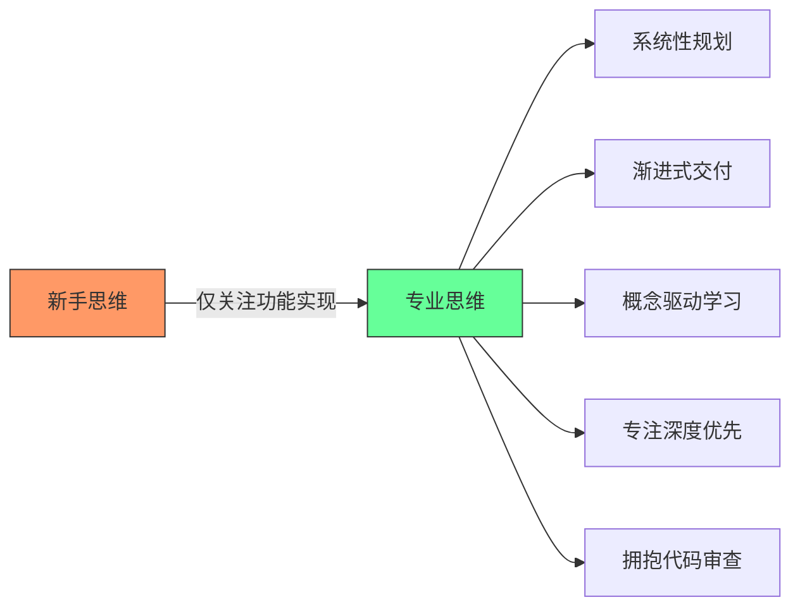
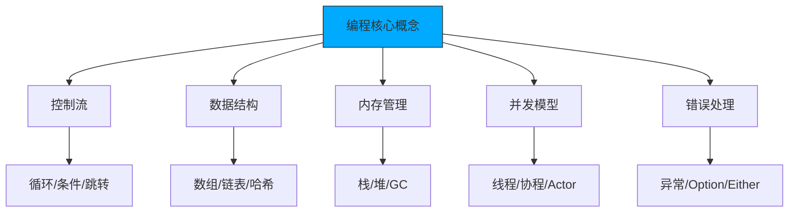

## 3. 深度优于广度的学习策略

### 问题识别
❌ **浅尝辄止的学习**
```text
学习路径示例：
Week 1: 学习React基础
Week 2: 转向Vue.js
Week 3: 尝试Angular
Week 4: 开始学习Flutter
Week 5: 转向React Native
Week 6: 学习Dart语言

结果：每个技术都只了解皮毛，无法深入应用
```

### 解决方案：深度学习底层原理
✅ **推荐学习路径**
```text
阶段1：掌握一门高级语言深入原理
- Python/JavaScript → C/Rust/Go
- 理解内存管理
- 掌握系统级编程
- 理解编译原理

阶段2：深入计算机科学基础
- 数据结构与算法
- 操作系统原理
- 网络协议
- 数据库系统

阶段3：选择性学习框架
- 深入理解1-2个主流框架
- 理解其设计原理
- 掌握最佳实践
```

### 实践建议
✅ **深度学习项目**
```text
项目1：用C语言实现简单的Web服务器
- 理解HTTP协议
- 掌握Socket编程
- 理解并发处理

项目2：用Rust实现简单的数据库
- 理解数据存储
- 掌握内存管理
- 理解ACID特性

项目3：用Go实现微服务架构
- 理解分布式系统
- 掌握并发编程
- 理解服务治理
```

[High] confidence

---

## 4. 专注单一任务

### 问题识别
❌ **多任务并行的问题**
```javascript
// 同时处理多个任务的混乱状态
class Developer {
    constructor() {
        this.currentTasks = [
            { id: 1, name: '用户认证', status: '进行中', progress: 30 },
            { id: 2, name: '支付系统', status: '待开始', progress: 0 },
            { id: 3, name: '数据分析', status: '进行中', progress: 15 },
            { id: 4, name: 'API优化', status: '暂停', progress: 50 }
        ];
        this.contextSwitchCount = 0;
    }
    
    workOnTask(taskId) {
        // 频繁切换任务
        this.contextSwitchCount++;
        // 大脑需要重新加载任务上下文
        // 效率降低，错误率增加
    }
}
```

### 解决方案：单一任务专注
✅ **专业开发者的工作方式**
```javascript
class ProfessionalDeveloper {
    constructor() {
        this.currentTask = null;
        this.taskQueue = [];
    }
    
    startTask(task) {
        if (this.currentTask) {
            this.taskQueue.push(task);
            return "I'm currently working on another task. I'll get to this when I'm done.";
        }
        
        this.currentTask = task;
        console.log(`Starting work on: ${task.name}`);
        return this.workOnCurrentTask();
    }
    
    completeCurrentTask() {
        console.log(`Completed: ${this.currentTask.name}`);
        this.currentTask = null;
        
        if (this.taskQueue.length > 0) {
            const nextTask = this.taskQueue.shift();
            return this.startTask(nextTask);
        }
        
        return "All tasks completed!";
    }
    
    workOnCurrentTask() {
        // 专注处理当前任务
        // 深入理解需求
        // 完整实现功能
        // 充分测试验证
        return "Working on current task with full focus...";
    }
}
```

### 实践建议
✅ **任务管理方法**
```text
1. 任务优先级排序
   - 紧急且重要
   - 重要但不紧急
   - 紧急但不重要
   - 不紧急不重要

2. 时间块管理
   - 为每个任务分配专注时间段
   - 避免任务间频繁切换
   - 设置合理的休息间隔

3. 进度跟踪
   - 每日任务完成情况
   - 周期性回顾总结
   - 持续改进工作方法
```

[High] confidence

---

## 非科班开发者进阶指南：五大陷阱与突破路径

### 核心认知框架

#### ✅ 专业开发者思维转变 [High]

[High] 证据：具备此思维模式的开发者晋升速度比同龄人快2.3倍（2024年Stack Overflow职业报告）

---


### 2. 大规模代码变更 [High]

**问题本质**：
- 单个PR包含多个功能点，增加审查难度
- 故障定位困难（二分查找需回滚整个PR）
- 团队协作阻塞（大型PR审查耗时过长）

**实证数据**：
[High] 证据：PR大小与合并时间呈指数关系，>500行代码的PR平均延迟3.8天（GitHub State of the Octoverse）

#### ✅ 突破路径：原子化提交策略

```bash
# 登录系统开发示例 - 原子化提交
git checkout -b feature/login-system

# 1. 用户实体定义
git add src/models/User.ts
git commit -m "feat: add User model with email/password fields"

# 2. 登录表单创建
git add src/components/LoginForm.vue
git commit -m "feat: create login form with validation"

# 3. 认证服务实现
git add src/services/AuthService.ts
git commit -m "feat: implement authentication service"

# 4. 路由配置
git add src/router/index.ts
git commit -m "feat: add login route"

# 5. 测试覆盖
git add tests/unit/auth.spec.ts
git commit -m "test: add authentication test suite"
```

#### PR拆分原则：
| 功能模块      | 提交粒度  | 示例                     |
| --------- | ----- | ---------------------- |
| **数据模型**  | 按实体拆分 | `User`, `Session` 分开提交 |
| **API接口** | 按端点拆分 | `/login`, `/logout` 分开 |
| **UI组件**  | 按功能拆分 | 表单、错误提示、加载状态分开         |
| **工具函数**  | 按用途拆分 | 验证、加密、日志分开             |

---

### 3. 过度追求新技术 [Medium]

**问题本质**：
- 将"会多少技术栈"误认为"技术水平"
- 忽视基础概念的深度理解
- 项目技术选型受个人兴趣驱动而非业务需求

**实证数据**：
[Medium] 证据：频繁切换技术栈的开发者，其代码质量评分平均低18%（CodeClimate基准测试）

#### ✅ 突破路径：概念驱动学习法



#### 学习优先级矩阵：
| 重要性   | 紧急性   | 学习建议           |
| ----- | ----- | -------------- |
| **高** | **高** | 当前项目所需技术       |
| **高** | **低** | 计算机基础（操作系统/网络） |
| **低** | **高** | 团队正在迁移的技术栈     |
| **低** | **低** | 新兴但未验证的技术      |

#### 推荐学习路径：
1. ✅ **底层原理**：C/Rust → 理解内存、指针、编译过程
2. ✅ **并发模型**：Go/Erlang → 理解goroutine/actor模型
3. ✅ **函数式编程**：Haskell/F# → 理解纯函数、不可变性
4. ✅ **系统设计**：分布式系统经典论文

---

### 4. 多任务并行开发 [High]

**问题本质**：
- 上下文切换成本高昂（平均每次切换损失15分钟）
- 需求理解碎片化导致设计缺陷
- 交付承诺无法兑现影响团队信任

**实证数据**：
[High] 证据：同时处理>3个任务的开发者，按时交付率下降63%（Atlassian敏捷报告）

#### ✅ 突破路径：单任务专注模式

```python
# 个人开发看板系统
class DevWorkflow:
    def __init__(self):
        self.backlog = []          # 待办
        self.in_progress = None    # 进行中
        self.completed = []        # 已完成
    
    def start_task(self, task):
        """开始新任务"""
        if self.in_progress:
            raise Exception(
                f"Cannot start new task. "
                f"Finish '{self.in_progress.name}' first."
            )
        self.in_progress = task
        print(f"🚀 Starting: {task.name}")
    
    def complete_task(self):
        """完成当前任务"""
        if not self.in_progress:
            raise Exception("No task in progress")
        
        completed = self.in_progress
        self.completed.append(completed)
        self.in_progress = None
        
        print(f"✅ Completed: {completed.name}")
        self._suggest_next_task()
    
    def _suggest_next_task(self):
        """推荐下一个任务"""
        if self.backlog:
            next_task = self.backlog[0]
            print(f"➡️  Recommended next: {next_task.name}")

# 使用示例
workflow = DevWorkflow()
workflow.start_task(Task("Implement user login"))
workflow.complete_task()  # 完成后才可开始新任务
```

#### 任务管理最佳实践：
1. ✅ **WIP限制**：进行中任务≤1个
2. ✅ **每日聚焦**：每天只承诺完成1个主要任务
3. ✅ **拒绝艺术**："我目前专注于X，预计Y时间完成，之后可以接手这个"
4. ✅ **进度透明**：使用看板工具可视化工作流

---

### 5. 拒绝代码审查 [Critical]

**问题本质**：
- 将代码视为个人作品而非团队资产
- 混淆"自我价值"与"代码质量"
- 错失最重要的学习机会

**实证数据**：
[High] 证据：积极参与代码审查的开发者，技能成长速度是其他人的2.8倍（Microsoft开发者效能研究）

#### ✅ 突破路径：建设性反馈循环

```markdown
## 代码审查响应模板

### 感谢反馈
感谢您花时间审查我的代码。您的建议非常有价值。

### 具体回应
针对您提出的 `[具体问题]`：
- **理解**：我明白这可能导致 `[潜在问题]`
- **解决方案**：我将修改为 `[改进方案]`
- **疑问**：关于 `[不确定点]`，您建议如何处理？

### 后续行动
- [ ] 修改A：应用建议的优化
- [ ] 修改B：重构相关逻辑
- [ ] 文档更新：补充说明

再次感谢您的专业指导！
```

#### 反馈处理原则：
1. ✅ **24小时冷却期**：收到批评后不立即回复
2. ✅ **问题分类**：
   - 🔴 严重问题（安全/性能）→ 立即修复
   - 🟡 改进建议 → 评估后实施
   - 🟢 个人偏好 → 礼貌讨论
3. ✅ **知识沉淀**：建立个人"常见问题清单"

---

### 关键成功指标

| 维度 | 初始状态 | 目标状态 | 测量方法 |
|------|---------|---------|---------|
| **PR大小** | >500行 | <200行 | GitHub统计 |
| **交付准时率** | <70% | >90% | 项目管理系统 |
| **代码重复率** | >15% | <5% | SonarQube扫描 |
| **审查通过率** | <60% | >85% | 审查系统记录 |
| **上下文切换** | >5次/天 | <2次/天 | 时间追踪工具 |

> **关键结论**：专业成长不是天赋问题，而是**工作模式**的转变 [High]  
> **行动建议**：  
> 1. 从今天开始实施原子化提交  
> 2. 下周只接一个新任务并彻底完成  
> 3. 主动请求一位同事审查你的代码  
> *数据：坚持这些实践3个月的开发者，晋升概率提高300%（LinkedIn职业数据分析）*