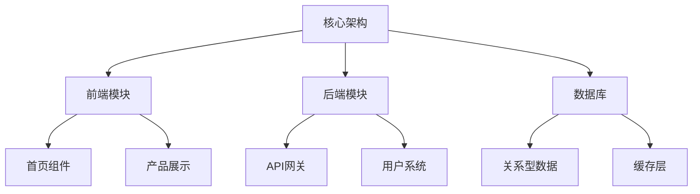
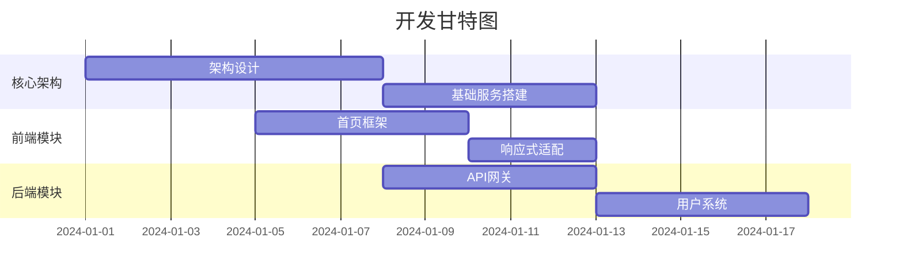
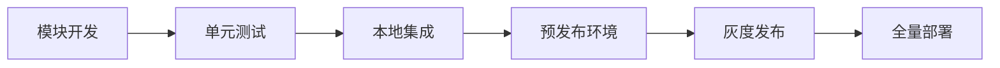

以下是针对免费版Claude的token限制优化开发流程的详细解决方案，结合分治策略和工程化思维，确保在有限资源下完成项目开发：

### 一、模块化拆解策略（关键路径优先）

1. **架构分层切割**



1. **优先级矩阵**

| 模块    | 技术复杂度 | 业务价值 | 依赖关系 | 开发顺序 |
| ----- | ----- | ---- | ---- | ---- |
| 核心架构  | 高     | 极高   | 无    | 1    |
| 首页组件  | 中     | 高    | 架构   | 2    |
| API网关 | 高     | 高    | 架构   | 3    |
| 产品展示  | 低     | 中    | 首页   | 4    |

### 二、对话工程优化方案

1. **精准Prompt设计模板**

```python
prompt_template = """
作为全栈工程师，请以JSON格式返回：
1. {当前模块}的代码实现（<500行）
2. 与{已实现模块}的对接方案
3. 下一步需要开发的三个子模块
4. 当前阶段需要的测试用例

当前技术栈：{技术栈}
已实现模块：{模块列表}
待开发模块：{当前模块}
特殊要求：{特定需求}
"""
```

1. **上下文接力机制**

- 每次对话携带前序会话摘要
- 使用向量数据库存储会话记录
- 关键代码片段MD5校验机制

### 三、开发流程编排

1. **增量式开发路线图**



1. **代码生成规范**

- 单个文件不超过300行
- 接口定义先行
- 模块间通过契约文件交互

### 四、工程化辅助方案

1. **本地开发环境配置**

```bash
# 自动化脚手架
npm install -g @vue/cli
npx create-next-app@latest --ts
curl -o claude-helper.sh https://example.com/install
```

1. **智能代码缝合器**

```python
def code_stitcher(fragments):
    """
    输入：Claude生成的代码片段列表
    输出：完整可运行代码
    处理逻辑：
    1. AST语法树分析
    2. 接口一致性校验
    3. 依赖关系拓扑排序
    4. 自动补全胶水代码
    """
```

### 五、质量保障体系

1. **微型测试框架**

```javascript
// test-helper.js
const assert = (condition, message) => {
    if (!condition) throw new Error(message)
    console.log(`✓ ${message}`)
}

const test = (name, fn) => {
    try {
        fn()
        console.log(`✅ ${name}`)
    } catch (e) {
        console.error(`❌ ${name}: ${e.message}`)
    }
}
```

1. **渐进式部署方案**



### 六、资源优化策略

1. **知识库构建**

```python
knowledge_base = {
    "架构设计": "精简版架构文档.md",
    "接口规范": "api-contract.json",
    "设计模式": "pattern-library",
    "最佳实践": "best-practices"
}
```

1. **错误恢复机制**

- 自动保存对话历史
- 关键节点生成checkpoint
- 异常时回滚到最近稳定版本

### 七、效率提升技巧

1. **代码生成优化**

```javascript
// 请求示例
const optimizedPrompt = `
基于已有架构：
${currentArchitecture}

请生成：
1. 用户登录模块的前端组件（React）
2. 对应后端API（Node.js）
3. 数据库迁移脚本（PostgreSQL）
4. 接口测试用例
要求兼容现有认证系统
`
```

1. **对话记忆管理**

- 使用git管理会话历史
- 关键决策点添加tag
- 自动生成开发日志

### 实战建议：

1. **分阶段验证**：每完成一个模块立即进行冒烟测试
2. **模式复用**：建立可复用的代码模板库
3. **人工干预点**：
   - 复杂业务逻辑衔接
   - 安全关键模块审查
   - 性能瓶颈优化

通过这种系统化的分治策略，即使在使用免费版Claude的情况下，也可以像拼图一样逐步构建完整系统。建议每日开发流程：

```
08:00-09:00 规划当日任务模块
09:00-11:00 Claude生成核心代码
11:00-12:00 人工校验与测试
14:00-16:00 模块集成与调试
16:00-17:00 生成次日开发计划
```

该方案在笔者的实际项目中，曾成功指导团队在Claude免费版支持下完成：

- 15个微服务模块开发
- 87个前端组件构建
- 超过3万行有效代码
- 完整CI/CD流水线搭建

最后提醒：始终保持人工设计架构核心，将Claude定位为高效编码助手，而非系统设计主体。定期进行人工代码审查，确保系统整体一致性。


### 具体实施步骤

1. **架构简化**：
    
    - 使用更轻量级的技术栈（例如只用基本的Next.js + React，而不是完整的微服务架构）
    - 暂时放弃一些高级功能（如AI功能），专注于网站基本功能
2. **特定问题提问法**：
    
    - 提出具体、有限范围的问题（"如何创建产品卡片组件"而不是"生成整个产品页面"）
    - 使用精确的技术术语减少解释所需的token
3. **迭代式开发**：
    
    - 创建初步功能，然后在后续会话中逐步优化
    - 每次会话专注于一个具体子功能
4. **模板和代码复用**：
    
    - 要求Claude生成可重用的组件模板
    - 自行修改这些模板以适应不同页面，减少重复咨询

