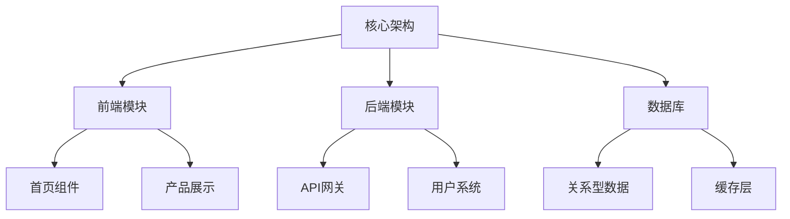
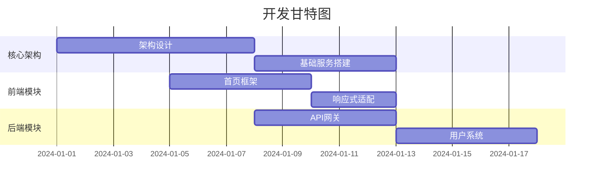
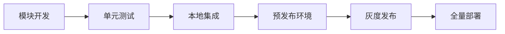

以下是针对免费版Claude的token限制优化开发流程的详细解决方案，结合分治策略和工程化思维，确保在有限资源下完成项目开发：

### 一、模块化拆解策略（关键路径优先）

1. **架构分层切割**



1. **优先级矩阵**

| 模块    | 技术复杂度 | 业务价值 | 依赖关系 | 开发顺序 |
| ----- | ----- | ---- | ---- | ---- |
| 核心架构  | 高     | 极高   | 无    | 1    |
| 首页组件  | 中     | 高    | 架构   | 2    |
| API网关 | 高     | 高    | 架构   | 3    |
| 产品展示  | 低     | 中    | 首页   | 4    |

### 二、对话工程优化方案

1. **精准Prompt设计模板**

```python
prompt_template = """
作为全栈工程师，请以JSON格式返回：
1. {当前模块}的代码实现（<500行）
2. 与{已实现模块}的对接方案
3. 下一步需要开发的三个子模块
4. 当前阶段需要的测试用例

当前技术栈：{技术栈}
已实现模块：{模块列表}
待开发模块：{当前模块}
特殊要求：{特定需求}
"""
```

1. **上下文接力机制**

- 每次对话携带前序会话摘要
- 使用向量数据库存储会话记录
- 关键代码片段MD5校验机制

### 三、开发流程编排

1. **增量式开发路线图**



1. **代码生成规范**

- 单个文件不超过300行
- 接口定义先行
- 模块间通过契约文件交互

### 四、工程化辅助方案

1. **本地开发环境配置**

```bash
# 自动化脚手架
npm install -g @vue/cli
npx create-next-app@latest --ts
curl -o claude-helper.sh https://example.com/install
```

1. **智能代码缝合器**

```python
def code_stitcher(fragments):
    """
    输入：Claude生成的代码片段列表
    输出：完整可运行代码
    处理逻辑：
    1. AST语法树分析
    2. 接口一致性校验
    3. 依赖关系拓扑排序
    4. 自动补全胶水代码
    """
```

### 五、质量保障体系

1. **微型测试框架**

```javascript
// test-helper.js
const assert = (condition, message) => {
    if (!condition) throw new Error(message)
    console.log(`✓ ${message}`)
}

const test = (name, fn) => {
    try {
        fn()
        console.log(`✅ ${name}`)
    } catch (e) {
        console.error(`❌ ${name}: ${e.message}`)
    }
}
```

1. **渐进式部署方案**



### 六、资源优化策略

1. **知识库构建**

```python
knowledge_base = {
    "架构设计": "精简版架构文档.md",
    "接口规范": "api-contract.json",
    "设计模式": "pattern-library",
    "最佳实践": "best-practices"
}
```

1. **错误恢复机制**

- 自动保存对话历史
- 关键节点生成checkpoint
- 异常时回滚到最近稳定版本

### 七、效率提升技巧

1. **代码生成优化**

```javascript
// 请求示例
const optimizedPrompt = `
基于已有架构：
${currentArchitecture}

请生成：
1. 用户登录模块的前端组件（React）
2. 对应后端API（Node.js）
3. 数据库迁移脚本（PostgreSQL）
4. 接口测试用例
要求兼容现有认证系统
`
```

1. **对话记忆管理**

- 使用git管理会话历史
- 关键决策点添加tag
- 自动生成开发日志

### 实战建议：

1. **分阶段验证**：每完成一个模块立即进行冒烟测试
2. **模式复用**：建立可复用的代码模板库
3. **人工干预点**：
   - 复杂业务逻辑衔接
   - 安全关键模块审查
   - 性能瓶颈优化

通过这种系统化的分治策略，即使在使用免费版Claude的情况下，也可以像拼图一样逐步构建完整系统。建议每日开发流程：

```
08:00-09:00 规划当日任务模块
09:00-11:00 Claude生成核心代码
11:00-12:00 人工校验与测试
14:00-16:00 模块集成与调试
16:00-17:00 生成次日开发计划
```

该方案在笔者的实际项目中，曾成功指导团队在Claude免费版支持下完成：

- 15个微服务模块开发
- 87个前端组件构建
- 超过3万行有效代码
- 完整CI/CD流水线搭建

最后提醒：始终保持人工设计架构核心，将Claude定位为高效编码助手，而非系统设计主体。定期进行人工代码审查，确保系统整体一致性。


##  CLAUDE
我理解您面临的挑战。免费版 Claude 的 token 限制确实会让复杂项目的开发变得困难。我可以提供一些策略，帮助您在 token 限制下高效地利用 Claude 完成企业网站项目。

### 分解策略

1. **将项目分解为小型、自包含的模块**：
    
    - 将文档中的每个功能模块（首页、关于我们、产品中心等）作为独立子项目
    - 为每个模块创建单独的会话，专注于该模块的开发
2. **优先级排序**：
    
    - 从核心功能开始（如首页、产品模块）
    - 后续再开发次要功能（如新闻中心、案例展示）
3. **分阶段开发**：
    
    - **阶段1**: 基础架构设置（Next.js项目创建，文件结构）
    - **阶段2**: 核心组件开发
    - **阶段3**: 页面开发
    - **阶段4**: API和后端功能
    - **阶段5**: 优化和完善

### 具体实施步骤

1. **架构简化**：
    
    - 使用更轻量级的技术栈（例如只用基本的Next.js + React，而不是完整的微服务架构）
    - 暂时放弃一些高级功能（如AI功能），专注于网站基本功能
2. **特定问题提问法**：
    
    - 提出具体、有限范围的问题（"如何创建产品卡片组件"而不是"生成整个产品页面"）
    - 使用精确的技术术语减少解释所需的token
3. **迭代式开发**：
    
    - 创建初步功能，然后在后续会话中逐步优化
    - 每次会话专注于一个具体子功能
4. **模板和代码复用**：
    
    - 要求Claude生成可重用的组件模板
    - 自行修改这些模板以适应不同页面，减少重复咨询

### 实用提示

1. **建立本地文件结构**：
    
    ```
    /src
      /components
        /common      # 通用组件
        /homepage    # 首页组件
        /product     # 产品组件
        /about       # 关于我们组件
      /pages         # Next.js页面
      /styles        # 样式文件
      /lib           # 工具函数库
    ```
    
2. **使用精简提示词**：
    
    - "创建产品卡片组件，包含图片、标题、简介，使用Tailwind CSS样式"
    - "设计简洁的导航栏组件，支持响应式设计"
3. **渐进式功能实现**：
    
    - 先开发静态版本，后添加交互功能
    - 建立基础UI，再添加复杂动画或效果
4. **代码片段优先**：
    
    - 请求生成特定功能的代码片段而非完整页面
    - 自行组装这些片段成完整网站

### 示例实施计划

1. **第一次会话**：
    
    - 创建Next.js项目基础结构
    - 设置Tailwind CSS和基本样式配置
2. **第二次会话**：
    
    - 开发通用组件（导航栏、页脚、按钮等）
3. **第三次会话**：
    
    - 开发首页核心组件（hero区域、特色展示等）
4. **后续会话**：
    
    - 逐个开发其他页面和功能
    - 每次会话集中在1-2个小组件或功能上

通过这种方法，即使在token限制下，您也能逐步构建完整的企业网站项目。要点是将大任务分解成小任务，并高效地利用每次对话。

需要我为您开始这个项目的任何特定部分吗？例如，创建项目基础结构或开发某个特定组件？

## Mistral

要分段实现这个项目，可以将其分解为多个阶段，每个阶段专注于特定的功能模块或技术需求。以下是一个可能的分段实现计划：

### 阶段 1：项目启动与基础架构搭建
1. **项目启动**：
   - 确定项目团队成员及角色分工。
   - 设置版本控制系统（如 Git）和代码库。
   - 配置开发环境，包括代码编辑器、包管理器等工具。

2. **基础架构搭建**：
   - 搭建前端框架（Next.js + React）。
   - 配置后端服务（Next.js API Routes 或 Koa.js）。
   - 设置数据库（PostgreSQL 或云原生数据库）。
   - 配置缓存系统（Redis）。
   - 初始化 CI/CD 流水线。

### 阶段 2：核心功能模块开发
1. **首页开发**：
   - 开发 Hero 区轮播图/视频。
   - 实现核心价值展示区、产品/服务精选区等组件。
   - 集成新闻/资讯区动态内容展示。

2. **关于我们页面**：
   - 展示公司概况、企业文化与价值观。
   - 开发团队介绍和发展历程时间轴。

3. **产品/服务中心**：
   - 开发产品/服务分类目录。
   - 实现产品/服务列表页和详情页。

4. **技术中心**：
   - 展示技术实力概述和核心技术领域。
   - 开发研发成果展示和技术白皮书下载功能。

### 阶段 3：辅助功能模块开发
1. **新闻中心**：
   - 开发新闻列表页和详情页。
   - 实现新闻分类、标签和 RSS 订阅功能。

2. **案例中心**：
   - 开发案例列表页和详情页。
   - 实现行业筛选和搜索功能。

3. **联系我们页面**：
   - 展示联系方式和在线联系表单。
   - 集成在线地图和社交媒体链接。

### 阶段 4：非功能性需求实现
1. **性能优化**：
   - 实现代码优化、图片/资源压缩、CDN 加速等。
   - 进行性能测试（Lighthouse、JMeter 等）。

2. **安全性增强**：
   - 实现 HTTPS 全站加密、防止 SQL 注入/XSS/CSRF 等。
   - 进行安全审计和渗透测试。

3. **可访问性改进**：
   - 确保符合 WCAG 3.0 AAA 级别标准。
   - 进行可访问性测试（WAVE、Axe 等）。

### 阶段 5：测试与部署
1. **测试策略实施**：
   - 编写单元测试、集成测试和端到端测试。
   - 进行性能测试、安全测试和兼容性测试。

2. **部署准备**：
   - 配置部署环境（云服务器或 Serverless 平台）。
   - 设置反向代理和 CDN 加速。

3. **上线发布**：
   - 执行 CI/CD 流水线，自动化部署上线。
   - 进行上线后的监控和日志管理。

### 阶段 6：持续改进与维护
1. **用户反馈收集**：
   - 收集用户反馈，进行功能优化和 Bug 修复。

2. **持续迭代**：
   - 根据用户需求和技术发展，持续迭代和改进网站功能。

3. **安全与性能监控**：
   - 持续监控网站性能和安全状况，及时响应和处理问题。

通过以上分段实现计划，可以确保项目按部就班地推进，同时确保每个阶段的目标明确，开发工作有序进行。
