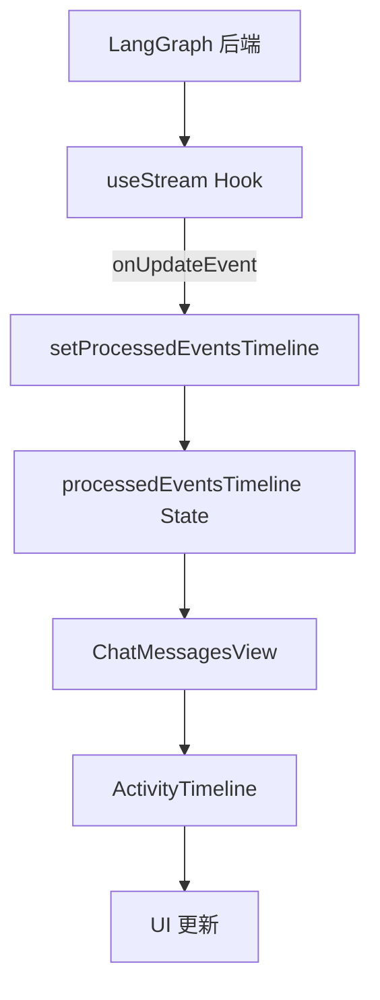

# LangGraph 全栈研究代理进阶教程

**目标读者**: 具备 Python 和 JavaScript 基础，对 AI/LLM 应用开发有初步了解的中级开发者。

---

## 第一章：核心概念与技术栈概览

本章将深入探讨本全栈研究代理应用所依赖的核心技术：LangGraph、Google Gemini API 以及整个应用的前后端架构。

### 1. 什么是 LangGraph？

LangGraph 是 LangChain 的一个强大扩展，专为构建有状态、多步骤的代理（Agent）和多代理（Multi-Agent）应用程序而设计。它通过引入图（Graph）结构来管理复杂的 LLM 工作流，使得代理的决策、工具使用和状态管理变得更加清晰和可控。

*   **LangChain 的扩展：有状态、多步骤的代理编排框架**
    LangGraph 解决了传统 LangChain 链在处理复杂、多轮次交互和动态决策时的局限性。它允许代理在执行过程中维护和更新内部状态，并根据当前状态和 LLM 的输出动态地决定下一步行动。这使得构建能够进行反思、迭代和自我修正的智能代理成为可能。

*   **图结构：节点（Nodes）与边（Edges）的概念**
    LangGraph 的核心是其图结构。一个 LangGraph 应用由以下两部分组成：
    *   **节点 (Nodes)**: 代表工作流中的一个步骤或一个操作。每个节点接收当前状态作为输入，执行特定逻辑（例如，调用 LLM、使用工具、处理数据），然后返回状态的更新。
        在我们的研究代理中，节点包括：
        *   `generate_query`: 生成搜索查询。
        *   `web_research`: 执行网络搜索。
        *   `reflection`: 反思搜索结果，判断是否需要进一步研究。
        *   `finalize_answer`: 整合所有信息并生成最终答案。
    *   **边 (Edges)**: 连接节点，定义了工作流的执行路径。边可以是：
        *   **直接边 (Direct Edges)**: 从一个节点直接指向另一个节点。
        *   **条件边 (Conditional Edges)**: 根据某个节点的输出（通常是路由函数）动态地决定下一个要执行的节点。这使得代理能够根据条件进行分支和循环。
        在 [`backend/src/agent/graph.py`](backend/src/agent/graph.py) 中，可以看到图的构建：
        ```python
        # backend/src/agent/graph.py
        # ...
        builder = StateGraph(OverallState, config_schema=Configuration)

        # Define the nodes we will cycle between
        builder.add_node("generate_query", generate_query)
        builder.add_node("web_research", web_research)
        builder.add_node("reflection", reflection)
        builder.add_node("finalize_answer", finalize_answer)

        # Set the entrypoint as `generate_query`
        builder.add_edge(START, "generate_query")
        # Add conditional edge to continue with search queries in a parallel branch
        builder.add_conditional_edges(
            "generate_query", continue_to_web_research, ["web_research"]
        )
        # Reflect on the web research
        builder.add_edge("web_research", "reflection")
        # Evaluate the research
        builder.add_conditional_edges(
            "reflection", evaluate_research, ["web_research", "finalize_answer"]
        )
        # Finalize the answer
        builder.add_edge("finalize_answer", END)

        graph = builder.compile(name="pro-search-agent")
        ```

*   **状态管理：如何通过 `TypedDict` 定义和管理代理的内部状态**
    LangGraph 的“有状态”特性通过一个共享的图状态（Graph State）来实现。这个状态在整个工作流中传递，并且每个节点都可以读取和更新它。在 Python 中，通常使用 `TypedDict` 来定义这个状态的结构，确保类型安全和清晰的数据模型。
    在 [`backend/src/agent/state.py`](backend/src/agent/state.py) 中，`OverallState` 定义了研究代理的全局状态：
    ```python
    # backend/src/agent/state.py
    from __future__ import annotations

    from dataclasses import dataclass, field
    from typing import TypedDict

    from langgraph.graph import add_messages
    from typing_extensions import Annotated


    import operator
    from dataclasses import dataclass, field
    from typing_extensions import Annotated


    class OverallState(TypedDict):
        messages: Annotated[list, add_messages]
        search_query: Annotated[list, operator.add]
        web_research_result: Annotated[list, operator.add]
        sources_gathered: Annotated[list, operator.add]
        initial_search_query_count: int
        max_research_loops: int
        research_loop_count: int
        reasoning_model: str


    class ReflectionState(TypedDict):
        is_sufficient: bool
        knowledge_gap: str
        follow_up_queries: Annotated[list, operator.add]
        research_loop_count: int
        number_of_ran_queries: int


    class Query(TypedDict):
        query: str
        rationale: str


    class QueryGenerationState(TypedDict):
        query_list: list[Query]


    class WebSearchState(TypedDict):
        search_query: str
        id: str


    @dataclass(kw_only=True)
    class SearchStateOutput:
        running_summary: str = field(default=None)  # Final report
    ```
    `Annotated` 结合 `add_messages` 和 `operator.add` 允许 LangGraph 自动处理列表的追加操作，简化了状态更新逻辑。

*   **LangGraph 的优势：复杂工作流、可观测性、容错性**
    *   **复杂工作流**: 能够轻松构建多步骤、多轮次、包含条件逻辑和循环的复杂代理工作流。
    *   **可观测性**: LangGraph 提供了强大的可观测性，可以清晰地看到代理在每个节点的状态变化、LLM 调用和工具使用情况，这对于调试和理解代理行为至关重要。
    *   **容错性**: 通过定义清晰的节点和状态转换，可以更容易地处理错误和异常情况，提高代理的健壮性。

### 2. Google Gemini API 深度解析

Google Gemini 是一系列多模态大语言模型，能够理解和生成文本、图像、音频和视频。在本研究代理中，我们主要利用其文本生成和工具使用能力。

*   **Gemini 模型家族：Flash, Pro 等不同模型的特点与适用场景**
    *   **Gemini 2.0 Flash**: 速度更快、成本更低，适用于需要快速响应和高吞吐量的任务，如查询生成、初步信息提取。在我们的代理中，它用于 `generate_query` 节点。
    *   **Gemini 2.5 Pro**: 能力更强、推理更复杂，适用于需要更高质量、更深入理解和更复杂推理的任务，如反思、最终答案生成。在我们的代理中，它用于 `reflection` 和 `finalize_answer` 节点。
    *   **模型选择**: 在 [`frontend/src/components/InputForm.tsx`](frontend/src/components/InputForm.tsx) 中，用户可以选择不同的模型来执行推理任务：
        ```typescript
        // frontend/src/components/InputForm.tsx
        // ...
        const [model, setModel] = useState("gemini-2.5-flash-preview-04-17");
        // ...
        <Select value={model} onValueChange={setModel}>
            <SelectTrigger className="w-[150px] bg-transparent border-none cursor-pointer">
                <SelectValue placeholder="Model" />
            </SelectTrigger>
            <SelectContent className="bg-neutral-700 border-neutral-600 text-neutral-300 cursor-pointer">
                <SelectItem
                    value="gemini-2.0-flash"
                    className="hover:bg-neutral-600 focus:bg-neutral-600 cursor-pointer"
                >
                    <div className="flex items-center">
                        <Zap className="h-4 w-4 mr-2 text-yellow-400" /> 2.0 Flash
                    </div>
                </SelectItem>
                <SelectItem
                    value="gemini-2.5-flash-preview-04-17"
                    className="hover:bg-neutral-600 focus:bg-neutral-600 cursor-pointer"
                >
                    <div className="flex items-center">
                        <Zap className="h-4 w-4 mr-2 text-orange-400" /> 2.5 Flash
                    </div>
                </SelectItem>
                <SelectItem
                    value="gemini-2.5-pro-preview-05-06"
                    className="hover:bg-neutral-600 focus:bg-neutral-600 cursor-pointer"
                >
                    <div className="flex items-center">
                        <Cpu className="h-4 w-4 mr-2 text-purple-400" /> 2.5 Pro
                    </div>
                </SelectItem>
            </SelectContent>
        </Select>
        // ...
        ```

*   **API 交互：如何通过 `langchain_google_genai` 或原生 `google.genai` 客户端调用**
    LangChain 提供了 `langchain_google_genai` 库，简化了与 Gemini API 的交互。它封装了底层的 API 调用，并提供了与 LangChain 表达式语言（LCEL）兼容的接口。
    在 [`backend/src/agent/graph.py`](backend/src/agent/graph.py) 中，我们看到两种调用方式：
    *   使用 `ChatGoogleGenerativeAI` (LangChain 封装):
        ```python
        # backend/src/agent/graph.py
        # ...
        from langchain_google_genai import ChatGoogleGenerativeAI
        # ...
        llm = ChatGoogleGenerativeAI(
            model=configurable.query_generator_model,
            temperature=1.0,
            max_retries=2,
            api_key=os.getenv("GEMINI_API_KEY"),
        )
        structured_llm = llm.with_structured_output(SearchQueryList)
        result = structured_llm.invoke(formatted_prompt)
        ```
    *   使用原生 `google.genai` 客户端 (为了获取 Grounding Metadata):
        ```python
        # backend/src/agent/graph.py
        # ...
        from google.genai import Client
        # ...
        genai_client = Client(api_key=os.getenv("GEMINI_API_KEY"))
        # ...
        response = genai_client.models.generate_content(
            model=configurable.query_generator_model,
            contents=formatted_prompt,
            config={
                "tools": [{"google_search": {}}],
                "temperature": 0,
            },
        )
        ```

*   **工具使用（Tool Use）：如何让 LLM 调用外部工具（如 Google Search）**
    Gemini 模型支持原生工具调用。通过在 API 请求中指定 `tools` 参数，LLM 可以在生成响应时决定调用哪些外部工具来获取信息或执行操作。
    在 `web_research` 节点中，LLM 被配置为可以使用 `google_search` 工具：
    ```python
    # backend/src/agent/graph.py
    # ...
    response = genai_client.models.generate_content(
        model=configurable.query_generator_model,
        contents=formatted_prompt,
        config={
            "tools": [{"google_search": {}}], # 启用 Google Search 工具
            "temperature": 0,
        },
    )
    ```
    当 LLM 认为需要进行网络搜索时，它会生成一个工具调用请求，然后由 LangGraph 框架捕获并执行实际的搜索操作。

*   **Grounding：如何利用搜索结果为 LLM 提供事实依据**
    Grounding 是指将 LLM 的生成内容锚定到外部事实来源的过程，以减少幻觉（hallucinations）并提高回答的准确性。Gemini API 提供了 `grounding_metadata`，其中包含搜索结果的引用信息。
    在 `web_research` 节点中，我们从 `response.candidates[0].grounding_metadata.grounding_chunks` 中提取引用信息，并将其整合到最终的答案中：
    ```python
    # backend/src/agent/graph.py
    # ...
    resolved_urls = resolve_urls(
        response.candidates[0].grounding_metadata.grounding_chunks, state["id"]
    )
    citations = get_citations(response, resolved_urls)
    modified_text = insert_citation_markers(response.text, citations)
    sources_gathered = [item for citation in citations for item in citation["segments"]]
    # ...
    ```
    这些引用信息最终会在前端 [`frontend/src/components/ChatMessagesView.tsx`](frontend/src/components/ChatMessagesView.tsx) 中以可点击的徽章形式展示，指向原始来源。

### 3. 全栈应用架构剖析

本研究代理是一个典型的全栈应用，由后端 API 服务和前端用户界面组成，并通过实时通信进行交互。

*   **后端：Python FastAPI + LangGraph**
    *   **API 服务：FastAPI 如何暴露 LangGraph 代理接口**
        FastAPI 是一个现代、快速（高性能）的 Python Web 框架，用于构建 API。它利用 Python 类型提示来自动生成 OpenAPI（以前称为 Swagger）文档，并提供数据验证。
        在 [`backend/src/agent/app.py`](backend/src/agent/app.py) 中，FastAPI 应用被定义并挂载了 LangGraph 代理的路由：
        ```python
        # backend/src/agent/app.py
        from fastapi import FastAPI
        # ...
        app = FastAPI()
        # ...
        # LangGraph 代理的路由通常由 LangGraph 库自动挂载到 FastAPI 应用上
        # 例如，通过 `langgraph dev` 命令或在代码中显式集成
        ```
        LangGraph 提供了方便的集成方式，可以直接将编译后的图作为 FastAPI 路由暴露，支持流式响应。

    *   **异步处理：LangGraph 在 FastAPI 中的异步集成**
        FastAPI 原生支持异步（`async/await`）操作，这与 LangGraph 的异步执行模型完美契合。LangGraph 的 `stream` 方法返回一个异步迭代器，允许后端在代理执行的每个步骤实时地将事件流式传输到前端，从而实现响应式用户体验。

*   **前端：React + TypeScript + Vite**
    *   **UI 框架：Shadcn UI 与 Tailwind CSS 的应用**
        *   **React**: 一个用于构建用户界面的 JavaScript 库。
        *   **TypeScript**: JavaScript 的超集，提供了静态类型检查，增强了代码的可维护性和可读性。
        *   **Vite**: 一个现代化的前端构建工具，提供了极快的开发服务器启动速度和热模块替换（HMR）功能。
        *   **Shadcn UI**: 一个基于 Radix UI 和 Tailwind CSS 的可复用组件库。它不提供预构建的组件，而是提供可复制粘贴的代码片段，允许开发者完全控制组件的样式和行为。
        *   **Tailwind CSS**: 一个实用程序优先的 CSS 框架，通过组合小的、单一用途的 CSS 类来快速构建自定义设计，避免了编写大量自定义 CSS。
        这些技术栈的组合使得前端开发高效且灵活，能够快速构建美观且响应式的用户界面。

    *   **实时通信：`@langchain/langgraph-sdk/react` 如何实现前端与后端代理的实时流式交互**
        `@langchain/langgraph-sdk/react` 是一个专门为 React 应用设计的 SDK，用于简化与 LangGraph 后端的实时通信。它提供了一个 `useStream` Hook，使得前端能够轻松地连接到 LangGraph 代理的流式 API，并实时接收代理执行过程中的事件更新。
        在 [`frontend/src/App.tsx`](frontend/src/App.tsx) 中，`useStream` Hook 的使用是实现实时交互的关键：
        ```typescript
        // frontend/src/App.tsx
        import { useStream } from "@langchain/langgraph-sdk/react";
        // ...
        export default function App() {
            // ...
            const thread = useStream<{
                messages: Message[];
                initial_search_query_count: number;
                max_research_loops: number;
                reasoning_model: string;
            }>({
                apiUrl: import.meta.env.DEV
                    ? "http://localhost:2024"
                    : "http://localhost:8123",
                assistantId: "agent",
                messagesKey: "messages",
                onFinish: (event: any) => {
                    console.log(event);
                },
                onUpdateEvent: (event: any) => {
                    // 根据事件类型更新前端状态，例如显示代理的活动时间线
                    // ...
                },
            });
            // ...
        }
        ```
        `onUpdateEvent` 回调函数在每次接收到后端流式事件时被触发，允许前端根据代理的进展更新 UI，例如显示“生成搜索查询”、“网络搜索中”、“反思中”等状态。

*   **数据流：用户输入 -> 前端 -> 后端 API -> LangGraph 代理 -> LLM/工具 -> LangGraph 代理 -> 后端 API -> 前端 -> 用户输出。**

    **图示建议**:
    *   **全栈应用架构图**:
        ```mermaid
        graph TD
            User[用户] --> Frontend[前端 (React/TypeScript)]
            Frontend --> BackendAPI[后端 API (FastAPI)]
            BackendAPI --> LangGraphAgent[LangGraph 代理]
            LangGraphAgent -- 调用 --> LLM[Google Gemini API]
            LangGraphAgent -- 调用 --> Tool[Google Search API]
            LLM --> LangGraphAgent
            Tool --> LangGraphAgent
            LangGraphAgent --> BackendAPI
            BackendAPI -- 实时流式更新 --> Frontend
            Frontend --> User
        ```
        **描述**: 此图展示了用户请求从前端发起，经过后端 FastAPI 路由到 LangGraph 代理。代理在执行过程中与 Google Gemini API 和 Google Search API 进行交互，获取信息并进行推理。代理的中间状态和最终结果通过后端 API 实时流式传输回前端，最终展示给用户。

    *   **LangGraph 代理流程图 (Mermaid)**:
        ```mermaid
        graph TD
            A[START] --> B(generate_query)
            B --> C{continue_to_web_research}
            C -- "For each query" --> D(web_research)
            D --> E(reflection)
            E -- "is_sufficient = true OR max_loops reached" --> F(finalize_answer)
            E -- "is_sufficient = false AND max_loops not reached" --> D
            F --> G[END]
        ```
        **描述**: 此图详细描绘了 [`backend/src/agent/graph.py`](backend/src/agent/graph.py) 中定义的研究代理的决策流程。
        1.  **START**: 代理启动。
        2.  **generate_query**: 根据用户问题生成初始搜索查询。
        3.  **continue_to_web_research**: 将生成的查询发送到 `web_research` 节点，可能并行执行多个搜索。
        4.  **web_research**: 执行网络搜索，获取相关信息。
        5.  **reflection**: 反思搜索结果，判断信息是否足够。
        6.  **evaluate_research (条件路由)**:
            *   如果信息足够 (`is_sufficient = true`) 或达到最大研究循环次数 (`max_loops reached`)，则进入 `finalize_answer` 节点。
            *   如果信息不足 (`is_sufficient = false`) 且未达到最大循环次数，则返回 `web_research` 节点，进行下一轮搜索（基于 `follow_up_queries`）。
        7.  **finalize_answer**: 整合所有搜索结果，生成最终答案。
        8.  **END**: 代理执行结束。

---

## 第二章：开发环境搭建与项目初始化

本章将指导您如何搭建后端和前端的开发环境，并可选地介绍如何使用 Docker Compose 进行容器化部署。

### 1. 后端环境配置

*   **Python 版本要求 (3.8+)**
    请确保您的系统安装了 Python 3.8 或更高版本。您可以通过运行 `python --version` 或 `python3 --version` 来检查。

*   **虚拟环境管理 (venv/conda)**
    强烈建议使用虚拟环境来管理项目依赖，以避免不同项目之间的依赖冲突。
    *   **使用 `venv`**:
        ```bash
        # 创建虚拟环境
        python -m venv .venv
        # 激活虚拟环境 (Windows)
        .venv\Scripts\activate
        # 激活虚拟环境 (macOS/Linux)
        source .venv/bin/activate
        ```
    *   **使用 `conda`**:
        ```bash
        # 创建 conda 环境
        conda create -n langgraph-env python=3.9
        # 激活 conda 环境
        conda activate langgraph-env
        ```

*   **依赖安装：`pip install .` (解析 `pyproject.toml`)**
    本项目使用 `pyproject.toml` 管理依赖。在激活虚拟环境后，进入 `backend` 目录并安装所有依赖：
    ```bash
    cd backend
    pip install .
    ```
    这将安装 `pyproject.toml` 中定义的所有生产依赖和开发依赖。

*   **`.env` 文件配置：`GEMINI_API_KEY` 获取与设置**
    您需要一个 Google Gemini API 密钥才能运行后端服务。
    1.  访问 [Google AI Studio](https://aistudio.google.com/app/apikey) 或 [Google Cloud Console](https://console.cloud.google.com/apis/credentials) 获取您的 API 密钥。
    2.  在 `backend` 目录下，复制 `.env.example` 文件并重命名为 `.env`：
        ```bash
        cp .env.example .env
        ```
    3.  打开 `.env` 文件，将您的 Gemini API 密钥粘贴到 `GEMINI_API_KEY` 变量中：
        ```
        GEMINI_API_KEY="YOUR_GEMINI_API_KEY"
        ```
    4.  如果您计划使用 Google Search 工具，还需要配置 Google Custom Search Engine (CSE) 和 API Key。请参考 Google Cloud 文档获取 `GOOGLE_API_KEY` 和 `GOOGLE_CSE_ID`，并将其添加到 `.env` 文件中。

*   **LangGraph 开发服务器 (`langgraph dev`) 介绍**
    LangGraph 提供了一个方便的开发服务器，可以自动加载您的代理图并暴露为 API。在 `backend` 目录下，运行：
    ```bash
    langgraph dev
    ```
    这将启动一个 FastAPI 服务器，并在默认端口（通常是 8000 或 2024）上暴露您的 LangGraph 代理。

### 2. 前端环境配置

*   **Node.js 和 npm/yarn/pnpm 安装**
    请确保您的系统安装了 Node.js (推荐 LTS 版本) 和一个包管理器 (npm, yarn 或 pnpm)。您可以通过运行 `node -v` 和 `npm -v` 来检查。

*   **依赖安装：`npm install`**
    进入 `frontend` 目录并安装所有前端依赖：
    ```bash
    cd frontend
    npm install # 或者 yarn install / pnpm install
    ```

*   **Vite 开发服务器 (`npm run dev`) 介绍**
    Vite 是一个快速的前端构建工具。在 `frontend` 目录下，运行：
    ```bash
    npm run dev
    ```
    这将启动 Vite 开发服务器，并在默认端口（通常是 5173）上提供前端应用。前端应用会自动代理到后端 LangGraph API。

### 3. Docker Compose 部署 (可选)

Docker Compose 允许您使用一个 YAML 文件定义和运行多容器 Docker 应用程序。本项目提供了 `docker-compose.yml` 文件，用于在容器中部署后端服务、Redis 和 PostgreSQL。

*   **`docker-compose.yml` 文件解析：Redis, Postgres, 后端服务**
    `docker-compose.yml` 文件定义了以下服务：
    *   **`redis`**: 用于 LangGraph 的 Pub/Sub 代理，实现实时事件流。
    *   **`postgres`**: 用于 LangGraph 的状态持久化，确保代理状态在重启后不会丢失。
    *   **`backend`**: 运行 LangGraph 后端服务。

*   **生产环境部署考量：Redis 作为 Pub/Sub 代理，Postgres 用于状态持久化**
    在生产环境中，为了实现高可用性和可伸缩性，通常需要将代理的状态和事件流进行持久化。
    *   **Redis**: 作为 Pub/Sub 代理，负责将 LangGraph 代理的实时事件广播到所有连接的前端客户端。
    *   **PostgreSQL**: 作为状态存储，将 LangGraph 代理的内部状态（例如，`OverallState`）持久化到数据库中，以便在代理崩溃或重启后能够恢复其状态。

*   **`Dockerfile` 构建流程**
    `Dockerfile` 定义了如何构建后端服务的 Docker 镜像。它通常包括：
    1.  选择一个基础镜像（例如，Python 官方镜像）。
    2.  设置工作目录。
    3.  复制项目文件。
    4.  安装 Python 依赖。
    5.  暴露端口。
    6.  定义启动命令。

    您可以通过以下命令构建 Docker 镜像并启动所有服务：
    ```bash
    docker-compose up --build
    ```

    **图示建议**:
    *   **开发环境搭建流程图**:
        ```mermaid
        graph TD
            A[开始] --> B{安装 Python 3.8+}
            B --> C{创建并激活虚拟环境}
            C --> D[进入 backend 目录]
            D --> E[pip install .]
            E --> F[配置 .env]
            F --> G[langgraph dev]
            A --> H{安装 Node.js/npm}
            H --> I[进入 frontend 目录]
            I --> J[npm install]
            J --> K[npm run dev]
            G & K --> L[完成]
        ```

        **描述**: 此图展示了本地开发环境的搭建流程，包括后端 Python 环境的配置（Python 安装、虚拟环境、依赖安装、API Key 配置、LangGraph 开发服务器启动）和前端 Node.js 环境的配置（Node.js/npm 安装、依赖安装、Vite 开发服务器启动）。

    *   **Docker Compose 部署架构图**:
        ```mermaid
        graph LR
            User[用户] --> FrontendContainer[前端容器]
            FrontendContainer --> BackendContainer[后端容器 FastAPI/LangGraph]
            BackendContainer --> RedisContainer[Redis 容器 Pub/Sub]
            BackendContainer --> PostgresContainer[PostgreSQL 容器 状态持久化]
            LLM[Google Gemini API] --> BackendContainer
            Tool[Google Search API] --> BackendContainer
        ```
        **描述**: 此图展示了使用 Docker Compose 部署时的容器化架构。前端容器与后端容器通信，后端容器则与 Redis（用于实时事件）和 PostgreSQL（用于状态持久化）容器进行交互。LLM 和 Google Search API 作为外部服务与后端容器通信。

---

## 第三章：主要功能演示与代码解析

本章将详细解析研究代理的核心功能，包括代理的交互流程以及前端如何管理状态和实现实时更新。

### 1. 代理交互流程详解

研究代理的核心在于其多步骤、迭代式的研究流程。我们将逐一分析每个关键节点及其在 [`backend/src/agent/graph.py`](backend/src/agent/graph.py) 中的实现。

*   **用户输入**: `InputForm.tsx` 如何捕获用户输入和配置参数（努力程度、模型）。
    在前端，[`frontend/src/components/InputForm.tsx`](frontend/src/components/InputForm.tsx) 组件负责捕获用户的查询输入以及“努力程度”（Effort）和“模型”（Model）的选择。
    *   **输入框**: 用户在 `Textarea` 中输入问题。
    *   **努力程度**: 通过 `Select` 组件选择“Low”、“Medium”或“High”。这会影响后端代理的初始搜索查询数量和最大研究循环次数。
        ```typescript
        // frontend/src/App.tsx
        // ...
        const handleSubmit = useCallback(
            (submittedInputValue: string, effort: string, model: string) => {
                // ...
                let initial_search_query_count = 0;
                let max_research_loops = 0;
                switch (effort) {
                    case "low":
                        initial_search_query_count = 1;
                        max_research_loops = 1;
                        break;
                    case "medium":
                        initial_search_query_count = 3;
                        max_research_loops = 3;
                        break;
                    case "high":
                        initial_search_query_count = 5;
                        max_research_loops = 10;
                        break;
                }
                // ...
                thread.submit({
                    messages: newMessages,
                    initial_search_query_count: initial_search_query_count,
                    max_research_loops: max_research_loops,
                    reasoning_model: model,
                });
            },
            [thread]
        );
        ```
    *   **模型选择**: 通过另一个 `Select` 组件选择用于推理的 Gemini 模型（Flash 或 Pro）。
    当用户提交表单时，`handleSubmit` 函数会将这些参数连同用户输入一起发送到后端 LangGraph 代理。

*   **查询生成 (`generate_query` 节点)**:
    *   `query_writer_instructions` 提示词分析。
        [`backend/src/agent/prompts.py`](backend/src/agent/prompts.py) 中的 `query_writer_instructions` 提示词指导 LLM 根据用户问题生成优化过的搜索查询。它强调生成多样化、聚焦于特定方面的查询，并限制查询数量。
        ```python
        # backend/src/agent/prompts.py
        query_writer_instructions = """Your goal is to generate sophisticated and diverse web search queries. These queries are intended for an advanced automated web research tool capable of analyzing complex results, following links, and synthesizing information.
        # ...
        Context: {research_topic}"""
        ```
    *   `SearchQueryList` 结构化输出。
        为了确保 LLM 输出的查询列表是结构化的，我们使用了 Pydantic 定义的 `SearchQueryList` 模型。LLM 被指示以 JSON 格式输出，包含 `query` (列表) 和 `rationale` (字符串) 字段。
        ```python
        # backend/src/agent/tools_and_schemas.py
        from pydantic import BaseModel, Field
        from typing import List

        class SearchQueryList(BaseModel):
            query: List[str] = Field(
                description="A list of search queries to be used for web research."
            )
            rationale: str = Field(
                description="A brief explanation of why these queries are relevant to the research topic."
            )
        ```
    *   代码解析：[`backend/src/agent/graph.py:44`](backend/src/agent/graph.py:44) `generate_query` 函数。
        `generate_query` 节点使用 `ChatGoogleGenerativeAI` (通常是 Gemini 2.0 Flash 模型) 并结合 `with_structured_output(SearchQueryList)` 来生成结构化的搜索查询。
        ```python
        # backend/src/agent/graph.py
        def generate_query(state: OverallState, config: RunnableConfig) -> QueryGenerationState:
            # ...
            llm = ChatGoogleGenerativeAI(
                model=configurable.query_generator_model, # 通常是 Gemini 2.0 Flash
                temperature=1.0,
                max_retries=2,
                api_key=os.getenv("GEMINI_API_KEY"),
            )
            structured_llm = llm.with_structured_output(SearchQueryList)
            # ...
            result = structured_llm.invoke(formatted_prompt)
            return {"query_list": result.query}
        ```

*   **网络搜索 (`web_research` 节点)**:
    *   Google Search API 调用与结果处理。
        `web_research` 节点负责执行实际的 Google 搜索。它直接使用原生的 `google.genai` 客户端来调用 Gemini API，并启用 `google_search` 工具。
    *   Grounding Metadata 与引用提取。
        关键在于从 Gemini 的响应中提取 `grounding_metadata`，其中包含了搜索结果的来源信息（URL 和文本片段）。这些信息用于生成引用，并最终插入到答案中。
    *   代码解析：[`backend/src/agent/graph.py:95`](backend/src/agent/graph.py:95) `web_research` 函数。
        ```python
        # backend/src/agent/graph.py
        def web_research(state: WebSearchState, config: RunnableConfig) -> OverallState:
            # ...
            response = genai_client.models.generate_content(
                model=configurable.query_generator_model,
                contents=formatted_prompt,
                config={
                    "tools": [{"google_search": {}}], # 启用 Google Search 工具
                    "temperature": 0,
                },
            )
            # 解析 grounding_metadata 提取引用
            resolved_urls = resolve_urls(
                response.candidates[0].grounding_metadata.grounding_chunks, state["id"]
            )
            citations = get_citations(response, resolved_urls)
            modified_text = insert_citation_markers(response.text, citations)
            sources_gathered = [item for citation in citations for item in citation["segments"]]

            return {
                "sources_gathered": sources_gathered,
                "search_query": [state["search_query"]],
                "web_research_result": [modified_text],
            }
        ```

*   **反思与知识差距分析 (`reflection` 节点)**:
    *   `reflection_instructions` 提示词分析。
        [`backend/src/agent/prompts.py`](backend/src/agent/prompts.py) 中的 `reflection_instructions` 提示词指导 LLM 对当前的搜索结果进行反思，判断信息是否足以回答用户问题，并识别知识空白。如果存在知识空白，它会生成后续的查询。
        ```python
        # backend/src/agent/prompts.py
        reflection_instructions = """You are an expert research assistant analyzing summaries about "{research_topic}".
        # ...
        Summaries:
        {summaries}"""
        ```
    *   `Reflection` 结构化输出：`is_sufficient`, `knowledge_gap`, `follow_up_queries`。
        与查询生成类似，反思节点也使用结构化输出 (`Reflection` Pydantic 模型) 来确保 LLM 返回清晰的判断结果和后续查询。
        ```python
        # backend/src/agent/tools_and_schemas.py
        class Reflection(BaseModel):
            is_sufficient: bool = Field(
                description="Whether the provided summaries are sufficient to answer the user's question."
            )
            knowledge_gap: str = Field(
                description="A description of what information is missing or needs clarification."
            )
            follow_up_queries: List[str] = Field(
                description="A list of follow-up queries to address the knowledge gap."
            )
        ```
    *   代码解析：[`backend/src/agent/graph.py:139`](backend/src/agent/graph.py:139) `reflection` 函数。
        `reflection` 节点使用更强大的模型 (通常是 Gemini 2.5 Pro) 来进行复杂的推理和结构化输出。
        ```python
        # backend/src/agent/graph.py
        def reflection(state: OverallState, config: RunnableConfig) -> ReflectionState:
            # ...
            llm = ChatGoogleGenerativeAI(
                model=reasoning_model, # 通常是 Gemini 2.5 Pro
                temperature=1.0,
                max_retries=2,
                api_key=os.getenv("GEMINI_API_KEY"),
            )
            result = llm.with_structured_output(Reflection).invoke(formatted_prompt)

            return {
                "is_sufficient": result.is_sufficient,
                "knowledge_gap": result.knowledge_gap,
                "follow_up_queries": result.follow_up_queries,
                "research_loop_count": state["research_loop_count"],
                "number_of_ran_queries": len(state["search_query"]),
            }
        ```

*   **迭代优化 (`evaluate_research` 路由)**:
    *   根据反思结果决定是否进行下一轮搜索。
        `evaluate_research` 是一个条件路由函数，它根据 `reflection` 节点的输出 (`is_sufficient` 和 `research_loop_count`) 来决定代理的下一步行动。
    *   最大研究循环次数的控制。
        通过 `max_research_loops` 参数（可在前端配置），我们可以控制代理进行迭代搜索的最大次数，防止无限循环。
    *   代码解析：[`backend/src/agent/graph.py:183`](backend/src/agent/graph.py:183) `evaluate_research` 函数。
        ```python
        # backend/src/agent/graph.py
        def evaluate_research(
            state: ReflectionState,
            config: RunnableConfig,
        ) -> OverallState:
            # ...
            max_research_loops = (
                state.get("max_research_loops")
                if state.get("max_research_loops") is not None
                else configurable.max_research_loops
            )
            if state["is_sufficient"] or state["research_loop_count"] >= max_research_loops:
                return "finalize_answer" # 信息足够或达到最大循环，进入最终答案生成
            else:
                return [
                    Send(
                        "web_research", # 否则，发送后续查询到 web_research 节点
                        {
                            "search_query": follow_up_query,
                            "id": state["number_of_ran_queries"] + int(idx),
                        },
                    )
                    for idx, follow_up_query in enumerate(state["follow_up_queries"])
                ]
        ```

*   **最终答案生成 (`finalize_answer` 节点)**:
    *   整合所有搜索结果。
        当代理认为收集到的信息足够时，`finalize_answer` 节点会被触发。它将所有 `web_research_result` 中的内容整合起来。
    *   引用标记的插入与解析。
        此节点还会处理引用的插入。在 `web_research` 阶段，短 URL 被插入到文本中作为引用标记。在最终答案生成时，这些短 URL 会被替换为原始的完整 URL，并与 `sources_gathered` 中的详细来源信息关联。
    *   代码解析：[`backend/src/agent/graph.py:220`](backend/src/agent/graph.py:220) `finalize_answer` 函数。
        ```python
        # backend/src/agent/graph.py
        def finalize_answer(state: OverallState, config: RunnableConfig):
            # ...
            llm = ChatGoogleGenerativeAI(
                model=reasoning_model, # 通常是 Gemini 2.5 Pro
                temperature=0,
                max_retries=2,
                api_key=os.getenv("GEMINI_API_KEY"),
            )
            result = llm.invoke(formatted_prompt)

            # 替换短 URL 为原始 URL 并收集唯一来源
            unique_sources = []
            for source in state["sources_gathered"]:
                if source["short_url"] in result.content:
                    result.content = result.content.replace(
                        source["short_url"], source["value"]
                    )
                    unique_sources.append(source)

            return {
                "messages": [AIMessage(content=result.content)],
                "sources_gathered": unique_sources,
            }
        ```

### 2. 前端状态管理与实时更新

前端应用通过 `useStream` Hook 与后端 LangGraph 代理进行实时通信，并根据接收到的事件更新 UI，为用户提供实时的反馈和活动时间线。

*   `App.tsx` 中的 `useStream` Hook：如何连接 LangGraph 后端并接收实时更新。
    [`frontend/src/App.tsx`](frontend/src/App.tsx) 是前端应用的入口点。它使用 `@langchain/langgraph-sdk/react` 提供的 `useStream` Hook 来建立与 LangGraph 后端的连接。
    ```typescript
    // frontend/src/App.tsx
    import { useStream } from "@langchain/langgraph-sdk/react";
    // ...
    const thread = useStream<{
        messages: Message[];
        initial_search_query_count: number;
        max_research_loops: number;
        reasoning_model: string;
    }>({
        apiUrl: import.meta.env.DEV
            ? "http://localhost:2024" // 开发环境后端地址
            : "http://localhost:8123", // 生产环境后端地址
        assistantId: "agent", // 代理的 ID
        messagesKey: "messages", // 消息键
        onFinish: (event: any) => {
            console.log(event);
        },
        onUpdateEvent: (event: any) => {
            let processedEvent: ProcessedEvent | null = null;
            if (event.generate_query) {
                processedEvent = {
                    title: "Generating Search Queries",
                    data: event.generate_query.query_list.join(", "),
                };
            } else if (event.web_research) {
                // ... 处理 web_research 事件
            } else if (event.reflection) {
                // ... 处理 reflection 事件
            } else if (event.finalize_answer) {
                // ... 处理 finalize_answer 事件
            }
            if (processedEvent) {
                setProcessedEventsTimeline((prevEvents) => [
                    ...prevEvents,
                    processedEvent!,
                ]);
            }
        },
    });
    ```
    `onUpdateEvent` 回调函数是核心，它在每次 LangGraph 代理发送新事件时被调用。通过检查 `event` 对象的不同属性（如 `event.generate_query`, `event.web_research` 等），前端可以识别当前代理正在执行的步骤，并相应地更新 `processedEventsTimeline` 状态。

*   `processedEventsTimeline` 和 `historicalActivities` 的作用。
    *   `processedEventsTimeline`: 这是一个 `useState` 变量，用于存储当前正在进行的代理会话的实时活动事件列表。每当 `onUpdateEvent` 接收到新事件时，它就会被更新，从而在 UI 上显示代理的实时进展。
    *   `historicalActivities`: 这是一个 `useState` 变量，类型为 `Record<string, ProcessedEvent[]>`，用于存储已完成的代理会话的历史活动时间线。当一个代理会话完成（即 `finalize_answer` 事件发生且 `thread.isLoading` 为 `false` 时），当前的 `processedEventsTimeline` 会被保存到 `historicalActivities` 中，并以最终 AI 消息的 ID 作为键。这使得用户可以回顾之前查询的代理执行过程。

*   `ChatMessagesView.tsx` 如何渲染不同类型的消息和活动时间线。
    [`frontend/src/components/ChatMessagesView.tsx`](frontend/src/components/ChatMessagesView.tsx) 组件负责渲染聊天消息和活动时间线。
    *   **消息渲染**: 它遍历 `thread.messages` 数组，根据消息类型 (`human` 或 `ai`) 渲染不同的气泡 (`HumanMessageBubble` 或 `AiMessageBubble`)。
    *   **实时活动时间线**: 对于当前正在加载的 AI 消息，`AiMessageBubble` 会接收 `liveActivityEvents` 并将其传递给 `ActivityTimeline` 组件，从而显示代理的实时进展。
    *   **历史活动时间线**: 对于已完成的 AI 消息，`AiMessageBubble` 会从 `historicalActivities` 中查找对应的历史活动事件，并将其渲染出来。
    *   **Markdown 渲染**: `ChatMessagesView` 使用 `react-markdown` 库来渲染 AI 生成的 Markdown 内容，包括引用链接。

    **图示建议**:
    *   **前端组件关系图**:
        ```mermaid
        graph TD
            App[App.tsx] --> ChatMessagesView[ChatMessagesView.tsx]
            App --> WelcomeScreen[WelcomeScreen.tsx]
            ChatMessagesView --> InputForm[InputForm.tsx]
            ChatMessagesView --> ActivityTimeline[ActivityTimeline.tsx]
            ChatMessagesView --> HumanMessageBubble[HumanMessageBubble.tsx]
            ChatMessagesView --> AiMessageBubble[AiMessageBubble.tsx]
            AiMessageBubble --> ActivityTimeline
        ```
        **描述**: 此图展示了前端 React 组件之间的层级和数据传递关系。`App.tsx` 是根组件，根据是否有历史消息来渲染 `WelcomeScreen` 或 `ChatMessagesView`。`ChatMessagesView` 包含了 `InputForm` 用于用户输入，并使用 `HumanMessageBubble` 和 `AiMessageBubble` 来显示聊天消息。`ActivityTimeline` 组件则用于展示代理的实时和历史活动。

    *   **实时数据流图**:
        好的，这是您请求的“实时数据流图”的竖排显示Mermaid语法：


        **描述**: 此图详细描绘了 LangGraph 后端如何通过流式 API 将事件发送到前端，以及前端如何更新 UI。后端 LangGraph 代理在执行过程中生成事件，这些事件通过流式 API 发送到前端的 `useStream` Hook。`useStream` 的 `onUpdateEvent` 回调函数捕获这些事件，并更新 `App.tsx` 中的 `processedEventsTimeline` 状态。`ChatMessagesView` 组件监听此状态的变化，并将其传递给 `ActivityTimeline` 组件，最终实时更新用户界面，显示代理的进展。

---

## 第四章：典型场景应用与扩展

本章将探讨研究代理的典型应用场景，并讨论如何扩展其能力以及进行性能优化和部署策略。

### 1. 研究代理的应用场景

本全栈研究代理模型具有广泛的应用潜力，可以作为许多智能应用的基础：

*   **智能客服**: 结合企业内部知识库和外部网络搜索能力，为客户提供更深入、更准确的问题解答，处理复杂查询，甚至进行多轮对话以解决问题。
*   **内容创作辅助**: 为文章、报告、博客、新闻稿等提供事实依据和引用。代理可以快速收集相关资料，提炼关键信息，并自动生成带有引用的草稿，极大地提高内容创作效率。
*   **市场调研**: 快速收集和分析特定行业、产品或竞争对手的信息。代理可以监控市场趋势、分析消费者情绪、收集产品评论，并生成结构化的市场报告。
*   **教育辅助**: 作为学生研究课题的智能助手。学生可以向代理提问，获取相关资料、概念解释和引用来源，帮助他们更好地理解和完成学术任务。
*   **法律研究**: 辅助律师进行案例分析、法规查询和判例法研究，快速定位相关法律条文和案例。
*   **医疗信息查询**: 为医生和研究人员提供最新的医学研究、疾病信息和治疗方案，但需注意医疗信息的严谨性和专业性。

### 2. 代理能力的扩展

本研究代理是一个可扩展的框架，您可以根据具体需求为其添加更多功能：

*   **集成更多工具**: 除了 Google Search，LangGraph 代理可以轻松集成其他外部 API 或自定义工具，以扩展其能力范围。
    *   **天气 API**: 添加一个天气工具，允许代理查询特定地点的实时天气信息。
    *   **股票数据 API**: 集成股票数据工具，使代理能够获取公司股价、财务报告等信息。
    *   **内部数据库查询**: 如果代理需要访问企业内部数据，可以开发一个工具来执行 SQL 查询或调用内部服务。
    *   **自定义工具**: 任何可以通过 Python 函数封装的逻辑都可以作为工具集成到 LangGraph 中。例如，一个用于执行复杂计算、数据分析或图像处理的工具。
    **实现方式**: 在 [`backend/src/agent/tools_and_schemas.py`](backend/src/agent/tools_and_schemas.py) 中定义新的工具的输入/输出 Schema，然后在 LangGraph 节点中调用这些工具。

*   **多模态输入/输出**: 结合 Gemini 的多模态能力，处理图像、音频等输入。
    Gemini 模型原生支持多模态输入。您可以扩展代理以处理：
    *   **图像输入**: 用户上传图片，代理可以分析图片内容并结合文本进行推理（例如，识别图片中的物体，然后搜索相关信息）。
    *   **音频输入**: 将用户的语音输入转换为文本，然后进行处理。
    *   **多模态输出**: 代理不仅生成文本答案，还可以生成图片、图表或代码片段。
    **实现方式**: 利用 `google.genai` 客户端的多模态输入能力，并在 LangGraph 状态中存储和传递多模态数据。

*   **记忆与个性化**: 如何利用 LangGraph 的持久化能力实现长期记忆和用户偏好学习。
    *   **长期记忆**: 通过将 LangGraph 的状态持久化到数据库（如 PostgreSQL）中，代理可以记住之前的对话历史、用户偏好、已完成的研究结果等。这使得代理能够提供更个性化和连贯的体验。
    *   **用户偏好学习**: 代理可以根据用户的历史交互和反馈，学习用户的偏好和习惯，从而在未来的交互中提供更符合用户需求的服务。
    **实现方式**: 配置 LangGraph 的检查点（Checkpointer）功能，将 `OverallState` 存储到持久化存储中。

*   **安全性与伦理**: 在实际应用中需要考虑的数据隐私、偏见、幻觉等问题。
    在部署生产级 AI 代理时，必须认真考虑以下方面：
    *   **数据隐私**: 确保用户数据的收集、存储和处理符合隐私法规（如 GDPR, CCPA）。对敏感数据进行匿名化或加密。
    *   **偏见**: LLM 可能会从训练数据中继承偏见。需要对代理的输出进行持续监控和评估，识别并减轻潜在的偏见。
    *   **幻觉**: LLM 有时会生成听起来合理但实际上不准确或虚构的信息。通过 Grounding、引用来源和用户反馈机制来减少幻觉。
    *   **滥用**: 防止代理被用于生成有害、非法或误导性内容。实施内容审核和安全过滤器。
    *   **透明度**: 告知用户代理的能力和局限性，以及它如何使用数据和工具。

### 3. 性能优化与部署策略

为了确保研究代理在生产环境中高效、稳定地运行，需要进行性能优化和制定合理的部署策略。

*   **LLM 调用优化：缓存、并行调用、模型选择**
    *   **缓存**: 对重复的 LLM 调用结果进行缓存，可以显著减少 API 调用次数和延迟。例如，对于相同的搜索查询，如果结果在短时间内不会改变，可以直接返回缓存结果。
    *   **并行调用**: 对于可以独立执行的多个 LLM 调用（例如，同时生成多个搜索查询），可以利用异步编程实现并行调用，缩短总响应时间。
    *   **模型选择**: 根据任务需求选择合适的 Gemini 模型。对于需要快速响应但对准确性要求不那么极致的任务（如查询生成），使用 Flash 模型；对于需要高质量推理的任务（如反思和最终答案生成），使用 Pro 模型。这在 [`frontend/src/components/InputForm.tsx`](frontend/src/components/InputForm.tsx) 中已经实现。

*   **LangGraph 性能调优：节点优化、状态管理**
    *   **节点优化**: 确保每个节点内部的逻辑尽可能高效。避免在节点中执行耗时且不必要的计算。
    *   **状态管理**: 优化 `OverallState` 的结构，只存储必要的信息，避免状态膨胀。合理使用 `Annotated` 来管理列表的追加操作。
    *   **异步执行**: 确保 LangGraph 节点中的所有 I/O 操作（如 API 调用、数据库操作）都是异步的，以避免阻塞事件循环。

*   **生产环境部署：负载均衡、可伸缩性、监控**
    *   **负载均衡**: 在多个后端代理实例之间分配传入请求，以处理高并发流量。
    *   **可伸缩性**: 设计代理和基础设施，使其能够根据负载自动扩展或缩减。例如，使用 Kubernetes 或其他容器编排工具来管理代理实例。
    *   **监控**: 实施全面的监控系统，跟踪代理的性能指标（如响应时间、错误率、LLM 成本）、资源利用率和用户行为。使用日志记录来帮助调试和故障排除。
    *   **CI/CD**: 建立持续集成/持续部署（CI/CD）管道，自动化代码测试、构建和部署过程，确保快速、可靠的发布。

---

## 第五章：图示建议

本节汇总了教程中建议的图示类型和内容，以帮助读者更好地理解复杂的概念和流程。

### 1. 数据流图

*   **全栈数据流**:
    ```mermaid
    graph TD
        User[用户] --> Frontend[前端 React/TypeScript]
        Frontend -- HTTP/WebSocket --> BackendAPI[后端 API FastAPI]
        BackendAPI -- LangGraph Stream --> LangGraphAgent[LangGraph 代理]
        LangGraphAgent -- Gemini API Call --> LLM[Google Gemini API]
        LangGraphAgent -- Google Search API Call --> GoogleSearch[Google Search API]
        LLM --> LangGraphAgent
        GoogleSearch --> LangGraphAgent
        LangGraphAgent -- State Update --> BackendAPI
        BackendAPI -- WebSocket Stream --> Frontend
        Frontend --> User
    ```
    **描述**: 描绘用户请求从前端到后端，经过 LangGraph 代理，与 Gemini API 和 Google Search API 交互，最终返回结果的完整路径。强调了前端与后端之间的 HTTP/WebSocket 通信，以及 LangGraph 内部与外部服务的交互。

*   **LangGraph 内部数据流**:
    ```mermaid
    graph LR
        subgraph LangGraph State OverallState
            A[messages]
            B[search_query]
            C[web_research_result]
            D[sources_gathered]
            E[initial_search_query_count]
            F[max_research_loops]
            G[research_loop_count]
            H[reasoning_model]
        end

        generate_query --> B
        web_research --> C & D
        reflection --> E & F & G & H
        finalize_answer --> A & D
    ```
    **描述**: 展示 `OverallState` 如何在各个节点之间传递和更新。每个节点都会读取和/或写入状态中的特定字段，从而实现信息的共享和流程的推进。

### 2. 组件关系图

*   **前端组件层级**:
    ```mermaid
    graph TD
        App[App.tsx] --> ChatMessagesView[ChatMessagesView.tsx]
        App --> WelcomeScreen[WelcomeScreen.tsx]
        ChatMessagesView --> InputForm[InputForm.tsx]
        ChatMessagesView --> ActivityTimeline[ActivityTimeline.tsx]
        ChatMessagesView --> HumanMessageBubble[HumanMessageBubble.tsx]
        ChatMessagesView --> AiMessageBubble[AiMessageBubble.tsx]
        AiMessageBubble --> ActivityTimeline
    ```
    **描述**: 展示 `App.tsx` 如何包含 `ChatMessagesView.tsx` 和 `InputForm.tsx`，以及它们如何通过 props 传递数据和回调函数。详细描绘了前端 UI 的组件结构。

*   **后端模块依赖**:
    ```mermaid
    graph TD
        app_py[app.py] --> graph_py[graph.py]
        graph_py --> state_py[state.py]
        graph_py --> tools_and_schemas_py[tools_and_schemas.py]
        graph_py --> configuration_py[configuration.py]
        graph_py --> prompts_py[prompts.py]
        graph_py --> utils_py[utils.py]
    ```
    **描述**: 展示 `app.py`, `graph.py`, `state.py`, `tools_and_schemas.py`, `configuration.py`, `prompts.py`, `utils.py` 之间的依赖关系。这有助于理解后端代码的模块化结构。

### 3. LangGraph 图结构图 (Mermaid)

*   详细展示 `graph.py` 中定义的 `StateGraph` 的所有节点、边和条件路由，清晰地描绘代理的决策流程。
    ```mermaid
    graph TD
        A[START] --> B(generate_query)
        B --> C{continue_to_web_research}
        C -- "For each query" --> D(web_research)
        D --> E(reflection)
        E -- "is_sufficient = true OR max_loops reached" --> F(finalize_answer)
        E -- "is_sufficient = false AND max_loops not reached" --> D
        F --> G[END]
    ```
    **描述**: 此图在第一章中已详细描述，再次强调其作为核心流程图的重要性。

### 4. 部署架构图

*   **开发环境**:
    ```mermaid
    graph LR
        User[用户] --> FrontendDevServer[前端开发服务器 Vite]
        FrontendDevServer -- API Proxy --> BackendDevServer[后端开发服务器 LangGraph Dev]
        BackendDevServer -- API Call --> GoogleGemini[Google Gemini API]
        BackendDevServer -- API Call --> GoogleSearch[Google Search API]
    ```
    **描述**: 展示本地开发时前端和后端服务的独立运行方式。前端 Vite 服务器通过代理将 API 请求转发到 LangGraph 开发服务器。

*   **生产环境 (Docker Compose)**:
    ```mermaid
    graph LR
        User[用户] --> Nginx/LoadBalancer[Nginx/负载均衡器]
        Nginx/LoadBalancer --> FrontendContainer[前端容器]
        Nginx/LoadBalancer --> BackendContainer[后端容器 FastAPI/LangGraph]
        BackendContainer --> RedisContainer[Redis 容器 Pub/Sub]
        BackendContainer --> PostgresContainer[PostgreSQL 容器 状态持久化]
        GoogleGemini[Google Gemini API] --> BackendContainer
        GoogleSearch[Google Search API] --> BackendContainer
    ```
    **描述**: 展示 Docker 容器中后端、Redis、Postgres 服务的部署拓扑。在生产环境中，通常会引入 Nginx 或负载均衡器来分发流量。

---

## 第六章：实践测试题

本节提供一套实践测试题，旨在评估您对本教程内容的理解和实际操作能力。

### 一、选择题 (单选)

1.  LangGraph 的核心优势不包括以下哪项？
    A. 复杂工作流编排
    B. 强大的可观测性
    C. 内置的 UI 界面
    D. 有状态的代理管理

2.  在 LangGraph 中，用于定义和管理代理内部状态的 Python 类型通常是：
    A. `dict`
    B. `list`
    C. `TypedDict`
    D. `tuple`

3.  Google Gemini API 中，哪个模型通常用于需要快速响应和高吞吐量的任务，如查询生成？
    A. Gemini 2.5 Pro
    B. Gemini 2.0 Flash
    C. Gemini Ultra
    D. Gemini Nano

4.  前端应用通过哪个 `@langchain/langgraph-sdk/react` Hook 实现与后端代理的实时流式交互？
    A. `useState`
    B. `useEffect`
    C. `useStream`
    D. `useCallback`

5.  在 `backend/src/agent/graph.py` 中，哪个节点负责根据反思结果决定是否进行下一轮搜索？
    A. `generate_query`
    B. `web_research`
    C. `reflection`
    D. `evaluate_research`

### 二、填空题

1.  LangGraph 通过引入 ________ 结构来管理复杂的 LLM 工作流。
2.  在 `backend` 目录下，您需要将 `.env.example` 文件复制并重命名为 ________，然后配置您的 `GEMINI_API_KEY`。
3.  前端应用使用 ________ 和 ________ CSS 框架来构建 UI。
4.  在 `web_research` 节点中，为了获取搜索结果的引用信息，我们从 Gemini API 响应的 ________ 中提取数据。
5.  在生产环境中，________ 通常用作 LangGraph 的 Pub/Sub 代理，而 ________ 用于状态持久化。

### 三、编程题

1.  **任务**: 在 `backend/src/agent/tools_and_schemas.py` 中添加一个新的 Pydantic 模型 `WeatherQuery`，用于表示天气查询的结构。它应该包含以下字段：
    *   `city`: 字符串类型，描述要查询天气的城市。
    *   `unit`: 字符串类型，可选，描述温度单位（例如 "celsius" 或 "fahrenheit"），默认值为 "celsius"。

    **代码示例 (仅需补充 `WeatherQuery` 部分)**:
    ```python
    # backend/src/agent/tools_and_schemas.py
    from typing import List, Optional
    from pydantic import BaseModel, Field

    class SearchQueryList(BaseModel):
        query: List[str] = Field(
            description="A list of search queries to be used for web research."
        )
        rationale: str = Field(
            description="A brief explanation of why these queries are relevant to the research topic."
        )

    class Reflection(BaseModel):
        is_sufficient: bool = Field(
            description="Whether the provided summaries are sufficient to answer the user's question."
        )
        knowledge_gap: str = Field(
            description="A description of what information is missing or needs clarification."
        )
        follow_up_queries: List[str] = Field(
            description="A list of follow-up queries to address the knowledge gap."
        )

    # 在此处添加 WeatherQuery 模型
    # class WeatherQuery(...)
    #     ...
    ```

2.  **任务**: 假设您已经添加了一个名为 `get_current_weather` 的工具函数（无需实现其内部逻辑），它接收 `WeatherQuery` 作为输入并返回天气信息。请在 `backend/src/agent/graph.py` 中添加一个新的 LangGraph 节点 `weather_tool_node`，该节点将调用此工具。

    **提示**:
    *   您需要导入 `WeatherQuery` 和 `get_current_weather`。
    *   节点函数应接收 `OverallState` 作为输入。
    *   在节点内部，您可以使用 `llm.with_structured_output(WeatherQuery).invoke(...)` 来让 LLM 生成 `WeatherQuery`，然后调用 `get_current_weather`。
    *   节点应返回一个更新 `OverallState` 的字典，例如将天气信息添加到 `messages` 中。

    **代码示例 (仅需补充 `weather_tool_node` 部分)**:
    ```python
    # backend/src/agent/graph.py
    import os

    from agent.tools_and_schemas import SearchQueryList, Reflection, WeatherQuery # 假设 WeatherQuery 已导入
    from dotenv import load_dotenv
    from langchain_core.messages import AIMessage, ToolMessage # ToolMessage 可能需要
    from langgraph.types import Send
    from langgraph.graph import StateGraph
    from langgraph.graph import START, END
    from langchain_core.runnables import RunnableConfig
    from google.genai import Client

    from agent.state import (
        OverallState,
        QueryGenerationState,
        ReflectionState,
        WebSearchState,
    )
    from agent.configuration import Configuration
    from agent.prompts import (
        get_current_date,
        query_writer_instructions,
        web_searcher_instructions,
        reflection_instructions,
        answer_instructions,
    )
    from langchain_google_genai import ChatGoogleGenerativeAI
    from agent.utils import (
        get_citations,
        get_research_topic,
        insert_citation_markers,
        resolve_urls,
    )

    load_dotenv()

    if os.getenv("GEMINI_API_KEY") is None:
        raise ValueError("GEMINI_API_KEY is not set")

    genai_client = Client(api_key=os.getenv("GEMINI_API_KEY"))

    # 假设的工具函数 (无需实现其内部逻辑)
    def get_current_weather(query: WeatherQuery) -> str:
        # 实际实现会调用外部天气 API
        return f"The weather in {query.city} is sunny and 25 degrees {query.unit}."

    # Nodes (其他节点省略)
    # ...

    # 在此处添加 weather_tool_node 节点
    # def weather_tool_node(state: OverallState, config: RunnableConfig):
    #     ...

    # Create our Agent Graph (其他部分省略)
    # builder = StateGraph(OverallState, config_schema=Configuration)
    # ...
    ```

---