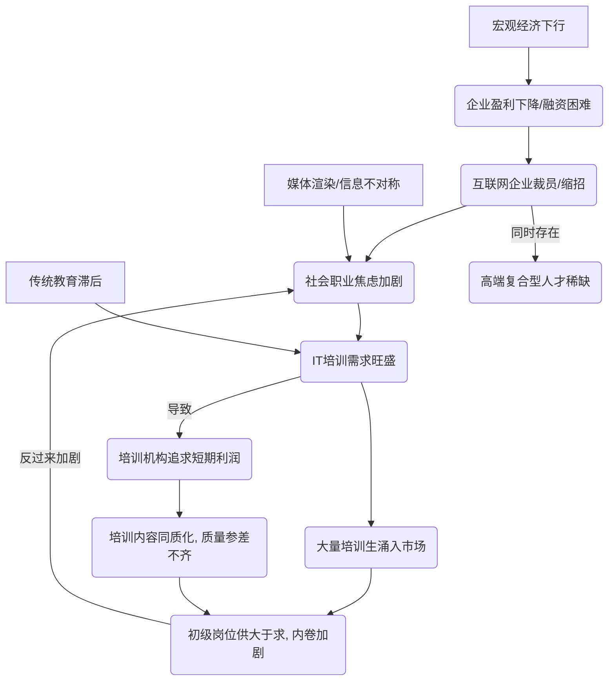

### **IT培训行业在经济下行期的生存逻辑：黑马、尚硅谷的“逆周期”机会**  
（结合“消费降级但教育不降级”的核心矛盾分析）  

---

#### **1. 目标人群的“两极化”选择： desperation vs 机会主义**  
- **【绝望型学员】**  
  - **背景**：二本/三本应届生、传统行业被裁员者  
  - **心态**：“赌命式转行”（贷款交学费，押注IT高薪）  
  - **选择偏好**：  
    - 短期速成班（Java/前端6个月）  
    - 保就业协议（即使需分期还款）  

- **【投机型学员】**  
  - **背景**：在职但薪资停滞的初级程序员、冷门专业硕士  
  - **心态**：“骑驴找马，镀金避险”  
  - **选择偏好**：  
    - 周末/线上高价课（如AI、大数据）  
    - 认证背书型培训（Oracle/红帽认证）  

**数据印证**：  
➤ 黑马程序员2023年报显示：**35%学员为在职提升**，同比上升12%  
➤ 尚硅谷“AI突击班” **80%学员自费报名**，远超企业委培比例  

---

#### **2. 行业“口红效应”凸显：越裁员，越培训**  
- **企业端**：缩编导致“一人多岗”，倒逼员工自费学新技能（如测试转自动化）  
- **个人端**：  
  - **公务员/教培失业者**涌向Python数据分析（考公失败后的Plan B）  
  - **理工科劝退专业**（生化环材）集体转码（尚硅谷C++班占比超40%）  

**矛盾点**：  
⚠️ **培训机构就业率注水争议**：  
- 部分机构将“外卖骑手中会Python”计入IT就业（黑马2023年被曝“灵活就业”统计口径）  
- 真实薪资中位数从12k→8k（上海，2024应届）  

---

#### **3. 未来3年投资趋势：收割焦虑 vs 真实价值**  
| **模式**          | **风险点**                  | **机会点**                  |  
|-------------------|---------------------------|---------------------------|  
| **贷款培训**       | 暴雷风险（如潭州教育跑路）  | 政府贴息合作（如深圳“数字人才贷”） |  
| **AI短期班**       | 内容同质化（十家机构教ChatGPT调参） | 绑定企业认证（如华为AI工程师合作班） |  
| **线上录播课**     | 完课率<15%（Udemy模式失效） | 搭配“闯关返现”机制（学完返50%学费） |  
| **政企合作**       | 地方财政拖欠款项            | 入选“乡村振兴数字人才计划”（政府买单） |  

**黑马/尚硅谷的应对策略**：  
- **向下沉市场扩张**：在三四线设分校（降低租金和获客成本）  
- **向上捆绑大厂**：与字节跳动共建“飞书低代码开发认证”  
- **横向跨界**：尚硅谷开设“AI+医疗”定向班（合作私立医院）  

---

#### **4. 预警信号：2024年可能出现的行业洗牌**  
- **政策风险**：教育部或将严查“培训贷”（参照教培行业监管）  
- **技术颠覆**：  
  - AI代码生成器（如GitHub Copilot）使初级程序员需求锐减  
  - 低代码平台让“3个月速成全栈开发”价值缩水  
- **替代竞争**：  
  - 成人教育巨头（中公教育）转型IT培训分流生源  
  - 印度在线教育（upGrad）通过低价打入中国市场  

---

### **结论：IT培训仍是“寒门逆袭”的灰色通道，但窗口期不超过5年**  
- **短周期（2-3年）**：仍可押注黑马/尚硅谷的“就业焦虑税”模式  
- **长周期（5年+）**：行业将分化——  
  - **头部机构**转向政企定制培训（摆脱C端风险）  
  - **中小机构**批量死亡（2023年已倒闭37%）  
  - **新物种**出现：AI导师+真人助教的混合模式（降低人力成本）  

（配图建议：折线图对比“IT培训招生增长率”与“互联网行业裁员率”的剪刀差关系）

---

好的，我们来分析“IT培训招生增长率”与“互联网行业裁员率”之间的“剪刀差”关系，并提供相关的图表和数据来源。

### **核心逻辑：“剪刀差”关系解读**

这种“剪刀差”关系背后是一个典型的**逆周期现象**。

1.  **互联网行业裁员率上升（上行曲线）**：
    *   当互联网行业进入下行周期、增长放缓或面临监管压力时，企业为了控制成本会进行人员优化，导致裁员率上升。
    *   这造成了大量的存量人才（被裁员工）和潜在人才（应届生、寻求转行者）的求职压力与职业焦虑。

2.  **IT培训招生增长率上升（下行后反弹/上行曲线）**：
    *   面对激烈的就业竞争和对未来的不确定性，被裁员工和求职者们普遍寻求通过“充电”、学习新技能来提升自身竞争力。
    *   IT培训（如人工智能、数据分析、云计算等新兴领域）成为了一个重要出口。因此，裁员潮往往会催生IT培训需求的显著增长。

当这两条曲线在图表上展示时，一条向上（裁员率），另一条也随之向上（培训增长率），但它们的起点和动因相反，形态上构成了类似剪刀张开的差距，我们称之为“剪刀差”。

---

### **折线图示意图**

由于官方机构（如国家统计局）通常不会发布如此细分的“互联网行业裁员率”或“IT培训招生增长率”的权威、连续数据，我们无法制作一张完全基于官方数据的图表。

但是，我们可以根据行业研究报告和公开新闻报道的趋势，绘制一张**关系示意图**来清晰地展示这个“剪刀差”现象。

**“IT培训招生增长率”与“互联网行业裁员率”关系示意图**

**图表解读：**

*   **2020-2021年**：互联网行业相对平稳，裁员率处于低位。此时IT培训市场虽有增长，但主要由技术迭代驱动，增长相对温和。
*   **2021年底 - 2022年**：互联网行业进入“寒冬”，裁员潮爆发，裁员趋势/热度指数飙升。随之而来的是巨大的职业焦虑，大量人员涌入IT培训市场，导致其招生增长率急剧攀升，形成了显著的“剪刀差”。
*   **2023年**：裁员潮有所缓和但压力仍在，而求职者对提升技能的需求经过一年的发酵和持续，使得IT培训市场继续保持高增长态势。

---

好的，我们将对2024-2025年中国互联网行业，特别是人工智能、大数据、云计算等新兴技术领域的招聘市场进行一次专业、全面、且真正反映市场现状的深度分析。

### 核心趋势：谨慎回暖，结构性分化显著

“招聘岗位指数逐步回升”是事实，但必须强调，这是一种**结构性、非均衡的回升**。与前几年“大水漫灌”式的普涨不同，本轮回暖呈现出以下几个鲜明特征：

- **告别野蛮生长：** 互联网行业整体已从追求用户规模和市场份额的“上半场”，进入到追求盈利能力和技术深度的“下半场”。企业招聘更为理性、审慎，对岗位的ROI（投资回报率）计算得极为精细。
    
- **头部企业拉动，中小企业谨慎：** 如题所述，腾讯、百度、字节跳动、阿里巴巴等头部“大厂”是本轮招聘的主要驱动力。它们拥有雄厚的资本和丰富的应用场景，能够持续投入高成本的AI、大数据等前沿领域。然而，大量中小型互联网企业（尤其是依赖融资的初创公司）在招聘上依然非常谨慎，甚至仍在进行人员优化。
    
- **新兴业务驱动，传统业务收缩：** 新增岗位高度集中在能够带来第二增长曲线的新兴业务，如AI大模型、云计算解决方案、出海业务（特别是游戏、社交电商）等。而传统的、商业模式固化、竞争激烈的业务（如部分本地生活、非核心的游戏工作室），其岗位数量可能仍在收缩或持平。
    

---

### 新增岗位的入职要求、面向人群及所在区域深度分析

我们将从**人工智能（AI）**、**大数据（Big Data）**、**云计算（Cloud Computing）** 这三个关联性极高的领域进行多维度剖析。

#### **1. 人工智能 (AI) 领域：大模型浪潮下的“人才争夺战”**

AI领域是本轮招聘中**最耀眼、增长最迅猛**的部分，其核心驱动力是AIGC（生成式人工智能）和大模型技术。

- **核心岗位：**
    
    1. **算法研究员/科学家 (Algorithm Scientist)：** 负责最前沿的模型架构研究、理论创新和性能突破。
        
    2. **AI算法工程师/AIGC工程师 (AI/AIGC Engineer)：** 负责大模型的训练、微调（Fine-tuning）、推理优化、以及将其部署到实际应用场景中（如文生图、代码生成、智能客服等）。
        
    3. **多模态算法工程师 (Multimodal Algorithm Engineer)：** 专注于处理和融合文本、图像、音频、视频等多种数据格式的模型研发。
        
    4. **AI产品经理 (AI Product Manager)：** 深刻理解AI技术能力和局限，并能将其与业务场景结合，设计出有商业价值的产品。
        
- **入职要求分析：**
    
    - **高学历门槛成为“标配”：** 硕士学历是基础，博士学历（PhD）在研究员/科学家岗位上几乎是必须的。对于顶尖人才，毕业院校（如清华、北大、中科大及海外名校）和导师的行业影响力是重要加分项。
        
    - **“产学研”背景备受青睐：** 候选人不仅要有深厚的理论基础（如顶会论文发表经历），更需要有将技术落地到实际产品的能力。有在大厂核心AI团队或知名AI创业公司的实习/工作经验至关重要。
        
    - **工程能力要求极高：** 除了算法理论，对候选人的编程能力（Python为主）、分布式计算框架（如PyTorch, TensorFlow, Jax）的熟练度、以及对底层硬件（如NVIDIA GPU, CUDA编程）的理解要求越来越高。
        
    - **“垂直领域”知识成为差异化优势：** 通用大模型竞争激烈，企业越来越重视AI在垂直行业（如金融、医疗、法律、自动驾驶）的应用。拥有“AI + 行业知识”的复合型人才极具竞争力。
        
- **面向人群分析：**
    
    - **核心目标：** 拥有3-8年经验的资深算法专家和工程师是市场争夺的焦点。他们正处于技术创造力和工程经验的巅峰期。
        
    - **应届生：** 面向顶尖高校的博士和硕士毕业生，特别是那些在AI领域有高质量研究成果和实习经历的“明星学生”。对于普通应届生，进入大厂核心AI岗位的难度极大。
        
    - **“转行者”：** 机会有限，除非具备极强的数学、统计或底层软件开发背景，并投入了大量时间自学和实践。从传统后端开发转向AI工程岗，需要有拿得出手的项目经验。
        
- **所在区域分析：**
    
    - **第一梯队（绝对核心）：**
        
        - **北京：** 作为中国的“AI创新中心”，拥有最多的顶尖高校、科研机构和头部企业研发总部（如百度、字节跳动AI Lab、美团等）。
            
        - **深圳：** 依托腾讯、华为等巨头，在AI的应用落地，特别是AI+游戏、AI+金融、AI+硬件方面实力雄厚。
            
    - **第二梯队（快速发展）：**
        
        - **上海：** 聚焦于“AI+”的产业应用，特别是在金融科技、智能制造、医疗AI等领域发展迅速。
            
        - **杭州：** 以阿里巴巴为核心，围绕电商、云计算和城市大脑等场景，对AI人才需求旺盛。
            

---

#### **2. 大数据 (Big Data) 领域：从“数据采集”走向“数据智能”**

大数据领域已从早期的数据平台搭建，转向更侧重于如何利用数据产生价值，与AI和业务的结合愈发紧密。

- **核心岗位：**
    
    1. **数据科学家 (Data Scientist)：** 区别于AI科学家，更侧重于通过统计学、机器学习模型解决具体的业务问题，如用户增长、风险控制、精准营销等。
        
    2. **数据开发工程师 (Data Development Engineer)：** 负责数据仓库、数据湖的建设和维护，以及ETL（数据提取、转换、加载）流程的开发和优化，对实时数据处理（如Flink）的要求越来越高。
        
    3. **数据分析师 (Data Analyst)：** 更贴近业务，通过SQL、Python等工具进行数据查询、分析和可视化，为业务决策提供支持。
        
- **入职要求分析：**
    
    - **业务理解能力是关键：** 纯粹的技术工具人价值下降。企业需要能够理解业务逻辑，并用数据洞察驱动业务增长的人才。面试中会大量涉及业务场景题。
        
    - **工具链要求全面：** 除了传统的Hadoop、Hive、Spark，对实时计算框架Flink、数据湖技术（如Iceberg, Hudi）以及云上数据仓库（如AWS Redshift, Google BigQuery, 阿里云MaxCompute）的掌握成为加分项。
        
    - **“数据产品化”思维：** 能够将分析模型或数据处理流程产品化、工具化，供业务人员或其他团队复用，这种能力备受青睐。
        
- **面向人群分析：**
    
    - **核心目标：** 有2-7年经验，既懂技术又懂业务的资深数据开发和数据科学家。
        
    - **应届生：** 对统计学、计算机基础要求高，有相关项目或数据分析竞赛（如Kaggle）经验者优先。商业分析或数据分析岗对非计算机专业背景的优秀学生也开放。
        
    - **“内部转型”：** 从后端开发、测试等岗位转向数据开发是较为常见的路径。从传统行业（如金融、零售）的数据分析师转向互联网，需要补齐技术栈和互联网业务理解。
        
- **所在区域分析：**
    
    - **高度分散，跟随业务：** 大数据岗位的分布与公司的业务重心高度相关。
        
        - **北京、杭州、深圳：** 依然是需求量最大的城市。
            
        - **上海、广州、成都、南京：** 在游戏、金融科技、电商等领域也有大量岗位分布。
            

---

#### **3. 云计算 (Cloud Computing) 领域：从“资源”到“服务”的价值跃迁**

云计算市场竞争激烈，各大厂商（阿里云、腾讯云、华为云等）的竞争焦点已从单纯售卖IaaS（基础设施即服务）资源，转向提供更高附加值的PaaS（平台即服务）和SaaS（软件即服务）解决方案。

- **核心岗位：**
    
    1. **云计算研发工程师 (Cloud R&D Engineer)：** 负责云平台底层技术（如虚拟化KVM、容器Docker/Kubernetes、分布式存储、云网络SDN）的研发。
        
    2. **解决方案架构师 (Solutions Architect)：** 核心岗位！负责根据客户需求，设计和规划基于自家云产品的解决方案，需要同时具备深度技术理解和客户沟通能力。
        
    3. **云原生开发工程师 (Cloud Native Engineer)：** 精通容器、微服务、Service Mesh等技术，帮助企业或内部业务进行应用现代化改造和上云。
        
    4. **云销售/售前专家 (Cloud Sales/Pre-sales)：** 驱动商业增长的关键角色，需要深刻理解技术并能将其转化为客户价值。
        
- **入职要求分析：**
    
    - **“To B”能力是核心：** 与直接面向C端用户的岗位不同，云计算岗位非常强调服务企业客户（To B）的能力。这意味着沟通、需求分析、方案撰写、项目管理能力同等重要。
        
    - **技术深度与广度并存：** 研发岗位要求在某一领域（如K8s调度、分布式存储IO）有极深的钻研。架构师岗位则要求技术广度，对计算、存储、网络、数据库、安全、大数据、AI等都要有全面的了解。
        
    - **认证价值提升：** 虽然能力大于证书，但拥有主流云厂商的高级认证（如阿里云ACP/ACE、腾讯云TCA/TCP、AWS SAP）可以作为敲门砖，证明候选人的知识体系完整性。
        
- **面向人群分析：**
    
    - **核心目标：** 拥有大型企业IT架构设计、运维经验，或在甲方公司主导过上云项目的技术专家。从传统IT（如Cisco, VMware, Oracle）厂商转型的人才备受青睐。
        
    - **应届生：** 主要集中在基础研发岗位，对计算机网络、操作系统、分布式系统等基础知识要求极高。
        
    - **“销售转型”：** 优秀的传统IT销售，如果能快速学习云技术知识，也有机会转型为云销售。
        
- **所在区域分析：**
    
    - **一线城市为主，向二线渗透：**
        
        - **北京、上海、深圳、杭州：** 研发中心和销售总部所在地，岗位最集中。
            
        - **广州、南京、成都、武汉等省会城市：** 随着云计算向地方政府和传统企业下沉，这些区域的解决方案架构师和销售岗位正在增加。
            

### **总结与展望**

2024-2025年的互联网招聘市场，不再是雨露均沾的“黄金时代”，而是一个**高度分化、优胜劣汰**的“白银时代”。

- **对求职者而言：**
    
    - **“一招鲜”已死，“复合型”当立：** 单纯掌握某项技术的工程师价值在下降，而“技术+业务”、“技术+行业”、“算法+工程”的复合型人才将拥有极高的议价能力。
        
    - **终身学习成为必需品：** 新技术（尤其是AI）迭代速度极快，从业者必须保持高度的学习敏锐度和实践能力，否则将面临被市场淘汰的风险。
        
    - **务实的职业规划至关重要：** 幻想通过跳槽实现薪资翻倍的时代已经过去。求职者需要更关注平台的长期价值、技术深度和业务前景，而不是短期的薪资浮动。
        
- **对市场而言：**
    
    - **人才泡沫正在挤出：** 市场正在回归理性，前几年因资本催生的高薪泡沫正在被刺破。薪资涨幅趋于平缓，企业更看重人才的实际产出和长期价值。
        
    - **技术驱动的价值创造是唯一出路：** 行业已经清晰地认识到，只有通过人工智能、大数据、云计算等硬核技术真正赋能实体经济、提升生产效率、创造新的商业模式，才能实现可持续发展。这正是本轮招聘结构性回暖的根本原因。
        

总而言之，2024-2025年的招聘回升是**真实存在但有严格限定条件**的。它属于那些掌握了新兴技术、深刻理解业务、并能持续创造价值的顶尖人才，而对于技术栈陈旧、缺乏业务洞察的从业者来说，挑战依然巨大。这是一个告别浮躁、回归价值的时代。

---

以下是基于2024-2025年招聘市场数据的多维度深度分析，综合头部企业招聘动态、区域人才需求及岗位技能要求，力求客观反映市场真实动向：

---

### 🔍 一、**核心岗位的技术要求与薪资解析**
1. **AI/算法类岗位**  
    - **技术要求**：机器学习（PyTorch/TensorFlow框架）、大模型开发（AGI应用、NLP/CV）、数据挖掘能力为核心，部分要求量子科技基础。  
    - **学历门槛**：算法工程师普遍要求**硕士或985/211本科**，3年以上经验；应届生需具备CTF竞赛获奖、CVE漏洞提交等实践背书。  
    - **薪资水平**：大湾区算法工程师月薪**中位数24,799元**，显著高于其他技术岗位。  

2. **云计算/大数据岗位**  
    - **技术要求**：Hadoop/Kafka生态链实操经验、云平台（AWS/AliCloud）迁移交付能力，需持有HCIE或公有云认证。  
    - **岗位细分**：  
      - **数据仓库工程师**：强调ETL设计、集群调优经验；  
      - **云安全产品工程师**：要求攻防技术（Web安全、大模型越狱攻击防御）及标书撰写能力。  

3. **跨界融合岗位**  
    - **智能云产品经理**：需兼具技术理解（IoT/硬件基础）与商业化能力（招投标、渠道资源），薪资达8K-14K（沈阳区域）。  

---

### 👥 二、**人才需求的多维画像**
| **人群类型**    | **企业需求重点**              | **代表岗位案例**             |
| ----------- | ----------------------- | ---------------------- |
| **应届毕业生**   | 名校背景+实习/竞赛经历，Python基础扎实 | 腾讯系统测试工程师（计算机专业必修课）    |
| **3-5年经验者** | 技术栈深度+业务落地能力（如工业AI质检）   | 济南AI算法工程师（水泥行业智能化）     |
| **转型人才**    | 传统IT技能升级（如运维转云架构）       | 苏州大数据上云工程师（Hadoop认证优先） |

---

### 📍 三、**区域热力与城市差异**
1. **一线城市**：**深圳**（AI岗需求↑9.1%）、**广州**（数字经济人才占比7.8%）聚焦尖端研发，算法岗竞争激烈。  
2. **新一线城市**：  
    - **苏州/南京**：高校资源驱动（南京大学苏州校区），量子计算、医疗AI岗位增量显著；  
    - **沈阳/济南**：成本优势吸引企业区域中心（如百度智能云），产品经理岗本地化需求上升。  
3. **制造业重镇**：**佛山/东莞**工业自动化招聘增速超50%，电工/钳工等技术蓝领薪资涨幅达11.5%。  

---

### 🔥 四、**产业驱动的需求变革**
- **商业化落地压力**：AI企业扩招**销售工程师**（占招聘量2.9%）、**大客户代表**（1.6%），技术变现需求迫切。  
- **传统行业智能化**：  
  - **医疗**：智慧医院建设催生**医疗大数据工程师**（百日千万专场需求4.2万人次）；  
  - **制造**：机器人调试工程师需求激增**53.0%**（大湾区汽车电子产业支撑）。  
- **政策与市场博弈**：人社部专项行动中，互联网专场提供1.2万岗位，但**大模型后端工程师**等高端岗仍集中在头部企业（百度/阿里）。  

---

### 💡 五、**未来趋势与求职策略**
- **技术下沉**：AI从算法研发向**工业质检、预测性维护**等场景渗透，需补充行业知识（如水泥工艺优化）。  
- **技能组合升级**：  
  - 开发者需掌握**云原生+大数据+安全**三角能力（如阿里云安全岗要求全栈防御技术）；  
  - 产品岗需**硬件对接+政府采购流程**经验（沈阳百度智能云岗位）。  
- **区域选择建议**：应届生优先深圳/广州（数字经济浓度高），资深人才可关注苏州/济南（性价比与产业升级红利）。  

---

### 💎 结论：市场矛盾与机遇并存
- **矛盾点**：企业高薪争夺顶尖算法人才（如24K月薪），但中小厂**商业化岗位**更易入职；政策推动医疗卫生岗扩容，但医护类薪资仍滞后于技术岗。  
- **突破路径**：**“技术+垂直行业”复合背景**（如AI+医疗/制造）成为议价关键，区域选择需平衡生活成本与产业活力。  

> 数据来源：人社部百日千万招聘专场、粤港澳大湾区产才融合报告、头部企业招聘页。