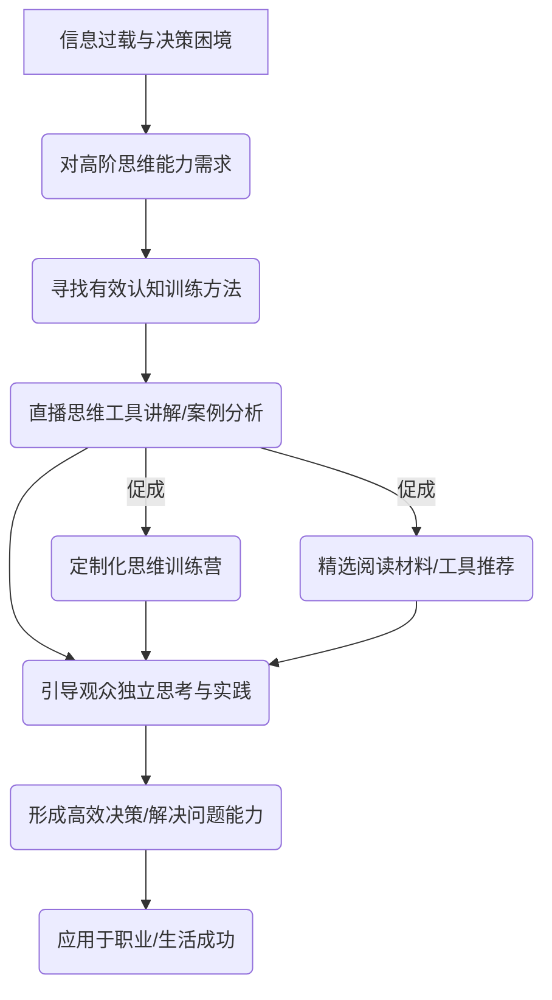
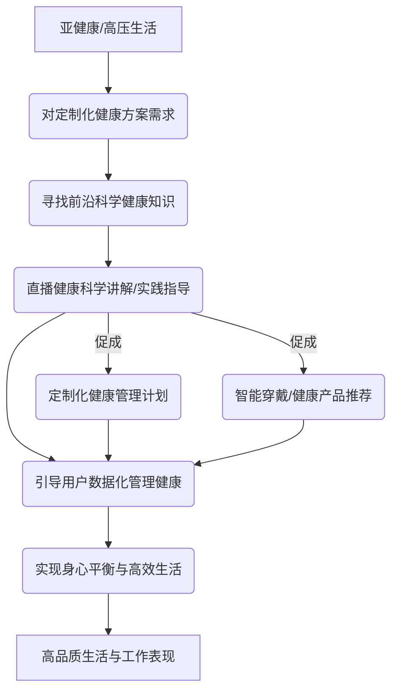

针对[[拥有6个钱包的年轻群体画像]]，提供“真实有用，听众在跟读之后有实际的收益”的技能内容，并要求具有商业模式、良好互动、产品潜力、护城河以及小众赛道的特点。

这个任务非常适合我们运用深度思考的框架来发掘真正的潜力赛道。我们将不仅仅是列举，而是通过剖析其背后的思维、质疑现有观念、构建系统图景，并识别深层模式，从而找到那些真正能建立“护城河”的直播方向。

“6个钱包”的年轻人，他们并非简单追求“省钱”或“速成”，而是更看重品质、体验、精神满足、以及将学习转化为实际价值的能力。他们的“技能教育”需求，很可能超出了传统的职业培训范畴，深入到生活美学、个人成长、高阶思维乃至影响力塑造等领域。

---

### **自媒体直播赛道推演：为“6个钱包”群体赋能**

让我们从你提供的笔记中提炼出核心需求，并应用我们的思维策略。

#### **核心需求回顾：**
*   **受众**: 一二线城市，生活富裕，有6个钱包支持的年轻人。
*   **内容特色**: 真实有用，跟读有实际收益。
*   **商业潜力**: 有后续商业模式、可形成良好互动、有成为产品的潜力、可建立护城河、小众赛道。

基于此，我为你推演出三个不同领域且符合条件的自媒体直播赛道。

---

### **赛道一：高端生活美学与沉浸式手作实践**

这个赛道旨在满足“6个钱包”年轻人对生活品质的极致追求、对个性化与艺术性的向往，以及通过亲手实践获得精神富足的需求。

#### **1. 剖析思维过程：超越“消费”的“创造”**

*   **常见假设**: 认为生活美学就是购买高档物品、享受服务。
*   **我们的剖析**: 富裕群体在满足物质需求后，会追求精神层面的满足感和自我实现。他们渴望的不仅仅是“拥有美”，更是“创造美”和“理解美”。亲手制作，意味着独特、有故事、有温度，这是金钱难以直接购买的价值。
*   **认知偏差**: 忽视了这部分人群对“匠人精神”和“慢生活”的追求，以及通过亲手实践获得的成就感和情绪价值。

#### **2. 质疑既定观念：挑战“技能即职业”的边界**

*   **挑战“技能教育必须是职业导向”**: 许多手作技能看起来不直接带来收入，但它们提供了情绪价值、社交价值和审美提升。对于不愁生计的年轻人，这些“非功利”的技能反而更具吸引力。
*   **质疑“线上直播只能单向输出”**: 高端手作直播可以设计大量实时互动环节，如材料选择指导、手法纠正、作品点评，甚至发起线上联名创作项目。

#### **4. 识别深层模式：从“消遣”到“自我价值实现”**

*   **深层模式**: 富裕群体在物质满足后，将重心转向精神世界的丰富。手作不仅是消遣，更是实现自我价值、构建个人标签、沉淀内在力量的途径。
*   **系统变革**: 改变了传统“买买买”的消费模式，倡导“创创创”的生活美学。从被动接受到主动创造，提升个人对生活的主导权和掌控感。

Sam，你认为这类直播是否能真正触动“6个钱包”年轻人的内心？除了上述例子，你还能想到哪些类似的“创作型”技能？

---

### **赛道二：高阶认知技能与批判性思维训练**

这个赛道瞄准的是“6个钱包”年轻人对个人成长、思维升级、高效决策以及在复杂信息环境中保持清醒的需求。他们可能已经拥有一定知识，但更渴望提升解决复杂问题的能力。

#### **1. 剖析思维过程：从“知识获取”到“智慧应用”**

*   **常见假设**: 认为通过阅读和听课就能提升认知水平。
*   **我们的剖析**: 真正的认知提升在于思维模式的转变和批判性工具的掌握，而非简单信息的堆砌。富裕年轻人面临更多高 stakes 的决策（投资、职业选择、人际关系），他们急需提升思维质量。
*   **认知偏差**: 过度依赖表面的信息和流行观点，缺乏对信息源、逻辑结构和潜在偏见的深入辨析能力。

#### **2. 质疑既定观念：挑战“硬技能万能论”**

*   **挑战“只有编程、金融等硬技能才有用”**: 在AI时代，高阶认知技能（如批判性思维、系统思维、[复杂问题解决]、情绪管理）的重要性日益凸显，它们是任何硬技能发挥作用的基石。
*   ==**质疑“思维训练是枯燥的理论课”**: 直播可以结合时事热点、商业案例、生活场景进行实时分析和讨论，让抽象的思维模式变得具象化、可操作。==

#### **3. 构建系统图景：个人“认知操作系统”的升级**

 

 

*   **赛道定位**: 帮助用户构建和优化其内在的“认知操作系统”，提升其在复杂世界中识别本质、做出明智决策的能力。
*   **内容示例**:
    *   **《复杂系统思维：洞察万物互联的底层逻辑》**: 结合商业案例、社会现象，讲解反馈回路、滞后效应、杠杆点等系统思维工具。
    *   **《批判性思维实战：破解信息茧房与逻辑陷阱》**: 针对热点新闻、社交媒体言论，分析常见逻辑谬误和认知偏差，引导观众辨析真伪。
    *   **《高效决策模型：从非理性到最优选择》**: 介绍贝叶斯思维、决策矩阵、风险评估等实用决策框架。
    *   **《情绪粒度与压力管理：从模糊到清晰的内心掌控》**: 讲解情绪的细微区分，教授科学的情绪调节和压力应对策略。
*   **后续商业模式**: 进阶系列直播课程、定制化思维训练营（小班制）、独家思维工具模板/框架、付费社群（高密度案例研讨、导师答疑）、精选书籍/工具推荐。
*   **护城河**: 主播深厚的学术背景与实战经验、独特的分析框架和案例库、能引发深度思考的互动方式、学习成果的可见性。

#### **4. 识别深层模式：从“知识焦虑”到“思维自信”**

*   **深层模式**: 许多人的“知识焦虑”源于对未知和不确定性的恐惧，以及缺乏驾驭信息的能力。通过高阶认知训练，可以从根本上解决这种焦虑，建立思维上的自信。
*   **系统变革**: 将“被动接收知识”转变为“主动构建智慧”，从“跟随潮流”转变为“引领思考”。改变个体在面对信息洪流和复杂问题时的无力感。

Sam，你觉得这种针对“思维升级”的直播，能否吸引那些已经拥有一定知识储备的年轻人？他们会为此支付怎样的溢价？

---

### **赛道三：定制化健康与身心平衡实践**

“6个钱包”的年轻人对健康的需求，不再停留在基础的“不生病”，而是对身体的极致掌控、精神的内在平衡、以及个性化、科学化的健康管理方案有极高需求。

#### **1. 剖析思维过程：从“健身”到“精细化生命管理”**

*   **常见假设**: 健康就是运动和饮食。
*   **我们的剖析**: 富裕年轻人更关注生物标记、睡眠优化、情绪对身体的影响、抗衰老、个性化营养等前沿领域。他们愿意投入时间和金钱去探索最适合自己的健康方案。
*   **认知偏差**: 忽视了健康领域的“定制化”和“科学化”趋势，误以为大众健身内容就能满足他们的需求。

#### **2. 质疑既定观念：挑战“大众健康方案”**

*   **挑战“一套方案适用所有人”**: 每个人的基因、生活习惯、体质都不同，大众化的健康建议往往无法满足个性化需求。直播可以引入数据分析、生物反馈等概念。
*   **质疑“健康只靠毅力”**: 强调科学方法、数据驱动、以及身心合一的平衡，而非简单的“管住嘴、迈开腿”。

#### **3. 构建系统图景：个人“生命仪表盘”的精细化调优**

 

 

*   **赛道定位**: 成为年轻人精细化生命管理的顾问，提供前沿、科学、定制化的健康实践指导，帮助他们实现身心最佳状态。
*   **内容示例**:
    *   **《睡眠科学与个性化优化：打造你的黄金8小时》**: 讲解睡眠周期、影响因素，教授通过环境、饮食、智能设备优化睡眠的方法。
    *   **《生物黑客入门：数据驱动的身体优化》**: 讲解如何利用可穿戴设备、基因检测、血液报告等数据，进行个性化营养、运动和补充剂调整。
    *   **《正念与情绪释放：高压下的内心平静之道》**: 结合冥想、呼吸法、认知行为疗法，帮助用户管理压力和焦虑。
    *   **《肠道健康与免疫力：身体第二大脑的秘密》**: 讲解肠道菌群与健康的关系，提供基于科学的饮食建议和益生菌方案。
*   **后续商业模式**: 高级健康定制方案（直播+一对一辅导）、健康数据分析服务、智能穿戴设备/高端营养补充剂/定制膳食推荐、线下健康主题工作坊。
*   **护城河**: 主播的专业医学/营养学/心理学背景、前沿的科学知识储备、数据驱动的个性化解决方案、社群内高价值的健康案例分享。

#### **4. 识别深层模式：从“被动治疗”到“主动掌控”**

*   **深层模式**: 富裕群体对于健康的深层需求是“掌控感”和“预防性”，不希望在身体出现问题时才被动治疗，而是希望主动地管理和优化自己的身体与精神状态。
*   **系统变革**: 改变了传统“生病看医生”的模式，转变为“日常管理，预防为主”的健康观。从“头痛医头脚痛医脚”的碎片化健康行为，整合为一套系统性的生命管理方案。

Sam，你觉得这类结合了“科学前沿”和“个人定制”的健康直播，与市面上的大众健康内容有何本质区别？它是否能建立起真正的数据壁垒和专家壁垒？

---

### **结语：构建你的“认知护城河”**

Sam，以上我为你推演了三个不同维度但都紧扣“6个钱包”年轻人需求的自媒体直播赛道。

这些赛道的核心共通点是：
*   **小众而高端**: 避开大众化竞争，瞄准细分市场。
*   **价值驱动**: 不仅传授技能，更传递一种生活理念或思维方式。
*   **可实操性**: 让观众能“跟读”并获得实际收益。
*   **可延展性**: 容易延伸出高价值的后续产品和服务。

要成功进入这些赛道并建立护城河，你需要：
1.  **深度专业性**: 成为你所选择领域的真正专家，提供超越泛泛之谈的深度内容。
2.  **独特的教学方法**: 不仅仅是知识输出，更是引导思维、激发实践的教学艺术。
3.  **社群建设**: 围绕共同的价值观和兴趣，建立高粘度的用户社群。
4.  **持续迭代**: 根据用户反馈和行业趋势，不断优化内容和商业模式。

Sam，现在请你思考：在这三个赛道中，哪一个最能激发你的热情和专业积累？你认为你最能从哪个赛道入手，并开始构建你的“认知护城河”？