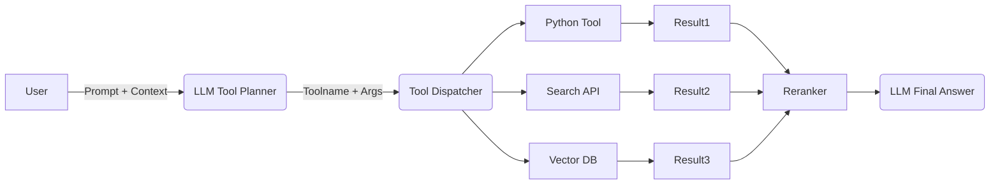

### 设置对响应类型的影响

不同的任务受益于不同的设置配置：

| 任务类型 | 温度      | 顶部 P    | 最大代币 | 频率惩罚    | 存在惩罚    |
| ---- | ------- | ------- | ---- | ------- | ------- |
| 事实问答 | 0.0-0.3 | 1.0     | 缓和   | 0.0     | 0.0     |
| 创意写作 | 0.7-1.0 | 0.9-1.0 | 高的   | 0.0-0.3 | 0.0-0.3 |
| 代码生成 | 0.2-0.5 | 1.0     | 高的   | 0.0-0.2 | 0.0     |
| 对话式  | 0.5-0.7 | 0.9-1.0 | 缓和   | 0.3-0.6 | 0.3-0.6 |
| 总结   | 0.3-0.5 | 1.0     | 各不相同 | 0.0-0.3 | 0.0-0.3 |

| Task Type        | Temperature | Top P   | Max Tokens | Frequency Penalty | Presence Penalty |
| ---------------- | ----------- | ------- | ---------- | ----------------- | ---------------- |
| Factual Q&A      | 0.0-0.3     | 1.0     | Moderate   | 0.0               | 0.0              |
| Creative Writing | 0.7-1.0     | 0.9-1.0 | High       | 0.0-0.3           | 0.0-0.3          |
| Code Generation  | 0.2-0.5     | 1.0     | High       | 0.0-0.2           | 0.0              |
| Conversational   | 0.5-0.7     | 0.9-1.0 | Moderate   | 0.3-0.6           | 0.3-0.6          |
| Summarization    | 0.3-0.5     | 1.0     | Varies     | 0.0-0.3           | 0.0-0.3          |


| Technique           | Recommended Settings Adjustments                          |
| ------------------- | --------------------------------------------------------- |
| Zero-shot Prompting | Moderate to low temperature (0.3-0.7)                     |
| Few-shot Prompting  | Lower temperature (0.1-0.5) for consistency with examples |
| Chain-of-Thought    | Low temperature (0.0-0.3) for logical consistency         |
| ReAct Prompting     | Low temperature for reasoning, higher for exploration     |
| Prompt Chaining     | Vary by chain step requirements                           |
这是一个针对不同任务类型（Task Type）设置大语言模型生成参数（如 `temperature`, `top_p`, `max_tokens`, `frequency_penalty`, `presence_penalty`）的推荐表。下面逐项分析这些配置背后的逻辑和使用策略：

---

### **参数含义简述**

|参数|含义|
|---|---|
|**Temperature**|控制输出的随机性。越低越确定，越高越发散。|
|**Top P (nucleus sampling)**|控制“累积概率”过滤，用于限制候选词的范围。|
|**Max Tokens**|最大生成长度，限制输出长度。|
|**Frequency Penalty**|惩罚重复使用的词（频率维度），防止重复啰嗦。|
|**Presence Penalty**|惩罚是否出现过的词，鼓励新词出现，提高多样性。|

---

### **各任务配置解读**

#### 1. **Factual Q&A（事实问答）**

- **Temperature: 0.0-0.3**：确保答案稳定准确，低随机性。
    
- **Top P: 1.0**：不做额外剪枝，保留全部候选，避免误删正确答案。
    
- **Max Tokens: Moderate**：通常事实问答不需要超长回答。
    
- **Frequency & Presence Penalty: 0.0**：不做语言控制，追求准确性。
    

> **分析**：这类任务要求结果**可复现、无偏差**，需要最大限度压制创造性。

---

#### 2. **Creative Writing（创意写作）**

- **Temperature: 0.7-1.0**：鼓励多样性、意料之外的输出。
    
- **Top P: 0.9-1.0**：允许更多候选词参与，增加表现力。
    
- **Max Tokens: High**：创作任务通常需要更长文本。
    
- **Frequency & Presence Penalty: 0.0-0.3**：适度惩罚重复，避免“口水文”。
    

> **分析**：这类任务希望模型能“发挥想象”，不能太保守。

---

#### 3. **Code Generation（代码生成）**

- **Temperature: 0.2-0.5**：需要一定的灵活性（如命名），但保持稳定。
    
- **Top P: 1.0**：确保语法合法结构不会被误裁。
    
- **Max Tokens: High**：代码往往长，逻辑完整是第一位。
    
- **Frequency Penalty: 0.0-0.2**：少量重复是可接受的，如变量使用。
    
- **Presence Penalty: 0.0**：保持保守，不鼓励随机添加。
    

> **分析**：代码生成更偏向“中性任务”，要有“创意”但不“乱写”。

---

#### 4. **Conversational（对话）**

- **Temperature: 0.5-0.7**：语气自然有变化，不失稳重。
    
- **Top P: 0.9-1.0**：提升交互性，生成更真实的回复。
    
- **Max Tokens: Moderate**：避免长篇大论，适中即可。
    
- **Frequency & Presence Penalty: 0.3-0.6**：抑制重复，提高对话多样性。
    

> **分析**：人机对话要“人味”，同时避免“答复复复复复”。

---

#### 5. **Summarization（摘要）**

- **Temperature: 0.3-0.5**：需要保留信息核心，不宜太自由。
    
- **Top P: 1.0**：保持信息完整性。
    
- **Max Tokens: Varies**：摘要长度依据源文不同变化。
    
- **Frequency & Presence Penalty: 0.0-0.3**：轻度惩罚重复，保持精炼。
    

> **分析**：摘要应重内容、轻风格，保持核心语义。

---

### **总结建议**

| 应用场景 | 重策略  | 建议                                       |
| ---- | ---- | ---------------------------------------- |
| 精准答复 | 稳定输出 | 降低 temperature、penalties，全候选保留           |
| 表达创新 | 多样性  | 提高 temperature + top_p，增加 penalties 抑制重复 |
| 实用代码 | 可控变化 | 适中 temp + 保守惩罚，防止语义漂移                    |
| 对话模拟 | 情感真实 | 中等 temp + 多样化 penalty 提升自然性              |
| 精炼摘要 | 信息导向 | 中低 temp + top_p=1，控制长度保持关键信息             |

---

如你需要一份参数自动推荐的 JSON 模板、Python 封装，或在 OpenAI / HuggingFace API 中的实际配置方式，也可以继续扩展。


投票机制:


## RAG

你说得对，**检索增强生成（Retrieval-Augmented Generation, RAG）** 正是因其能够**动态接入外部知识**，成为当前处理知识密集型任务的主流范式之一。

下面是对 RAG 的结构、流程和适用场景的详细解释：

---

### **RAG 架构流程图（简要说明每个组件）**

```
User Query
   ↓
Retriever Component  ←→ Knowledge Base (向量数据库，如 FAISS / Weaviate / Vespa / Qdrant)
   ↓
Top-K Retrieved Documents
   ↓
Context Augmentation (拼接 Prompt)
   ↓
LLM Generator (如 GPT / Claude / Gemini)
   ↓
Final Response
```

---

### **核心特点与优势**

|特性|说明|
|---|---|
|**知识动态检索**|通过稀疏（如 BM25）或密集向量检索（如 DPR）从外部知识库中获取相关信息。|
|**上下文增强**|将检索到的信息拼接到 LLM 的 Prompt 输入中，使生成更加具备事实支持。|
|**提高事实准确率**|有效缓解 hallucination（模型捏造）的现象，特别适用于需要引用知识的任务。|
|**处理长尾知识**|LLM 预训练知识有限，通过外部知识库补充冷门或更新信息。|
|**可扩展性强**|替换知识库（如企业私有数据）、增加多阶段检索都很灵活。|

---

### **典型适用任务**

|任务类型|说明|
|---|---|
|**问答系统（QA）**|法律、医疗、学术等场景，答案需要有据可依。|
|**企业内部搜索助手**|面向 HR、财务、客服文档构建助手。|
|**文档摘要 + 查询**|结合文档检索 + LLM 摘要/问答，例如合同解读。|
|**技术知识库接入**|ChatGPT + 自有技术文档结合形成智能问答机器人。|
|**R&D 和情报分析**|科研文献、报告、分析文档等提取并生成洞见。|

---

### **数学原理简要（Embedding + Similarity Search）**

- **Step 1: 编码查询**  
    q=fenc(xquery)q = f_{enc}(x_{query})
    
- **Step 2: 在向量数据库中检索 Top-K**  
    Dtop−k=argmaxd∈D sim(fenc(xquery),fenc(d))D_{top-k} = \text{argmax}_{d \in \mathcal{D}} \, \text{sim}(f_{enc}(x_{query}), f_{enc}(d))
    
- **Step 3: 构造 Prompt**  
    Prompt=Concat(xquery,d1,d2,…,dk)\text{Prompt} = \text{Concat}(x_{query}, d_1, d_2, \dots, d_k)
    
- **Step 4: LLM 生成**  
    y=fLLM(Prompt)y = f_{LLM}(\text{Prompt})
    

---

### **对比传统 LLM-only 模式**

|模型模式|是否可查新知识|幻觉风险|推理成本|
|---|---|---|---|
|LLM 直接生成|否（停留在预训练知识）|高|低（无检索）|
|RAG 架构|是（接入外部）|低|中（增加检索过程）|

---

### **前瞻趋势与扩展**

- **多跳检索（Multi-hop RAG）**：用于多步推理任务。
    
- **Hybrid RAG（稀疏+密集结合）**：如 ColBERT、RePlug。
    
- **长上下文模型的融合**：RAG + Long-context LLM（如 Claude 3/ Gemini 1.5）。
    
- **工具增强型 RAG**：让模型“先检索再算”，如 Toolformer。
    

---

如果你需要实际项目模板（如基于 LangChain、LlamaIndex 或自定义向量库构建的 RAG pipeline），我可以帮你生成代码和系统架构图。需要的话直接说。

---
当然，下面是对你列出这四种 **RAG 前沿模式** 的 TL;DR（Too Long; Didn't Read）式解释，每条都足够简明但不失深度：

---

### **1. Multi-hop RAG（多跳检索）**

**一句话总结：** 不止检索一次，模型会“逐步思考”，像侦探一样层层追问查证。

**适用场景：** 复杂问题拆解为多个子问题（如“谁是爱因斯坦的博士生的导师？”）

**技术点：** 每轮检索的结果作为下一轮查询的上下文，逐步逼近答案。

---

### **2. Hybrid RAG（混合检索）**

**一句话总结：** 把传统关键词（稀疏）和语义向量（密集）结合，让检索更“聪明又精准”。

**典型工具：** ColBERT（逐 token 比对）、RePlug（融合多个检索信号）。

**优势：** 保留 BM25 精度，结合向量语义召回，提升 recall + precision。

---

### **3. Long-context RAG（长上下文融合）**

**一句话总结：** 既然 LLM 的上下文窗口变长了，那就一次塞更多知识进去！

**用例：** 结合 RAG 和 Claude 3 / Gemini 1.5 等 1M token 模型，省掉复杂检索合并逻辑。

**技术变革：** 上下文拼接直接扩展到整个文档集，靠模型自身 attention 过滤噪声。

---

### **4. Tool-augmented RAG（工具增强）**

**一句话总结：** 不是让 LLM 胡乱猜答案，而是“先查再算”，像程序员一样查资料+调函数。

**代表：** Toolformer、ReAct + RAG、AutoGPT + Retrieval。

**核心机制：** 模型在生成中主动调用工具，如代码解释器、计算器或 API 调用器，RAG 是其中一个工具。

---

如果你希望这些模式用一个工程模板来体现（比如：Multi-hop with LangChain + ColBERT + Claude 3），我也可以为你搭一份 starter repo。是否继续？

---
**Hybrid RAG（混合检索）** 是 RAG 的升级形式，它结合了 **稀疏检索（如 BM25）** 和 **密集检索（如向量搜索）**，以更全面、准确地召回相关文档。适用于复杂查询、开放问答、企业知识库等高召回需求的场景。

---

## 一句话总结：

> 把关键词匹配的“稳”和语义搜索的“准”结合起来，用更聪明的方式找资料。

---

## 原理简述：

1. **稀疏检索：** 用 TF-IDF、BM25 等传统 IR 方法，基于关键词做精确匹配。
    
2. **密集检索：** 用语义向量（BERT embedding 等）计算 query 和文档的相似度。
    
3. **融合方式：**
    
    - **加权融合：** $Score = \lambda \cdot Score_{\text{BM25}} + (1 - \lambda) \cdot Score_{\text{Dense}}$
        
    - **交叉重排序：** 先用 BM25 召回一批文档，再用向量模型重新排序。
        
    - **集成：** 双通道并行检索，取并集或交集。
        

---

## 代表系统：

|项目|特点|优势|
|---|---|---|
|**ColBERT**|分词级向量 + 相似度加权匹配|精细粒度 + 高效并行|
|**RePlug**|插件式检索融合模块|可控 + 插拔式整合 BM25/Dense|
|**HybridSearch in Elasticsearch / Vespa**|工程级实现|稳定 + 可部署 + 生产就绪|

---

## 应用优势：

- **提升 Recall（召回率）：** 避免纯密集模型漏掉关键词表达不同但语义相近的文档。
    
- **语义丰富 + 精确覆盖：** 同时捕捉 query 的意思和它字面出现的关键词。
    
- **对抗幻觉：** 多检索源交叉验证，提升 RAG 的 factual consistency。
    

---

## 工程实践示例（伪代码）：

```python
# 混合检索组件（基于 LangChain）
bm25_docs = sparse_retriever.get_relevant_documents(query)
dense_docs = dense_retriever.get_relevant_documents(query)
hybrid_docs = rerank(bm25_docs + dense_docs, query)  # 可用 Cohere ReRank、ColBERT 等
```

---

## 适用场景：

- 企业文档问答（语义广泛 + 专业术语多）
    
- 法律、金融等需要精确匹配和深层语义的检索任务
    
- 多语种、长尾关键词、多模态检索（扩展中）
    

---

需要我基于 LangChain + FAISS + Elasticsearch + LlamaIndex 做一个 Hybrid RAG 的 demo 吗？或者你想用的是 ColBERT 方式实现的 production 级 hybrid pipeline？

---

**Tool-augmented RAG（工具增强 RAG）** 是一种结合了「检索 + 工具使用 + 生成」的新型工作流，它让语言模型在生成前或生成中，**主动调用外部工具**（如计算器、代码执行器、SQL 接口、API、搜索引擎等）来获取所需信息或完成复杂任务。

---

## TL;DR 速览

> RAG 只是“从知识库中取资料”；Tool-RAG 更进一步：**模型知道“我要用工具”，然后真的去用工具**，再返回结果辅助生成。

---

## 核心流程

```text
Query -> Retriever -> Tool Planner -> Tool Call(s) -> Augmented Context -> LLM -> Final Answer
```

- **Retriever**：召回可能相关的文档（可选）
    
- **Tool Planner**：判断是否需要工具 + 调用顺序（可以是 prompt 或 policy 模块）
    
- **Tool Call**：执行函数/API 调用（如 Calculator、SQL、Python、搜索、代码执行等）
    
- **Augmented Context**：将文档 + 工具返回结果 + 原 query 一起送入 LLM
    
- **LLM Generator**：生成最终响应
    

---

## 工具增强的价值

|优势|描述|
|---|---|
|**计算能力增强**|用外部计算工具（如 ReAct + Python）处理数学/逻辑/图表问题|
|**实时信息增强**|接入 Web 搜索/API 获取最新信息|
|**模块化可控性**|工具执行可审计、可测试，更容易工程部署|
|**Agent 化的第一步**|工具调用 + 规划是构建 Agent 系统的核心能力之一|

---

## 代表系统和技术

| 系统                     | 特点                           |
| ---------------------- | ---------------------------- |
| **Toolformer**         | 由 Meta 提出，语言模型自监督学习何时调用哪个工具  |
| **ReAct**              | Reason + Act，模型边思考边调用工具并逐步生成 |
| **LangChain**          | 提供 Tool abstraction，支持链式调用   |
| **AutoGPT / AgentGPT** | 多工具协调 + 多轮自我调用               |
| **DSPy**               | 可编程工具调度 + 编译型推理结构            |

---

## 示例（ReAct Prompt 简化）

```text
Question: What's the 7-day moving average of AAPL's closing price?

Thought: I need the recent AAPL prices.
Action: CallYahooFinanceAPI("AAPL", range="7d")

Observation: [price list...]

Thought: Now I calculate the moving average.
Action: Python(mean(prices))

Observation: 183.75

Answer: The 7-day moving average is $183.75.
```

---

## 工程落地建议：

- 开发环境建议使用 **LangChain Agents** 或 **DSPy**，支持插件化工具注入。
    
- 工具可以是本地函数（Python）、API（REST）、数据库（SQL）、向量搜索等。
    
- 推荐部署方式：
    
    - 前端 prompt 规划 + 工具执行 trace
        
    - 后端工具调度器 + LLM reranker 优化最终回答
        

---

## 用途场景

- **金融问答**（调用行情/指标接口）
    
- **企业内应用**（调用 CRM、ERP、数据库）
    
- **教育辅导**（执行代码、化学公式计算）
    
- **复杂多步推理**（如知识图谱填充、RPA）
    

---

想要一个支持 LangChain + Function Calling + 检索融合的 Tool-RAG 架构 demo 吗？我可以帮你生成一份部署方案或 PoC 示例。要不要试试？

---

非常清晰的方向，以下是对你这段落地建议的**扩展与可执行化建议**，结合你关注的 Agent + RAG + 工程实践：

---

## ✅ 工程落地建议（强化版）

### 1. **开发框架选型**

|技术栈|推荐理由|
|---|---|
|**LangChain Agents**|内置 tool 调用 & memory & agent policy 机制，支持多种 executor（ReAct、Plan-And-Execute）|
|**DSPy**|类似编译器思想，支持组件模块化、优化提示流（prompt graph），适合实验性项目|
|**LangGraph（进阶）**|有状态多轮推理 & 工具流控系统，适合构建 complex multi-agent|

> **建议**：快速 MVP 用 LangChain，Agent-Tool-Orchestration 建议研究 LangGraph。

---

### 2. **工具体系设计**

建议你构建如下几类可调用工具，支持 DSL/Plugin 注入：

|工具类型|实例|调用方式|
|---|---|---|
|**本地函数**|Python 工具函数（如计算、翻译）|@tool 装饰器注册|
|**外部 API**|如 Weather API / Search API|OpenAPI → Tool|
|**数据库**|SQL 执行器，支持知识仓库问答|langchain SQLAgent|
|**向量搜索**|FAISS / Weaviate / LanceDB|retriever + context injection|
|**文件系统工具**|文件读写、目录索引、知识载入|agentfs 模块（LangChain）|

---

### 3. **部署结构建议**



---

### 4. **Prompt + Trace 管理（前端）**

- 前端可视化显示 ReAct trace（Thought → Action → Obs）
    
- 使用 stream 分阶段返回过程（增强 explainability）
    
- 提供用户微调 hint 提升上下文效果
    

---

### 5. **后端调度器建议**

|模块|技术栈|核心职责|
|---|---|---|
|ToolRegistry|Python dict / JSON + LangChain Tool|工具注册和统一调度接口|
|ToolExecutor|异步多线程 / 队列|实际调用工具 + 结果格式规范|
|Reranker|LLM + score 函数|多工具结果 rerank（可引入 CoT/BLEU）|
|MemoryManager|Redis / FAISS hybrid|多轮上下文记忆 & 工具调用结果缓存|

---

### 补充建议（生产级）：

- 日志 & 调试：建议记录每一步 Action/Observation → trace 全链路日志
    
- 多模态扩展：考虑后续引入图像工具（Image2Text）或代码执行器（REPL）
    

---

是否需要我直接给你一份完整的示例 repo（支持工具注入 + Agent 执行流 + Prompt trace 展示）？可结合你常用的框架（LangChain、DSPy、FastAPI 等）定制。

---

