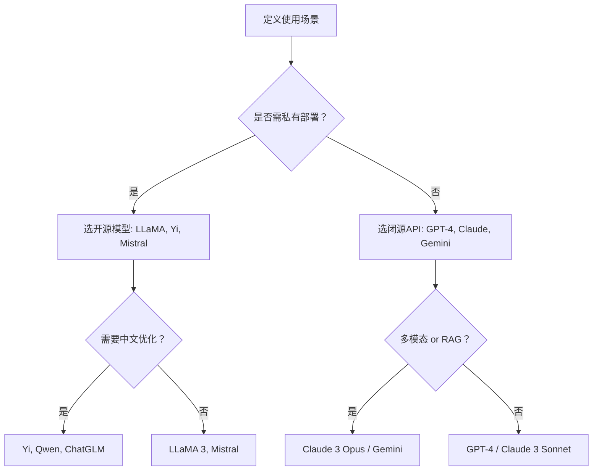

## 📚 四、训练阶段：最大似然学习 + 反向传播

训练过程简化为：

1. 输入大量文本（TB 级别，如维基百科、GitHub、新闻等）
    
2. 对每一段文本，模型尝试预测下一个词
    
3. 使用 **交叉熵损失函数（Cross-Entropy Loss）** 衡量预测与实际差距
    
4. 使用 **反向传播 + Adam 优化器** 更新参数
    

训练消耗极大，GPT-3 需要几千个 GPU 连续跑几周。

---

## 🧰 七、系统组件：生产环境中的 LLM

现代 LLM 系统不仅仅是一个语言模型，还包含很多辅助机制：

| 模块                              | 说明                    |
| ------------------------------- | --------------------- |
| Prompt Engineering              | 输入提示优化，增强模型能力         |
| RAG（检索增强生成）                     | 外部数据库知识接入，如搜索引擎/知识库   |
| Tool Calling / Function Calling | LLM 可以调用函数/API        |
| RLHF                            | 人类反馈强化学习，用于价值对齐       |
| 多任务训练                           | 提升泛化能力，如兼顾对话、摘要、翻译等任务 |


---

### ✅ 2. **私有部署 + 数据安全要求高**

- 建议模型：LLaMA 3（8B/70B）、Mistral 7B、Yi 系列
    
- 推荐部署方式：`vLLM + Hugging Face + LoRA 微调`
    
- 原因：
    
    - 开源可控，成本低
        
    - 易于本地训练微调
        
    - 可避免数据出境/合规问题
        

---

### ✅ 3. **中文或多语言任务**

- 建议模型：
    
    - Yi 系列（中文优异）
        
    - ChatGLM 3 / Qwen 系列（阿里）
        
    - GPT-4/Claude 在中文也表现优异，但成本高
        
- 注意事项：
    
    - 多数西方模型在中文理解上细节差一点
        
    - 开源模型更可控，适合中文特定领域微调
        

---

### ✅ 4. **代码生成 / 编程助手**

- 建议模型：
    
    - GPT-4 (最强，支持函数调用、思维链编程)
        
    - Claude 3 Sonnet（代码风格优雅）
        
    - Deepseek-Coder、Code LLaMA（开源）
        
- 评估方式：
    
    - 代码正确率（pass@1）
        
    - 解释能力
        
    - 支持多语言（Python / JS / Rust 等）
        

---

### ✅ 5. **RAG（检索增强生成）系统集成**

- 要求模型：
    
    - 支持长上下文（>32k）
        
    - 回答稳定、抽象能力强
        
- 建议模型：
    
    - Claude 3 Opus（长上下文能力优异）
        
    - Gemini 1.5 Pro（多模态 + 搜索工具）
        
    - GPT-4-turbo（有 Function Calling 支持）
        

---

## 🔍三、模型选择的维度总结

|维度|对应考虑|
|---|---|
|**模型质量**|Zero-shot / Few-shot 精度，MMLU, HELM, BIG-Bench等基准|
|**上下文长度**|需要处理多少 token？（8k / 32k / 200k / 1M）|
|**调用成本**|OpenAI vs 本地开源部署（运行+显卡+内存成本）|
|**响应速度**|是否用于实时交互系统？|
|**多模态能力**|是否需要图文、代码、结构化数据等能力？|
|**开源程度**|是否需要二次训练、微调或私有化部署？|

---

## 🛠️四、选型决策流程（可用于团队技术选型）



---

## 📌五、开源模型推荐组合（部署 or 微调）

|场景|模型|工具链|
|---|---|---|
|最小可用 Demo|Mistral 7B|`Ollama + LangChain`|
|私有 RAG 系统|LLaMA 3 70B|`vLLM + FAISS + Haystack`|
|中文企业定制|Yi 34B|`Transformers + LoRA + OpenWebUI`|
|本地编程助手|Deepseek-Coder 7B|`Continue.dev / CodeGeeX`|

---

## 🧠结语：如何选择？

> ❝选择模型的关键，不在于哪个最强，而在于**哪个在你的场景下效果最优+性价比最高+可落地**。❞

可以从以下几个角度开始试验：

1. 先用 OpenAI / Claude / Gemini 快速验证业务可行性
    
2. 再考虑是否私有部署 + RAG 组件
    
3. 最后若需降低成本，尝试微调开源模型
    

---

如果你想要：

- 一个具体对比表（价格/速度/精度）
    
- 开源模型部署/评估脚本
    
- 构建一个 RAG+LLM 业务级原型（支持代码）
    

可以告诉我，我可以一步步帮你做选型+上手。是否需要我帮你构建一个“模型选型和测试工作表”？


## 🛠️ 五、工具与开源实践推荐

| 目的    | 工具                                  | 说明                       |
| ----- | ----------------------------------- | ------------------------ |
| 输入防御  | Rebuff / Guardrails AI              | Prompt injection 检测，规则控制 |
| 输出检测  | OpenAI Moderation API / Detoxify    | 审查有害内容                   |
| 内容水印  | GPT Watermarking / DeepMind SynthID | 判断内容是否由 AI 生成            |
| 可追踪日志 | PromptLayer / LangSmith             | Prompt + 生成结果的可追踪链路      |
| 隐私处理  | TextRedact / Presidio               | 对文本中 PII 信息进行识别与脱敏处理     |

---

## 📚 七、推荐工具 & 框架（进阶）

|工具/库|功能|
|---|---|
|[LangChain](https://github.com/langchain-ai/langchain)|多模块 Prompt 模板系统|
|[PromptLayer](https://promptlayer.com/)|Prompt 管理、版本控制|
|[LlamaIndex](https://www.llamaindex.ai/)|索引式上下文注入|
|[Guidance (by Microsoft)](https://github.com/microsoft/guidance)|高控制性的 Prompt 模板引擎|
|[Promptfoo](https://github.com/promptfoo/promptfoo)|Prompt A/B 测试和评估|

---

## ✅ 八、总结：Prompt Engineering 的能力曲线

> Prompt 工程不是玩玩 prompt，而是系统构建「输入 → 输出」的语言接口，最终为 LLM 应用建立“可预测、可控、可用”的输入层。

| 阶段  | 技能要点                         |
| --- | ---------------------------- |
| 初级  | 掌握基础模板，避免典型坑                 |
| 中级  | 构建通用/领域特定 Prompt 模板库         |
| 高级  | 结合工具链、反馈机制，实现 Prompt 自动生成与优化 |

---
这是个关键问题，Sam。如果你让模型以 JSON 数组格式输出任务、子任务、调度指令、参数等结构化内容，那后续就可以**像操作数据库一样操作模型的输出**，实现如下功能：

---

## ✅ JSON 输出的后续用法（通用场景）

### 1. **渲染为 UI 界面 / 表格**

- 用 JSON 填充前端组件（React/Vue 中的任务卡片、ToDo 列表、进度表等）。
    
- 示例：
    

```json
[
  {"step_number": 1, "subtask": "设计对话框结构", "priority": "高", "estimated_time_minutes": 45},
  {"step_number": 2, "subtask": "实现订单状态查询模块", "priority": "中", "estimated_time_minutes": 60}
]
```

可以直接映射成：

|步骤|子任务|优先级|预计耗时（分钟）|
|---|---|---|---|
|1|设计对话框结构|高|45|
|2|实现订单状态查询模块|中|60|

---

### 2. **发送给调度系统或 Agent 控制器**

- JSON 可以喂给 Python 脚本、LangChain Agent、AutoGen Runner，作为「待执行计划」。
    

```python
import json

with open("llm_output.json") as f:
    tasks = json.load(f)

for task in tasks:
    print(f"⏳ 正在执行: {task['subtask']}，预计耗时: {task['estimated_time_minutes']} 分钟")
```

---

### 3. **反向喂给模型进行下一轮任务**

- 把这轮 JSON 输出直接嵌入下一个 prompt 中，实现多轮 Agent 对话。
    

```text
根据以下任务拆解结果，判断是否存在依赖关系，并重新排序：

{{上轮模型的 JSON 输出}}
```

---

### 4. **保存到数据库 / Sheet**

你可以直接将 JSON 转为数据库记录，或写入 Google Sheet：

```python
import gspread
from oauth2client.service_account import ServiceAccountCredentials

# 认证并连接 Sheet
# creds = ServiceAccountCredentials.from_json_keyfile_name(...)
# client = gspread.authorize(creds)

sheet = client.open("Agent任务表").sheet1
for row in tasks:
    sheet.append_row([
        row["step_number"],
        row["subtask"],
        row["priority"],
        row["estimated_time_minutes"]
    ])
```

---

## 📦 延伸用途

| 用途              | 技术栈                       | 实例                         |
| --------------- | ------------------------- | -------------------------- |
| 可视化日程安排         | Dash / Streamlit          | 将 JSON 生成甘特图或时间线           |
| 多 Agent 协作      | LangGraph / AutoGen       | 一个 Agent 输出 JSON，另一个读取任务执行 |
| Prompt Chain 管理 | JSON as DAG Node          | JSON 变成 prompt 节点流的一部分     |
| 云函数触发器          | AWS Lambda / GCP Function | 根据 JSON 控制执行逻辑             |

---

## ☑️ 总结

**为什么让 LLM 输出 JSON：**

1. 可被程序读取与消费
    
2. 支持构建多轮推理链
    
3. 更方便评估模型表现（结构比自然语言更容易对比）
    

如果你希望我为你写一个 demo，从 prompt → JSON → 任务执行/调度，可提供一个你常用的 use case，我可以马上生成。需要吗？

---

好的，Sam。这里我为你设计一个通用性强、具备高度复用价值的 demo：**「日程自动规划 + 执行器联动」**，它可以应用于任何需要结构化管理任务的个人效率系统。

---

## 🧠 Use Case 提案：「自然语言 → JSON 日程 → 自动执行」

### 🎯 场景：你每天早上输入一句话描述今天要做什么，它会自动拆分成结构化任务并分发执行。

---

### 🔁 示例输入 Prompt

```
今天我想完成以下几件事：总结昨天会议内容，给王总发周报，学习 LLM 提示词优化的最新技巧，整理 Notion 里的项目笔记。
```

---

### 🎯 LLM 输出（JSON）

```json
[
  {
    "step_number": 1,
    "subtask": "总结昨天会议内容",
    "priority": "高",
    "estimated_time_minutes": 30,
    "action_type": "note_edit",
    "tool": "Obsidian"
  },
  {
    "step_number": 2,
    "subtask": "给王总发周报",
    "priority": "高",
    "estimated_time_minutes": 20,
    "action_type": "email_send",
    "tool": "Gmail"
  },
  {
    "step_number": 3,
    "subtask": "学习 LLM 提示词优化的最新技巧",
    "priority": "中",
    "estimated_time_minutes": 60,
    "action_type": "content_study",
    "tool": "YouTube / Arxiv"
  },
  {
    "step_number": 4,
    "subtask": "整理 Notion 里的项目笔记",
    "priority": "中",
    "estimated_time_minutes": 25,
    "action_type": "note_review",
    "tool": "Notion"
  }
]
```

---

### ⚙️ 调度执行器脚本（Python 简化版）

```python
import json
from time import sleep

def execute_task(task):
    print(f"📌 执行任务：{task['subtask']}")
    print(f"➡️ 类型：{task['action_type']}，工具：{task['tool']}")
    print(f"⏱️ 预计用时：{task['estimated_time_minutes']} 分钟\n")
    # 模拟执行
    sleep(1)

# 加载模型输出的 JSON
with open('today_tasks.json') as f:
    tasks = json.load(f)

# 依优先级调度（可扩展为优先级 + 时间段安排）
sorted_tasks = sorted(tasks, key=lambda t: t["priority"])

# 开始执行
for task in sorted_tasks:
    execute_task(task)
```

---

### 🔗 拓展方向（为你的系统铺路）：

| 功能方向                   | 技术栈建议                         | 可实现内容                     |
| ---------------------- | ----------------------------- | ------------------------- |
| 自动写入 Google Calendar   | Google Apps Script / gcal API | 拆分任务后直接写入日程               |
| 联动 Notion / Obsidian   | Notion API / Obsidian Plugin  | 根据任务内容创建笔记                |
| 接入 LangChain / AutoGen | JSON → Agent Loop             | Prompt → 任务 → 工具 Agent 执行 |
| 微服务调度框架                | FastAPI + Redis Queue         | 拆解后交由 Worker 执行           |
| 自动执行邮箱、脚本、Slack等       | Zapier / n8n / 自建             | JSON 控制器分发多端触发器           |

---

### ✅ 总结一句话：

这类 use case 是 “**结构化语言交互 → 自动化执行**” 的完美范式，非常适合构建个人智能助理、任务管家、AI Copilot。

如果你想试试，我可以立刻把 prompt 模板 + JSON Schema + Python 执行器 打包给你部署，是否需要？或者我们可以[[智能任务管家|以 Obsidian + Notion + Calendar 为起点做一个最小可用系统]]。你有偏好吗？

---
好的，这是对AI Agent的提炼总结，用中文呈现，保持直接和随性的风格，适合像你这样的高智商人群：

---

### **AI Agent：超越传统大语言模型**

别再只把大语言模型（LLM）看作是吐文字的机器了。**AI Agent是那些以LLM为核心，能够自主采取行动、解决复杂任务的系统。**它们不仅仅是更聪明，它们是真正的“实干家”。

**为什么它们很重要？** 独立的大语言模型在处理需要多步骤、涉及真实世界的复杂任务时（比如制定市场策略）会力不从心，因为它们缺乏最新信息、外部工具访问和规划能力。Agent弥补了这一差距。

**它们是如何运作的？**

- **规划与反思：** 它们能分解任务、制定策略，并从自己的行动中学习。
- **工具使用：** 它们能调用外部工具（比如代码解释器、网页搜索、数据库）来完成现实世界的具体工作。
- **记忆系统：** 它们能记住过去的信息，从而做出更明智的决策并持续学习。

**它们的应用场景：** Agent正被广泛应用于各种领域：客户支持、个性化推荐、深度研究、电商、金融分析等等。它们的核心价值在于自动化那些复杂且多变的任务。

---
好的，Sam，来一个深度研究MVP Agent的示例，这不仅仅是功能上的MVP，更是在设计理念上体现你之前强调的“上下文清晰”、“模块化”和“可观测性”。我们的目标是构建一个能颠覆你直觉的、高度智能化的研究工具，即使是MVP版本也要有未来的影子。

---

[[深度研究MVP Agent]]