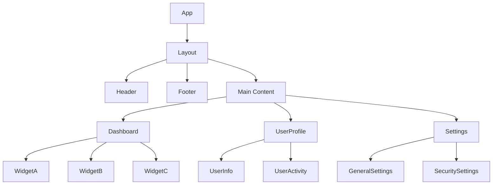
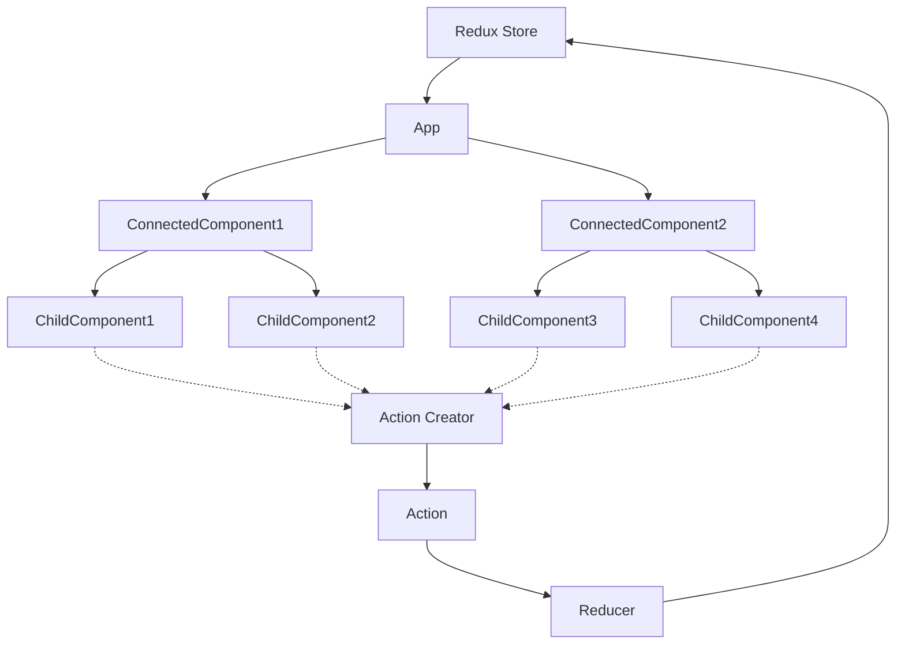

让我们深入探讨如何构建一个可扩展、可维护的大型 React 应用，涵盖组件拆分、数据流设计、错误边界等关键方面。
1. 组件拆分
组件拆分是 React 应用架构的基础。好的组件拆分可以提高代码的可重用性和可维护性。
原则：
- 单一职责：每个组件应该只做一件事。
- 可重用性：设计通用组件，以便在多处使用。
- 组合优于继承：使用组合来构建复杂的UI。

2. 数据流设计
在大型应用中，管理数据流是关键。我们可以使用 Redux 或 MobX 等状态管理库，或者使用 React 的 Context API。
原则：
- 单一数据源：保持一个全局状态树。
- 状态不可变性：不直接修改状态，而是返回新的状态对象。
- 单向数据流：**数据从顶层组件向下流动，事件从底层组件向上传递。**
示例数据流设计：

