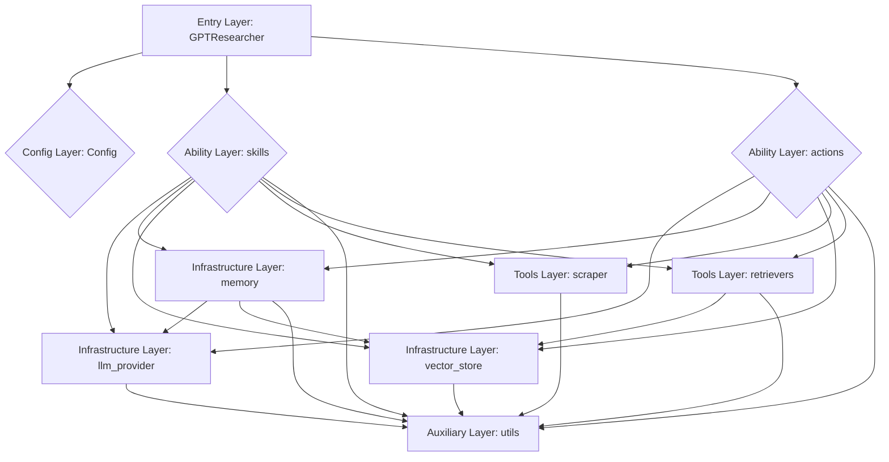

让手机为你提供更具体、更贴近实际的例子，说明系统如何通过依赖注入、事件驱动通信、接口抽象和配置驱动实现模块间的解耦。

假设我们正在开发一个**智能家居控制系统**，它需要管理各种设备（灯、空调、门锁等），并提供用户界面进行操作。

---

### 1. 依赖注入 (Dependency Injection - DI)

**概念：** 模块不再自己创建它所依赖的对象，而是由外部（通常是DI容器）提供给它。这就像你不需要自己买电池来遥控器，而是有人直接把装好电池的遥控器递给你。

**智能家居系统中的例子：**

- **问题：** 我们的 `LightController` 模块需要一个 `LightService` 来控制灯光，它自己创建这个 `LightService` 实例。如果将来我们需要更换一个不同的灯光服务（比如从飞利浦Hue切换到小米智能灯），`LightController` 就需要修改代码。
- **解耦前：**
    
    Java
    
    ```
    // LightController.java
    public class LightController {
        private LightService lightService = new PhilipsHueLightService(); // 内部创建依赖
        // ... 控制灯光的方法
    }
    ```
    
- **解耦后 (通过构造函数注入)：**
    
    Java
    
    ```
    // LightController.java
    public class LightController {
        private LightService lightService;
    
        public LightController(LightService lightService) { // 依赖通过构造函数注入
            this.lightService = lightService;
        }
        // ... 控制灯光的方法
    }
    
    // 在应用程序启动时或DI容器中
    public class ApplicationConfig {
        public static void main(String[] args) {
            LightService philipsService = new PhilipsHueLightService();
            LightController controller1 = new LightController(philipsService);
    
            LightService xiaomiService = new XiaomiSmartLightService();
            LightController controller2 = new LightController(xiaomiService); // 轻松切换实现
        }
    }
    ```
    
- **效果：** `LightController` 不再关心 `LightService` 的具体实现，它只知道自己需要一个 `LightService` 类型的对象。这样，我们可以轻松地在不修改 `LightController` 代码的情况下，更换不同的灯光服务提供商。

---

### 2. 事件驱动通信 (Event-Driven Communication)

**概念：** 模块之间不直接调用对方的方法，而是通过发布/订阅事件的方式进行通信。一个模块发布一个事件，其他感兴趣的模块订阅并响应这个事件。就像广播电台，发布者只管播放，听众自己选择收听。

**智能家居系统中的例子：**

- **问题：** 当 `MotionSensor` 检测到有人移动时，它需要通知 `LightController` 开灯，同时通知 `SecuritySystem` 记录活动。如果直接调用，`MotionSensor` 会与 `LightController` 和 `SecuritySystem` 紧密耦合。
- **解耦前：**
    
    Java
    
    ```
    // MotionSensor.java
    public class MotionSensor {
        private LightController lightController;
        private SecuritySystem securitySystem;
    
        public MotionSensor(LightController lightController, SecuritySystem securitySystem) {
            this.lightController = lightController;
            this.securitySystem = securitySystem;
        }
    
        public void detectMotion() {
            // ... 检测到移动
            lightController.turnOnLights(); // 直接调用
            securitySystem.recordActivity("Motion detected"); // 直接调用
        }
    }
    ```
    
- **解耦后 (通过事件总线/消息队列)：**
    
    Java
    
    ```
    // EventPublisher (例如，一个事件总线)
    public class EventBus {
        private List<EventListener> listeners = new ArrayList<>();
    
        public void register(EventListener listener) {
            listeners.add(listener);
        }
    
        public void publish(Event event) {
            for (EventListener listener : listeners) {
                listener.onEvent(event);
            }
        }
    }
    
    // MotionSensor.java (发布者)
    public class MotionSensor {
        private EventBus eventBus;
    
        public MotionSensor(EventBus eventBus) {
            this.eventBus = eventBus;
        }
    
        public void detectMotion() {
            // ... 检测到移动
            eventBus.publish(new MotionDetectedEvent()); // 发布事件
        }
    }
    
    // LightController.java (订阅者)
    public class LightController implements EventListener {
        @Override
        public void onEvent(Event event) {
            if (event instanceof MotionDetectedEvent) {
                // ... 开灯逻辑
                System.out.println("LightController: Motion detected, turning on lights.");
            }
        }
    }
    
    // SecuritySystem.java (订阅者)
    public class SecuritySystem implements EventListener {
        @Override
        public void onEvent(Event event) {
            if (event instanceof MotionDetectedEvent) {
                // ... 记录活动逻辑
                System.out.println("SecuritySystem: Motion detected, recording activity.");
            }
        }
    }
    
    // 应用程序启动时
    public class Application {
        public static void main(String[] args) {
            EventBus eventBus = new EventBus();
            MotionSensor motionSensor = new MotionSensor(eventBus);
            LightController lightController = new LightController();
            SecuritySystem securitySystem = new SecuritySystem();
    
            eventBus.register(lightController);
            eventBus.register(securitySystem);
    
            motionSensor.detectMotion(); // 触发事件
        }
    }
    ```
    
- **效果：** `MotionSensor` 不再需要知道谁会响应它的移动事件，它只管发布。`LightController` 和 `SecuritySystem` 也不需要知道事件是由谁发布的，它们只关注自己感兴趣的事件。这样，我们可以轻松地添加或移除响应者，而无需修改 `MotionSensor` 的代码。

---

### 3. 接口抽象 (Interface Abstraction)

**概念：** 定义一组行为规范，而不是具体的实现。模块之间通过接口进行交互，而不是具体的类。这就像USB接口，电脑只知道怎么和USB设备通信，而不用管里面是U盘、鼠标还是键盘。

**智能家居系统中的例子：**

- **问题：** 我们的 `SmartHomeDashboard` 需要显示各种设备的状态并发送控制命令。如果直接依赖于具体的设备类（如 `PhilipsHueLight`、`DaikinAC`），那么每增加一种新设备，`SmartHomeDashboard` 都需要修改。
- **解耦前：**
    
    Java
    
    ```
    // SmartHomeDashboard.java
    public class SmartHomeDashboard {
        private PhilipsHueLight light;
        private DaikinAC airConditioner;
    
        public SmartHomeDashboard(PhilipsHueLight light, DaikinAC airConditioner) {
            this.light = light;
            this.airConditioner = airConditioner;
        }
    
        public void displayStatus() {
            System.out.println("Light status: " + light.isOn());
            System.out.println("AC temperature: " + airConditioner.getCurrentTemperature());
        }
    
        public void controlDevices() {
            light.turnOn();
            airConditioner.setTemperature(25);
        }
    }
    ```
    
- **解耦后 (通过接口)：**
    
    Java
    
    ```
    // IDevice.java (接口定义)
    public interface IDevice {
        String getName();
        String getStatus();
        void turnOn();
        void turnOff();
        // ... 其他通用操作
    }
    
    // PhilipsHueLight.java (实现接口)
    public class PhilipsHueLight implements IDevice {
        private String name = "Living Room Light";
        private boolean isOn = false;
    
        @Override
        public String getName() { return name; }
        @Override
        public String getStatus() { return isOn ? "On" : "Off"; }
        @Override
        public void turnOn() { isOn = true; System.out.println(name + " turned on."); }
        @Override
        public void turnOff() { isOn = false; System.out.println(name + " turned off."); }
    }
    
    // DaikinAC.java (实现接口)
    public class DaikinAC implements IDevice {
        private String name = "Bedroom AC";
        private int temperature = 26;
        private boolean isOn = false;
    
        @Override
        public String getName() { return name; }
        @Override
        public String getStatus() { return "Temp: " + temperature + ", Status: " + (isOn ? "On" : "Off"); }
        @Override
        public void turnOn() { isOn = true; System.out.println(name + " turned on."); }
        @Override
        public void turnOff() { isOn = false; System.out.println(name + " turned off."); }
        public void setTemperature(int temp) { this.temperature = temp; System.out.println(name + " set to " + temp + "C."); }
    }
    
    // SmartHomeDashboard.java
    public class SmartHomeDashboard {
        private List<IDevice> devices; // 依赖于接口
    
        public SmartHomeDashboard(List<IDevice> devices) {
            this.devices = devices;
        }
    
        public void displayAllDeviceStatus() {
            for (IDevice device : devices) {
                System.out.println(device.getName() + " Status: " + device.getStatus());
            }
        }
    
        public void controlAllDevices() {
            for (IDevice device : devices) {
                device.turnOn(); // 调用接口方法
            }
        }
    }
    
    // 应用程序启动时
    public class Application {
        public static void main(String[] args) {
            List<IDevice> myDevices = new ArrayList<>();
            myDevices.add(new PhilipsHueLight());
            myDevices.add(new DaikinAC());
            // 以后可以轻松添加新设备，例如：
            // myDevices.add(new SmartDoorLock());
    
            SmartHomeDashboard dashboard = new SmartHomeDashboard(myDevices);
            dashboard.displayAllDeviceStatus();
            dashboard.controlAllDevices();
        }
    }
    ```
    
- **效果：** `SmartHomeDashboard` 只通过 `IDevice` 接口与设备交互，而不再关心设备的具体类型。这意味着我们可以轻松地添加新的智能设备（只要它们实现了 `IDevice` 接口），而无需修改 `SmartHomeDashboard` 的代码。这极大地提高了系统的可扩展性。

---

### 4. 配置驱动 (Configuration-Driven)

**概念：** 系统的行为和组件的组合方式不是硬编码在代码中，而是通过外部配置文件（如XML、JSON、YAML、属性文件）进行定义。这就像你通过设置菜单来定制手机的功能，而不是修改手机的底层代码。

**智能家居系统中的例子：**

- **问题：** 我们的系统需要连接不同的设备厂商API，并且这些API的密钥、端点等信息可能会变动。如果这些信息硬编码在代码中，每次修改都需要重新编译部署。
    
- **解耦前：**
    
    Java
    
    ```
    // PhilipsHueLightService.java
    public class PhilipsHueLightService implements LightService {
        private String apiKey = "hardcoded_philips_api_key";
        private String baseUrl = "https://api.philips.com/hue/v1";
        // ... 使用这些信息连接API
    }
    ```
    
- **解耦后 (通过配置文件)：**
    
    **`application.properties` 文件:**
    
    Properties
    
    ```
    light.service.type=philips
    philips.hue.api.key=your_philips_hue_api_key_from_config
    philips.hue.base.url=https://api.philips.com/hue/v1
    xiaomi.light.api.key=your_xiaomi_api_key_from_config
    xiaomi.light.base.url=https://api.xiaomi.com/smartlight/v1
    ```
    
    **`PhilipsHueLightService.java`:**
    
    Java
    
    ```
    public class PhilipsHueLightService implements LightService {
        private String apiKey;
        private String baseUrl;
    
        public PhilipsHueLightService(String apiKey, String baseUrl) { // 通过构造函数注入配置
            this.apiKey = apiKey;
            this.baseUrl = baseUrl;
        }
        // ... 使用 apiKey 和 baseUrl 连接API
    }
    ```
    
    **`LightServiceFactory.java` (根据配置创建服务实例)：**
    
    Java
    
    ```
    public class LightServiceFactory {
        public static LightService createLightService(Properties config) {
            String serviceType = config.getProperty("light.service.type");
            if ("philips".equals(serviceType)) {
                String apiKey = config.getProperty("philips.hue.api.key");
                String baseUrl = config.getProperty("philips.hue.base.url");
                return new PhilipsHueLightService(apiKey, baseUrl);
            } else if ("xiaomi".equals(serviceType)) {
                String apiKey = config.getProperty("xiaomi.light.api.key");
                String baseUrl = config.getProperty("xiaomi.light.base.url");
                return new XiaomiSmartLightService(apiKey, baseUrl);
            } else {
                throw new IllegalArgumentException("Unknown light service type: " + serviceType);
            }
        }
    }
    ```
    
    **应用程序启动时：**
    
    Java
    
    ```
    import java.io.FileInputStream;
    import java.io.IOException;
    import java.util.Properties;
    
    public class Application {
        public static void main(String[] args) throws IOException {
            Properties config = new Properties();
            try (FileInputStream fis = new FileInputStream("application.properties")) {
                config.load(fis);
            }
    
            LightService lightService = LightServiceFactory.createLightService(config);
            LightController lightController = new LightController(lightService); // 结合DI
    
            lightController.turnOn();
        }
    }
    ```
    
- **效果：** 我们可以通过修改 `application.properties` 文件来切换灯光服务提供商（例如，从飞利浦切换到小米），或者更新API密钥，而无需重新编译和部署代码。这使得系统更加灵活，易于维护和适应变化。
    

---

**总结：**

通过上述例子可以看出，依赖注入、事件驱动通信、接口抽象和配置驱动都是实现模块间解耦的有效手段。它们各自侧重于不同的解耦维度，但常常协同使用，共同构建出高内聚、低耦合、易于扩展和维护的健壮系统。

- **依赖注入：** 管理模块间的**依赖关系**，将依赖的创建和管理责任从模块内部转移到外部。
- **事件驱动通信：** 实现模块间的**异步通信**，将发布者与订阅者解耦。
- **接口抽象：** 定义模块间的**行为规范**，将实现与使用解耦。
- **配置驱动：** 将系统**行为和参数**从代码中分离，通过外部配置进行调整。

这些技术共同协作，使得智能家居系统能够轻松应对新的设备类型、不同的厂商API以及不断变化的用户需求，而无需对核心代码进行大量修改。

