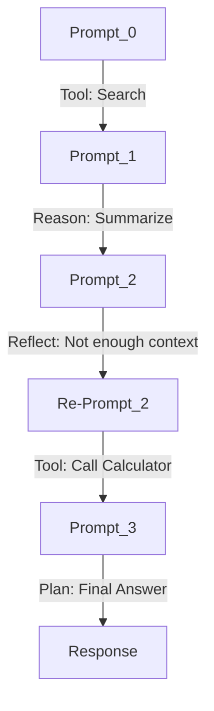

---
aliases:
date: 2025-12-03 09:58
tags:
source:
update:
rating: 10
related:
---

“提示路径演化（Prompt Trajectory Evolution）”是理解 LLM 多轮推理、工具链调用、任务拆解等智能行为背后 **“路径依赖 + 轨迹跃迁”** 的重要思维框架。对构建高级 Agent 系统、进行 Prompt Debug、提示迁移学习、行为链因果建模都有直接帮助。

---

## 一、什么是提示路径演化？

简化定义：

> **Prompt 路径演化**是指，LLM 从初始提示出发，随着内部推理步骤、外部工具调用、用户反馈等，不断演化出新的提示状态序列与行为决策路径。

### 类比：

- 类比「程序执行路径」：if-else 分支、函数调用栈

- 类比「认知心理轨迹」：从问题识别 → 联想 →策略生成 →反馈修正

---

## 二、提示路径的组成

### 核心结构如下：

```
[Prompt_0]
   |
   |--[Action_1] → Tool_A → Result_1
   |          |
   |          └──[Prompt_1]
   |                |
   |--[Action_2] → Reflect → Rewrite_Prompt
                    |
                   [Prompt_2]
```

### 每条路径包含：

| 组件         | 说明                                     |
| ---------- | -------------------------------------- |
| Prompt_n   | 当前提示语（含历史 memory、目标、工具建议等）             |
| Action_n   | 本轮推理策略：调用工具 / 自反思 / 生成子任务等             |
| Result_n   | 工具返回或推理输出                              |
| Transition | Prompt 更新方式（append / rewrite / branch） |

---

## 三、路径演化的四类模式（可建模）

| 类型       | 描述                    | 示例                         |
| -------- | --------------------- | -------------------------- |
| **线性演化** | 固定目标，逐步优化提示           | 用户提问 → 摘要 → 查询优化           |
| **分支演化** | 多个子任务路径分化并行           | Agent 分派子 Agent 追踪不同信息源    |
| **循环演化** | ReAct/RAG中反复执行“观察-行动” | 检索 → 评价 → 再检索              |
| **跃迁演化** | 外部输入/异常使路径重构          | 工具失败 → 自反思 → 重新生成全新 Prompt |

---

## 四、提示路径演化的作用与价值

| 方向                              | 应用                                 |
| ------------------------------- | ---------------------------------- |
| **Prompt Debug**                | 识别哪一步推理出错（路径回溯）                    |
| **Few-shot Prompt Engineering** | 保留优秀路径段作为提示模板片段                    |
| **迁移学习 / Prompt 压缩**            | 从多个路径提取通用策略子图                      |
| **Agent 行为建模**                  | 构建 Prompt-Action Graph，支持因果分析、任务计划 |
| **行为记忆 / Replay Buffer**        | 保存演化轨迹以便强化学习与人类反馈优化（RLAIF）         |

## 一、本轮推理策略的三大核心类型（TAR 分类）

| 策略类别                            | 含义                | 示例                         |
| ------------------------------- | ----------------- | -------------------------- |
| **T：Tool Invocation** 工具调用      | 调用外部接口/数据库/API/函数 | 搜索、计算、数据库查询、LangGraph 调用   |
| **A：Agent Reasoning** 推理与判断     | 自主生成内容、解释、评估、归纳等  | 回答问题、总结内容、生成文本、评分          |
| **R：Reflective Control** 自反思与控制 | 反省自己输出、修正路径、重构目标  | CoT 调整、Prompt 重写、输出拒绝、恢复快照 |

## 二、每类策略的子策略示意（可追踪）

### 1. 工具调用 Tool Invocation

| 子策略                 | 描述              | 典型场景                      |
| ------------------- | --------------- | ------------------------- |
| Search → Synthesize | 调用 Web 检索后归纳答案  | ReAct-style 信息检索          |
| Execute Code        | 执行 Python/JS 脚本 | LLM with code interpreter |
| Use External Memory | 查询或更新记忆数据库      | RAG with memory agent     |

### 2. 推理与判断 Agent Reasoning

| 子策略                    | 描述        | 典型场景                |
| ---------------------- | --------- | ------------------- |
| Chain of Thought (CoT) | 逐步分解问题思路  | 多步数学题               |
| Compare → Select       | 对比多个方案并选优 | 多选题、A/B 策略比对        |
| Plan → Act             | 拆解计划并执行   | 多步骤任务规划（BabyAGI 模型） |

### 3. 自反思与控制 Reflective Control

| 子策略                      | 描述             | 典型场景                          |
| ------------------------ | -------------- | ----------------------------- |
| Reflect → Rewrite Prompt | 自我审视输出不理想，修改提示 | AutoGPT-style self-correction |
| Ask for Clarification    | 向用户请求更多上下文     | Human-in-the-loop 增量交互        |
| Detect & Recover         | 识别错误输出，触发回滚机制  | LLM Guardrail / Prompt Rewind |

---

## 三、路径演化中的策略变换图（可视化思维模型）



你可以看到，一个完整路径里混合使用了 Tool / Reason / Reflect 三类策略。

---

![[提示词路径演化示例]]