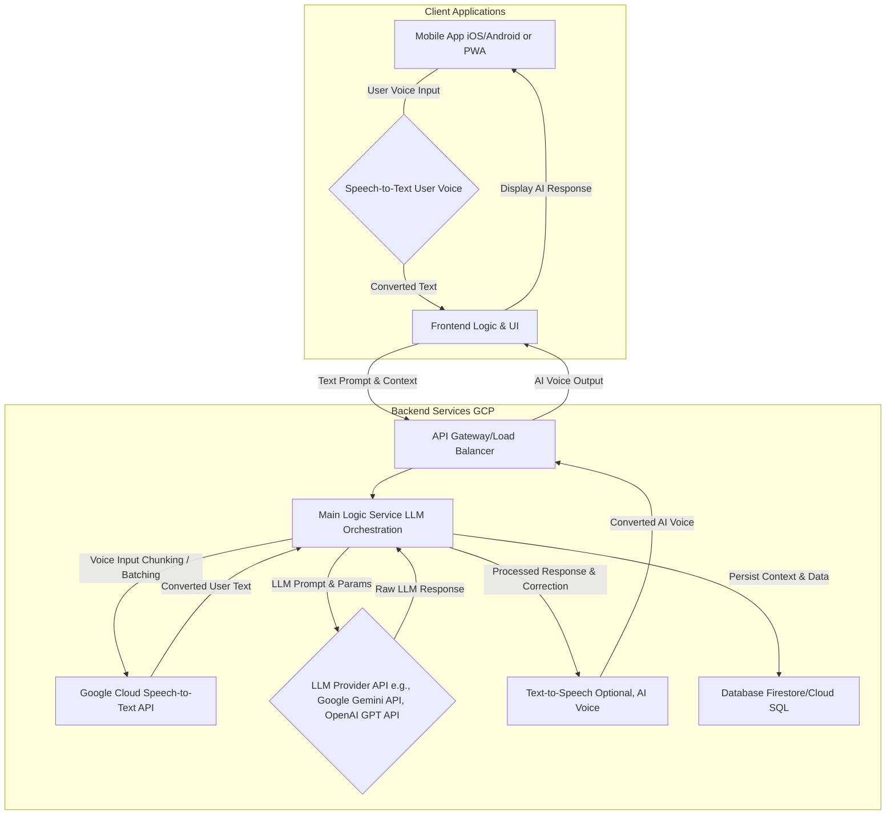

好的，我们来为“AI 语言学习伴侣”这个创新应用产品创意，设计其MVP（最小可行产品）的PRD（产品需求文档）和对应的关键技术RFC（征求意见稿）。

这不仅是把一个想法变为实际产品的步骤，更是对“第一性原理”（用户核心需求与技术核心能力）、“系统性思维”（产品设计与技术实现协同）、“权衡与取舍”（MVP范围界定）的深度实践。

---

## 产品需求文档 (PRD): AI 语言学习伴侣 MVP

**产品名称：** FluentFlow AI 语言学习伴侣 (MVP)
**版本：** 1.0 (MVP)
**日期：** 2024年5月15日
**作者：** [你的姓名/产品经理]
**目标用户：** 希望在真实对话场景下提高英语口语和听力，但缺乏语言环境和自信的初中级学习者。

---

### 1. 文档目的

本文档旨在明确 FluentFlow AI 语言学习伴侣 MVP 的核心功能、体验设计、技术需求和发布标准。它将作为产品、设计、工程团队协作的唯一事实来源，指导MVP的开发和发布。

### 2. 产品概述

FluentFlow 是一款基于 AI 大语言模型（LLM）的智能语言学习伴侣应用，旨在为用户提供**实时、个性化、无压力的口语对话练习环境**。通过模拟真实对话场景、提供即时反馈和定制化内容，帮助用户克服口语障碍，提升实际交流能力。

**MVP 核心理念：** 专注解决用户“不敢开口说”、“不知道说什么”、“说过后没人纠正”的痛点。

### 3. 用户故事 / 痛点

*   “我学了很多语法和词汇，但一开口就紧张，不知道怎么组织语言。”
*   “我想练习口语，但身边没有 native speaker 陪练，或者陪练费用太高。”
*   “我已经说过了，但不知道哪里说得不对，口音、语法问题没人指出来。”
*   “传统的语言学习 App 都是基于预设对话，不够灵活，不真实。”
*   “我不知道根据我的水平，该练习什么内容，对话话题很快就枯竭了。”

### 4. 目标用户

*   **主要用户：** 18-35岁，对技术有一定接受度，有学习英语的需求（考级、职场、旅游），英语水平处于 A2-B2（CEFR）的初中级学习者。
*   **次要用户：** 希望通过AI辅助提升特定领域口语（如商务英语）的进阶学习者。

### 5. 功能范围 (MVP)

#### 5.1. 核心功能：AI 实时对话练习

*   **5.1.1. 场景选择与开启对话：**
    *   用户可从预设的有限场景列表中（例如：咖啡馆点餐、机场问询、酒店入住、日常闲聊）选择一个场景。
    *   点击“开始对话”按钮，系统 AI 将基于所选场景开始第一句对话。
*   **5.1.2. 语音输入与文本转录：**
    *   用户点击麦克风按钮开始说话，松开停止。
    *   系统实时将用户语音转录为文本，并显示在聊天界面。
*   **5.1.3. AI 智能回应与对话推进：**
    *   AI（LLM）根据用户发言的意图、内容和上下文，生成自然、连贯的口语化回应。
    *   AI 的回应会根据场景主题进行，并引导对话流程。
*   **5.1.4. 实时口语纠正（核心价值）：**
    *   在用户发言转录文本下方或侧边，实时高亮或标注（颜色区分）语法错误、词汇不当、发音问题（发音可能在MVP中简化）。
    *   提供**简洁的纠正建议**（例如：提示正确的单词、语法规则、更自然的表达）。
    *   **纠正优先级：** 语法 > 词汇 > 表达自然度 > （发音，如MVP内未包含）。
*   **5.1.5. 文本翻译（辅助）：**
    *   用户可点击 AI 或自己发言的任意文本气泡，显示其主要意思的中文翻译（辅助理解）。
*   **5.1.6. 对话结束与场景复盘：**
    *   当对话达到预设轮次（例如10-15轮）或用户点击“结束对话”按钮时，对话结束。
    *   提供本次对话的**总览报告**，包括对话主题、关键修正点总结。

#### 5.2. 非核心但重要辅助功能 (MVP 阶段不包含，或以非常简化形式存在)

*   语音发音分析与评分。
*   AI 基于学习进度和表现动态推荐新场景或定制化练习。
*   多轮次对话的上下文记忆深度优化。
*   用户学习曲线跟踪与可视化。
*   详细的词汇、语法学习模块。
*   多语言支持（MVP仅限英语）。
*   用户个人化 AI 角色设置（性格、口音等）。
*   社交分享对话记录功能。

### 6. 用户体验 (UX) 与界面 (UI)

*   **界面：** 简洁的聊天界面，类似即时通讯工具，文本气泡为主，支持麦克风按钮、翻译按钮。
*   **实时反馈：** 纠正信息应在用户发言后几秒内出现，不打断用户体验。
*   **操作流：**
    1.  打开App -> 进入对话主界面 -> 选择场景 -> 开始对话。
    2.  点击麦克风说话 -> 语音转文本 -> AI 回应 -> 同时显示纠正。
    3.  点击文本气泡看翻译。
    4.  对话结束 -> 查看总结。

### 7. 技术要求 (高层次)

*   **前端：** 移动端原生应用 (iOS/Android) 或 PWA。与后端进行高效通信。
*   **后端：** 承担 AI 交互、语音处理、用户数据管理等核心逻辑。
*   **AI/ML：**
    *   **语音识别 (ASR)：** 准确地将用户口语转换为文本。
    *   **大语言模型 (LLM)：** 负责 AI 的对话生成和核心语言纠正。
    *   **文本转语音 (TTS)：** 将 AI 的回应文本转换为语音（辅助）。
*   **数据库：** 用户数据、对话记录、学习进度存储。
*   **API 集成：** 调用主要的 LLM (例如：Google Gemini API, OpenAI GPT API) 和 ASR/TTS 服务。

### 8. 成功度量 (Metrics for Success)

*   **用户留存率 (Retention Rate)：** 次日/7日/30日留存率。
*   **活跃度 (Engagement)：** 平均每日对话时长、每周对话轮次。
*   **用户满意度 (Satisfaction)：** 通过应用内问卷或评分，评估对话体验和纠正准确性。
*   **转化率 (Conversion Rate)：** （如果未来涉及付费）从免费用户到付费用户的转化。
*   **错误率 (Error Rate)：** 语音识别准确率、AI 回应的自然度与相关性、纠正的准确率。

### 9. 盈利模式 (MVP 阶段不强制，但需初步思考)

*   订阅模式：按对话时长、对话轮次或高级功能（如定制AI角色、无限对话）收费。
*   免费增值 (Freemium)：提供基础免费对话次数，高级功能或更多场景需付费订阅。

### 10. 发布计划 (MVP)

*   **最小可行范围定义：** 只包含“场景选择、语音输入、AI智能回应、实时纠正、文本翻译、对话总结”等MVP核心功能。
*   **内部测试：** 完成 Alpha/Beta 测试，确保关键功能稳定性。
*   **小规模发布：** 基于 Google Play/App Store 的 Beta 测试计划或 TestFlight，邀请限量用户。
*   **快速迭代：** 根据用户反馈快速修复Bug、优化核心体验。

---

## 技术征求意见稿 (RFC): FluentFlow AI 语言学习伴侣 MVP 核心技术栈与架构

**标题：** FluentFlow AI 语言学习伴侣 MVP 核心技术栈与 LLM 集成架构设计

**作者：** [你的姓名]，软件架构师

**状态：** 提案草稿

**日期：** 2024年5月15日

---

### 1. 摘要 / 执行概要

本RFC旨在为 FluentFlow AI 语言学习伴侣 MVP 阶段的核心技术栈和 LLM（大语言模型）集成架构提供设计方案。我们将采用 **云优先（Cloud-Native）** 的架构，最大限度地利用 Google Cloud Platform (GCP) 的托管服务和 AI 相关 API。

核心挑战在于实现**低延迟的语音转文本、高响应速度的LLM对话生成与实时纠正、以及高效且安全的上下文管理**。鉴于 MVP 阶段的需求，我们倾向于通过 **MaaS (Model as a Service)** 的方式接入主流 LLM API，而非自建和微调大模型。这将显著加速开发，并将重心放在产品核心价值的实现上。

### 2. 动机与技术挑战

*   **实时性要求：** 用户对话体验对响应速度要求极高，语音输入、AI回应、纠正反馈都需在毫秒级完成。
*   **AI 能力集成：** 需要整合 ASR (语音识别)、LLM (对话生成、语言纠正)、TTS (文本转语音) 等多项AI能力。
*   **上下文管理：** AI 进行自然对话需要理解多轮次的上下文，这需要有效地管理对话状态。
*   **错误处理与鲁棒性：** AI API 调用可能失败，需要设计健壮的回退机制。
*   **成本效率：** LLM API 调用成本不菲，需要优化API调用策略。
*   **快速迭代：** MVP 阶段需快速验证市场，技术选型应支持敏捷开发。

### 3. 架构目标

*   **高性能低延迟：** 确保端到端响应时间满足用户体验需求。
*   **可扩展性：** 架构应能随着用户量的增长而水平扩展。
*   **高可用性：** 关键组件应具备冗余和故障恢复能力。
*   **成本效益：** 优化AI模型API调用成本。
*   **开发效率：** 优先采用托管服务和成熟框架。
*   **安全性：** 用户语音数据、对话记录和API密钥需严格保护。

### 4. 提案：MVP 核心技术栈与架构

我们将采用前后端分离的现代化架构，后端核心服务部署于 GCP。

#### 4.1. 前端（Client Applications）

*   **技术栈：**
    *   **移动原生：** Kotlin/Swift 或 React Native / Flutter (推荐后者，跨平台且迭代快)。
    *   **PWA：** Next.js (React) / Vue (Nuxt.js) / SvelteKit。
*   **职责：**
    *   用户界面渲染与交互。
    *   语音录制与分块（如果需要流式传输给 ASRA)。
    *   实时显示 ASR 结果、AI 回应和纠正。
    *   管理客户端的局部状态。

#### 4.2. 后端核心服务 (GCP)

*   **4.2.1. 主业务逻辑服务 (Main Logic Service - LLM Orchestration)**
    *   **技术栈：** Go (性能高，并发好) 或 Python (AI 生态丰富，开发快)。部署在 Google Cloud Run (Serverless Container) 或 Google Kubernetes Engine (GKE) 上。
    *   **职责：**
        *   **ASR 结果处理：** 接收用户语音 ASR 后的文本。
        *   **LLM Prompt Engineering：** 根据用户文本、场景上下文、AI 自身之前的发言和纠正规则，构建针对 LLM API 的 Prompt。
            *   **Prompt 策略：**
                *   **System Prompt：** 定义 AI 的角色（语言学习伴侣）、核心指令（引导对话、进行语法/词汇/表达纠正）。
                *   **Few-Shot Examples (少量示例)：** 在 Prompt 中提供正确对话和纠正的少量例子，引导 LLM 更好的表现。
                *   **Chain of Thought / Tool Use (CoT/工具使用)：** 引导 LLM 分步思考，先生成对话，再独立进行自我纠正。
        *   **上下文管理：** 维护对话的历史记录（最近 N 轮次），并将其作为 Promt 的一部分发送给 LLM。利用内存缓存（如 Redis）结合持久化存储（数据库）。
        *   **纠正逻辑：**
            *   **LLM 自纠正：** LLM 被 Prompt 为在生成用户回复后，再分析用户上一句话的错误并提供纠正（这可能需要两个LLM调用或一个复杂Prompt）。
            *   **独立纠正模型：** （MVP阶段可能过度）使用另一个小型、专业的语言模型API进行纠偏，或通过规则引擎对LLM输出进行后处理。
        *   **响应处理：** 解析 LLM 响应，提取 AI 回应文本和纠正信息，并组装成客户端需要的格式。
        *   **TTS 调用 (可选)：** 将 AI 回应文本发送给 TTS 服务获取语音。
        *   **对话数据持久化：** 将对话记录、纠正信息、学习进度保存到数据库。
*   **4.2.2. AI 模型即服务 (MaaS) 集成**
    *   **语音转文本 (ASR)：** **Google Cloud Speech-to-Text API**。优势在于高准确率、流式识别和广泛的语言支持。
    *   **大语言模型 (LLM)：** **Google Gemini API** (推荐，作为内部产品，性能和成本可能更优) 或 **OpenAI GPT API**。
        *   **选择考量：** 模型性能（对话自然度、纠正准确性）、延迟、API 成本、可靠性、可用性。
    *   **文本转语音 (TTS)：** **Google Cloud Text-to-Speech API**。支持多种声音和语调，增强AI声音的自然度。
*   **4.2.3. 数据库 (Database)**
    *   **技术栈：**
        *   **对话与学习进度：** **Google Cloud Firestore (NoSQL)** 或 **Cloud SQL (PostgreSQL/MySQL)**。Firestore 适合灵活的 JSON 文档结构和实时同步；Cloud SQL 适合结构化关系数据和复杂的分析查询能力。MVP 优先选择 Firestore 易于快速迭代Schema。
        *   **缓存：** Google Cloud Memorystore (Redis) 用于快速存储 LLM 上下文、用户会话状态。

### 5. 数据流与上下文管理

1.  **用户语音 -> 文本：** 客户端录音 -> GCS Speech-to-Text API -> 用户发言文本。
2.  **文本 -> AI 回应 + 纠正：** 主业务服务构建 Prompt（包括历史对话上下文、场景信息、纠正指示） -> LLM API -> LLM 返回原始回应和纠正信息 -> 主业务服务解析并结构化。
3.  **AI 回应文本 -> 语音 (可选)：** 主业务服务发送 AI 回应文本 -> GCS Text-to-Speech API -> AI 回应语音。
4.  **上下文持久化：** 每轮对话后，将用户发言、AI 回应、纠正内容、相关时间戳等持久化到数据库。

### 6. 性能与成本优化

*   **并发处理：** 后端服务（Cloud Run/GKE）应设计为高并发处理请求的 Go/Python 服务。
*   **长连接：** 考虑使用 WebSocket 在客户端和后端服务之间维持长连接，减少 HTTP 请求的开销。
*   **LLM Prompt 优化：** 精简 Prompt Token 数量，减少不必要的上下文传递，降低 API 调用成本。
*   **缓存：** 对重复的短语翻译、常见纠正建议进行缓存。
*   **速率限制与重试：** 对 LLM API 和 ASR/TTS API 调用实施合理的速率限制、指数退避重试和断路器模式，提升系统韧性。

### 7. 可观测性与错误处理

*   **日志：** 所有服务（客户端、后端）集成 Google Cloud Logging。记录关键请求的输入输出、错误信息、性能指标。
*   **指标：** 使用 Google Cloud Monitoring 收集每个服务的 CPU、内存、网络 IO、请求延迟、错误率等指标。
*   **分布式追踪：** 利用 OpenTelemetry 或 Google Cloud Trace，实现从客户端到后端服务（包括对 MaaS API 的调用）的全链路追踪，关键用于分析端到端延迟和定位瓶颈。
*   **错误处理：**
    *   捕获 LLM API 调用失败、ASR 失败等外部依赖错误。
    *   实现重试和回退策略（例如，如果 LLM 返回错误，提供一个预设的通用回复或提示用户重试）。
    *   对错误日志进行告警，以便 SRE 团队及时响应。

### 8. 安全性考量

*   **用户数据加密：** 用户语音数据、对话文本、学习进度数据在传输和存储时都应加密。
*   **API Key 安全：** LLM API Key 不应暴露在客户端，应通过后端服务代理调用。后端服务应使用 IAM 角色和最小权限原则。
*   **数据脱敏：** 考虑对聊天记录中的敏感个人信息进行脱敏处理。
*   **模型偏见与滥用：** 关注 LLM 模型潜在的偏见和不当回应，设计审查机制和内容过滤。

### 9. 开放问题 / 讨论点

*   MVP 是否包含发音纠正？如果包含，集成何种技术（如 Phonetic-Aware ASR 或其他模型）？
*   LLM Prompt Engineering 团队的工作流和版本管理如何？
*   如何平衡 AI 回复的自然度/智能程度与 API 调用的成本/延迟？
*   如何处理用户对 AI 回复或纠正的反馈，并用于模型优化（RLHF）？
*   跨不同 LLM 模型的切换策略和兼容性如何设计？

### 10. 参考资料

*   Google Cloud Speech-to-Text Documentation
*   Google Cloud Text-to-Speech Documentation
*   Google Gemini API Documentation
*   OpenAI API Documentation
*   Pattern: Chain of Thought Prompting
*   Pattern: Retrieval-Augmented Generation (RAG)
*   SRE Book: Measuring Reliability & Eliminating Toil

---

### Changelog

*   **2024-05-15:** 初稿提交。
*   **[后续修订日期]:** [修订说明]