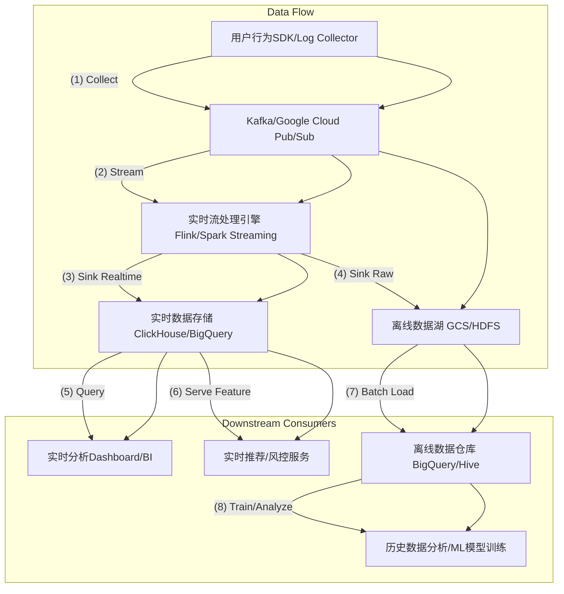

一份优秀的[[设计文档]]（[[高效提升个人效率和减少疲劳RFC]]，Request For Comments）通常具备以下特征：[[清晰的问题定义]]、[[明确的目标]]、[[详细的设计方案]]、[[充分的备选方案分析]]、对[[非功能性需求（NFRs）]]的[[考虑]]、[[风险评估]]、[[测试]]和[[部署计划]]，并促进[[利益相关者]]之间的[[沟通]]和[[共识]]。

以下是一个假设场景下的[[设计文档]]范例，旨在体现其结构和内容深度：

---

## RFC: 用户行为实时分析平台迁移方案

**1. 基本信息**

*   **标题：** 用户行为实时分析平台从Monolith DB到流式处理架构的迁移方案
*   **作者：** Sam Chen (Data Infrastructure Team)
*   **评审人：** Lead Architects, Product Leads, SRE Team, Analytics Team
*   **状态：** 初稿 (Draft)
*   **创建日期：** 2024-06-25
*   **更新日期：** 2024-06-25

**2. 摘要 (Executive Summary)**

本RFC旨在提出并讨论将当前基于[[关系型数据库]]（MySQL）的[[用户行为日志]]存储和[[分析]]系统，迁移至一套[[实时]]、[[高吞吐量]]的[[流式处理架构]]。新架构将利用[[Kafka]]进行[[数据收集]]，[[Flink]]进行[[实时处理]]，并将结果存储至[[ClickHouse]]或[[BigQuery]]以支持[[实时分析]]和[[机器学习模型训练]]。此迁移将显著提升[[数据处理]]的[[实时性]]、[[系统扩展性]]及[[分析灵活性]]，以满足日益增长的[[业务需求]]和[[用户体验]]优化。

**3. 背景与动机 (Background & Motivation)**

当前的用户行为日志（如页面访问、点击、搜索行为）处理系统存在以下显著痛点：
*   **[[延迟高]]：** 日志数据首先写入MySQL，再通过定时任务（ hourly batch job）同步至[[离线数据仓库]]。从[[行为发生]]到[[可分析]]，[[延迟]]通常在1-2小时，无法支持[[实时推荐]]、[[实时风控]]等场景。
*   **[[可扩展性瓶颈]]：** 随着[[用户量]]和[[行为数据]]的[[指数级增长]]，MySQL[[单点数据库]]已达到[[写入]]和[[查询性能]]的[[上限]]，难以[[水平扩展]]。频繁的[[扩容]]和[[维护]]成为[[SRE团队]]的沉重负担。
*   **[[分析能力受限]]：** MySQL不适合[[大规模]][[聚合查询]]和[[复杂多维分析]]，导致[[数据分析师]]和[[产品经理]]难以快速获得[[洞察]]。
*   **[[技术债务]]：** 现有[[日志收集SDK]]和[[数据同步逻辑]]耦合度高，难以[[维护]]和[[迭代]]。

本次迁移的[[驱动因素]]是[[业务部门]]对以下新能力的需求：
*   [[实时个性化推荐]]：依据用户[[即时行为]]调整[[推荐结果]]。
*   [[实时营销活动]]：针对用户在App内的[[实时行为]]触发[[营销事件]]。
*   [[实时风控]]：对异常[[用户行为]]进行[[即时识别]]和[[预警]]。
*   [[更灵活]]、[[更低延迟]]的[[自助式数据分析]]。

**4. 目标 (Goals)**

*   **功能性目标：**
    *   实现用户行为日志的[[端到端]][[实时处理]]，从[[数据采集]]到[[分析就绪]]的[[延迟]]控制在**5秒以内**。
    *   支持**每秒5万条**（高峰期可达10万条）[[日志事件]]的[[高并发写入]]和[[稳定处理]]。
    *   提供[[结构化]]和[[半结构化]]日志的[[统一处理]]能力。
    *   支持基于[[时间窗口]]的[[实时聚合]]和[[指标计算]]。
    *   提供[[自助式查询]]接口，支持[[秒级]]响应的[[高维度]]、[[大范围]]数据[[查询]]。
*   **[[非功能性目标（NFRs）]]：**
    *   **[[可用性]]：** 核心[[数据管道]]达到**99.99%**的[[服务可用性]]。
    *   **[[可靠性]]：** 确保[[数据不丢失]]，支持[[至少一次]]（at-least-once）的[[消息投递语义]]。
    *   **[[可扩展性]]：** [[系统]]具备[[水平扩展能力]]，能通过增加[[节点]]支持未来5-10倍的[[数据增长]]。
    *   **[[可维护性]]：** [[模块化设计]]，[[代码清晰]]，[[易于部署]]、[[监控]]和[[故障排查]]。
    *   **[[成本效益]]：** 综合[[资源成本]]和[[运维成本]]，保持在可接受范围内。

**5. 非目标 (Non-Goals)**

*   本次迁移不涉及[[历史数据]]的[[全量离线迁移]]，[[历史数据]]将继续通过现有[[离线同步流程]]导入[[数据仓库]]。
*   不替换现有所有[[下游离线分析任务]]的[[数据源]]，仅针对[[实时分析]]和部分[[机器学习]]场景。
*   不提供[[通用型]][[数据转换]]（ETL）服务，仅针对用户行为日志的[[特定格式转换]]。

**6. 拟议设计 (Proposed Design)**

我们将采用[[事件驱动]]的[[微服务架构]]，核心组件如下：

**6.1 高层架构图 (High-Level Architecture)**



**6.2 组件详情**

*   **[[用户行为SDK]]/[[日志收集器]]：**
    *   职责：在[[前端]]（Web/App）或[[后端服务]]中[[实时采集]]用户行为日志。
    *   更改：[[SDK]]将直接将日志事件通过[[HTTP]]/[[gRPC]]发送到统一的[[日志收集服务]]，该服务将日志[[批量写入]][[消息队列]]。
    *   格式：统一采用[[JSON格式]]，并通过[[Protobuf]]进行[[序列化]]以提高[[效率]]和[[兼容性]]。

*   **[[消息队列]] (Message Queue)：[[Kafka]] 或 [[Google Cloud Pub/Sub]]**
    *   职责：作为[[日志事件]]的[[持久化]]和[[高吞吐量缓冲区]]，[[解耦]]上游[[采集]]和下游[[处理]]。
    *   选型考虑：
        *   **[[Kafka]]：** 内部部署，具备[[强大]]的[[生态系统]]和[[精细化控制]]能力，但[[运维成本]]较高。
        *   **[[Google Cloud Pub/Sub]]：** [[全托管]]服务，[[运维成本]]极低，[[高可用]]、[[弹性伸缩]]，与[[Google Cloud]]生态集成度高。
    *   **初步倾向：** 考虑到[[运维成本]]和[[未来与云]]的[[集成]]，倾向于**[[Google Cloud Pub/Sub]]**。如果存在[[本地化部署]]或[[成本]]的严格限制，则备选[[Kafka]]。

*   **[[实时流处理引擎]] (Real-time Stream Processing Engine)：[[Apache Flink]]**
    *   职责：消费[[消息队列]]中的日志事件，进行[[数据清洗]]、[[转换]]、[[规范化]]、[[聚合计算]]（如[[PV]]/[[UV]]、[[会话]]），并将处理后的数据写入[[实时数据存储]]和[[离线数据湖]]。
    *   特性：支持[[事件时间处理]]、[[Exactly-Once语义]]、[[状态管理]]、[[窗口操作]]，适用于[[复杂实时计算]]。
    *   部署：部署在[[Kubernetes]]集群上，利用其[[伸缩能力]]和[[高可用]]特性。

*   **[[实时数据存储]] (Real-time Data Store)：[[ClickHouse]] 或 [[Google BigQuery]]**
    *   职责：存储[[Flink]]处理后的[[实时指标]]和[[明细数据]]，支持[[快速]]、[[多维]]的[[交互式查询]]。
    *   选型考虑：
        *   **[[ClickHouse]]：** [[高性能]][[列式数据库]]，[[开源]]，适合[[OLAP查询]]，但需[[自行运维]]。
        *   **[[Google BigQuery]]：** [[全托管]]、[[PB级]][[分析数据仓库]]，[[无服务器]]，[[高可用]]，与[[Google Cloud]]生态深度集成，适合[[Ad-hoc查询]]和[[大数据分析]]。
    *   **初步倾向：** 倾向于**[[Google BigQuery]]**作为主要[[实时存储]]，辅以[[内存数据库]]或[[Redis]]用于[[低延迟]]的[[关键指标查询]]。

*   **[[离线数据湖]] (Offline Data Lake)：[[Google Cloud Storage (GCS)]]**
    *   职责：存储原始的、未经处理的日志事件，作为[[历史数据]]的[[长期存储]]和[[离线批处理]]的[[数据源]]。
    *   集成：[[Flink]]会将一份原始数据[[副本写入]]GCS。

**6.3 数据模型和转换**

*   **原始日志格式 (JSON)：**
    ```json
    {
      "event_id": "uuid",
      "timestamp": "ISO 8601",
      "user_id": "string",
      "event_type": "string", // e.g., "page_view", "click", "search"
      "page_url": "string",
      "session_id": "string",
      "device_info": { /* ... */ },
      "geo_info": { /* ... */ },
      "additional_properties": { /* ... */ }
    }
    ```
*   **Flink转换示例：**
    *   [[用户会话识别]]：基于[[user_id]]和[[时间窗口]]聚合，生成[[session_id]]（如果原始数据中无）。
    *   [[IP解析]]：转换为[[地理位置信息]]。
    *   [[事件归一化]]：将不同[[事件类型]]映射到[[统一标签]]。
    *   [[实时指标计算]]：例如，过去5分钟内某页面的[[PV]]、[[UV]]。

**6.4 API 变更**

*   上游[[日志SDK]]/[[收集器]]将从直接写入MySQL改为通过[[HTTP]]/[[gRPC]]发送到新的[[日志接入服务]]。
*   下游[[分析团队]]将通过[[BigQuery]]或[[内部BI平台]]的[[SQL查询接口]]访问[[实时数据]]，替代原有[[MySQL查询]]。
*   [[实时推荐]]和[[风控服务]]将通过[[API]]或[[消息订阅]]（如[[Pub/Sub]]）方式获取[[实时处理结果]]。

**6.5 失败模式与弹性 (Failure Modes & Resiliency)**

*   **[[消息队列]]：** [[Pub/Sub]]本身具备[[高可用]]和[[持久化]]特性，确保[[消息不丢失]]。
*   **[[流处理引擎]]：** [[Flink]]配置[[Checkpoint]]和[[State Backend]]（如[[RocksDB]] on GCS），支持[[故障恢复]]和[[Exactly-Once语义]]，确保计算结果的[[准确性]]和[[一致性]]。
*   **[[实时存储]]：** [[BigQuery]]提供[[多区域冗余]]和[[高可用]]。
*   **[[数据丢失]]：** 关键[[数据管道]]采用[[死信队列]]（DLQ）机制，处理无法正常处理的[[异常消息]]。
*   **[[服务降级]]：** 在[[消息队列]]过载或[[下游服务]]异常时，[[日志收集器]]可短暂[[降级]]为[[本地缓存]]+[[批写入]]模式，[[避免数据丢失]]，但会牺牲[[实时性]]。

**6.6 安全与隐私 (Security & Privacy)**

*   所有[[数据传输]]通道（SDK -> Log Collector -> Pub/Sub -> Flink -> BigQuery）将采用[[TLS加密]]。
*   对[[敏感数据]]（如[[IP地址]]、[[用户标识]]）进行[[脱敏]]或[[匿名化处理]]。
*   严格遵循[[GDPR]]、[[CCPA]]等[[数据隐私法规]]，确保[[数据存储]]和[[处理]]符合[[合规性要求]]。
*   [[BigQuery]]的[[IAM权限管理]]将用于控制[[数据访问权限]]。

**6.7 监控与告警 (Monitoring & Alerting)**

*   **[[端到端延迟]]：** 监控从[[日志生成]]到[[BigQuery可查询]]的[[总延迟]]。
*   **[[吞吐量]]：** 监控各环节（Pub/Sub, Flink）的[[事件]]输入/输出[[吞吐量]]。
*   **[[资源利用率]]：** 监控[[Flink集群]]的[[CPU]]、[[内存]]、[[网络]]使用情况。
*   **[[错误率]]：** 监控[[日志收集器]]、[[Flink任务]]的[[错误日志]]和[[异常]]。
*   **[[数据质量]]：** 部署[[数据质量检查]]任务，定期验证[[数据完整性]]和[[准确性]]。
*   使用[[Prometheus]] + [[Grafana]] 进行[[指标可视化]]，[[PagerDuty]]进行[[告警通知]]。

**7. 替代方案 (Alternatives Considered)**

**7.1 替代方案1: 仅升级MySQL集群 + 优化批处理**
*   **描述：** 引入[[MySQL分库分表]]、[[读写分离]]，并优化现有[[批处理流程]]，缩短[[同步周期]]。
*   **优点：** [[改动最小]]，[[成本]]相对最低，[[技术栈]]熟悉。
*   **缺点：**
    *   **[[无法实现真正实时]]：** 批处理[[延迟]]仍无法满足秒级要求。
    *   **[[扩展性有限]]：** [[关系型数据库]]在[[高并发写入]]和[[复杂查询]]上的[[固有瓶颈]]。
    *   **[[技术债务]]：** 根本[[架构模式]]不变，仍存在[[耦合]]和[[维护]]难题。
*   **决策：** 不采纳，无法满足[[核心]]的[[实时性]]和[[高扩展性]]需求。

**7.2 替代方案2: 使用[[Apache Spark Streaming]]代替[[Flink]]**
*   **描述：** 利用[[Spark Streaming]]作为[[流处理引擎]]。
*   **优点：** [[Spark生态系统]]成熟，[[批流一体]]，[[学习曲线]]可能更平缓（如果团队有Spark背景）。
*   **缺点：**
    *   **[[微批处理]]：** [[Spark Streaming]]是基于[[微批处理]]，而不是真正的[[事件级处理]]，可能导致更高的[[延迟]]。
    *   **[[状态管理]]：** [[Flink]]在[[复杂状态管理]]和[[Exactly-Once语义]]方面通常更[[强大]]和[[稳定]]。
*   **决策：** 考虑到对[[实时性]]和[[数据一致性]]的严格要求，倾向于[[Flink]]，但如果[[团队]]现有[[Spark]]经验丰富且[[延迟]]要求略有放宽，可重新评估。

**7.3 替代方案3: 使用[[ELK Stack]] (Elasticsearch, Logstash, Kibana) 作为[[实时存储]]和[[分析]]**
*   **描述：** 使用[[Elasticsearch]]作为[[实时查询引擎]]，[[Logstash]]或[[Beats]]作为[[数据收集]]和[[传输]]。
*   **优点：** [[全文检索]]能力强，[[Kibana]]提供[[开箱即用]]的[[可视化]]。
*   **缺点：**
    *   **[[成本]]：** [[大规模]][[Elasticsearch集群]]的[[资源消耗]]和[[运维成本]]可能非常高。
    *   **[[实时计算]]：** [[Elasticsearch]]主要用于[[搜索]]和[[聚合]]，缺乏[[Flink]]那样强大的[[流式复杂计算]]能力。
    *   **[[数据一致性]]：** [[Logstash]]在[[数据处理]]的[[可靠性]]上可能不如[[Flink]]。
*   **决策：** 不采纳。更适合[[日志检索]]和[[运维监控]]，不完全匹配[[用户行为分析]]对[[复杂实时指标]]和[[成本]]的[[需求]]。

**8. 开放问题与未来工作 (Open Questions & Future Work)**

*   [[日志收集器]]的[[高可用部署策略]]和[[灾备方案]]。
*   [[BigQuery]]的[[表分区]]和[[聚簇策略]]的[[详细设计]]，以[[优化查询性能]]和[[成本]]。
*   [[历史数据]]从现有MySQL到[[BigQuery]]的[[增量同步]]方案。
*   [[机器学习模型]]如何高效消费[[BigQuery]]中的[[实时特征]]。
*   [[敏感数据]]的[[细粒度权限控制]]和[[数据加密]]方案。
*   [[用户画像]]服务如何与新[[实时平台]]集成，以提供更[[实时]]的[[用户标签]]。

**9. 部署与上线计划 (Rollout Plan)**

1.  **[[阶段1：小流量验证]] (Week 1-2)：**
    *   部署新的[[日志接入服务]]、[[Pub/Sub]]主题、[[Flink任务]]和[[BigQuery表]]。
    *   仅将[[一小部分]][[内部测试用户]]的日志数据导向新平台。
    *   [[并行运行]]新旧系统，[[对比数据一致性]]和[[延迟]]。
    *   建立[[核心指标监控]]和[[告警]]。
2.  **[[阶段2：灰度发布]] (Week 3-4)：**
    *   逐步将[[生产环境]]中[[低风险]]、[[非核心业务]]的[[用户流量]]按比例（如5%、20%、50%）切至新平台。
    *   持续监控[[系统健康]]、[[性能]]和[[数据质量]]。
    *   收集[[数据分析师]]和[[产品经理]]的[[反馈]]。
3.  **[[阶段3：全量切换]] (Week 5)：**
    *   确认[[系统稳定]]且[[性能达标]]后，将所有[[用户行为日志流量]]切换至新平台。
    *   旧MySQL[[日志表]]停止写入，进入[[只读维护状态]]。
4.  **[[阶段4：旧系统下线]] (Week 6 onwards)：**
    *   在确保[[所有下游]]已[[成功切换]]并[[验证]]后，逐步[[下线]]旧的MySQL[[日志服务]]和[[批处理脚本]]。

**10. 迁移计划 (Migration Plan)**

*   **[[历史数据]]：** 现有[[MySQL]]中的[[历史日志数据]]将保持不动，并继续通过现有[[离线同步管道]]注入到[[离线数据仓库]]（[[BigQuery]]）。新平台启动后，所有[[新增日志]]将通过新管道处理。
*   **[[下游消费者]]：** 与现有[[下游服务]]（如[[推荐系统]]、[[BI报表]]）[[沟通]]，协助他们将[[数据源]]从[[MySQL]]或[[离线数据仓库]]逐步切换到[[BigQuery]]的[[实时数据表]]，或通过[[Pub/Sub]]订阅[[实时事件流]]。

**11. 测试策略 (Test Strategy)**

*   **[[单元测试]]：** 对[[日志收集器]]、[[Flink任务]]中的[[数据处理逻辑]]进行[[单元测试]]。
*   **[[集成测试]]：** [[端到端]]测试[[数据管道]]的[[完整性]]和[[正确性]]。
*   **[[性能测试]]：** 使用[[JMeter]]或[[Locust]]模拟[[高峰流量]]，测试[[系统吞吐量]]、[[延迟]]和[[资源利用率]]。
*   **[[数据质量测试]]：** 自动化测试脚本对比新旧系统[[数据]]的[[一致性]]和[[完整性]]，确保[[数据无损]]和[[格式正确]]。
*   **[[故障注入测试]]：** 模拟[[组件失效]]（如[[消息队列]]中断、[[Flink任务崩溃]]）以验证[[系统的韧性]]和[[恢复能力]]。

**12. 成功指标 (Success Metrics)**

*   **[[实时性]]：** 99%的日志事件从[[采集]]到[[BigQuery]]可见[[延迟]] ≤ 5秒。
*   **[[吞吐量]]：** 核心[[流处理管道]]能够稳定处理[[每秒5万事件]]的[[高峰负载]]，无[[积压]]。
*   **[[可用性]]：** [[数据管道]]服务[[可用性]]达到99.99%。
*   **[[数据一致性]]：** [[实时数据]]与[[离线数据仓库]]在[[核心指标]]上的[[差异]] < 0.1%。
*   **[[成本]]：** 新平台每处理一百万事件的[[平均成本]]比旧平台[[降低15%]]。
*   **[[用户满意度]]：** [[数据分析师]]和[[产品经理]]对新平台[[实时性]]和[[查询性能]]的[[满意度]]提升20%。

**13. 附录 (Appendix)**

*   [[日志事件]]的[[详细字段定义]]和[[Schema]]。
*   [[Flink]]任务的[[并行度]]和[[资源配置建议]]。
*   [[BigQuery表]]的[[详细Schema设计]]。
*   现有[[MySQL表结构]]。

---