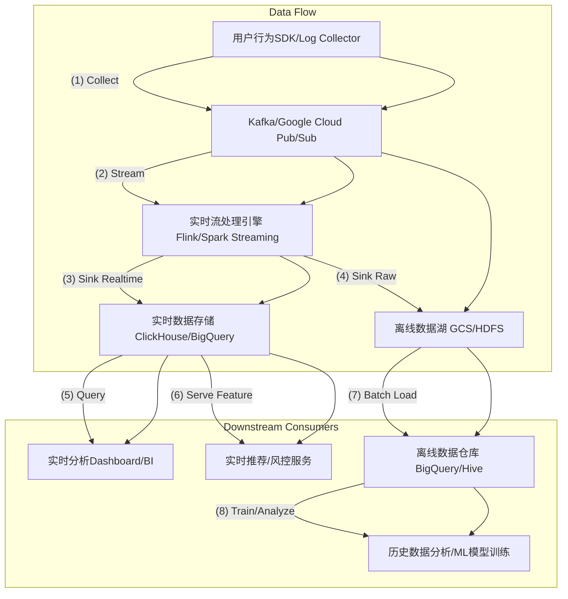

一份优秀的RFC（Request For Comments）设计文档通常具备以下特征：清晰的问题定义、明确的目标、详细的设计方案、充分的备选方案分析、对非功能性需求（NFRs）的考虑、风险评估、测试和部署计划，并促进利益相关者之间的沟通和共识。

以下是一个假设场景下的[[设计文档]]范例，旨在体现其结构和内容深度：

---

## RFC: 用户行为实时分析平台迁移方案

**1. 基本信息**

*   **标题：** 用户行为实时分析平台从Monolith DB到流式处理架构的迁移方案
*   **作者：** Sam Chen (Data Infrastructure Team)
*   **评审人：** Lead Architects, Product Leads, SRE Team, Analytics Team
*   **状态：** 初稿 (Draft)
*   **创建日期：** 2024-06-25
*   **更新日期：** 2024-06-25

**2. 摘要 (Executive Summary)**

本RFC旨在提出并讨论将当前基于关系型数据库（MySQL）的用户行为日志存储和分析系统，迁移至一套实时、高吞吐量的[[流式处理架构]]。新架构将利用[[Kafka]]进行数据收集，[[Apache Flink]]进行实时处理，并将结果存储至ClickHouse或[[Google BigQuery]]以支持实时分析和机器学习模型训练。此迁移将显著提升数据处理的实时性、系统扩展性及分析灵活性，以满足日益增长的业务需求和用户体验优化。

**3. 背景与动机 (Background & Motivation)**

当前的用户行为日志（如页面访问、点击、搜索行为）处理系统存在以下显著痛点：
*   **延迟高：** 日志数据首先写入MySQL，再通过定时任务（hourly batch job）同步至离线数据仓库。从行为发生到可分析，延迟通常在1-2小时，无法支持实时推荐、实时风控等场景。
*   **可扩展性瓶颈：** 随着用户量和行为数据的指数级增长，MySQL单点数据库已达到写入和查询性能的上限，难以水平扩展。频繁的扩容和维护成为SRE团队的沉重负担。
*   **分析能力受限：** MySQL不适合大规模聚合查询和复杂多维分析，导致数据分析师和产品经理难以快速获得洞察。
*   **技术债务：** 现有日志收集SDK和数据同步逻辑耦合度高，难以维护和迭代。

本次迁移的驱动因素是业务部门对以下新能力的需求：
*   实时个性化推荐：依据用户即时行为调整推荐结果。
*   实时营销活动：针对用户在App内的实时行为触发营销事件。
*   实时风控：对异常用户行为进行即时识别和预警。
*   更灵活、更低延迟的自助式数据分析。

**4. 目标 (Goals)**

*   **功能性目标：**
    *   实现用户行为日志的端到端实时处理，从数据采集到分析就绪的延迟控制在**5秒以内**。
    *   支持**每秒5万条**（高峰期可达10万条）日志事件的高并发写入和稳定处理。
    *   提供结构化和半结构化日志的统一处理能力。
    *   支持基于时间窗口的实时聚合和指标计算。
    *   提供自助式查询接口，支持秒级响应的高维度、大范围数据查询。
*   **非功能性目标（NFRs）：**
    *   **可用性：** 核心数据管道达到**99.99%** 的服务可用性。
    *   **可靠性：** 确保数据不丢失，支持至少一次（at-least-once）的消息投递语义。
    *   **可扩展性：** 系统具备水平扩展能力，能通过增加节点支持未来5-10倍的数据增长。
    *   **可维护性：** 模块化设计，代码清晰，易于部署、监控和故障排查。
    *   **成本效益：** 综合资源成本和运维成本，保持在可接受范围内。

**5. 非目标 (Non-Goals)**

*   本次迁移不涉及历史数据的全量离线迁移，历史数据将继续通过现有离线同步流程导入数据仓库。
*   不替换现有所有下游离线分析任务的数据源，仅针对实时分析和部分机器学习场景。
*   不提供通用型数据转换（ETL）服务，仅针对用户行为日志的特定格式转换。

**6. 拟议设计 (Proposed Design)**

我们将采用事件驱动的微服务架构，核心组件如下：

**6.1 高层架构图 (High-Level Architecture)**



**6.2 组件详情**

*   **用户行为SDK/日志收集器：**
    *   职责：在前端（Web/App）或后端服务中实时采集用户行为日志。
    *   更改：SDK将直接将日志事件通过HTTP/gRPC发送到统一的日志收集服务，该服务将日志批量写入消息队列。
    *   格式：统一采用JSON格式，并通过Protobuf进行序列化以提高效率和兼容性。

*   **消息队列 (Message Queue)：Kafka 或 Google Cloud Pub/Sub**
    *   职责：作为日志事件的持久化和高吞吐量缓冲区，解耦上游采集和下游处理。
    *   选型考虑：
        *   Kafka：内部部署，具备强大的生态系统和精细化控制能力，但运维成本较高。
        *   Google Cloud Pub/Sub：全托管服务，运维成本极低，高可用、弹性伸缩，与Google Cloud生态集成度高。
    *   **初步倾向：** 考虑到运维成本和未来与云的集成，倾向于**Google Cloud Pub/Sub**。如果存在本地化部署或成本的严格限制，则备选Kafka。

*   **实时流处理引擎 (Real-time Stream Processing Engine)：Apache Flink**
    *   职责：消费消息队列中的日志事件，进行数据清洗、转换、规范化、聚合计算（如PV/UV、会话），并将处理后的数据写入实时数据存储和离线数据湖。
    *   特性：支持事件时间处理、Exactly-Once语义、状态管理、窗口操作，适用于复杂实时计算。
    *   部署：部署在Kubernetes集群上，利用其伸缩能力和高可用特性。

*   **实时数据存储 (Real-time Data Store)：ClickHouse 或 Google BigQuery**
    *   职责：存储Flink处理后的实时指标和明细数据，支持快速、多维的交互式查询。
    *   选型考虑：
        *   ClickHouse：高性能列式数据库，开源，适合OLAP查询，但需自行运维。
        *   Google BigQuery：全托管、PB级分析数据仓库，无服务器，高可用，与Google Cloud生态深度集成，适合Ad-hoc查询和大数据分析。
    *   **初步倾向：** 倾向于**Google BigQuery**作为主要实时存储，辅以内存数据库或Redis用于低延迟的关键指标查询。

*   **离线数据湖 (Offline Data Lake)：Google Cloud Storage (GCS)**
    *   职责：存储原始的、未经处理的日志事件，作为历史数据的长期存储和离线批处理的数据源。
    *   集成：Flink会将一份原始数据副本写入GCS。

**6.3 数据模型和转换**

*   **原始日志格式 (JSON)：**
    ```json
    {
      "event_id": "uuid",
      "timestamp": "ISO 8601",
      "user_id": "string",
      "event_type": "string", // e.g., "page_view", "click", "search"
      "page_url": "string",
      "session_id": "string",
      "device_info": { /* ... */ },
      "geo_info": { /* ... */ },
      "additional_properties": { /* ... */ }
    }
    ```
*   **Flink转换示例：**
    *   用户会话识别：基于user_id和时间窗口聚合，生成session_id（如果原始数据中无）。
    *   IP解析：转换为地理位置信息。
    *   事件归一化：将不同事件类型映射到统一标签。
    *   实时指标计算：例如，过去5分钟内某页面的PV、UV。

**6.4 API 变更**

*   上游日志SDK/收集器将从直接写入MySQL改为通过HTTP/gRPC发送到新的日志接入服务。
*   下游分析团队将通过BigQuery或内部BI平台的SQL查询接口访问实时数据，替代原有MySQL查询。
*   实时推荐和风控服务将通过API或消息订阅（如Pub/Sub）方式获取实时处理结果。

**6.5 失败模式与弹性 (Failure Modes & Resiliency)**

*   **消息队列：** Pub/Sub本身具备高可用和持久化特性，确保消息不丢失。
*   **流处理引擎：** Flink配置Checkpoint和State Backend（如RocksDB on GCS），支持故障恢复和Exactly-Once语义，确保计算结果的准确性与一致性。
*   **实时存储：** BigQuery提供多区域冗余和高可用。
*   **数据丢失：** 关键数据管道采用死信队列（DLQ）机制，处理无法正常处理的异常消息。
*   **服务降级：** 在消息队列过载或下游服务异常时，日志收集器可短暂降级为本地缓存+批写入模式，避免数据丢失，但会牺牲实时性。

**6.6 安全与隐私 (Security & Privacy)**

*   所有数据传输通道（SDK -> Log Collector -> Pub/Sub -> Flink -> BigQuery）将采用TLS加密。
*   对敏感数据（如IP地址、用户标识）进行脱敏或匿名化处理。
*   严格遵循GDPR、CCPA等数据隐私法规，确保数据存储和处理符合合规性要求。
*   BigQuery的IAM权限管理将用于控制数据访问权限。

**6.7 监控与告警 (Monitoring & Alerting)**

*   **端到端延迟：** 监控从日志生成到BigQuery可查询的总延迟。
*   **吞吐量：** 监控各环节（Pub/Sub, Flink）的事件输入/输出吞吐量。
*   **资源利用率：** 监控Flink集群的CPU、内存、网络使用情况。
*   **错误率：** 监控日志收集器、Flink任务的错误日志和异常。
*   **数据质量：** 部署数据质量检查任务，定期验证数据完整性与准确性。
*   **故障注入测试：** 模拟组件失效（如消息队列中断、Flink任务崩溃）以验证系统的韧性与恢复能力。
*   使用Prometheus + Grafana 进行指标可视化，PagerDuty进行告警通知。

**7. 替代方案 (Alternatives Considered)**

**7.1 替代方案1: 仅升级MySQL集群 + 优化批处理**
*   **描述：** 引入MySQL分库分表、读写分离，并优化现有批处理流程，缩短同步周期。
*   **优点：** 改动最小，成本相对最低，技术栈熟悉。
*   **缺点：**
    *   **无法实现真正实时：** 批处理延迟仍无法满足秒级要求。
    *   **扩展性有限：** 关系型数据库在高并发写入和复杂查询上的固有瓶颈。
    *   **技术债务：** 根本架构模式不变，仍存在耦合和维护难题。
*   **决策：** 不采纳，无法满足核心的实时性与高扩展性需求。

**7.2 替代方案2: 使用Apache Spark Streaming代替Flink**
*   **描述：** 利用Spark Streaming作为流处理引擎。
*   **优点：** Spark生态系统成熟，批流一体，学习曲线可能更平缓（如果团队有Spark背景）。
*   **缺点：**
    *   **微批处理：** Spark Streaming是基于微批处理，而不是真正的事件级处理，可能导致更高的延迟。
    *   **状态管理：** Flink在复杂状态管理和Exactly-Once语义方面通常更强大和稳定。
*   **决策：** 考虑到对实时性与数据一致性的严格要求，倾向于Flink，但如果团队现有Spark经验丰富且延迟要求略有放宽，可重新评估。

**7.3 替代方案3: 使用ELK Stack (Elasticsearch, Logstash, Kibana) 作为实时存储和分析**
*   **描述：** 使用Elasticsearch作为实时查询引擎，Logstash或Beats作为数据收集和传输。
*   **优点：** 全文检索能力强，Kibana提供开箱即用的可视化。
*   **缺点：**
    *   **成本：** 大规模Elasticsearch集群的资源消耗和运维成本可能非常高。
    *   **实时计算：** Elasticsearch主要用于搜索和聚合，缺乏Flink那样强大的流式复杂计算能力。
    *   **数据一致性：** Logstash在数据处理的可靠性上可能不如Flink。
*   **决策：** 不采纳。更适合日志检索和运维监控，不完全匹配用户行为分析对复杂实时指标和成本的需求。

**8. 开放问题与未来工作 (Open Questions & Future Work)**

*   日志收集器的高可用部署策略和灾备方案。
*   BigQuery的表分区和聚簇策略的详细设计，以优化查询性能和成本。
*   历史数据从现有MySQL到BigQuery的增量同步方案。
*   机器学习模型如何高效消费BigQuery中的实时特征。
*   敏感数据的细粒度权限控制和数据加密方案。
*   用户画像服务如何与新实时平台集成，以提供更实时的用户标签。

**9. 部署与上线计划 (Rollout Plan)**

1.  **阶段1：小流量验证** (Week 1-2)：
    *   部署新的日志接入服务、Pub/Sub主题、Flink任务和BigQuery表。
    *   仅将一小部分内部测试用户的日志数据导向新平台。
    *   并行运行新旧系统，对比数据一致性与延迟。
    *   建立核心指标监控和告警。
2.  **阶段2：灰度发布** (Week 3-4)：
    *   逐步将生产环境中低风险、非核心业务的用户流量按比例（如5%、20%、50%）切至新平台。
    *   持续监控系统健康、性能和数据质量。
    *   收集数据分析师和产品经理的反馈。
3.  **阶段3：全量切换** (Week 5)：
    *   确认系统稳定且性能达标后，将所有用户行为日志流量切换至新平台。
    *   旧MySQL日志表停止写入，进入只读维护状态。
4.  **阶段4：旧系统下线** (Week 6 onwards)：
    *   在确保所有下游已成功切换并验证后，逐步下线旧的MySQL日志服务和批处理脚本。

**10. 迁移计划 (Migration Plan)**

*   **历史数据：** 现有MySQL中的历史日志数据将保持不动，并继续通过现有离线同步管道注入到离线数据仓库（BigQuery）。新平台启动后，所有新增日志将通过新管道处理。
*   **下游消费者：** 与现有下游服务（如推荐系统、BI报表）沟通，协助他们将数据源从MySQL或离线数据仓库逐步切换到BigQuery的实时数据表，或通过Pub/Sub订阅实时事件流。

**11. 测试策略 (Test Strategy)**

*   **单元测试：** 对日志收集器、Flink任务中的数据处理逻辑进行单元测试。
*   **集成测试：** 端到端测试数据管道的完整性与正确性。
*   **性能测试：** 使用JMeter或Locust模拟高峰流量，测试系统吞吐量、延迟和资源利用率。
*   **数据质量测试：** 自动化测试脚本对比新旧系统数据的一致性与完整性，确保数据无损和格式正确。
*   **故障注入测试：** 模拟组件失效（如消息队列中断、Flink任务崩溃）以验证系统的韧性与恢复能力。

**12. 成功指标 (Success Metrics)**

*   **实时性：** 99%的日志事件从采集到BigQuery可见延迟 ≤ 5秒。
*   **吞吐量：** 核心流处理管道能够稳定处理每秒5万事件的高峰负载，无积压。
*   **可用性：** 数据管道服务可用性达到99.99%。
*   **数据一致性：** 实时数据与离线数据仓库在核心指标上的差异 < 0.1%。
*   **成本：** 新平台每处理一百万事件的平均成本比旧平台降低15%。
*   **用户满意度：** 数据分析师和产品经理对新平台实时性与查询性能的满意度提升20%。

**13. 附录 (Appendix)**

*   日志事件的详细字段定义和Schema。
*   Flink任务的并行度与资源配置建议。
*   BigQuery表的详细Schema设计。
*   现有MySQL表结构。
