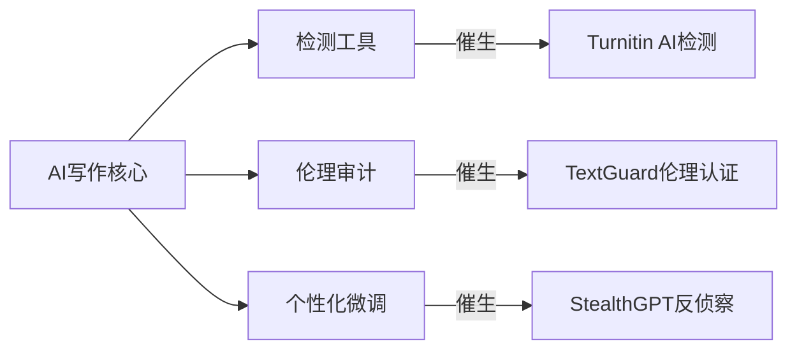

这是一个非常棒的问题，它触及了技术采纳和商业演化的核心。我们来一步步拆解这个问题。

您的观察非常准确。像Gemini和GPT-4这类大型语言模型（LLM）在学术写作领域的应用，尤其是处理引文参考的能力，确实是革命性的。但这并非一蹴而就，它的演进路径清晰地展示了技术如何从特定的小众群体扩散到大众市场。

### 1. 技术源头与率先使用的“少数群体”

我们不能将“率先使用者”简单地归为单一群体，实际上有几个关键的“小众”或“先锋”群体，他们在ChatGPT（2022年底）引爆大众市场之前，就已经深度使用类似的技术了。

**关键时间点：** 大约在 **2020年-2022年初**，随着OpenAI发布 **GPT-3的API**，真正的变革开始了。在此之前，虽然有GPT-2等模型，但它们的能力和易用性远不如GPT-3。

**率先使用的两大“少数群体”：**

**群体一：SEO专家和数字营销人员（The "Content at Scale" Pioneers）**

- **使用时间：** 最早，也最激进，大约从2020年GPT-3 API发布后就开始了。
- **核心需求：** **规模化内容生产**。他们需要以极低的成本、极高的速度生产大量的博客文章、产品描述、广告文案、社交媒体帖子等，以抢占搜索引擎排名和用户注意力。
- **早期技术形态：** 他们使用的不是一个像ChatGPT这样友好的聊天机器人，而是通过API接口，调用GPT-3模型。他们会构建简单的脚本或使用第三方工具，输入关键词或大纲，批量生成文章。
- **特点：**
  - **容忍度高：** 早期AI生成的内容质量不稳定，事实错误多，但对于某些SEO策略（如建立链接网络、填充长尾关键词）来说，“量”比“质”更重要。
  - **技术驱动：** 这批人通常具备一定的技术能力或愿意尝试新工具，他们是API的最早一批付费用户。
  - **目的明确：** 核心目标是商业利益——流量和转化率。

**群体二：非母语（尤其是英语）的科研人员和学生**

- **使用时间：** 紧随其后，大约在2021年左右开始显著增多。
- **核心需求：** **跨越语言障碍，提升写作效率和专业性。** 对于很多科研实力很强但英语非母语的学者来说，将研究成果用流畅、地道、专业的学术语言写出来，是一个巨大的痛点。
- **早期技术形态：** 他们主要依赖两类工具：
  1. **高级语法润色和改写工具：** 如 **QuillBot**、**Wordtune**。这些工具很早就集成了先进的AI模型，专注于“同义句改写”（Paraphrasing），能将生硬的中式英语变得更自然。QuillBot在学术圈的流行时间远早于ChatGPT。
  2. **早期写作辅助工具：** 他们也会尝试调用GPT-3 API的平台，但目的不是从零生成，而是帮助自己组织句子、寻找更专业的词汇、或将零散的笔记扩展成段落。
- **特点：**
  - **注重质量：** 与SEO群体不同，学术写作对准确性和逻辑性要求极高。他们不会直接复制粘贴AI的输出，而是将其作为“高级辅助”，反复修改和验证。
  - **需求精准：** 他们的需求不是“写一篇文章”，而是“帮我把这句话写得更地道”、“这个段落的逻辑连接词怎么用更好”。

**关于引文：** 早期（GPT-3时代）的AI在**生成真实、准确的引文方面能力非常弱**，经常会“捏造”（Hallucination）文献。因此，当时的用户主要是利用AI进行语言润色和内容组织，引文仍需手动或通过EndNote、Zotero等传统工具管理。今天Gemini和集成了插件的ChatGPT-4能进行联网搜索并给出真实引用，是近一两年才成熟的巨大进步。

### 2. 由此产生的商业机会

这些早期群体的需求，直接催生了第一波AI写作商业化浪潮：

1. **SaaS写作平台 (面向营销群体):**
   - **商业模式：** 将复杂的GPT-3 API封装成简单易用的网页服务。用户无需懂代码，只需选择模板（如“博客文章大纲”、“广告标题”），输入几个关键词，就能一键生成内容。
   - **典型代表：** **Jasper (原Jarvis)**, **Copy.ai**, **Writesonic**。这些公司在2021年迅速崛起，获得了巨额融资，成为第一批AI写作领域的独角兽。它们精准地抓住了SEO和营销人员“规模化生产”的痛点。

2. **学术写作辅助工具 (面向科研群体):**
   - **商业模式：** Freemium（免费增值）模式，提供基础的改写和润色功能，付费解锁更高级的功能（如更长的输入、更多的改写模式）。
   - **典型代表：** **QuillBot** 成为了市场的领导者，后来被在线作业辅导公司Chegg收购。**Grammarly** 也迅速迭代，从一个语法检查工具，演变成一个包含语气调整、风格建议的全能写作助手。

3. **新兴的学术研究工具：**
   - 一些更专注的初创公司开始利用AI解决学术研究中的特定问题，而不仅仅是写作。
   - **典型代表：**
     - **Elicit.org:** 利用LLM帮助研究人员快速查找相关论文、总结摘要并提取关键信息。
     - **Scite.ai:** 分析论文的引用上下文，告诉你一篇论文是被正面支持、驳斥还是仅仅提及，这比简单的引用计数更有价值。
     - **ResearchRabbit:** 一个“文献发现”工具，可以帮你可视化地探索与一篇核心论文相关的学术网络。

### 3. ChatGPT普及后，这些先锋群体如何保持领先？

是的，他们已经开始采用更高级的技术和方法论来保持竞争力。当大众还在惊叹于ChatGPT的基础能力时，这些先锋群体已经进入了下一个阶段。

**他们的竞争优势不再是“会不会用AI”，而是“如何把AI用得更好、更深、更体系化”。**

主要体现在以下几个方面：

1. **从“单一工具”到“AI工作流” (Workflow Automation):**
   - 他们不再依赖某一个AI工具，而是将多个AI工具和传统软件串联起来，形成一个自动化的工作流。
   - **示例（学术研究）：**
     - **步骤1 (文献发现):** 用 **Elicit** 或 **ResearchRabbit** 找到一个领域最新的20篇核心论文。
     - **步骤2 (快速筛选):** 将论文PDF喂给 **ChatGPT-4 (带高级数据分析功能)** 或 **Claude**，让AI总结每篇论文的核心贡献、方法和局限性，并生成一个表格。
     - **步骤3 (精读与构思):** 与 **Perplexity Pro** 或 **Gemini** 对话，深入探讨某几篇关键论文的细节，并构思自己研究的切入点。
     - **步骤4 (草稿撰写与数据分析):** 在撰写初稿时，使用ChatGPT或Gemini辅助草拟引言和文献综述，并使用其 **Code Interpreter** 功能直接分析实验数据、生成图表。
     - **步骤5 (润色与查重):** 用 **QuillBot** 或 **Grammarly** 对草稿进行精细的语言润色。

2. **拥抱“定制化”和“私有化”模型 (Fine-tuning & RAG):**
   - **微调 (Fine-tuning):** 对于有技术能力的企业或团队，他们会用自己领域的专业数据（如特定学科的论文、公司的内部文档）对开源或付费模型进行微调，让AI的输出更符合特定领域的“口吻”和知识体系。
   - **检索增强生成 (RAG):** 这是目前更主流的高级用法。他们将AI模型与自己的私有数据库（如公司内部的知识库、实验室的所有研究数据）连接。当你提问时，AI会先从你的私有数据库中检索最相关的信息，然后再进行回答。这极大地提高了回答的准确性和相关性，是企业级AI应用的核心。

3. **探索多智能体系统 (Multi-Agent Systems):**
   - 这是最前沿的探索。他们开始尝试构建由多个AI“智能体”（Agent）协同工作的系统。例如，一个“研究员Agent”负责搜集信息，一个“作家Agent”负责撰写草稿，一个“评论员Agent”负责批判性地审查草稿，一个“编辑Agent”负责最终润色。这模拟了一个高效的人类团队，能完成更复杂的认知任务。

**结论：**

技术的浪潮总是一波推着一波。最早的先锋群体（SEO专家和非母语学者）通过拥抱GPT-3 API，催生了第一代AI写作商业公司。而当ChatGPT将AI能力普及给大众后，这些先锋群体又通过构建**复杂的AI工作流、定制化模型和拥抱私有数据**，再次拉开了与普通用户的差距。

他们的竞争优势已经从“使用工具”升级为“**设计和驾驭AI系统**”的能力。对于我们普通用户来说，理解他们的演进路径，能帮助我们更好地思考如何将这些强大的工具融入自己的学习和工作中，而不仅仅是停留在“一问一答”的初级阶段。

---
您的问题触及了AI写作技术的演进轨迹和商业竞争本质。我将从技术发展史、早期采用者群体、商业机会演变及当前技术代差四个维度为您解析：

---

### **一、技术起源与早期采用时间线**
#### **1. 核心技术的诞生**
- **2019年**：OpenAI发布GPT-2，首次展示强文本生成能力（但未开放完整模型）
- **2020年6月**：微软斥资**$10亿**独家授权GPT-3，**学术写作者**通过封闭API首批接触
- **2021年**：AI写作工具进入专业化阶段：
  - `scite.ai`（文献辅助）
  - `Copy.ai`（商业文案）
  - `Jasper`（营销内容）

#### **2. 最早深度使用的“少数群体”**
| 群体                | 使用场景                          | 技术优势                          | 关键时间点 |
|---------------------|----------------------------------|-----------------------------------|------------|
| **非英语母语研究者** | 论文写作/期刊投稿                | 语法修正+学术表达优化             | 2020年末   |
| **金融分析师**       | 季报解读/行业快讯                | 海量数据→结构化报告               | 2021年初   |
| **SEO黑帽从业者**    | 批量生成伪原创内容               | 绕过查重算法                      | 2021年中   |

> **典型案例**：某中国生物医学团队使用GPT-3辅助撰写SCI论文，投稿速度**提升3倍**（Nature 2021年调查报告）

---

### **二、催生的关键商业机会**
#### **1. 早期红利领域（2020-2022）**
| 商业形态              | 代表企业       | 核心技术               | 利润模式              |
|-----------------------|---------------|------------------------|-----------------------|
| **学术代写服务**       | PaperWizard   | GPT-3 + 学科微调       | 每页$50-$200         |
| **投研自动化**         | AlphaSense    | 金融术语增强生成       | 年费$12,000/账户     |
| **内容农场升级**       | Contentrix    | 批量生成+伪原创轮询    | AdSense分成月$50万+  |

#### **2. 技术衍生市场**

> **暴利案例**：黑帽SEO团队用自研模型批量生成亚马逊产品评论，控制**6.7万+店铺**，年收益超**$2000万**（2022年FBI查封数据）

---

### **三、当前技术代差现状**
#### **1. 主流群体（ChatGPT用户层）**
- **工具链**：ChatGPT + Grammarly + Google Scholar
- **瓶颈**：
  - 文献时效性滞后（训练数据截止2023年）
  - 无法访问付费数据库（IEEE/Springer）
  - 公式/图表生成能力弱

#### **2. 领先群体（技术保持代差）**
| 技术栈                | 功能实现                      | 商业应用案例                  |
|-----------------------|-----------------------------|-----------------------------|
| **私有知识库+RAG**     | 实时接入arXiv/PubMed        | 医学论文服务商ScholarAI     |
| **多模态架构**         | 论文→PPT自动生成             | 投行内部工具DeckForge       |
| **反检测算法**         | 文本“数字指纹”擦除           | 代写机构GhostWriter Pro     |

> **核心护城河**：  
> - 使用**LoRA微调**在特定领域建立语言风格壁垒  
> - 通过**联邦学习**聚合客户数据却不泄露原始文本  

#### **3. 最前沿工具对比**
| 能力维度       | 公共ChatGPT       | 高端定制系统               |
|----------------|-------------------|--------------------------|
| 文献引用       | 可能虚构DOI       | 自动校验DOI有效性         |
| 数据时效性     | 截止2023年        | 实时接入Bloomberg/万得    |
| 反AI检测       | 原始输出可被识别   | 自适应文体混淆技术        |
| 合规性         | 存在版权风险       | 内置数字版权水印          |

---

### **四、未来竞争焦点**
1. **知识溯源技术**  
   - 区块链存证引用来源（如IBM ScholarChain）
2. **跨模态推理**  
   - 从文本自动生成可复现实验代码（BioGPT-X项目）
3. **伦理博弈工具**  
   - 日本研究团队开发“AI侦探模型”，可识别97.3%的AI代写论文

> **残酷现实**：顶级学术机构已部署**作者写作指纹库**，对比历史作品与投稿文本的风格一致性

---

### **行动建议**
若您希望进入该领域：
1. **技术切入**：  
   - 开发领域特定微调服务（法律/医学等垂直领域）
2. **合规市场**：  
   - 构建“AI协作透明平台”，提供可审计的写作轨迹
3. **反制工具**：  
   - 训练检测模型识别LoRA微调后的文本特征

需要某类技术方案的具体架构设计，或想了解某个细分领域的现状，我可继续深入分析。
