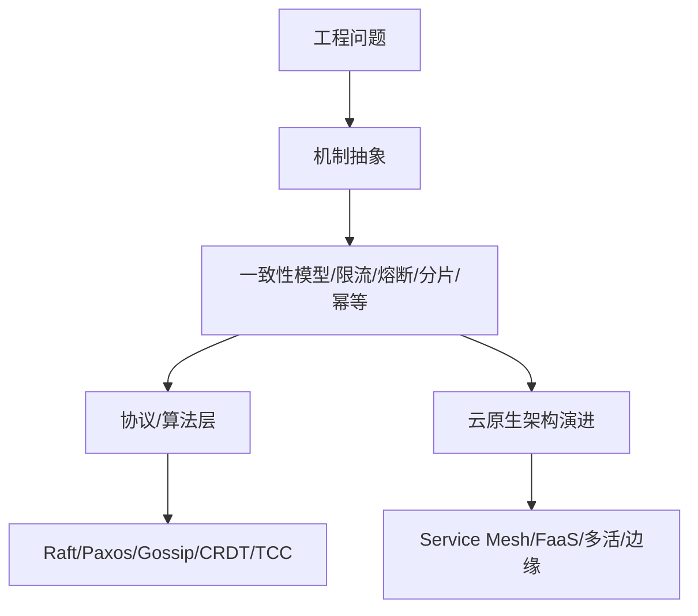

你已经列出了分布式系统的核心问题域中的关键知识点（限流、缓存、服务治理、消息解耦、最终一致性），但要构建一个真正 **系统级认知图谱**，还需要补齐以下几个**高频瓶颈点 + 抽象设计维度**：


## 六、完整知识图谱建议（可导入 Obsidian / Notion）

```yaml
分布式系统知识图谱:
  架构原则:
    - CAP / PACELC
    - 一致性模型
    - 分布式事务
  系统治理:
    - 服务注册与发现
    - 熔断限流降级
    - 链路追踪
    - 配置中心
  性能优化:
    - 多级缓存
    - 请求合并
    - 批处理 vs 实时
    - 幂等性
  高可用设计:
    - MQ 异步解耦
    - 最终一致性
    - 灰度发布
    - 多活架构
  存储系统:
    - Sharding 策略
    - 分布式锁
    - 文件系统优化
    - Gossip & Raft 协议
  云原生趋势:
    - Serverless
    - Edge Computing
    - Service Mesh
```

---

## 一、架构级别补充知识点（Top-Down）

### 1. **CAP / PACELC 理论**

- **目的**：理解为何无法同时满足一致性 + 可用性 + 分区容忍
    
- **PACELC 补充了延迟和一致性权衡**，是现代系统更真实的建模依据。
    

### 2. **调度层认知（资源调度 vs. 请求调度）**

- **资源调度**：K8s、YARN、Nomad、Flink JobManager 等
    
- **请求调度**：RateLimiter、Priority Queue、工作队列分配器（如 Celery）
    

### 3. **多级缓存架构（Local + Redis + CDN）**

- L1/L2 Cache，防止跨机访问延迟
    
- **热点 key 保护**策略（如 single-flight、locking cache）
    

### 4. **分布式链路追踪 + 可观测性**

- OpenTelemetry / Zipkin / Jaeger
    
- 分布式 Tracing 的核心组件：TraceId / SpanId / ParentId
    

---

## 二、系统瓶颈级别（Bottom-Up）

### 1. **数据一致性维度细分（强/弱/最终一致性）**

- **读写一致性模型**：线性化一致性、顺序一致性、因果一致性
    
- **存储一致性协议**：
    
    - Paxos / Raft（共识类）
        
    - Gossip（状态传播类，如 Cassandra）
        

### 2. **分布式事务实现机制**

- **2PC / 3PC**（阻塞型）
    
- **TCC**（业务级补偿）
    
- **Saga Pattern**（用于长事务编排）
    
- **消息事务 outbox pattern**（写入 DB + MQ 中转表，定期发送）
    

### 3. **网络不可靠模型（Fail-stop vs. Byzantine）**

- **半开连接 / TCP 粘包问题 / 请求重放问题**
    
- **心跳探测 + 自愈机制（如 Kubernetes liveness probe）**
    

---

## 三、业务架构维度（Domain-Driven）

### 1. **系统分片（Sharding）策略**

- 水平分片 vs 垂直分片
    
- Hash vs 范围分片
    
- **Consistent Hashing**（一致性哈希 + 虚拟节点）
    

### 2. **幂等性设计**

- 客户端 Token / 唯一请求 ID / 幂等键锁（如 Redis SETNX）
    
- 数据层幂等保护（唯一索引，操作记录表）
    

### 3. **灰度发布 & 滚动升级机制**

- 实现：Kubernetes Deployment / Istio 灰度路由
    
- A/B test、金丝雀发布、慢启动机制（Warm-Up）
    

---

## 四、真实高压场景中的“盲区瓶颈”

|类别|痛点|对应策略|
|---|---|---|
|文件系统|海量小文件读写|MinIO、FastDFS、HDFS、小文件合并策略|
|数据膨胀|Binlog、MQ 堆积|TTL 机制、消费确认重试机制|
|非对称负载|上游调用量远大于下游|请求合并、批处理窗口|
|网络拥塞|Snowflake ID 冲突 or 网络分区|Clock Sync + fallback + region partition|
|频繁变更配置|分布式配置中心|Nacos、Apollo、Spring Cloud Config|

---

## 五、结合 DevOps / 云原生趋势的架构要点

- **Service Mesh**：如 Istio/Linkerd 控制服务间通信流量、可观测性、熔断等
    
- **无服务器（Serverless）架构**：事件驱动，函数隔离（FaaS）
    
- **边缘计算**：分布式节点靠近用户，需处理局部一致性与数据上报聚合
    
- **多活架构**：同城多活、异地多活（双写一致性、冲突解决）
    

---

---

如需，我可以直接为你输出一个《分布式系统知识跳跃路径图谱》：从常见工程问题出发，向底层机制 & 前沿趋势跳跃的认知路径图，适合用于演讲、教学或导图复盘。是否继续？

好的 Sam，以下是一个系统化的 **《分布式系统知识跳跃路径图谱》**，其目标是：

> **从实际工程问题出发，逐层向底层原理 & 架构演进路径跳跃，构建结构性认知压缩框架。**

---

## 《分布式系统知识跳跃路径图谱》

格式说明：

- **[问题/现象]**：现实中遇到的工程瓶颈
    
- **→ 跳跃认知维度**：抽象出该问题背后的通用机制
    
- **→ 底层原理/演进路径**：对应的理论、协议或架构发展趋势
    

---

### 一、请求处理链路跳跃

```
[请求突然激增，服务被打爆]
→ 限流 + 熔断策略设计
→ 令牌桶 / 滑动窗口 / Bulkhead 模式（隔离）  
→ 资源调度模型（K8s QoS + Istio Circuit Breaking）
```

```
[缓存失效导致数据库雪崩]
→ 缓存穿透 / 击穿 / 雪崩机制
→ Bloom Filter / Mutex / 预热 + LazyLoad + TTL抖动
→ 分布式 Cache 层设计（Redis Cluster + Local L1）
```

```
[服务调用链追踪困难]
→ 分布式可观测性模型
→ TraceId → SpanId → 上下游传播机制（W3C TraceContext）
→ OpenTelemetry / Linkerd / Istio Mixer
```

---

### 二、服务治理跳跃

```
[服务动态注册失败 or 拉取延迟]
→ 注册中心机制
→ 心跳检测 + TTL + 长轮询 vs. 推送
→ ZooKeeper → Eureka → Nacos → Consul 演进
```

```
[上游服务故障导致下游连锁雪崩]
→ 服务降级 / 异常隔离
→ Hystrix → Sentinel → Istio + Envoy Filter → Adaptive Policy（自适应限流）
```

```
[配置频繁修改导致服务重启]
→ 分布式配置中心
→ 配置热更新机制 + Key/Version 管理
→ Apollo / Spring Cloud Config / Nacos Config
```

---

### 三、异步解耦 & 数据一致性跳跃

```
[订单创建成功但库存未扣减]
→ 异步解耦 + 最终一致性
→ MQ + Outbox + Retry/Dead Letter Queue
→ TCC / Saga 模式 / Binlog Listener（Debezium）
```

```
[跨服务事务无法保障一致性]
→ 分布式事务模型
→ 2PC → TCC → Saga → 消息事务（本地事务 + MQ Outbox）
→ 隔离性 vs. 可用性权衡
```

```
[消息重复消费 or 顺序错乱]
→ 幂等性设计
→ 幂等键 / 请求唯一ID / DB 去重表设计
→ MQ 顺序消费：Partition + Key Hash
```

---

### 四、数据一致性跳跃

```
[缓存和 DB 数据读不一致]
→ 一致性模型对比
→ 读写一致性（Read-after-write、Monotonic Read）
→ BASE 理论 → Raft / Paxos / CRDT / LWW Register
```

```
[多节点间状态同步不及时]
→ 状态传播协议
→ Gossip 协议（去中心化传播）
→ Redis Cluster / Cassandra 等机制
```

---

### 五、存储 & 分片跳跃

```
[单表行数超过亿级查询变慢]
→ 水平分库分表设计
→ 取模分片、范围分片、一致性哈希
→ Sharding-JDBC / Vitess / OceanBase 实现原理
```

```
[热点 Key 导致 Redis 单点高负载]
→ 热点 Key 迁移策略
→ 客户端缓存、异步预热、分片+虚拟节点+随机后缀
→ Proxy 层路由（Codis / Twemproxy）
```

---

### 六、系统稳定性 &边界跳跃

```
[服务在某些时间段频繁崩溃]
→ 异常观测 + 自愈机制
→ 熔断 + 自动扩缩容 + 自动重启（CrashLoopBackOff）
→ Kubernetes Probes（Liveness + Readiness）
```

```
[系统中某部分时延剧增]
→ tail latency 问题 + P99 优化
→ 批处理 + 请求合并 + 快速失败机制
→ 优先队列调度器（Priority Queue + Token Bucket）
```

```
[服务资源竞争严重]
→ 调度公平性建模
→ CFS 调度器、工作队列池、Sidecar 资源隔离
→ QoS + HPA + NodeAffinity + cgroups
```

---

### 七、云原生架构跳跃

```
[部署变更频繁导致系统不稳定]
→ 灰度发布 + 金丝雀发布
→ 版本路由控制（Istio VirtualService）
→ 环境隔离（Dev / Staging / Prod）+ 多版本打包
```

```
[需快速扩展处理突发请求]
→ Serverless 架构跳跃
→ FaaS 事件模型 + 冷启动优化 + 并发上下限管理
→ AWS Lambda / Cloudflare Workers / KNative
```

```
[用户分布全球，访问延迟高]
→ 多活架构 / 边缘计算
→ 异地多活（双写冲突）/ Local-First 写入策略
→ 数据同步策略：CRDT / 同步日志合并
```

---

## 总结：路径跳跃策略图（结构化视图）



---

如你需要，我可以继续扩展：

- 导出成 Markdown + Mermaid 格式，用于 Obsidian 知识库
    
- 输出每条路径的“关键跳跃点解释卡片”，方便制成抽认卡（支持 Cloze 格式）
    
- 构建互动式 Agent（输入工程问题 → 输出路径跳跃图）
    

是否继续？或者你想要哪个方向深挖？