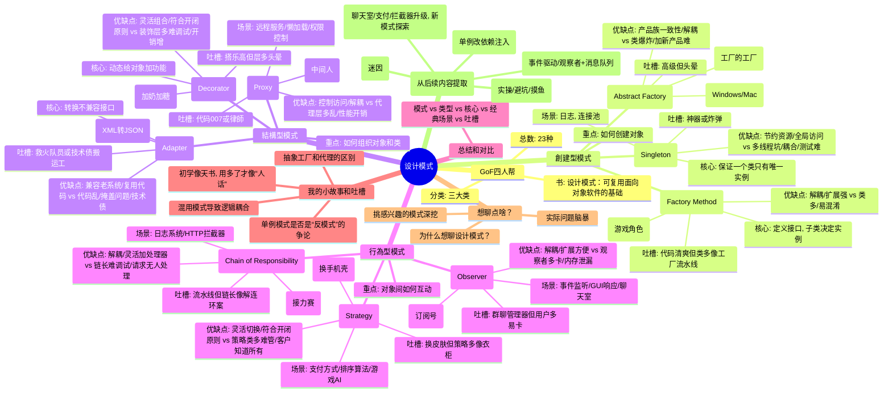

## 🎯 设计模式（GoF 23种）：认知锚点库

---

## **第一层：分类总览** ★

|大类|重点|核心思想|
|---|---|---|
|**创建型** (5种)|如何创建对象|隐藏创建逻辑，增强灵活性|
|**结构型** (7种)|如何组织对象/类|通过组合实现功能扩展|
|**行为型** (11种)|对象间如何互动|职责分配、通信协调|

---

## **第二层：九大常用模式速查表** △

|模式|类型|核心|场景|优点|缺点|吐槽|
|---|---|---|---|---|---|---|
|**单例**|创建|唯一实例|日志、连接池|资源节约、全局易用|多线程坑、耦合、测试难|神器or炸弹|
|**工厂方法**|创建|子类决定实例|多类型对象(游戏角色)|解耦、易扩展|类多易混淆|流水线但清爽|
|**抽象工厂**|创建|创建产品族|跨平台UI整套切换|产品族一致性|类爆炸、加新产品难|高级但头晕|
|**适配器**|结构|转换不兼容接口|集成老API(XML→JSON)|复用代码、兼容老系统|代码乱、掩盖问题|救火队员|
|**装饰者**|结构|动态加功能|IO流、咖啡配料|灵活组合、开闭原则|层多难调试、开销增|乐高但晕|
|**代理**|结构|控制访问(中间人)|懒加载、权限、远程|控制访问、解耦|层多乱、性能开销|007或律师|
|**观察者**|行为|一对多通知|事件监听、聊天室|解耦、扩展方便|观察者多卡、内存泄漏|群聊管理员|
|**策略**|行为|动态切换算法|支付方式、排序、AI|灵活切换、开闭原则|策略类多、客户知道所有|衣柜皮肤|
|**责任链**|行为|请求沿链传递|日志、HTTP拦截器|解耦、易加处理器|链长难调试、无人处理|接力赛|

---

## **第三层：创建型模式详解**

### **3.1 单例模式 (Singleton)** ★

**核心**：保证类只有唯一实例，全局访问

```python
# 线程安全的懒汉式单例
class Singleton:
    _instance = None
    _lock = threading.Lock()
    
    @classmethod
    def get_instance(cls):
        if cls._instance is None:
            with cls._lock:
                if cls._instance is None:
                    cls._instance = cls()
        return cls._instance

# ✗ 错误写法（多线程下会创建多个实例）
class BadSingleton:
    _instance = None
    
    def __new__(cls):
        if cls._instance is None:
            cls._instance = super().__new__(cls)
        return cls._instance
```

**反常识** ❗：

- ❗ 单例 = 好？ → 多线程下的double-check坑很深
- ❗ 全局访问 = 便利？ → 实际是全局耦合，测试地狱

**建议**：用**依赖注入**替代（IoC容器管理生命周期）

---

### **3.2 工厂方法 (Factory Method)**

**核心**：定义接口，子类决定实例

```python
# 接口
class CharacterFactory(ABC):
    @abstractmethod
    def create_character(self):
        pass

# 具体工厂
class WarriorFactory(CharacterFactory):
    def create_character(self):
        return Warrior(hp=100, attack=20)

class MageFactory(CharacterFactory):
    def create_character(self):
        return Mage(hp=50, magic=30)

# 使用
factory = WarriorFactory()
character = factory.create_character()
```

**优势**：避免硬编码类名 (if-else地狱)

---

### **3.3 抽象工厂 (Abstract Factory)**

**核心**：创建一组相关对象（工厂的工厂）

```python
# 抽象工厂
class UIFactory(ABC):
    @abstractmethod
    def create_button(self):
        pass
    
    @abstractmethod
    def create_window(self):
        pass

# Windows风格工厂
class WindowsUIFactory(UIFactory):
    def create_button(self):
        return WindowsButton()
    
    def create_window(self):
        return WindowsWindow()

# Mac风格工厂
class MacUIFactory(UIFactory):
    def create_button(self):
        return MacButton()
    
    def create_window(self):
        return MacWindow()

# 整套切换
factory = WindowsUIFactory() if os == "windows" else MacUIFactory()
button = factory.create_button()
window = factory.create_window()
```

**适用**：多平台、多主题、产品族需要一致性

---

## **第四层：结构型模式详解**

### **4.1 适配器 (Adapter)**

**核心**：转换不兼容接口，让老代码兼容新系统

```python
# 老API (XML格式)
class LegacyAPI:
    def get_data_xml(self):
        return "<data><name>Alice</name></data>"

# 新系统需要JSON
class NewSystem:
    def process_json(self, json_data):
        return json_data

# 适配器
class XMLToJSONAdapter:
    def __init__(self, legacy_api):
        self.legacy_api = legacy_api
    
    def get_data(self):
        xml_data = self.legacy_api.get_data_xml()
        # 转换XML→JSON
        return json.dumps({"name": "Alice"})

# 使用
adapter = XMLToJSONAdapter(LegacyAPI())
system = NewSystem()
system.process_json(adapter.get_data())
```

**警示** ❗：适配器很方便，但可能积累技术债

---

### **4.2 装饰者 (Decorator)**

**核心**：动态给对象加功能，不改变接口

```python
# 基础咖啡
class Coffee:
    def cost(self):
        return 10

# 装饰器
class MilkDecorator(Coffee):
    def __init__(self, coffee):
        self.coffee = coffee
    
    def cost(self):
        return self.coffee.cost() + 2

class SugarDecorator(Coffee):
    def __init__(self, coffee):
        self.coffee = coffee
    
    def cost(self):
        return self.coffee.cost() + 1

# 灵活组合
coffee = Coffee()
coffee = MilkDecorator(coffee)      # +2
coffee = SugarDecorator(coffee)     # +1
print(coffee.cost())  # 13
```

**优势**：比继承灵活，可任意组合；符合开闭原则

---

### **4.3 代理 (Proxy)**

**核心**：控制对象访问（充当中间人）

```python
# 真实对象
class DatabaseConnection:
    def query(self, sql):
        # 耗时操作
        return "result"

# 代理：添加权限控制、懒加载等
class DatabaseProxy:
    def __init__(self):
        self._connection = None
    
    def query(self, sql, user_role="guest"):
        # 权限检查
        if user_role != "admin":
            raise PermissionError("Unauthorized")
        
        # 懒加载：第一次才创建连接
        if self._connection is None:
            self._connection = DatabaseConnection()
        
        return self._connection.query(sql)

# 使用
proxy = DatabaseProxy()
proxy.query("SELECT * FROM users", user_role="admin")
```

**类型**：

- 保护代理：权限控制
- 远程代理：跨网络调用
- 虚拟代理：懒加载

---

## **第五层：行为型模式详解**

### **5.1 观察者 (Observer)** ★

**核心**：一对多通知（发布-订阅）

```python
# 观察者接口
class Observer(ABC):
    @abstractmethod
    def update(self, message):
        pass

# 主题（被观察者）
class ChatRoom:
    def __init__(self):
        self.observers = []
    
    def subscribe(self, observer):
        self.observers.append(observer)
    
    def unsubscribe(self, observer):
        self.observers.remove(observer)
    
    def send_message(self, message):
        for observer in self.observers:
            observer.update(message)

# 具体观察者
class User(Observer):
    def __init__(self, name):
        self.name = name
    
    def update(self, message):
        print(f"{self.name} received: {message}")

# 使用
room = ChatRoom()
alice = User("Alice")
bob = User("Bob")

room.subscribe(alice)
room.subscribe(bob)

room.send_message("Hello everyone!")
# Alice received: Hello everyone!
# Bob received: Hello everyone!
```

**反常识** ❗：

- ❗ 观察者越多越好？ → 观察者多 → 性能下降 + 内存泄漏风险
- ❗ 手写观察者好？ → 用消息队列/事件总线（削峰、异步）更好

---

### **5.2 策略 (Strategy)**

**核心**：动态切换算法（避免 if-else）

```python
# 策略接口
class PaymentStrategy(ABC):
    @abstractmethod
    def pay(self, amount):
        pass

# 具体策略
class CreditCardStrategy(PaymentStrategy):
    def pay(self, amount):
        return f"Paid ${amount} with Credit Card"

class WeChatStrategy(PaymentStrategy):
    def pay(self, amount):
        return f"Paid ${amount} with WeChat"

# 上下文
class Order:
    def __init__(self, amount):
        self.amount = amount
        self.strategy = None
    
    def set_strategy(self, strategy: PaymentStrategy):
        self.strategy = strategy
    
    def checkout(self):
        return self.strategy.pay(self.amount)

# 使用
order = Order(100)
order.set_strategy(CreditCardStrategy())
print(order.checkout())  # Paid $100 with Credit Card

order.set_strategy(WeChatStrategy())
print(order.checkout())  # Paid $100 with WeChat
```

**优势**：运行时动态选择算法，符合开闭原则

---

### **5.3 责任链 (Chain of Responsibility)**

**核心**：请求沿链传递，每个处理器只负责自己的部分

```python
# 处理器接口
class Handler(ABC):
    def __init__(self, next_handler=None):
        self.next_handler = next_handler
    
    @abstractmethod
    def handle(self, request):
        pass

# 具体处理器
class DebugLogHandler(Handler):
    def handle(self, request):
        if request.level == "DEBUG":
            print(f"[DEBUG] {request.message}")
        elif self.next_handler:
            self.next_handler.handle(request)

class ErrorLogHandler(Handler):
    def handle(self, request):
        if request.level == "ERROR":
            print(f"[ERROR] {request.message}")
        elif self.next_handler:
            self.next_handler.handle(request)

# 构建链
debug = DebugLogHandler()
error = ErrorLogHandler()
debug.next_handler = error

# 使用
class Request:
    def __init__(self, level, message):
        self.level = level
        self.message = message

debug.handle(Request("DEBUG", "Variable x = 5"))
debug.handle(Request("ERROR", "Connection failed"))
```

**应用**：

- 日志系统分级
- HTTP请求拦截器链
- 审批流程

---

## **第六层：模式对比与选择**

### **何时使用哪个模式？**

```
问题：对象创建逻辑复杂
├─ 单个对象 → 工厂方法
├─ 产品族 → 抽象工厂
└─ 单一实例 → 单例（但考虑依赖注入）

问题：功能扩展
├─ 静态扩展(继承) → 不用模式
├─ 动态扩展(包装) → 装饰者
└─ 功能可选 → 策略

问题：对象间通信
├─ 一对多通知 → 观察者
├─ 访问控制 → 代理
├─ 请求处理 → 责任链
└─ 兼容老系统 → 适配器
```

---

## **第七层：反常识与陷阱** ❗

|陷阱|真相|
|---|---|
|❗ 单例 = 好的全局变量？|✗ 单例 = 隐式全局耦合，测试难|
|❗ 模式越多越灵活？|✗ 过度设计 → 代码复杂度爆炸|
|❗ 装饰者可无限嵌套？|✗ 层数多 → 性能下降 + 调试地狱|
|❗ 观察者可以同步通知？|✗ 生产环境用消息队列（异步、削峰）|
|❗ 工厂方法避免了if-else？|✗ if-else只是移到了工厂里|

---

## **第八层：设计模式的道** ★★★

> **模式不是目标，解决问题才是**

```
初学阶段：把模式当"必须用"
  → 代码变得高度可复用但难以理解
  
进阶阶段：理解模式背后的原理
  → 知道什么时候用、什么时候不用
  
高手阶段：在问题中认识模式
  → 自然而然地写出符合模式的代码
  → 甚至创造新的模式
```

**核心三原则**：

1. 🎯 **KISS** (Keep It Simple, Stupid) - 简单优先
2. 🎯 **YAGNI** (You Aren't Gonna Need It) - 不过度设计
3. 🎯 **DRY** (Don't Repeat Yourself) - 避免重复

---

## **快速查阅**

### **我该用哪个模式？**

|问题|答案|
|---|---|
|对象创建太复杂|工厂方法 / 抽象工厂|
|需要唯一实例|单例（不推荐） / 依赖注入|
|动态加功能|装饰者|
|控制访问|代理|
|解耦发送者和接收者|观察者 / 消息队列|
|同步多个对象状态|观察者|
|多种支付方式|策略|
|多级审批流程|责任链|
|兼容老系统|适配器|

---

## **复习触发点**

|时长|内容|用途|
|---|---|---|
|2min|分类总览表|快速回忆9种|
|5min|速查表 + 吐槽|理解模式特点|
|10min|核心原理 + 代码骨架|学会应用|
|15min|模式对比树 + 反常识|灵活选择|
|实战时|_"这里有重复逻辑"_ → 装饰者/策略|识别信号|
||_"这些对象相关联"_ → 抽象工厂|识别信号|

---

## **关键对标**

### **模式 vs 反模式**

|目标|好的做法|坏的做法(反模式)|
|---|---|---|
|唯一实例|依赖注入 + IoC|全局单例|
|解耦观察者|消息队列 + 异步|同步观察者|
|对象创建|工厂抽象|处处 new|
|代码复用|组合 > 继承|深层继承树|

---

**生成时间**：2025-12-14 | **版本**：1.0 | **用途**：面试准备/代码设计参考