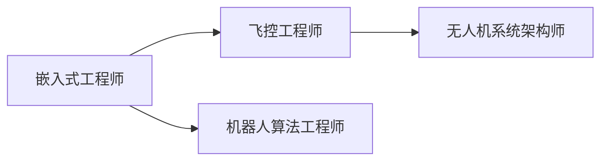

# 无人机与嵌入式系统完全指南

## 一、核心论点

**嵌入式系统是无人机的"大脑"和"神经系统"**

没有嵌入式系统，就没有现代智能无人机。从飞控到任务执行，嵌入式系统是其"大脑与神经网络"。

---

## 二、核心架构：三层关系

### 1. 三层架构模型

| 层级 | 嵌入式系统作用 | 核心模块 |
|:--- |:--- |:--- |
| **感知层** | 传感器 → 嵌入式驱动 | IMU、气压计、磁力计、GPS |
| **决策层** | 算法 → 嵌入式处理器 | 姿态估计算法、路径规划 |
| **执行层** | 控制指令 → 嵌入式I/O | 电机PWM、舵机控制 |

### 2. 关键依赖

- **实时性**：需要确定性响应（毫秒级）
- **可靠性**：需要硬件级故障处理
- **低功耗**：需要高效能耗比

---

## 三、飞控系统嵌入式实现

### 1. 定义与作用

**飞控 = Flight Controller**，是无人机姿态稳定与运动控制的核心模块

### 2. 典型飞控主循环

```c
while(1) {
    读取IMU数据();           // I2C/SPI
    读取GPS位置();           // UART
    运行姿态估计算法();       // Mahony/Madgwick
    PID控制计算();           // 实时控制律
    输出电机PWM();           // Timer
    延时(2ms);              // 500Hz控制频率
}
```

### 3. 关键传感器

| 传感器 | 作用 | 常用型号 |
|:--- |:--- |:--- |
| **IMU** | 陀螺仪 + 加速度计 | MPU6050/ICM20689 |
| **气压计** | 测高度 | MS5611 |
| **磁力计** | 航向角 | HMC5883L |
| **GPS** | 位置 | uBlox M8N |

### 4. 常用MCU

- **STM32F4**：168MHz，浮点运算
- **STM32H7**：480MHz，双核

### 5. 开源飞控

- **PX4飞控架构** - 基于NuttX RTOS
- **ArduPilot架构** - 支持Linux/ChibiOS

---

## 四、嵌入式硬件平台

### 1. MCU vs SoC 选型决策树

| 平台类型 | 应用场景 | 示例 |
|:--- |:--- |:--- |
| **MCU** | 小型无人机主控 | STM32F4/H7, NXP Kinetis |
| **嵌入式SoC** | 图像处理/中高端机型 | Jetson, Qualcomm Flight RB5 |
| **RTOS** | 实时性保障 | FreeRTOS, PX4/NuttX |
| **Linux系统** | 高算力任务 | Ubuntu on Jetson / Pi |

### 2. SoC选型对比（AI/视觉场景）

| 平台 | CPU | GPU | 功耗 | 适用场景 |
|:--- |:--- |:--- |:--- |:--- |
| **Jetson Nano** | 4核A57 | 128核Maxwell | 5-10W | 入门视觉避障 |
| **Jetson Xavier NX** | 6核Carmel | 384核Volta | 10-15W | SLAM + 目标跟踪 |
| **RK3399** | 2大4小 | Mali-T860 | 3-5W | 低成本图传 |
| **Snapdragon Flight** | 4核Kryo | Adreno 530 | <5W | 高集成度方案 |

### 3. 设计权衡

- **算力 vs. 功耗**：Jetson性能强但续航减半
- **生态 vs. 成本**：Jetson贵但支持CUDA/TensorRT
- **尺寸 vs. 散热**：高算力SoC需主动散热

### 4. 典型应用

```bash
# Jetson上运行YOLOv5目标检测
$ python3 detect.py --weights yolov5s.pt --source /dev/video0
```

---

## 五、RTOS在飞控中的作用

### 1. 为什么需要RTOS？

裸机编程（Super Loop）无法保证：

1. **任务优先级**：传感器读取必须优先于日志记录
2. **时间确定性**：控制周期必须精确2ms
3. **资源管理**：多任务并发需要信号量/消息队列

### 2. FreeRTOS示例

```c
void vTaskIMU(void *pvParameters) {
    TickType_t xLastWakeTime = xTaskGetTickCount();
    for(;;) {
        读取IMU();
        姿态解算();
        vTaskDelayUntil(&xLastWakeTime, pdMS_TO_TICKS(2)); // 500Hz
    }
}

void vTaskGPS(void *pvParameters) {
    for(;;) {
        if(xSemaphoreTake(uartSemaphore, portMAX_DELAY)) {
            解析GPS数据();
        }
    }
}
```

### 3. PX4的NuttX方案

- **优先级调度**：控制任务优先级最高
- **uORB消息总线**：模块间解耦通信
- **低延迟**：中断响应 <10μs

---

## 六、案例研究

### 1. 农业植保无人机

**系统架构**
```
RTK-GPS → 嵌入式主控 → 飞控
高度传感器 ↗         ↓ PWM
                    水泵+喷头
```

**技术要点**
1. **RTK定位**：厘米级精度（F9P模块）
2. **恒高飞行**：激光测距 + 气压计融合
3. **变量喷洒**：
   ```c
   喷洒流量 = 飞行速度 × 目标亩用量 / 喷幅
   ```
4. **断点续喷**：掉电后自动记录坐标

**硬件配置**
- 主控：STM32H743（双精度FPU）
- 通信：LoRa遥测 + 4G图传
- 载荷：12L药箱 + 无刷直流水泵

**实际挑战**
- 农药腐蚀电路板 → 三防漆处理
- 高温环境 → MCU降频运行
- 电磁干扰 → 磁力计远离电机

### 2. 空中加油验证系统

- 地面嵌入式系统运行视觉识别算法
- 计算相对姿态后反馈至飞控
- 响应时间需求：毫秒级
- 注重高性能处理与实时通信

---

## 七、开发技能树

### 1. 基础层（3-6个月）

- [ ] C语言指针与结构体
- [ ] STM32 HAL库开发
- [ ] UART/I2C/SPI通信
- [ ] 定时器与PWM输出
- [ ] 中断与DMA

### 2. 进阶层（6-12个月）

- [ ] FreeRTOS任务调度
- [ ] 卡尔曼滤波（姿态融合）
- [ ] PID控制器调参
- [ ] MAVLink协议解析
- [ ] Git版本管理

### 3. 专家层（1-2年）

- [ ] 传感器标定算法
- [ ] 视觉SLAM（ORB-SLAM2）
- [ ] 嵌入式Linux开发
- [ ] ROS 2与PX4联合仿真
- [ ] 硬件原理图设计

### 4. 推荐学习资源

1. **书籍**：《STM32权威指南》
2. **课程**：Coursera《嵌入式系统导论》
3. **项目**：克隆开源飞控并修改参数
4. **工具**：STM32CubeIDE + QGroundControl

### 5. 职业路径



---

## 八、技术演进

### 1. 嵌入式技术推进无人机发展

**作用方向**：
1. **自主能力提升**：AI芯片实现机载识别与避障
2. **可靠性增强**：看门狗、冗余传感器
3. **低功耗小型化**：SoC集成CPU/GPU/ISP
4. **复杂任务支持**：农业喷洒、物流投递

### 2. 趋势

- **嵌入式AI**：机载深度学习
- **异构计算**：CPU+GPU+NPU
- **低功耗高可靠架构**：能量收集 + 故障预测

---

## 九、无人机开发所需技能地图

### 1. 基础技能

- C/C++、STM32、FreeRTOS、SPI/I2C/UART

### 2. 进阶技能

- 卡尔曼滤波、PID控制、MAVLink协议、嵌入式Linux

### 3. 工具

- Keil、STM32CubeIDE、QGroundControl、ROS 2

### 4. 延伸笔记

- [[嵌入式系统_RTOS_原理]]
- [[滤波算法_Kalman_应用于飞控]]
- [[通信协议_MAVLink_结构与机制]]

---

## 十、总结

无人机可看作嵌入式系统的高阶应用体。

| 维度 | 说明 |
|:--- |:--- |
| **本质关系** | 嵌入式系统赋予无人机智能与灵活性 |
| **技术依赖** | 飞控、导航、通信、任务等核心均依赖嵌入式 |
| **发展趋势** | 嵌入式AI、异构计算、低功耗设计 |
| **行业要求** | 对嵌入式开发能力要求极高 |

**一句话总结**：
> 嵌入式系统让无人机具备"感知、思考、行动"的能力，是从遥控玩具到飞行机器人的进化基石。

---

**关联笔记**
- [[RTOS在飞控中的作用]]
- [[嵌入式SoC在无人机中的选型]]
- [[案例：农业植保无人机嵌入式系统]]
- [[无人机嵌入式开发技能树]]
