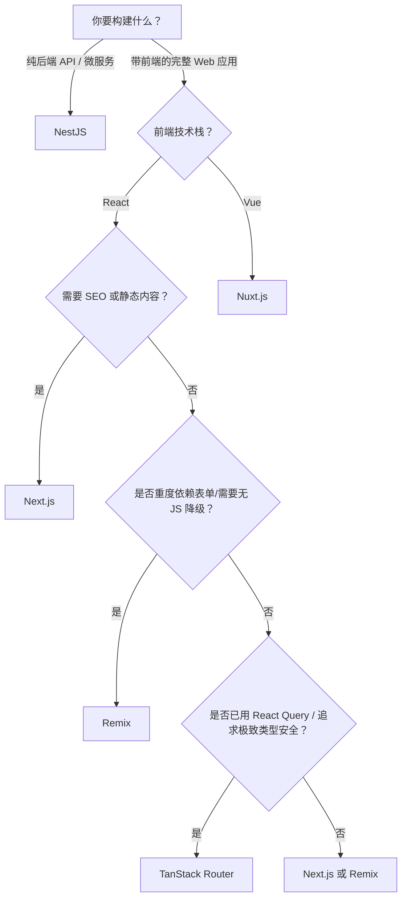

# 现代前端框架选型与实战

## 一、框架概览对比

| 特性 | **TanStack Router** | **Next.js** | **Remix** | **NestJS** |
|:--- |:--- |:--- |:--- |:--- |
| **类型** | 前端路由框架（可扩展为全栈） | React全栈框架 | React全栈框架 | Node.js后端框架（TS优先） |
| **核心理念** | 类型安全、渐进式、无运行时魔法 | 约定优于配置、SSR/SSG/ISR | Web标准优先、渐进增强 | 企业级架构、OOP+DI |
| **数据获取** | `loader`（类似Remix） | `async` Server Components / Route Handlers | `loader` / `action`（基于Web Fetch） | 自定义（REST/gRPC/GraphQL） |
| **渲染模式** | CSR为主，支持SSR（需集成） | App Router: SSR/SSG/ISR/RSC | 默认SSR + Hydration | 无内置前端（通常返回JSON） |
| **部署目标** | 任何JS环境（含Edge） | Vercel优化，也支持其他 | 通用（适配多平台） | Node.js服务器/Docker |
| **学习曲线** | 中（需理解路由树、类型推导） | 中高（App Router概念多） | 中（强调Web原语） | 高（需OOP、装饰器、模块系统） |
| **典型用途** | 复杂SPA/渐进式全栈 | 企业级Web应用、营销站、CMS | 高交互性、表单密集型应用 | 微服务、API网关、后端系统 |

---

## 二、React 19+ 开发范式演进

### 1. 核心架构演进：从手动到自动

- **Fiber架构**：作为React 16引入的协调引擎重写，是实现Actions、`useTransition`等新特性背后机制的关键
- **React编译器**：新的范式是"编写直观的代码，让编译器自动处理优化"，从要求开发者手动管理性能，转向由工具链自动保障性能

### 2. React 19+ 核心开发范式

**以Actions为中心的数据突变模式**
- **核心机制**：通过`useTransition`, `useFormStatus`等Hooks，React内置了一套处理异步操作的完整状态机
- **优势**：统一了pending状态、Optimistic Updates和错误处理

**服务器组件(Server Components)优先的架构**
- **默认在服务端**：组件默认在服务器上运行，有效提升初始加载性能、减少发送到客户端的JavaScript体积
- **客户端是"选择加入"**：只有需要状态、生命周期和浏览器事件等交互能力的组件，才通过`"use client"`指令标记

**对函数式编程思想的深化**
- **不可变性(Immutability)**：React编译器和Diff算法都严重依赖于状态的不可变性
- **副作用的精细化管理**：
  - 数据突变类副作用：应首选Actions来处理
  - 非突变类副作用：如与第三方库同步、设置订阅等，继续使用`useEffect`

### 3. 心智模型转变

- 从"手动优化性能"转向"信任编译器"
- 从"客户端状态管理"转向"服务端优先的数据流与交互"
- React不再仅仅是声明UI，更是声明数据突变的完整流程

---

## 三、Next.js高阶进阶

### 1. 本质

```
Next.js ≠ React路由库
Next.js = React全栈框架的范式转变
       = SSR/SSG/ISR/CSR的智能混合器
       = Server Components时代的设计系统
```

### 2. 五层学习架构

**L1：为什么（30min）**
- **问题驱动**：解决SPA的SEO盲区、首屏慢、缺乏后端、配置复杂等问题
- **设计哲学**：混合渲染、以用户为中心、全栈一体化

**L2：快速实践（1hour）**
- 官方Learn (App Router版) → 30min
- 搭建小项目(CRUD + form + API) → 30min

**L3：核心抽象（2hour）**

**关键概念四象限**
| | **数据流向** | **执行位置** |
|:--- |:--- |:--- |
| **读** | RSC fetch → 自动dedupe + 缓存 | Server |
| **写** | Server Action → 数据库 → revalidate | Server |
| **交互** | Client Component + state/effect | Browser |
| **路由** | 文件系统 + Layout + Middleware | Both |

**四大机制**

**① RSC（React Server Components）**
- 何物：服务端直接渲染的组件，无JS bundle
- 收益：减少Client JS、直接访问数据库/密钥、无hydration开销

**② Server Action**
- 何物：标记为async的函数，自动序列化为API endpoint
- 收益：无需手写API、CSRF防护天生、Optimistic UI简单

**③ 缓存策略**
```javascript
fetch(url, { cache: 'force-cache' })     → SSG
fetch(url, { next: { revalidate: 60 } }) → ISR
fetch(url, { cache: 'no-store' })        → SSR
```

**④ Middleware**
- 位置：Edge Runtime（CDN节点）
- 用途：认证 → API调用 → 动态行为

**L4：实现细节（2hour）**

**必读源码模块**
```
packages/next/src/
├── server/
│   ├── app-render.tsx     ← RSC渲染逻辑
│   ├── route-handlers.ts  ← Server Action路由
│   └── lib/app-dir-module ← 文件系统路由
├── client/
│   ├── components/app-router.tsx ← 客户端路由导航
│   └── use-transition-manager    ← Optimistic UI
└── lib/
    └── metadata.ts        ← SEO元数据生成
```

**三个核心问题**

**Q1：RSC Payload长什么样？**
```json
{
  "0": { "_type": "Component", "name": "BlogPost" },
  "1": { "_type": "Promise", "result": { "title": "..." } }
}
```

**Q2：Server Action如何序列化？**
- 编译时：function → 唯一ID（如"a1b2c3"）
- 运行时：$ACTION_ID_a1b2c3d(args) → POST /__next_server_actions__

**Q3：Streaming如何实现？**
- 使用`renderToReadableStream() + Suspense`
- 分块发送HTML：1. 骨架屏HTML 2. 组件完成 → 补充HTML fragment

### 3. 快速对标

| 框架 | 渲染 | Server Actions | RSC | 成熟度 |
|:--- |:--- |:--- |:--- |:--- |
| **Next.js** | Hybrid | ✅ | ✅ v13+ | ⭐⭐⭐⭐⭐ |
| Remix | SSR优先 | Actions | ❌ | ⭐⭐⭐⭐ |
| SvelteKit | Hybrid | ❌ | ❌ | ⭐⭐⭐ |
| Astro | 静态优先 | ❌ | ❌ | ⭐⭐⭐ |

---

## 四、渲染模式深度解析

### 1. 渲染模式对比总表

| 模式 | 全称 | 数据获取时机 | 首屏性能 | SEO友好 | 交互能力 | 典型使用框架 |
|:--- |:--- |:--- |:--- |:--- |:--- |:--- |
| **CSR** | Client-Side Rendering | 浏览器加载JS后发起请求 | ❌ 较慢 | ❌ 差 | ✅ 强 | React（原生）、Vue CLI |
| **SSR** | Server-Side Rendering | 服务器在响应HTML前获取数据 | ✅ 快 | ✅ 好 | ✅ 强 | Next.js (Pages Router)、Remix |
| **SSG** | Static Site Generation | 构建时预渲染 | ✅✅ 极快 | ✅✅ 最佳 | ⚠️ 有限 | Next.js、Gatsby、Astro |
| **ISR** | Incremental Static Regeneration | 构建时 + 运行时按需更新 | ✅ 快 | ✅ 好 | ✅ 动态更新 | Next.js（独有） |
| **RSC** | React Server Components | 服务器组件在服务端渲染 | ✅ 减少客户端bundle | ✅ 内容在HTML中 | ⚠️ 仅限特定组件 | Next.js App Router |

### 2. 详细解析

**CSR（客户端渲染）**
- 工作方式：服务器返回空HTML + JS bundle，浏览器执行JS后才发起API请求、渲染页面
- 优点：开发简单，前后端完全分离；交互灵活
- 缺点：首屏慢、SEO不友好

**SSR（服务端渲染）**
- 工作方式：每次请求时，服务器获取数据 → 渲染完整HTML → 返回给浏览器 → 客户端"注水"
- 优点：首屏快，SEO友好；支持个性化内容
- 缺点：服务器压力大；TTFB可能较长

**SSG（静态站点生成）**
- 工作方式：在构建时将所有页面预渲染为静态HTML文件，部署到CDN
- 优点：极致性能、成本低、SEO最佳
- 缺点：内容更新需重新构建

**ISR（增量静态再生）**
- 工作方式：首次访问时若无缓存返回fallback，后台异步生成并缓存
- 优点：兼顾SSG性能和SSG动态性；无需重建整个站点即可更新部分内容
- 缺点：仅限Next.js

**RSC（React Server Components）**
- 工作方式：组件分为Server Component和Client Component
- 优点：减少客户端bundle体积；自动代码分割；数据获取更靠近UI
- 缺点：学习曲线陡峭；不能在Server Component中使用hooks

---

## 五、框架选择决策树



---

## 六、各框架的"灵魂"

| 框架 | 核心价值 | 一句话定位 |
|:--- |:--- |:--- |
| **TanStack Router** | 类型安全 + 渐进式路由 | "给React应用装上智能导航系统" |
| **Next.js** | 全栈一体化 + 多渲染模式 | "React应用的瑞士军刀" |
| **Remix** | Web标准 + 渐进增强 | "让Web回归本质的React框架" |
| **NestJS** | 企业级架构 + 可维护性 | "Node.js的Spring Framework" |

---

## 七、趋势与建议（2026）

- **Next.js**仍是React全栈的**默认选择**，尤其在Vercel生态中
- **Remix**在**表单和用户体验鲁棒性**要求高的场景持续赢得口碑
- **TanStack Router**正在成为**高级React团队**的新宠
- **NestJS**在**后端领域地位稳固**，是TypeScript后端的事实标准之一

**最终建议**：
- 不确定？从**Next.js**开始
- 做内部工具、管理后台？考虑**Remix**或**TanStack Router**
- 只写API？选**NestJS**（或Fastify/Hono若追求轻量）

---

**关联笔记**
- [[React开发范式与架构分析]]
- [[Next.js 进阶学习指南]]
- [[TanStack等四个现代框架深度对比]]
