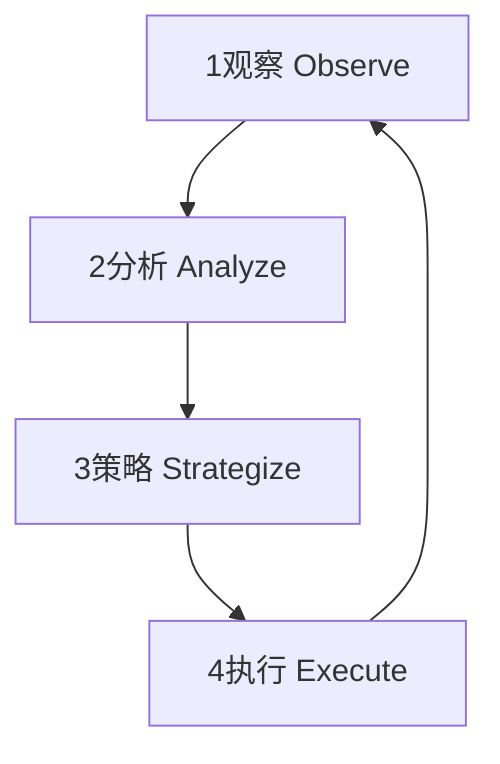

# 个人操作系统综合指南

> **核心逻辑一句话**：把自己当成一套可演进的系统，用五个心智模块和季度 OKR 持续重构决策与习惯。

---

## 一、系统架构

### 🧩 五大心智内核

| 内核 | 职能 | 核心原则 |
|------|------|----------|
| **Clarity** | 像 debugger 一样找根因 | 用「现象–假设–验证–原理」分析重大决策 |
| **Vision** | 为项目和人生预留 3–5 年扩展槽 | 拒绝一次性硬编码 |
| **Craft** | 把重复工作变成可复用脚本/清单 | 按「做第三次就抽象」的原则小重构 |
| **Resilience** | 为高压和失败设计「熔断与降级」 | 关注恢复时间而非自责 |
| **Legacy** | 把经验封装成 SOP / 教程 | 让别人和未来的自己能直接调用你的「API」 |

### 🔄 元认知执行循环

所有元认知活动都可以被抽象为一个持续迭代的四阶段循环：

1. **Observe (观察)**: 有意识地监控当前的思维状态和过程
2. **Analyze (分析)**: 解构和评估思维过程的质量
3. **Strategize (策略)**: 基于分析结果，设计或选择更优的思维策略
4. **Execute (执行)**: 应用新策略，并返回观察阶段，形成闭环

### 👁️ 三重视角诊断

| 视角 | 核心问题 | 应用 |
|------|----------|------|
| **国家视角（PPE）** | 战略–执行–制度是否失衡？ | 检查方向、执行力、流程沉淀 |
| **操作系统视角（MIT）** | 当前 bug 在哪一层？ | 定位 debugger / roadmap / pipeline / API |
| **未来用户视角（设计思维）** | 3 年后的自己会如何评价？ | 评估决策的主功能、副作用和回滚方案 |

---

## 二、硬约束层

> **系统不崩盘的前提。违反任一条，暂停其他优化。**

| 领域 | 规则 | 阈值 / 验证方式 | 适用条件 |
|------|------|------------------|----------|
| **财务** | 不滚动高息消费债（信用卡最低还款、网贷等） | 账单无利息 = 合规 | 收入 ≥ 基础支出 |
| **健康** | 睡眠 ≥ 7h / 天 + 每周运动 ≥2 次 | 可穿戴设备 / 自测 | 长期可持续 |

**⚠️ 触发降载信号：** 连续3天睡眠不足 / 持续疼痛 / 债务利息 > 收入5% → **先恢复，再推进**

---

## 三、仪表盘系统

> **把"成长"从感受变为可观测数据**

### 每日（30秒）
- [ ] 今天最重要的1件事完成了吗？
- [ ] 手机屏幕时间是否超标？

### 每周（10分钟）
- 深度工作时长：**≥8–15h**（专注、无干扰）
- 可展示产出：**≥1项**（代码/demo/文章/复盘/成交记录）
- 运动：≥2次；关键关系：≥1次高质量交流

### 每月（10分钟）
- 资产负债表更新（现金流、负债、净资产）
- 新增1个可复用模块（模板/脚本/方法论）
- 自评声誉SLO：承诺按时交付率、延期提前沟通率

### 每季度（30分钟）
- 主要关系是否健康？是否在消耗你？
- 当前路径还说得通吗？
- 健康是否被透支？

---

## 四、核心协议

> **触发条件 → 动作 → 止损/退出**

| 协议 | 触发条件 | 动作 | 失效信号 / 风险 |
|------|--------|------|----------------|
| **执行：微观单线程** | 切换频繁、质量下滑 | 每天2个专注块（25–50min），块内只做1事，末尾写"下一步" | 把专注当逃避沟通；无同步机制 |
| **探索：宏观并行小实验** | 职业迷茫、想转型 | 2–4周低成本实验（课程+作品/访谈10人/兼职）；提前写清成功标准 & 止损线 | 无止损 → 变成分心；成本不可回撤 |
| **决策：可逆快做，不可逆慢做** | 选择困难、焦虑拖延 | 问："撤回成本多大？"• 可逆（工具/内容）→ 24h内决定• 不可逆（买房/裸辞）→ ≥2周冷静期 + premortem | 把不可逆当可逆 → 出事故；反之 → 冻结 |
| **声誉：可靠性 > 讨好** | 想经营口碑但拒投机 | 1) 只承诺能交付的 2) 关键结论留痕 3) 冲突对事不对人 | 过度讨好透支；过度"形象管理"显假 |
| **金钱：安全垫 → 自动化** | 现金流波动、易冲动消费 | 顺序：1) 记账透明 2) 清高息债 3) 建应急金（3–6月支出）4) 自动转账长期投资 | 无安全垫就高风险投资 = 幻觉收益 |

---

## 五、季度 OKR 引擎

### 目标 O
安装/升级「架构师心智」作为个人操作系统。

### 关键结果 KR

| KR 类别 | 具体指标 |
|---------|----------|
| **KR‑Clarity & Craft** | 季度内完成若干份第一性原理决策文档，并接受他人挑错 |
| **KR‑Vision** | 为 1–2 个关键项目画「5 年架构图 + 扩展点」，避免只盯眼前交付 |
| **KR‑Resilience & Legacy** | 用统一复盘框架缩短恢复时间，并每次产出至少 1 条可执行改进项 |

### 最小行动集（本周可执行）

1. 选一件重要决策，用第一性原理模板写完一页分析
2. 为一个在做的项目画草图：5 年后可能形态 + 至少 3 个扩展点
3. 选择一个已重复 ≥3 次的流程，写成标准清单或小脚本，视为一次 Craft 小重构
4. 选一次崩溃/失败经历，测算恢复时间，并写一条「下次如何缩短 50%」的规则

---

## 六、高 ROI 杠杆

> **优先投入时间的地方**

1. **技能密度**：2–3个互补硬技能 + 业务理解 → 形成独特供给（如：工程+写作+产品）

2. **分发能力**：让产出被看见（写作/作品集/内部分享）→ 可检索、可复用

3. **合作网络**：高信任弱连接 → 降低交易成本，提升机会质量

4. **资本自动化**：钱在后台工作（指数基金+自动定投），但**永远排在现金流安全之后**

> ✅ **杠杆生效前提**：已通过"硬约束" + 有可展示产出

---

## 七、避坑指南

| 反模式 | 症状 | 修正 |
|--------|------|------|
| **只收藏概念，不绑定具体 If–Then 规则** | 知道很多但行动不起来 | 每学到一个心智模块，至少写出一条「如果 X，就执行 Y」的场景规则，并实际用一次 |
| **把复盘变成情绪宣泄，而非系统升级** | 复盘停留在自责或总结口号 | 复盘必须以「下次具体改什么流程」收尾 |
| **心智升级只停留在个体，不做 Legacy 输出** | 经验无法复用 | 每完成一次有价值的项目或决策，至少产出一份对他人可用的 SOP / 模板 |

---

## 八、何时扔掉这份笔记？

- 你在**反复阅读而非行动**
- 你用它**评判自己或他人**
- 它让你**更焦虑而非平静**
- 你的**实际处境不符假设**（如生存线挣扎）

> 💡 **比笔记更有用的**：
> 1. 直接去做那件你一直拖延的事
> 2. 和真正了解你的人聊30分钟
> 3. 睡一个好觉
> 4. 承认"我不知道"，然后先动起来

---

### 最小可行安装（7天启动）

1. 建仪表盘（Notion/表格）：深度工时、产出、睡眠、现金流
2. 设每天2个专注块 + 块末"下一步"
3. 列清所有债务利率 → 停止滚动高息债
4. 设应急金自动转账（哪怕100元）
5. 做1个2周小实验 → 产出可展示作品
6. 写"声誉SLO"三条规则贴桌面
7. 做"生存底线审计"：列出3–5条不可触碰红线

---

> **最后提醒**：
> 这份系统不是真理，而是一个**可证伪、可迭代的假设**。
> 用30天验证它是否对你有效——无效就删掉，别让它成为新的负担。

---

**合并来源**：
- [[个人操作系统重构指南]]
- [[高 ROI 个人操作系统]]
- [[元认知MOC]]