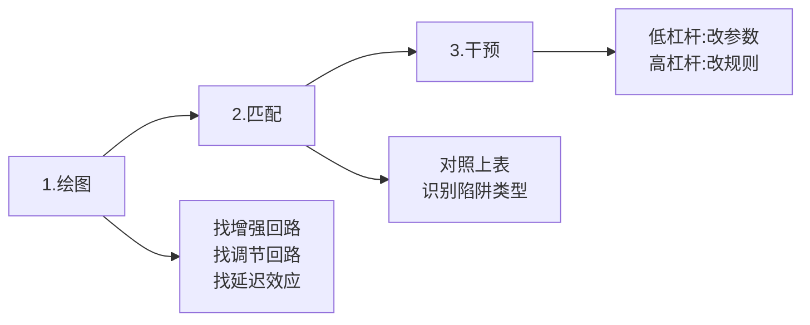

---
aliases:
- 系统思维
- 创新方法
- 深度工作
date: 2025-09-15 00:00:00+00:00
rating: 3.0
tags:
- Cognitive-Design
- Feedback-Loop-Optimization
- Systems-Thinking
- Innovation
- Type/Reference
- Domain/Technology
type: 系统
update: 2026-01-21 00:00:00+00:00
---
# 系统思维与创新方法

---

## 一、系统思考速查手册

### 核心公式

**线性思维** ❌ $A \rightarrow B$  
**系统思维** ✅ $A \rightleftarrows B$ (反馈回路)

**系统 = 要素(存量) + 连接(流量) + 目标(反馈)**

---

### 四大系统陷阱速查表

| 陷阱类型 | 你会看到 | 立即做这个 |
|:---------|:---------|:-----------|
| **增长极限** | 早期飞速增长→突然停滞 | ❌ 加更多力 <br> ✅ **解开约束瓶颈** |
| **饮鸩止渴** | 问题反复出现且恶化 | ❌ 继续用"止疼药" <br> ✅ **切断依赖，攻根因** |
| **责任转移** | 依赖外援，自身能力退化 | ❌ 增加外部支持 <br> ✅ **撤出拐杖，强制自愈** |
| **公地悲剧** | 各自最优→集体崩盘 | ❌ 道德说教 <br> ✅ **建立约束机制** |

---

### 三步解题法



#### 详细步骤

**Step 1: 绘制因果回路图**
- 增强回路 🔄：什么在驱动雪球效应？
- 调节回路 🛑：什么在限制增长？
- 延迟效应 ⏱️：动作与结果的时差在哪？

**Step 2: 匹配原型**
- 对照"四大陷阱表"，找到你的困境模式

**Step 3: 施加干预**
- **低杠杆**：改参数（加钱/加人/加时间）← 通常无效
- **高杠杆**：改规则（改激励/改流程/改连接）← 四两拨千斤

---

### 速用场景卡

#### 组织管理
**症状**：部门互相甩锅  
**诊断**：责任转移陷阱  
**干预**：建立跨部门共享KPI

#### 个人成长
**症状**：努力但无突破  
**诊断**：增长极限陷阱  
**干预**：找到能力天花板并针对性训练（而非盲目努力）

#### 社会问题
**症状**：环境污染加剧  
**诊断**：公地悲剧  
**干预**：碳税/排放配额等强制约束

---

### 记住这句话

> **不要推得更用力，要找到那个支点。**  
> 改变反馈回路 > 改变要素数量

---

### 使用检查清单

遇到问题时问自己：
- [ ] 这是单次事件还是重复模式？
- [ ] 我看到的是症状还是根因？
- [ ] 系统中的延迟在哪里？
- [ ] 谁在承担短期利益？谁在承担长期成本？
- [ ] 我的解决方案是"止疼药"还是"手术"？

---

## 二、创新方法

### TRIZ 理论

#### 核心思想

TRIZ（发明问题解决理论）提供了一套系统化的创新方法论，通过识别矛盾并应用40个发明原理来解决问题。

#### 8大进化法则

- **S曲线发展法则**
- **提高理想化法则**
- **不均匀发展法则**
- **向超系统发展法则**
- **向微观发展法则**
- **提高动态性法则**
- **提高协调性法则**
- **减少人参与法则**

---

### 马斯克五步工作法

#### 核心模式

先极致简化和质疑，再优化和自动化。

#### 五步流程（实用）

1. **质疑需求**: 绝不接受或遵循任何要求，直到追溯到"提出要求的那个人的理由"，并确认它是否有意义
2. **删除**: 只保留10%核心负荷，尽可能删除所有可以删除的部分
3. **简化/优化**: 在完成步骤2后，简化或优化剩余的部分
4. **加速**: 加快流程的速度
5. **自动化**: 在前四步都完成后，将流程自动化

#### 模式价值（实用）

确保精力聚焦核心，从源头减少复杂性，避免优化冗余系统。严格遵循此模式，是最高效的"捷径"。

---

## 三、蜜蜂算法

### 核心逻辑

**生存底线 > 局部最优**

在复杂系统中，个体的"聪明"是高成本且不可靠的。算法的核心在于通过**统计鲁棒性**和**机械化 SOP**，在概率上覆盖风险并捕捉机会。

### 模式对比矩阵

| 维度 | 传统英雄模式 | 蜜蜂算法模式 | ROI 洞察 |
| :--- | :--- | :--- | :--- |
| **核心变量** | 解决问题的能力 | **消除风险的流程** | 切断灭绝级路径 |
| **注意力** | 平均分配/细节死循环 | **信号频率驱动（摇摆舞）** | 80% 带宽聚焦高频区 |
| **应变策略** | 坚守与拯救（堡垒） | **快速放弃（侦察）** | 识别枯萎，动态迁移 |
| **护城河** | 深度技术细节 | **确定性协议的执行力** | 降低代谢成本 |

---

### 行动指南：黄金三步协议

1. **熔断风险**：
   - 动作：扫描并切断"灭绝级路径"（如无测试的代码、单点故障）

2. **信号狙击**：
   - 动作：统计代码变更频率与引用频率，仅在"高亮度区"投入时间

3. **机械化重复**：
   - 动作：放弃即兴发挥，将有效动作转化为不可违背的 **SOP（标准作业程序）**

---

### 决策指南：应用场景

- **场景 A**：面对海量源码阅读
  - 策略：忽略长尾文件，只读核心热点

- **场景 B**：项目陷入重构僵局
  - 策略：执行"快速放弃"，侦察蜂迅速撤离低ROI区域，重建新锚点

- **场景 C**：制定职业规划
  - 策略：不赌单点技术，构建能适应不同环境的"算法心智"

---

## 四、核心竞争力构建系统

### 核心公式

```
独特性 = 护城河
行动   = 认知引擎  
信噪比 = 效能基石
```

**终极法则**：

> 成为独一无二的行动者，在最小闭环中持续输出高信噪比的价值

---

### 核心主题清单

| # | 核心概念 | 关键公式/原理 |
| -- | ------- | --------------------- |
| 1 | 个人核心竞争力 | 独特性 × 知识 × 经验（不可复制） |
| 2 | 心智本质 | 具身的、关系性的涌现（≠ 大脑产物） |
| 3 | 自知意识 | Autonoetic："我"的叙事能力 |
| 4 | 错误根源 | 认知简化：错误比较 + 错误预期 |
| 5 | 行动优先 | 向前聚焦 + 归因于策略 → 唤醒意愿 |
| 6 | 信任公式 | (可信 × 可靠 × 亲密) / 自我导向 |
| 7 | 高效学习 | 深度 + 身份驱动 + 精准反馈 |
| 8 | 微学习边界 | 即时应用 ✓ / 深度建构 ✗ |
| 9 | 优质关系 | 规则 + 价值互换（远离消耗型） |
| 10 | 最小练习空间 | 精准 + 可重复 + 有反馈的闭环 |
| 11 | 高效沟通 | 消除多余空间（提升信噪比） |
| 12 | 幽默机制 | 预期违背 + 情绪调节工具 |
| 13 | 情绪管理 | 生理干预（呼吸/心率监控） |
| 14 | 四大认知障 | 勿意、勿必、勿固、勿我 |

---

### 三大支柱系统

#### 1️⃣ 构建不可替代的自我

**核心逻辑**：

- 同质化 = 竞争死亡螺旋
- 差异化 = 生存前提（非锦上添花）

**公式**：

```
独特性 = (经历 × 反思) / 从众压力
```

**行动指南**：

| 维度 | 策略 |
| -------- | ---- |
| **定期自问** | "这件事只有我能怎么看/做？" |
| **跨界组合** | 程序员+心理学 / 工程师+诗歌 |
| **困境转化** | 人生挫折 → 方法论 |

**价值锚点**：

- AI 时代：标准化技能被替代 → 独特组合不可复制
- 职业护城河：背景 × 创伤 × 兴趣 = 无法模仿的认知棱镜

---

#### 2️⃣ 在行动中觉醒

**反常识**：

```
认知、动机、信心 ≠ 前置条件
         ↓
在行动反馈循环中生成
```

**公式**：

```
意愿 = 行动 × 即时反馈
```

**三大破局法**：

| 技术 | 定义 | 应用 |
| ---------- | ------------ | ---------------- |
| **最小练习空间** | 5分钟就能启动的行动单元 | 降低心理启动成本 |
| **向前聚焦** | 切断对"状态完美"的执念 | "我做了__" 替代 "我应该__" |
| **归因于策略** | 失败 → 可调整变量 | "什么可优化？" 替代 "我不行" |

**高杠杆效应**：

```
❌ 准备 → 行动 → 准备（拖延死循环）
✅ 行动 → 反馈 → 迭代（正向飞轮）
```

---

#### 3️⃣ 管理认知与关系的信噪比

**核心逻辑**：

```
现代人核心能力 = 在信息/人际噪声中保持信号清晰
```

**公式**：

```
清晰度 = 信号强度 / 噪声总量
```

#### I. 对内：认知降噪

| 陷阱 | 修正策略 |
| -------- | ---- |
| **错误比较** | "我是否忽略了关键变量或差异？" |
| **错误预期** | 警惕线性因果（复杂系统多非线性） |
| **本能失明** | 识别"感觉对"但实际有害的行为 |
| **四大执念** | 勿意、勿必、勿固、勿我 |

#### II. 对外：关系降噪

- **信任公式**： (可信 × 可靠 × 亲密) / 自我导向
- **筛选原则**：无法共同成长的关系 → 果断放弃
- **沟通极简**：只留"结论 + 行动请求"

---

### 评分矩阵（CEO 视角）

| 主题 | 普适性 | 杠杆率 | 可操作 | 抗脆弱 | **加权总分** |
| ------ | --- | --- | --- | --- | -------- |
| 在行动中觉醒 | 10 | 10 | 10 | 9 | **9.70** |
| 管理信噪比 | 10 | 9 | 9 | 10 | **9.45** |
| 不可替代性 | 9 | 10 | 8 | 9 | **9.05** |

---

### 自增强系统

```
独特性（提供方向）
     ↓
行动（产生反馈）
     ↓
信噪比（确保质量）
     ↓
反哺独特性升级
```

---

### 立即行动清单

#### 今天就做

```
□ 定义 1 个"只有我能做"的任务（5分钟版本）
□ 识别 1 个"错误比较"并重新框定
□ 切断 1 个消耗型关系/对话
```

#### 本周做

```
□ 记录 3 个"经历 × 反思"组合点
□ 设计 1 个"最小练习空间"并执行 7 天
□ 用"结论先行"改写 1 封重要邮件
```

#### 长期坚持

```
□ 每月审计：时间投入是否强化独特性？
□ 每季度复盘：哪些行动产生意外正反馈？
□ 每年清理：哪些关系降低了信噪比？
```

---

## 五、深度工作与10x实战

### 深度工作

#### 定义：精英水平产出的能力

- **快速掌握复杂事物**：能够高效学习并精通那些复杂、抽象且需要高度认知投入的知识和技能
- **以精英水平产出**：以卓越的质量和效率，产出**难以复制、具有高价值的成果**

---

### 10x 实战手册

#### 核心

- **10x ≠ 多干 10 倍。10x = 砍掉 80% 平庸，只保留高杠杆。**

---

#### 1. 身份重塑：让未来决定现在

- 设定一个**极具体的 10x 身份**：例：年入千万 + 每年只工作 200 天
- **4C**：
  - **Clarity**：写清楚：10x 的你具体长什么样、怎么过一天
  - **Certainty**：公开承诺、押上真金白银，切断退路
  - **Conviction**：把新身份和你的价值观捆绑
  - **Consistency**：每天行为对照新身份，偏离就纠正

**规则**：**先问"10x 的我会怎么选？"再行动。**

---

#### 2. 极端帕累托：只做能撑起 10x 的事

- 写下你所有工作/项目/习惯
- 问自己：
  - **"哪些 20% 能撑起 10x 结果？"**
  - **"剩下 80%，我能停掉或外包什么？"**
- 做决定：
  - 立刻停止 1–3 件最没杠杆的事
  - 把时间和脑力全部挪到那少数 10x 任务上

**关键**：**不做，比多做更难，也更值钱。**

---

#### 3. 时间结构化：用日程强行保护深度

三类日，严格区分：

1. **Free Day（自由日）**
   - 0% 工作，不看邮件、不回消息
   - 目的：恢复、重启大脑

2. **Focus Day（专注日）**
   - 只做那 20% 的核心高杠杆工作
   - 所有杂事一律拒绝或推到 Buffer Day

3. **Buffer Day（缓冲日）**
   - 集中处理邮件、会议、行政、杂活
   - 目的是**把噪音关在这一天**，不污染专注日

**没有恢复，就不会有真正的高绩效。**

---

#### 4. 每日自问（3 个问题）

每天用 3 分钟，问完这三句：

1. **Gap vs Gain**
   - 我今天是在盯着"还不够"（Gap），还是看到"已经前进了什么"（Gain）？

2. **Who Not How**
   - 这件事谁能比我做得更好/更快？我可以让谁来做？

3. **Kairos Moment**
   - 今天有没有哪 10 分钟，是我真正在做最重要的事、完全在场的？

---

**合并来源**：
- [[系统思考速查手册]]
- [[创新发明范式-TRIZ 理论]]
- [[蜜蜂算法]]
- [[核心竞争力构建系统]]
- [[深度工作调度理念]]
- [[10x 实战手册]]
- [[埃隆·马斯克的五步工作法 (Elon Musk's 5-Step Process)]]