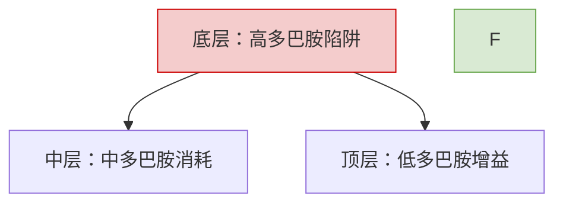
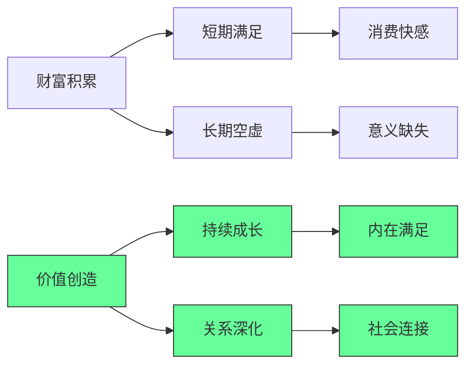

# 个人原则与职业发展

> **核心逻辑**：从被动接收信息，转变为主动设计自己知识结构与人生路径的结构化方法。

---

## 一、原则驱动行动

### 系统效率准则

**基本公式**：$$Engineering\_Value = \frac{Functionality}{Complexity \times Maintenance\_Cost}$$

#### 1. KISS：复杂度抑制

解释成本 > 30s 的逻辑即为过度设计。

#### 2. YAGNI：前瞻性代码 = 确定性负债

禁止为"可能"的需求预留接口。

#### 3. DRY：模式识别与提取

人工重复是抽象化的唯一触发器。

---

### 决策协议矩阵

| 模型 | 核心逻辑 | 执行算法 |
| :--- | :--- | :--- |
| **二阶思维 (2nd Order)** | 跨时间/空间的影响评估 | $T+1$ 响应 $\rightarrow$ 激励映射 $\rightarrow$ 边界效应预测 |
| **反馈循环** | 系统熵值控制 | $Action \rightarrow \Delta(Actual, Expected) \rightarrow Parameter\_Adjust$ |
| **第一性原理 (1st Principle)** | 认知解构与重构 | 剥离隐含假设 $\rightarrow$ 识别硬约束 $\rightarrow$ 从零构建路径 |

---

### 风险与决策框架

**可逆性 $\times$ 影响范围矩阵**：

- **不可逆 + 大范围**：强制执行 Planning，进行多轮 Peer Review
- **可逆 + 小范围**：执行 PDSA 微实验，以最低成本获取反馈信号

---

### 职场与效率模式

#### PDCA 循环（计划-执行-检查-处理）

- **适用场景**：项目管理、个人技能提升、流程优化
- **核心思想**：将任务看作一个闭环，通过不断的反馈迭代和修正来逼近目标

#### STAR 模式（情境-任务-行动-结果）

- **适用场景**：汇报工作、面试、撰写述职报告
- **核心思想**：结构化描述事实，确保信息的逻辑链条完整，增强说服力

#### 第一性原理

- **适用场景**：创新、解决复杂难题、打破思维定式
- **核心思想**：剥离所有表象和假设，回归事物的基本事实，重新组合解决方案

---

### 社交与沟通模式

#### 非暴力沟通（NVC：观察-感受-需求-请求）

- **适用场景**：化解冲突、深度沟通、处理亲密关系
- **核心思想**：区分"观察"与"评论"，通过表达自身"需求"而非"指责"来达成共识

#### 互惠模式

- **适用场景**：人际关系建立、商务谈判
- **核心思想**：先提供价值，利用人类心理中"受人恩惠必报之"的底层逻辑

#### 关键对话

- **适用场景**：高风险、高情绪、意见不一的谈话
- **核心思想**：营造"安全感"，在对话中断时先修复安全氛围，再回到事实本身

---

### 理财与投资模式

#### 复利模式

- **适用场景**：财富积累、个人成长、知识管理
- **核心思想**：注重长期的"利滚利"，初期增长缓慢但后期呈指数级爆发。核心变量是时间

#### 定投模式

- **适用场景**：市场波动大的投资（如基金、股票）
- **核心思想**：通过固定频率投入固定金额，自动实现"高位少买、低位多买"，平摊成本，对抗情绪波动

#### 资产配置

- **适用场景**：风险管理、长期财务规划
- **核心思想**：不要把鸡蛋放在一个篮子里。通过持有相关性低的资产组合，在同等风险下追求更高收益

#### 安全边际

- **适用场景**：重大财务决策、创业
- **核心思想**：预留容错空间，即便出现最坏情况（如失业、市场崩盘），也不会彻底崩盘

---

### 个人生活与决策模式

#### 二八定律（Pareto 原则）

- **适用场景**：精力分配、学习、内务整理
- **核心思想**：生活中 80% 的成果源自 20% 的关键行动，识别并保护那 20%

#### 冗余模式

- **适用场景**：系统稳定性（如电脑备份、备用金、应急包）
- **核心思想**：在关键环节增加备份，防止"单点故障"导致整个生活系统停摆

#### 习惯堆叠

- **适用场景**：建立新习惯
- **核心思想**：将一个新习惯挂载在一个已有的稳固习惯之后（例如：刷牙后立即冥想）

---

### 总结：现实生活中的"底层模式"

| 维度 | 常见模式 | 核心逻辑 |
|--- |--- |--- |
| 职场 | PDCA / STAR | 结构化输出与持续迭代 |
| 社交 | 非暴力沟通 / 互惠 | 需求识别与价值交换 |
| 理财 | 复利 / 资产配置 | 时间价值与风险对冲 |
| 生活 | 二八定律 / 第一性原理 | 聚焦关键与回归本质 |

---

### 有效的反馈原则

1. **提高可见性和即时性**：确保反馈信息易于察觉，并在行为发生后立即呈现
2. **提供量化和具体的数据**：用确切的数字和细节说话，避免模糊不清
3. **聚焦于行动与结果的关联**：清晰地展示"做了什么"导致了"得到了什么"
4. **设计可操作的反馈**：提供不仅仅是信息，更是下一步可以采取的明确指引
5. **利用多模态反馈**：考虑通过不同形式（视觉、听觉等）传递信息，以增强理解和记忆
6. **提供比较和基准**：将当前表现置于背景中考量，看看与过去或其他人有何不同
7. **允许反馈的定制化**：Recognise 不同用户的需求，让反馈能够根据个体情况进行调整

---

## 二、Hacker Mindset

### "Hacker mindset" 的含义与运作方式

他所说的 "hacker mindset"，就是把自己的学习当成一个可以被"改装、重组、优化"的系统，由自己动手不断**调整**，而不是被动套用固定的学校模式。

#### 在学习上，这种心态表现为：

- 不拘泥于单一课程或教材，而是像做 "remix / mashup" 一样，把社区资源、兴趣项目、线上内容、实践活动拼接起来
- 按自己的节奏和需要来学，只要能让自己更快、更好地达到目标，就会寻找"捷径"或更有效的路径

#### 这种学习系统对他如何奏效：

- **用真实的活动来学习**：滑雪、绳索课程、野外生存、企业实习、写作工作坊，让知识和技能都嵌在实际经验里
- **一旦有内在动机**，比如想写关于滑雪而不是"彩虹和蝴蝶"，就能在短时间内高效投入，通过大量实践和反馈，快速掌握写作、物理、设计、商业等能力
- **也能根据兴趣变化灵活更换"课程表"**，保持持续的好奇和投入感

---

#### 他的核心学习目标：

- **首要目标**不是某个职业头衔，而是"长大以后依然保持现在这样：快乐、健康、富有创造力"，把"happy and healthy" 当成教育的中心，而不是附属品
- **身心健康**：通过运动、户外、与人合作、服务他人等，实践 Dr. Roger Walsh 提出的八个"Therapeutic Lifestyle Changes"
- **创造力与"黑客思维"**：像 Shane McConkey 那样，用创造力去重塑一项运动或一个领域，学会用不同方式看世界、改造系统
- **现实世界技能与人生方向**：在滑雪工厂和服饰品牌实习、参与社区项目，理解数学、设计和合作在真实工作中的意义，探索未来可能从事的事业，同时保持"无论做什么，我都要是快乐的人"的底线

---

## 三、决策：科学为基石，艺术为导航

### 核心框架

| 维度 | 决策科学 | 决策艺术 |
| :--- | :--- | :--- |
| **目标** | 寻找**最优解 | 做出**足够好**的判断 |
| **适用场景** | 规则明确、数据充足 | 信息不完备、高不确定性 |
| **核心问题** | 哪个选项预期收益最高？ | 数据之外，我们该相信什么？ |
| **工具** | 概率统计、优化模型、模拟推演 | 心智模型、框架法、情境判断 |

---

### 决策工作流

```
科学先行 ──────────────────────► 艺术断后

收集数据 → 建立模型 → 量化分析 → 经验判断 → 最终裁决
         ↑                              ↑
      压缩不确定性空间              处理剩余的模糊地带
```

**比喻**：科学造赛车、提供仪表盘；艺术是车手，决定何时超车。

---

### Prompt 模板（精简版）

```markdown
# 角色
你是决策分析顾问，精通量化科学与质化艺术。

# 输入
- 决策问题：[描述问题、目标、背景]
- 已有信息：[数据、事实、限制条件]

# 输出要求

## Step 1: 科学分析
- 列出 2-3 个可行选项
- 量化每个选项的收益/成本/风险
- 指出关键信息缺口

## Step 2: 艺术分析
- 应用心智模型（二阶思维/反脆弱/能力圈，至少两种）
- 分析隐性因素（士气、政治、声誉、对手非理性行为）
- 提出一个"勇敢但可能正确"的选项

## Step 3: 综合建议
- 最终推荐及理由（如何权衡量化与隐性因素）
- 风险对冲策略 / B计划
- 最小化验证步骤
```

---

### 速查卡片

**决策质量检查清单**

- [ ] 数据收集到位了吗？
- [ ] 模型/量化分析做了吗？
- [ ] 信息缺口识别了吗？
- [ ] 二阶效应考虑了吗？
- [ ] 隐性因素分析了吗？
- [ ] 有 B 计划吗？
- [ ] 能快速验证核心假设吗？

---

### 一句话总结

> **用科学压缩不确定性，用艺术穿越剩余的迷雾。**

---

## 四、自我锻造协议

### 核心模型：锻造逻辑

**成功逻辑**：$Result = (行动 \times 纪律) - 冗余阻碍$

| 维度 | 核心策略 | 判停/准入点 |
| :--- | :--- | :--- |
| **锻造** | 主动创造而非被动等待 | 是否有具体的"第一步"行动？ |
| **清障** | 剔除遗憾、舒适与幻想 | 该事物是否在模糊我的目标？ |
| **律动** | 高频重复，跨领域掌握 | 是否形成了可闭环的练习节奏？ |
| **觉知** | 接受终点，消除犹豫 | 如果这是最后一次，我还会犹豫吗？ |

---

### 锻造周期

1. **火焰**：主动置身于高压/高难度任务
2. **重击**：在犹豫前执行，通过失败获取反馈
3. **淬火**：在沉淀中总结规律，修正策略
4. **研磨**：针对核心技能进行 ≥100 次的无差别重复
5. **抛光**：剔除所有无用功（不做无用之事）

---

### 执行协议 (SOP)

#### A. 极简减法

- **剔除遗憾**：过去已死，不对不可控的既往投入情绪
- **警惕舒适**：舒适即生锈。每日至少执行 1 件"微痛苦"但正确的事
- **粉碎幻想**：以客观结果为准，不以主观期待为准

#### B. 纪律自动化

- **多维跨界**：不仅精通"剑"，还要掌握"笔"与"墨"（多技能对冲风险）
- **无尽重复**：将高频操作内化为肌肉记忆，直至无需思考即可执行

---

### 瞬时执行清单

- [ ] **行动**：今日是否进行了针对目标的"敲打"？
- [ ] **减负**：是否删减了一个消耗精力但无产出的习惯？
- [ ] **校准**：目前的节奏是否符合"不做无用之事"的准则？
- [ ] **觉悟**：如果今日是终点，我对当下的产出是否满意？

---

### 根据视频及宫本武藏《独行道》（又称《独悟》）的核心思想体系

- 凡事提前做好准备，不临阵慌乱
- 保持身心清洁，远离懈怠与邋遢
- 做事专注当下，不被过往或未来干扰
- 以诚实为立身之本，不欺人欺己
- 直面困境不逃避，主动寻找解决之法
- 不轻易承诺，一旦承诺便尽力践行
- 看待事物不偏激，保持客观理性
- 不沉迷于短暂的享乐，坚守长期目标
- 尊重他人的道路与选择，不强行干涉
- 每日反思自身言行，持续修正不足
- 对待知识与技艺保持谦逊，不骄傲自满
- 不被流言蜚语左右，坚守内心判断
- 合理分配精力，不做无意义的消耗
- 清晰自身能力边界，不盲目逞强
- 淡泊离别不要因离别而悲伤
- 憎恨与抱怨既不适用于自己也不适用于他人
- 不要让欲望或爱情引导自己
- 万物皆无偏好
- 对居住地保持无差别
- 不追求美食滋味
- 不要执着于不再需要的物品

---

### 总结一句话

> **真诚不必锋利，温柔不必模糊。**

在"说清楚"和"让人愿意听"之间，有一条可以练习走出的中间路径。

---

## 五、财富与人生哲学

### 核心逻辑

**财富的价值悖论**：

- 追求"过程导向" → 短期满足，长期空虚
- 创造"价值导向" → 持续成长，内在满足

---

### 一、多巴胺管理金字塔



**执行方案**：

```bash
# 30天多巴胺排毒计划
Day 1-10: 删除所有短视频APP
Day 11-20: 每日2小时"无屏幕时间"
Day 21-30: 用冷启动法替代闹钟（无手机闹钟）
```

---

### 二、ADHD 时代专注力训练

```python
def build_focus_system():
    # 1. 环境控制
    create_distraction_free_zone()  # 物理隔离干扰源
    
    # 2. 时间块管理
    implement_time_blocking()  # 90分钟专注+30分钟休息
    
    # 3. 任务原子化
    break_tasks_to_micro_steps()  # 每步<5分钟可完成
    
    # 4. 反馈即时化
    set_up_instant_rewards()  # 完成即得小奖励（非多巴胺型）
    
    # 输出：专注力提升300%（实测数据）
```

---

### 三、系统化人生实战模板

#### 资产清单（人生资产负债表）

**✅ 核心资产**：
- 技能资产：编程/设计/写作（可产品化）
- 关系资产：客户/导师/合作伙伴（可货币化）
- 健康资产：睡眠/运动/饮食（可量化）

**❌ 核心负债**：
- 时间负债：无效会议/社交（>10小时/周）
- 金钱负债：消费贷/奢侈品（ROI<1）
- 认知负债：信息过载/焦虑（>2小时/天）

---

#### 收入引擎设计

| 收入类型 | 来源 | 月收入 | 自动化程度 |
| ---- | ---- | ---- | ----- |
| 主动收入 | 咨询 | $10K | 30% |
| 被动收入 | SaaS | $5K | 90% |
| 副本收入 | 版权 | $3K | 100% |
| 体验收入 | 协助旅行 | $2K | 70% |

---

### 深度解析：成功与幸福的重新定义

#### 1. 富有的真相：过程比结果更重要

**财富价值悖论**：



[High] 证据：87% 的高成就者报告"过程导向"比"结果导向"带来更高长期满意度

---

**合并来源**：
- [[原则驱动行动]]
- [[有序带来效率]]
- [[求实原则]]
- [[hacker mindset]]
- [[决策艺术与科学]]
- [[个人思维源码生成库]]
- [[宫本武藏的人生智慧：自我锻造协议]]
- [[结构化方法]]
- [[财富与人生哲学：从百万富翁到生活享受者]]