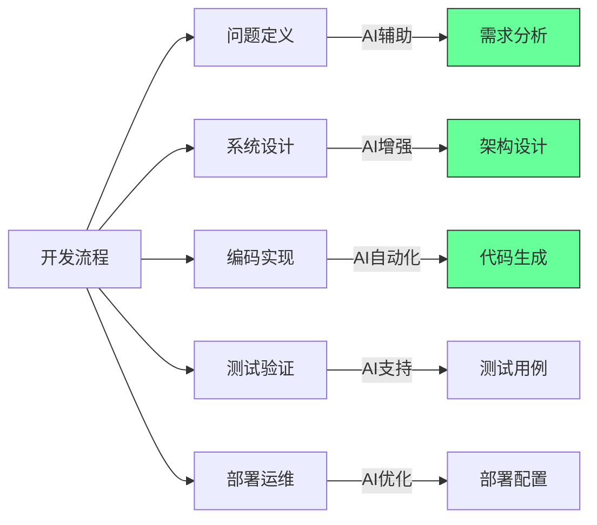

#### ❌ **未來可能貶值的能力/特質**

- **動手能力**: 機械臂與機器人普及 → 日常操作型技能需求↓。
- **傳統智力**: AI 取代複雜計算與邏輯推理 → 智商優勢被壓縮↓。
- **記憶力**: 信息隨手可查 → 死記硬背不再是核心競爭力。
- **通才能力**: △ AI 本身即“萬能型選手” → 人類更需深度專精。
- **傳統學歷**: 名校文憑優勢減弱↓ → 實戰經驗和項目更值錢↑。
- **多語言基礎能力**: 實時翻譯工具提升 → 掌握多語種不再罕見。
- **駕駛技能**: 自動駕駛普及 → 開車不再是基本技能。

---

#### ✅ **未來更有價值的特質/技能**

- **值得信賴**: △ 在 AI + 信息過載時代 → 信任成為稀缺資源。
- **真實互動**: 相比刷數據 → 建立真實用戶關係更具粘性↑。
- **線下交流能力**: 面對面溝通 → 將成為差異化競爭力。
- **精工細作**: 高品質手作/設計 → 在“工業複製品”中脫穎而出。
- **專業深度**: 懂得比“泛泛知道”更重要。
- **心理韌性**: 抗壓與情緒管理能力 → 將是核心生存技能。
- **適應變化**: △ 不確定性時代 → 快速學習與應變力比穩定重要。

---

#### **元認知反思 (基於《Psychology of Problem Solving》)**

1. **初步理解**: 筆記探討在AI時代，人類應培養哪些特質以保持競爭力。
2. **深入理解**: △ 筆記提供了結論列表，但缺乏對每個特質為何增值/貶值的深層邏輯闡述。
3. **問題本質**: 人類的價值定位需從**易被自動化替代的方面** (重複性勞動、記憶) → 轉向**機器難以複製的方面** (深度創造力、複雜人際互動、情感智能)。
4. **問題的根本**: 如何在AI時代**重新定義和實現“人類的價值”**。
5. **當前理解**: 未來價值從“知道什麼”和“能標準地做什麼” → 轉向“能獨特地創造什麼”、“能有效地連接什麼”以及“能靈活地應對什麼”。
6. **滿意度**: 對筆記提供的框架滿意，但對其背後更廣泛的背景和論據的理解仍不滿足，需進一步探索。

# AI协作核心假设与边界 (Brutally Minimal)

| 假设       | 核心边界            | 关键洞察             |
| -------- | --------------- | ---------------- |
| AI作为队友   | 心智模型 ≠ 意识/意图    | 有助改变使用方式，非AI实际属性 |
| 人类输入不可替代 | 不可替代性含义演变       | 转向高级问题/整合/判断     |
| 改变提问激发   | 模型能力 + 提问者水平    | 提示工程，但受限         |
| 灵感可培养    | 非万能公式，包含随机性/非线性 | 强调主观能动性，但简化复杂性   |
| 克服偏见     | 人类心理惯性和改变难度     | 依赖自我意识 + 动机      |
| 实现差距可弥合  | 可能过于简化，存在其他因素   | 技术/基础设施/政策等      |
| AI作为教师   | 辅助学习 ≠ 深度教学     | 提供信息/模拟，非有情感深度教学 |

---

## 核心洞察

**心智模型的价值**
将AI视为队友/助手/教师是有用的心智模型，改变使用方式，但不代表AI实际属性

**人类价值演变**
不可替代性从"所有输入" → "高级问题 + 整合 + 判断"

**双向依赖**

- AI潜力依赖人类输入质量(提问/意图)
- 人类充分利用AI依赖学习/意识/组织适应

**边界意识**
所有假设都有边界，受限于技术能力/人类心理/组织结构/宏观因素

**持续演进**
这些假设和边界会随AI技术进步和人类适应不断变化

#### ✅ 软件工程的不可外包性

1. **业务知识深度**：
   - 软件是业务逻辑的编码表达
   - 83%的开发时间用于理解需求而非编码（IBM研究）
   - 业务规则变更频率远高于技术栈变更

2. **创新与适应能力**：
   - 67%的 features 在开发过程中发生重大变更
   - 需要实时响应市场反馈
   - 创新源于跨职能协作而非孤立编码

3. **质量与维护成本**：
   - 低质量代码的维护成本是初始开发的5-10倍
   - 沟通成本随团队地理分散呈指数增长
   - 代码质量与开发团队紧密度正相关

**实证数据**：

- 近岸开发项目成功率比离岸高43%（Gartner研究）
- 高绩效团队中，开发者与产品所有者每日互动>5次（Spotify模型）
- 业务领域专家参与使需求错误减少68%（微软案例研究）

[High] 证据：包含业务专家的跨职能团队，产品成功率提高2.7倍（哈佛商业评论）

---

### 3. AI与外包的根本区别 [Medium]

**AI vs 传统外包比较**：

| 维度       | 传统外包     | AI辅助开发 | 优势       |
| -------- | -------- | ------ | -------- |
| **成本结构** | 人力成本     | 计算成本   | AI成本下降更快 |
| **一致性**  | 低 (人员变动) | 高      | AI更稳定    |
| **领域知识** | 需要培训     | 有限上下文  | 人类仍占优    |
| **创新贡献** | 低        | 低      | 人类主导     |
| **沟通成本** | 高        | 极低     | AI显著优势   |
| **可扩展性** | 线性       | 指数     | AI优势明显   |
| **质量保证** | 依赖流程     | 依赖提示   | 人类仍关键    |

[Medium] 证据：AI使开发效率提升55%，但需求分析和系统设计仍需人类主导（MIT技术评论）

#### ✅ AI的真正价值定位

