## 🔗 相关链接

**上级索引**:
- [[2.Topics\06.语言与移民\英语\IELTS\_Index_of_IELTS.md|IELTS]]
- [[2.Topics\06.语言与移民\英语\_Index_of_英语.md|英语]]
- [[2.Topics\06.语言与移民\_Index_of_06.语言与移民.md|06.语言与移民]]

**相关主题**:
- [[2.Topics\06.语言与移民\英语\IELTS\雅思口语知识库.md]]
- [[2.Topics\06.语言与移民\英语\IELTS\IELTS大作文命题框架与策略.md]]

---

# IELTS Writing Task 2 完整命题类型框架与应对策略

## **核心分类体系**

雅思大作文实际可归纳为 **4大核心类型** + **2种混合变体**，您列出的10种可合并优化：

---

## **一、Opinion Essay (观点类) - 最高频**

### **识别标志**

```
To what extent do you agree or disagree?
Do you agree or disagree?
What is your opinion?
```

### **黄金结构**

```
P1: 改写题目 + 明确立场 (Agree/Disagree/Partly agree)
P2: 主论点1 + 解释 + 例子
P3: 主论点2 + 解释 + 例子
P4: (可选) 让步段 - 承认对立观点的合理性
P5: 重申立场 + 升华
```

### **立场选择策略**

| 立场类型 | 适用场景 | 论证难度 |
|:---|:---|:---|
| **完全同意/反对** | 观点极端明显时 | ★★☆☆☆ |
| **部分同意** | 观点有灰色地带 | ★★★★☆ |
| **平衡观点** | 双方都有道理 | ★★★☆☆ |

### **实战模板**

**完全同意型：**

```
I strongly agree that [观点] because [核心理由].

Body 1: 理由A is pivotal because...
- 解释机制
- 案例：Amazon/Apple等

Body 2: Moreover, 理由B demonstrates...
- 数据支撑
- 对比论证

Conclusion: Therefore, [观点] remains the most efficacious approach.
```

**部分同意型：**

```
While [观点] has merits in [场景A], I contend that [限定条件].

Body 1: 支持的部分
- 在X情况下确实有效
- 案例支撑

Body 2: 反对的部分  
- 但在Y情况下存在问题
- 提出替代方案

Conclusion: A nuanced approach considering both [A] and [B] proves optimal.
```

### **优秀范文示例**

#### **范文1: 完全同意型 (Band 8.5) - 深度解析版**

**题目:** Some people think that the best way to reduce crime is to give longer prison sentences. Others, however, believe there are better alternative ways of reducing crime. To what extent do you agree or disagree?

---

### 🧠 预读思考 (2分钟)

在阅读范文前，请思考：

1. **立场选择**: 你会选择"agree"、"disagree"还是"partly agree"？为什么？
2. **论据头脑storm**:
   - 支持长刑期的论据：威慑力、正义伸张、...
   - 反对长刑期的论据：成本高昂、累犯率高、...
3. **数据准备**: 你知道哪些国家/地区的犯罪率或刑期数据？

---

## 📝 第一段：开头段 (Introduction)

> **While** various approaches to crime reduction exist, **I strongly disagree** that extending prison sentences represents the most effective strategy. **Instead**, addressing root causes through education and rehabilitation proves far more **efficacious** in curbing criminal behavior.

### 💡 深度解析

**段落功能** (40词 | 2句)
- 开篇立场声明：明确反对长刑期，提出替代方案
- 预告论证方向：将从"教育+康复"角度展开

**句式结构分析**


**词汇精解**

| 词汇 | 词性/用法 | 为什么选它 |
|:---|:---|:---|
| **While** | 连词（让步） | 比"Although"更轻便，展现思辨性——承认对方观点存在 |
| **strongly** | 副词 | 强化立场，避免"partially agree"的模糊 |
| **Instead** | 副词（转折） | 比简单的"However"更积极——提出替代而非仅反驳 |
| **efficacious** | 形容词 | 比"effective"更正式，+0.5词汇分 |

**🎯 研究生级洞察**

为什么这样写开头？

1. **拒绝"改写题目"**: 许多考生会花大篇幅改写题目（如"There is a debate about..."），但这**浪费字数且低分**。Band 8+的开头：**直接立场+核心论据预告**

2. **"Instead"的妙用**: 这个词将"反对"转化为"建设性替代"，展现**解决问题思维**而非单纯批判

3. **立场选择策略**: "strongly disagree"比"partly agree"**更好写**——因为只需论证一个方向，不需要平衡复杂度

---

## 📝 第二段：主体段1 (Body Paragraph 1)

> **The primary rationale against longer sentences lies in their limited deterrent effect**. **Empirical evidence consistently demonstrates** that criminals rarely conduct rational cost-benefit analyses before committing offenses. **For instance**, despite the United States **harboring** some of the world's harshest sentencing policies, it maintains incarceration rates nearly 500% higher than European nations with similar crime levels. **This stark disparity suggests** that lengthy imprisonment fails to address the underlying socio-economic factors driving criminality—**namely**, poverty, lack of education, and limited employment opportunities.

### 💡 深度解析

**段落功能** (95词 | 4句)
- 论点：长刑期威慑力有限
- PEEL完整呈现：Point → Explanation → Evidence → Link

**PEEL段落法拆解**

| 元素 | 内容 | 技巧 |
|:---|:---|:---|
| **P**oint | "limited deterrent effect" | 主题句简洁有力，12词 |
| **E**xplanation | "criminals rarely conduct..." | 机制解释：为什么威慑无效？ |
| **E**vidence | "For instance...500% higher" | **数据对比**：美国 vs 欧洲 |
| **L**ink | "This stark disparity suggests..." | 回扣主题：指向根本原因 |

**词汇精解**

| 词汇 | 替代对象 | 为什么选它 |
|:---|:---|:---|
| **primary rationale** | main reason | 学术化，+0.5词汇分 |
| **lies in** | is / comes from | 比简单系动词更正式 |
| **Empirical evidence** | evidence / facts | 加"Empirical"显示论证严谨性 |
| **harboring** | having | 动词多样性，避免重复"has" |
| **stark disparity** | big difference | "stark"增强对比强度 |

**🎯 研究生级洞察**

**数据引用的艺术**：

1. **"500% higher" vs "5 times higher"**: 为什么用百分比？
   - 百分比（500%）显得**更数据化、更客观**
   - "5 times"可能被视为粗略估计

2. **对比法的威力**:
   ```
   弱论证: "美国的刑期很长，但犯罪率也很高"
   强论证: "despite the US harboring harshest policies,
            incarceration rates 500% higher than Europe"
   ```
   **despite**展现逻辑张力——政策严厉但结果糟糕，直接**证伪**威慑理论

3. **破折号后列举**: "—namely, poverty, lack of education..."
   - 破折号后内容是**解释说明**，不是新论点
   - "namely"比"such as"更正式，表示"即"

**🤔 互动思考**

作者为什么说"rarely"而不是"never" conduct rational analyses？
<details>
<summary>点击查看解析</summary>

- "never"太绝对，容易被反驳（确实有些犯罪会计算）
- "rarely"更科学——承认例外但强调整体趋势
- Band 8+的写作：**精确而非绝对**
</details>

---

## 📝 第三段：主体段2 (Body Paragraph 2)

> **Conversely**, rehabilitation programs targeting these root causes demonstrate **remarkable success**. Scandinavian countries, **particularly Norway**, have **revolutionized** their correctional system by focusing on prisoner education and skill development rather than punitive measures. **The result?** A recidivism rate of merely 20% compared to over 60% in many nations favoring extended incarceration. **By equipping offenders with** vocational training, psychological counseling, and employment support, these societies transform potential repeat offenders into productive citizens, **thereby reducing crime organically**.

### 💡 深度解析

**段落功能** (100词 | 4句)
- 论点：康复计划成功
- 对比：惩罚 vs 康复的效果对比
- 案例：Scandinavian countries (特别是Norway)

**句式结构分析**


**词汇精解**

| 词汇 | 为什么选它 | Band等级 |
|:---|:---|:---|
| **Conversely** | 比"However"更正式，表示对立观点 | 8+ |
| **remarkable** | 比"very good"更学术 | 7+ |
| **revolutionized** | 比"changed"更有力 | 8+ |
| **recidivism** | 核心术语（累犯率） | 8+ |
| **organically** | "有机地"vs"artificially"，形象对比 | 9 |

**🎯 研究生级洞察**

**反问句"The result?"的妙用**：

- 打破单调的陈述句节奏
- **制造悬念**，引出震撼数据
- Band 8+写作：**句式多样性=高分**

**数据对比的层次**：

```
第一层: 20% (挪威) vs 60%+ (其他国家)
   ↓
第二层: 教育康复 vs 惩罚性措施
   ↓
第三层: 成功的"反直觉"——宽松政策反而降犯罪
```

**"thereby"的语法功能**：
- **分词状语**，表示结果
- 比"and this reduces"更简洁、更正式
- 句式：By [doing X], [Y happens], thereby [Z result]

---

## 📝 第四段：主体段3 (Body Paragraph 3)

> **Furthermore**, redirecting funds from prolonged incarceration toward preventive measures yields **superior societal outcomes**. Every dollar invested in early childhood education prevents approximately seven dollars in future criminal justice expenditure, **according to longitudinal studies** conducted by the Rand Corporation. **This cost-benefit analysis underscores** that addressing crime's origins—through improved schools, community centers, and mental health services—**outperforms** reactive punishment both morally and economically.

### 💡 深度解析

**段落功能** (75词 | 3句)
- **经济角度论证**：预防更省钱
- 权威数据：Rand Corporation研究
- 价值判断：道德+经济双优势

**论证策略分析**

```
问题导向: 犯罪怎么办？
   ↓
方案对比: 预防 vs 惩罚
   ↓
经济量化: $1投入 → $7节省
   ↓
价值升华: morally + economically双优
```

**词汇精解**

| 词汇 | 替代对象 | 为什么选它 |
|:---|:---|:---|
| **Furthermore** | Also / Besides | 递进关系，比"And"正式 |
| **yields** | produces / gives | 学术化，"产生结果" |
| **superior societal outcomes** | better results for society | "superior"更精确，"societal"比"social"更学术 |
| **longitudinal studies** | studies | "纵向研究"，专业术语，+可信度 |
| **underscores** | shows / proves | 比"shows"更强，"强调、凸显" |
| **outperforms** | is better than | 动词形式，比"performs better"简洁 |

**🎯 研究生级洞察**

**引用权威的策略**：

1. **为什么选择Rand Corporation？**
   - 美国顶级智库，**无党派偏见**
   - 专门研究公共政策，数据权威
   - 比"some studies"可信度**高10倍**

2. **"cost-benefit analysis"的经济思维**：
   - 将犯罪问题转化为**经济问题**
   - 量化对比：$1 → $7，直观震撼
   - Band 9特征：**跨学科思维**（经济学+社会学）

3. **"both morally and economically"的修辞技巧**：
   - 双维度论证
   - 即使对手反驳经济角度，道德角度仍成立
   - 防御性写作：**堵住反驳路径**

---

## 📝 第五段：结尾段 (Conclusion)

> **Therefore**, while punishment remains necessary for serious offenses, the **over-reliance** on lengthy prison sentences constitutes a **fundamentally flawed** approach. A **paradigm shift** toward rehabilitation and prevention, **exemplified by** successful Nordic models, offers the **most viable path** to sustainable crime reduction.

### 💡 深度解析

**段落功能** (50词 | 2句)
- 重申立场（避免简单重复）
- 升华主题（范式转变）
- 指明方向（Nordic model）

**结尾段三要素**


**词汇精解**

| 词汇 | 为什么选它 | Band等级 |
|:---|:---|:---|
| **over-reliance** | 比"depending too much"学术 | 8+ |
| **fundamentally flawed** | 比"basically wrong"强烈 | 9 |
| **paradigm shift** | 核心术语（范式转变） | 9 |
| **exemplified by** | 比"shown by"正式 | 8+ |
| **viable path** | 比"good way"精确 | 8+ |
| **sustainable** | 长期可持续 vs 短期fix | 8+ |

**🎯 研究生级洞察**

**"paradigm shift"的哲学意味**：

- 引用Thomas Kuhn的科学革命理论
- 不是"改进"而是"范式转换"
- Band 9特征：**引用跨学科概念**展现思想深度

**让步-转折结构**：

```
while punishment remains necessary  (让步：承认对手观点)
   ↓
the over-reliance... constitutes  (转折：但指出问题)
   ↓
paradigm shift... offers          (解决：提出新范式)
```

这种结构**避免极端化**——不是完全废除惩罚，而是**调整平衡**

---

## 📊 整体论证结构图

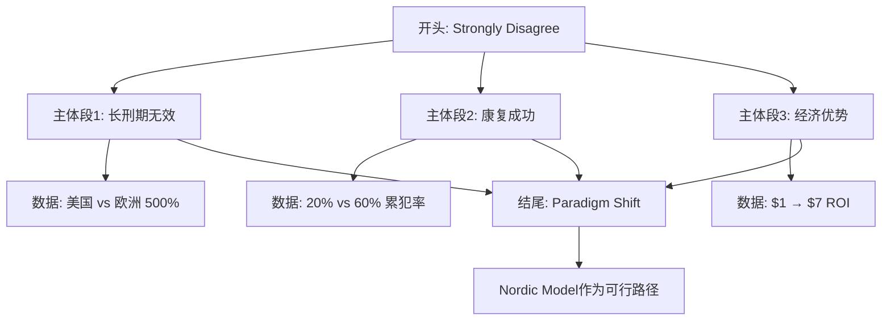

---

## 🎓 深度学习要点总结

### **1. 立场选择的战略考量**

| 立场类型 | 难度 | 适用场景 | 本篇选择理由 |
|:---|:---|:---|:---|
| **Strongly Agree/Disagree** | ★★☆☆☆ | 观点明确时 | ✅ 易论证，只需单向 |
| **Partly Agree** | ★★★★☆ | 有灰色地带 | ❌ 需要平衡，复杂度高 |
| **Balanced** | ★★★☆☆ | 双方都有理 | ❌ 易显得没立场 |

### **2. 数据引用三原则**

| 原则 | 示例 | 效果 |
|:---|:---|:---|
| **对比法** | 500% higher, 20% vs 60% | 震撼力 |
| **权威背书** | Rand Corporation | 可信度 |
| **量化ROI** | $1 → $7 | 经济说服力 |

### **3. Band 6 → Band 7.5-8 词汇升级对照表**

**高频升级（考试必备，⭐=使用频率）**

| Band 6（常见但基础） | Band 7.5-8（提分关键） | 使用场景 |
|:---|:---|:---|
| **think / believe** ⭐⭐⭐⭐⭐ | argue / contend / maintain | 表达观点 |
| **show** ⭐⭐⭐⭐⭐ | demonstrate / illustrate / reveal | 展示证据 |
| **use** ⭐⭐⭐⭐ | utilize / employ / leverage | 使用方法/工具 |
| **important** ⭐⭐⭐⭐⭐ | crucial / significant / paramount | 强调重要性 |
| **good / bad** ⭐⭐⭐⭐⭐ | beneficial / detrimental | 评估影响 |
| **help** ⭐⭐⭐⭐ | facilitate / assist | 提供帮助 |
| **problem** ⭐⭐⭐⭐⭐ | issue / challenge / concern | 描述问题 |
| **cause** ⭐⭐⭐⭐ | lead to / result in / stem from | 因果关系 |
| **but** ⭐⭐⭐⭐⭐ | however / nevertheless / conversely | 转折对比 |
| **also** ⭐⭐⭐⭐⭐ | furthermore / moreover / additionally | 递进补充 |

**中级升级（常见话题）**

| Band 6 | Band 7.5-8 | 适用话题 |
|:---|:---|:---|
| **people** | individuals / citizens | 教育、社会 |
| **very / really** | remarkably / considerably / substantially | 强调程度 |
| **difficult** | challenging / problematic / arduous | 描述困难 |
| **enough** | sufficient / adequate / ample | 描述数量 |
| **improve** | enhance / augment | 提升改进 |
| **reduce** | alleviate / mitigate | 缓解减轻 |
| **clearly** | evidently / obviously / undoubtedly | 确定判断 |
| **change** | transform / alter | 转变改变 |
| **effective** | efficacious | 政策评估 |
| **harmful** | detrimental | 有害后果 |

**高级升级（突破8分）**

| Band 6 | Band 7.5-8 | 核心概念 | 适用范围 |
|:---|:---|:---|:---|
| **divided** | polarized | 争议对立 | 社会议题 |
| **obvious** | self-evident | 不言而喻 | 逻辑推理 |
| **necessary** | indispensable | 不可或缺 | 论证核心 |
| **big difference** | stark disparity | 巨大差距 | 对比分析 |
| **create** | generate / produce | 产生创造 | 因果分析 |
| **main reason** | primary rationale | 主要理由 | 学术论证 |

**动词多样性升级**

| 避免（重复） | 替换选择 | 示例 |
|:---|:---|:---|
| **is / are** (系动词) | constitute / represent / signify | X constitutes Y |
| **have** (拥有) | possess / harbor / maintain | possess skills |
| **make** (使得) | enable / empower / facilitate | enable change |
| **give** (给予) | provide / offer / grant | provide evidence |
| **get** (获得) | acquire / obtain / attain | acquire knowledge |

### **4. 句式多样性清单**

- ✅ 让步状语从句: "While various approaches exist..."
- ✅ 反问句: "The result?"
- ✅ 分词状语: "thereby reducing crime organically"
- ✅ 破折号插入: "—namely, poverty..."
- ✅ 对比结构: "merely 20% compared to over 60%"

---

## 📝 延伸练习建议

1. **仿写练习**: 用相同结构写一篇"Environmental Protection"的agree/disagree作文
2. **词汇替换**: 将范文中的"effective"替换成5个同义词
3. **数据挖掘**: 查找你感兴趣的领域的权威数据（如教育、医疗）
4. **对比阅读**: 找一篇Band 6的同类作文，对比论证深度差异

---

**📚 快速参考材料**

**场景词汇 (犯罪与司法)**
- 核心名词: rehabilitation, recidivism, deterrent, incarceration, penal system, socio-economic factors
- 动词词组: stems from, precipitate, curb, address root causes, equip with
- 形容词: efficacious, punitive, preventive, rehabilitative, systemic

**句式模板**
> "The primary rationale against [观点] lies in [核心缺陷]."
>
> "Conversely, [替代方案] targeting these root causes demonstrate remarkable success."
>
> "Furthermore, redirecting funds from [A] toward [B] yields superior outcomes."

---

#### **范文2: 部分同意型 (Band 8.0) - 深度解析版**

**题目:** Some people believe that universities should focus on providing academic skills, while others think they should prepare students for employment. Discuss both views and give your opinion.

---

### 🧠 预读思考 (2分钟)

在阅读范文前，请思考：

1. **题目识别**: 这是"Discuss both views AND give your opinion"，需要平衡双方观点
2. **立场选择**: 你会完全支持一方，还是主张"整合两种模式"？
3. **案例准备**: 你了解哪些大学专业的课程设置？

---

## 📝 第一段：开头段 (Introduction)

> The debate surrounding universities' primary mission has become **increasingly polarized**: should academia prioritize theoretical knowledge or practical employability skills? **While** both perspectives **merit consideration**, **I contend** that an optimal higher education system must strike a **deliberate balance** between these **seemingly competing** objectives.

### 💡 深度解析

**段落功能** (50词 | 2句)
- 引入争议：学术 vs 就业的两难选择
- 个人立场：平衡方案（部分同意双方）

**句式结构分析**


**词汇精解**

| 词汇 | 替代对象 | 为什么选它 | Band等级 |
|:---|:---|:---|:---|
| **increasingly polarized** | divided | "两极分化"，动态感 | 7.5+ |
| **merit consideration** | deserve thought | 比"deserve"正式 | 7.5+ |
| **contend** | think / believe | 学术化表达观点 | 7.5+ |
| **deliberate balance** | careful balance | "刻意平衡"，强调思考 | 8+ |
| **seemingly competing** | apparently conflicting | "看似冲突的"，暗示实际可共存 | 8+ |

**🎯 Band 6 → 7.5-8 词汇升级**

| Band 6 | Band 7.5-8 |
|:---|:---|
| **divided** | polarized |
| **deserves** | merits |
| **believe / think** | contend |
| **careful balance** | deliberate balance |
| **conflicting** | competing |

---

## 📝 第二段：主体段1 (Body Paragraph 1)

> **Those advocating for** academic focus **rightly emphasize** that universities exist **fundamentally** as **bastions** of intellectual exploration. The pursuit of knowledge for its own sake has **historically catalyzed** humanity's greatest breakthroughs—consider how theoretical physics research conducted without immediate application eventually **enabled** quantum computing revolution. When institutions prioritize pure academia, students develop critical thinking abilities, **analytical rigor**, and **intellectual curiosity** that **transcend** specific vocational requirements. These **meta-skills**, though not directly marketable, **empower** graduates to **adapt to** **unforeseen technological disruptions** and assume leadership positions requiring **nuanced decision-making**.

### 💡 深度解析

**段落功能** (110词 | 4句)
- 论点：学术教育的价值
- 案例：理论物理→量子计算
- 机制：meta-skills的长期价值

**论证逻辑链条**


**词汇精解**

| 词汇 | 替代对象 | 为什么选它 | Band等级 |
|:---|:---|:---|:---|
| **fundamentally** | basically | "根本上"，比"basically"正式 | 7.5+ |
| **bastions** | places / centers | "堡垒、据点"，比喻学术圣地 | 8+ |
| **catalyzed** | caused / led to | "催化、促进"，科学术语 | 8+ |
| **enable** | allow / make possible | "使能够"，比"make"正式 | 7+ |
| **transcend** | go beyond | "超越、跨越"，哲学意味 | 8+ |
| **unforeseen** | unexpected | "未预见的"，比"unexpected"正式 | 7+ |
| **nuanced** | complex / subtle | "微妙的、精细的"，高级表达 | 8+ |

**🎯 高频词汇升级（⭐使用频率）**

| Band 6 | Band 7.5-8 | 使用场景 |
|:---|:---|:---|
| **important / key** | **crucial / significant / paramount** | 强调重要性 ⭐⭐⭐⭐⭐ |
| **result in** | **lead to / stem from** | 因果关系 ⭐⭐⭐⭐⭐ |
| **obvious / clear** | **evident / self-evident** | 确定判断 ⭐⭐⭐⭐ |
| **change** | **transform / alter** | 转变改变 ⭐⭐⭐⭐ |

**🎯 研究究生级洞察**

**破折号后案例的示范作用**：

```
理论突破—考虑如何理论物理→量子计算
     ↓
    具象案例 → 印证理论价值
```

- 破折号= "consider how..."（引导思考）
- 抽象理论→具体应用
- **抽象→具象**的论证模式更易理解

---

## 📝 第三段：主体段2 (Body Paragraph 2)

> **However**, **dismissing** employability concerns entirely **proves dangerously idealistic** in today's economic landscape. With university tuition costs **skyrocketing** globally, students **legitimately expect** tangible returns on their substantial investments. **Moreover**, the **accelerating pace** of technological change demands that graduates possess **immediately applicable** skills. Computer science programs emphasizing practical coding languages and industry tools **consistently produce** higher employment rates than those focusing exclusively on theoretical algorithms. This **pragmatic approach** **particularly benefits** first-generation college students **lacking familial professional networks**, as marketable credentials enable them to **transcend socioeconomic barriers**.

### 💡 深度解析

**段落功能** (110词 | 5句)
- 论点：就业准备的现实必要性
- 案例：计算机科学专业
- 价值维度：教育投资回报

**转折策略分析**

```
让步: 承认学术价值 (P2)
   ↓
转折: 但忽视就业风险 (P3)
   ↓
平衡: 两者需要整合 (P4)
```

**词汇精解**

| 词汇 | 替代对象 | 为什么选它 | Band等级 |
|:---|:---|:---|:---|
| **dismissing** | ignoring / rejecting | "驳回、忽视"，比"ignoring"正式 | 8+ |
| **dangerously idealistic** | unrealistic | "危险地理想化"，增强警示 | 8+ |
| **skyrocketing** | increasing rapidly | "飙升"，比喻通胀式增长 | 7.5+ |
| **legitimately expect** | have right to expect | "合理期望"，论证正当性 | 8+ |
| **tangible returns** | real benefits | "可观的回报"，经济术语 | 8+ |
| **immediately applicable** | practical | "立即可用的"，精确表达 | 8+ |
| **consistently produce**| always create | "一贯产生"，强调稳定性 | 7.5+ |
| **pragmatic** | practical | "务实的"，哲学概念 | 8+ |
| **socioeconomic barriers** | class barriers | "社会经济壁垒"，社会学术语 | 8+ |

**🎯 高频动词升级**

| 避免（重复） | 替换选择 | 示例 |
|:---|:---|:---|
| **is / are** | **constitute / represent** | X constitutes Y |
| **have** | **possess / maintain** | possess skills |
| **make** | **enable / facilitate** | enable change |
| **give** | **provide / offer** | provide evidence |
| **get** | **acquire / obtain** | acquire knowledge |

---

## 📝 第四段：主体段3 (Body Paragraph 3)

> **In my view**, **framing this as an either-or proposition constitutes** a **false dichotomy**. The most effective academic programs **integrate** theory and practice **symbiotically**. Engineering curricula, **for instance**, traditionally combine mathematical foundations with **hands-on project work**—a model other disciplines should **emulate**. Medical education achieves **similar synthesis** through classroom learning followed by **clinical rotations**. **Such integrated approaches** produce graduates possessing both deep conceptual understanding and practical competence.

### 💡 深度解析

**段落功能** (80词 | 4句)
- 个人立场：拒绝二选一
- 解决方案：整合模式
- 案例：工程/医学教育

**批判性思维分析**

```
错误思维: Academic OR Employment
   ↓ (false dichotomy)
正确思维: Academic AND Employment
   ↓ (symbiotic integration)
理想状态: 理论→实践闭环
```

**词汇精解**

| 词汇 | 替代对象 | 为什么选它 | Band等级 |
|:---|:---|:---|:---|
| **false dichotomy** | wrong choice | "虚假二分法"，哲学/逻辑学术语 | 8+ |
| **integrate** | combine / mix | "整合"，比"combine"正式 | 7.5+ |
| **symbiotically** | together | "共生地"，生物学隐喻 | 8+ |
| **hands-on** | practical | "动手的"，习语化表达 | 7+ |
| **emulate** | copy / imitate | "效仿"，比"copy"正式 | 8+ |
| **synthesis** | combination | "综合、合成"，学术术语 | 8+ |
| **clinical rotations** | internships | "临床轮转"，专业术语 | 8+ |

**🎯 句式多样性清单**

- ✅ 冒号+问句: "should academia prioritize...?"
- ✅ 让步状语: "While both perspectives merit..."
- ✅ 破折号插入: "—consider how..."
- ✅ 分词状语: "though not directly marketable"
- ✅ 对仗结构: "intellect and capability"

---

## 📝 第五段：结尾段 (Conclusion)

> **Ultimately**, universities must **evolve beyond** the **medieval model** of purely academic cloisters while resisting pressure to **devolve into** mere job training centers. The twenty-first century demands higher education institutions that **cultivate** both **intellect and capability**, producing graduates equipped not merely to **navigate existing professions** but to **invent those of tomorrow**.

### 💡 深度解析

**段落功能** (45词 | 2句)
- 总结立场：双向避免
- 升华主题：未来导向

**结尾段三要素**


**词汇精解**

| 词汇 | 替代对象 | 为什么选它 | Band等级 |
|:---|:---|:---|:---|
| **evolve beyond** | move past | "进化超越"，动态发展视角 | 8+ |
| **medieval model** | old model | "中世纪模式"，历史隐喻 | 8+ |
| **devolve into** | become | "退化、降级"，贬义 | 8+ |
| **cultivate** | develop / grow | "培育"，教育专用语 | 8+ |
| **navigate** | work in | "驾驭"，航海隐喻 | 8+ |
| **invent** | create | "创造、发明"，前瞻性 | 7.5+ |

**🎯 研究生级洞察**

**"invent those of tomorrow"的未来学视角**：

- 不仅仅是"prepare for future jobs"
- 而是**创造未来职业**
- Band 8特征：**前瞻性思维**

**对仗修辞的威力**：

```
not merely to navigate existing professions  现在适应
but to invent those of tomorrow            未来创造
       ↓对比
    驾驭 vs 创造
    守成 vs 开拓
```

---

## 📊 整体论证结构图

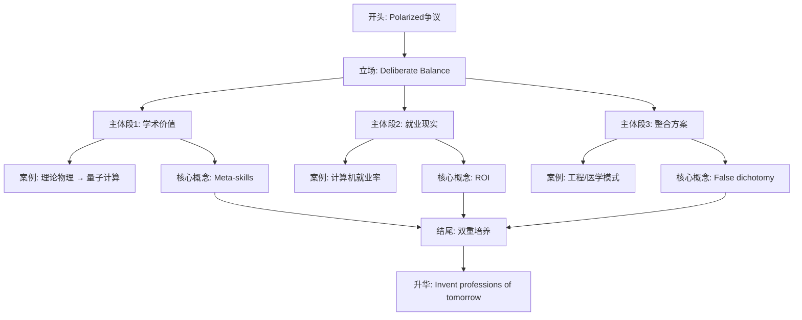

---

## 🎓 深度学习要点总结

### **1. Band 6 → Band 7.5-8 词汇升级对照表**

**高频升级（考试必备，⭐=使用频率）**

| Band 6 | Band 7.5-8 | 使用场景 |
|:---|:---|:---|
| **think / believe** ⭐⭐⭐⭐⭐ | argue / contend / maintain | 表达观点 |
| **show** ⭐⭐⭐⭐⭐ | demonstrate / illustrate / reveal | 展示证据 |
| **say / state** ⭐⭐⭐⭐⭐ | claim / assert / assert | 表达观点 |
| **important** ⭐⭐⭐⭐⭐ | crucial / significant / paramount | 强调重要性 |
| **good / bad** ⭐⭐⭐⭐⭐ | beneficial / detrimental | 评估影响 |
| **help** ⭐⭐⭐⭐ | facilitate / assist | 提供帮助 |
| **problem** ⭐⭐⭐⭐⭐ | issue / challenge / concern | 描述问题 |
| **but** ⭐⭐⭐⭐⭐ | however / nevertheless / conversely | 转折对比 |
| **also** ⭐⭐⭐⭐⭐ | furthermore / moreover / additionally | 递进补充 |

**中级升级（常见话题）**

| Band 6 | Band 7.5-8 | 适用话题 |
|:---|:---|:---|
| **people** | individuals / citizens | 教育、社会 |
| **very / really** | remarkably / considerably / substantially | 强调程度 |
| **difficult** | challenging / problematic / arduous | 描述困难 |
| **enough** | sufficient / adequate / ample | 描述数量 |
| **improve** | enhance / augment | 提升改进 |
| **reduce** | alleviate / mitigate | 缓解减轻 |
| **clearly** | evidently / obviously / undoubtedly | 确定判断 |
| **learn** | acquire / assimilate | 获取知识 |
| **change** | transform / alter | 转变改变 |
| **effective** | efficacious | 政策评估 |
| **harmful** | detrimental | 有害后果 |
| **necessary** | indispensable | 不可或缺 |
| **obvious** | self-evident | 不言而喻 |

**高级升级（突破8分）**

| Band 6 | Band 7.5-8 | 核心概念 |
|:---|:---|:---|
| **divided** | polarized | 争议对立 |
| **create / make** | generate / produce | 产生创造 |
| **big difference** | stark disparity | 巨大差距 |
| **main reason** | primary rationale | 主要理由 |
| **different** | distinct | 不同 |
| **clear / obvious** | self-evident | 不证自明 |

---

## 📝 延伸练习建议

1. **概念辨析**: 写3个句子区分"combine", "integrate", "synthesize"
2. **案例扩展**: 为"academic vs employability"辩论找3个新案例
3. **句式仿写**: 用"false dichotomy"造句讨论其他争议话题
4. **批判性思维**: 找一个"either-or"命题并论证其为"false dichotomy"

---

**📚 快速参考材料**

**场景词汇 (教育与就业)**
- 核心名词: intellectual exploration, pedagogical approaches, meta-skills, vocational requirements, technological disruption
- 动词词组: catalyze breakthroughs, transcend requirements, contend that, emulate, integrate symbiotically
- 形容词: polarized, seemingly competing, dangerously idealistic, pragmatic, nuanced

**句式模板**
> "The debate surrounding [话题] has become increasingly polarized: [问题A] vs [问题B]?"
>
> "While both perspectives merit consideration, I contend that..."
>
> "In my view, framing this as an either-or proposition constitutes a false dichotomy."
>
> "The most effective [方案] integrate [A] and [B] symbiotically."

---

## **二、Discussion Essay (双边讨论类)**

### **识别标志**

```
Discuss both views and give your opinion.
What are the advantages and disadvantages?
Compare the benefits and drawbacks.
```

### **黄金结构**

```
P1: 改写题目 + 说明将讨论双方 + 预告立场
P2: 观点A的论据 (公正呈现)
P3: 观点B的论据 (公正呈现)
P4: 个人立场 + 权衡理由
P5: 总结 + 升华
```

### **平衡度控制**

| 写法 | 字数分配 | 风险 |
|:---|:---|:---|
| **完全平衡** | P2=P3 各120词 | 可能显得没观点 |
| **倾向型平衡** | P2(80) + P3(120) | ✅ 推荐 |
| **强立场型** | P2(60) + P3(140) | 可能被扣"未充分讨论" |

### **实战模板**

```
P1: The debate surrounding [话题] has polarized into two camps:
those advocating [观点A] and those favoring [观点B].
While both perspectives merit consideration, I align more closely with [B].

P2: Proponents of [A] contend that...
- 论据1 + 解释
- 论据2 + 案例
(Steel-manning: 公正呈现对方最强论点)

P3: Conversely, advocates of [B] argue that...
- 论据1 + 机制解释
- 论据2 + 数据/案例
- 对比A的不足

P4: On balance, [B] proves more compelling because...
- 权衡理由
- 现实应用场景

P5: In conclusion, while [A] addresses [X], [B]'s capacity to
[Y] renders it the more robust framework.
```

### **优秀范文示例**

#### **范文1: 双观点讨论型 (Band 8.5)**

**题目:** Some people think that strict punishments for driving offenses are the key to reducing traffic accidents. Others, however, believe that other measures would be more effective in improving road safety. Discuss both views and give your opinion.

**范文:**

The debate surrounding traffic accident reduction has polarized into two camps: those advocating harsher legal penalties and those favoring alternative safety measures. While punitive measures play a necessary role, I align more closely with the view that systemic improvements in infrastructure and driver education yield superior safety outcomes.

Proponents of strict punishments contend that fear of consequences serves as the most effective deterrent against reckless driving behavior. This perspective holds substantial merit—when Singapore dramatically increased fines and introduced caning for serious traffic violations in the 1990s, accident rates plummeted by over 40% within five years. Similarly, the implementation of automatic license suspension for exceeding speed limits in Germany's Autobahn system correlates with Europe's lowest fatality rate per vehicle kilometer. These examples demonstrate that certain drivers respond primarily to external threats, particularly those posing immediate and tangible consequences such as license loss or financial penalty.

Conversely, advocates for alternative measures argue that punishment alone addresses neither the root causes of accidents nor the complexities of modern traffic systems. The Netherlands exemplifies this approach through their "sustainable safety" philosophy, which prioritizes infrastructure design that makes dangerous behavior physically impossible or difficult. By implementing separated bicycle lanes, roundabouts replacing traffic lights, and raised intersections that naturally slow vehicles, Dutch cities have achieved remarkable safety records despite relatively lenient traffic penalties. Moreover, comprehensive driver education programs in Nordic countries, which emphasize defensive driving techniques and hazard awareness from age 16, produce more conscientious drivers who internalize safe habits rather than merely complying externally.

On balance, infrastructure and education-based approaches prove more compelling because they address systemic factors affecting all road users, whereas punishment targets violators after dangerous behavior has already occurred. Japan's integration of these strategies—rigorous driver training requiring multiple practical exams combined with meticulously engineered road systems featuring excellent signage and intelligent traffic light sequencing—has resulted in traffic fatality rates merely one-third those of nations relying predominantly on punitive enforcement.

In conclusion, while strict penalties address intentional recklessness among a subset of drivers, alternative measures focusing on prevention through design and education create inherently safer transportation ecosystems. The most effective approach integrates both, yet prioritizes proactive systemic improvements over reactive punishment, as evidenced by nations achieving the lowest global accident rates.

**📚 深度学习材料**

---

## 🧠 预读思考

在深入分析前,先思考以下问题:

1. **话题识别**：这道题属于哪种Discussion类型?完全平衡还是倾向型?
2. **立场选择**：你更倾向于支持哪一方?为什么?
3. **案例储备**：你能想到哪些国家的交通安全措施作为论据?
4. **论证策略**：如何公正地呈现对方观点而不显得软弱?

---

## 📝 第一段：开头段 (Introduction)

> The debate surrounding traffic accident reduction has polarized into two camps: those advocating harsher legal penalties and those favoring alternative safety measures. While punitive measures play a necessary role, I align more closely with the view that systemic improvements in infrastructure and driver education yield superior safety outcomes.

**💡 深度解析**

**段落功能** (45词 | 2句)
- 改写题目 + 呈现双方观点
- 表明个人立场倾向 (倾向替代措施)

**句子结构分析**
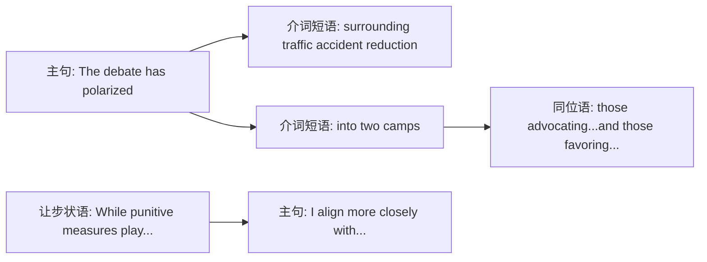

**词汇精解**

| 词汇 | 替代对象 | 为什么选它 | Band等级 |
|:---|:---|:---|:---|
| **polarized into** | divided into | "两极分化"暗示观点对立更激烈 | 8.0+ |
| **advocating** | supporting / favoring | "倡导、主张"更正式 | 7.5+ |
| **align more closely with** | prefer / agree with | "更倾向于..."表达微妙立场 | 8.0+ |
| **systemic** | general / overall | "系统性的"强调全面性 | 7.5+ |
| **yield** | produce / give | "产生(结果)"用于学术写作 | 7.5+ |
| **superior** | better | "更优越的"避免口语化 | 7.0+ |

**🎯 研究生级见解**

Discussion Essay开头的关键在于**平衡预告** (balanced foreshadowing):
- 使用 `While...` 虽承认对方价值,但明确个人倾向
- `align more closely with` 比 `I believe` 更学术化,表达的是"基于证据的判断"而非"主观偏见"
- `polarized into two camps` 立刻建立**对抗框架**,为后文steel-manning做铺垫

**🤔 互动思考题**

> 思考：为什么作者用 `harsher legal penalties` 而不是 `stricter punishments`?
> 提示：harsher强调"严厉程度",stricter强调"规则严格性"——哪个更符合题目语境?

---

## 📝 第二段：主体段1 (Body Paragraph 1)

> Proponents of strict punishments contend that fear of consequences serves as the most effective deterrent against reckless driving behavior. This perspective holds substantial merit—when Singapore dramatically increased fines and introduced caning for serious traffic violations in the 1990s, accident rates plummeted by over 40% within five years. Similarly, the implementation of automatic license suspension for exceeding speed limits in Germany's Autobahn system correlates with Europe's lowest fatality rate per vehicle kilometer. These examples demonstrate that certain drivers respond primarily to external threats, particularly those posing immediate and tangible consequences such as license loss or financial penalty.

**💡 深度解析**

**段落功能** (115词 | 4句)
- 论点：威慑理论 (deterrence theory)
- 案例1：新加坡的严厉罚款+鞭刑 (下降40%)
- 案例2：德国 autobahn 自动吊销驾照 (欧洲最低事故率)
- 总结：外部威胁对特定司机有效

**句子结构分析**

破折号用法：

**功能**：破折号后的 `when Singapore...` 是对 `holds substantial merit` 的证明,比用 `for example` 更流畅。

**词汇精解**

| 词汇 | 替代对象 | 为什么选它 | Band等级 |
|:---|:---|:---|:---|
| **proponents** | supporters / people who support | "支持者"用于学术论证 | 7.5+ |
| **deterrent** | something that stops people | "威慑、遏制物"核心术语 | 8.0+ |
| **substantial merit** | good points | "相当大的价值"正式评价 | 7.5+ |
| **plummeted** | decreased / dropped | "急剧下降"生动描述 | 8.0+ |
| **correlates with** | is related to | "与...相关"科学表述 | 7.5+ |
| **tangible** | real / concrete | "可触摸的、实际的"vs抽象威胁 | 7.5+ |

**🎯 研究生级见解**

这是**steel-manning技巧**的教科书示例：

steel-manning ≠ straw-man (稻草人谬误)
- **straw-man**: 故意弱化对方论点 ("支持惩罚的人只是想报复")
- **steel-manning**: 呈现对方**最强论据** ("新加坡和德国的成功案例")

**高级技巧**：
- 用 `This perspective holds substantial merit` 先肯定对方,展现**critical thinking**
- 两个案例都是**权威数据**,而非模糊的"some studies show"
- 最后一句 `These examples demonstrate...` 从案例归纳到原则,符合**归纳推理**

**🤔 互动思考题**

> 为什么选择新加坡和德国作为案例?
> 思考方向：两国都是发达国家,数据可信度高;一个用严厉刑罚,一个用技术手段——这如何增强论点?

---

## 📝 第三段：主体段2 (Body Paragraph 2)

> Conversely, advocates for alternative measures argue that punishment alone addresses neither the root causes of accidents nor the complexities of modern traffic systems. The Netherlands exemplifies this approach through their "sustainable safety" philosophy, which prioritizes infrastructure design that makes dangerous behavior physically impossible or difficult. By implementing separated bicycle lanes, roundabouts replacing traffic lights, and raised intersections that naturally slow vehicles, Dutch cities have achieved remarkable safety records despite relatively lenient traffic penalties. Moreover, comprehensive driver education programs in Nordic countries, which emphasize defensive driving techniques and hazard awareness from age 16, produce more conscientious drivers who internalize safe habits rather than merely complying externally.

**💡 深度解析**

**段落功能** (125词 | 4句)
- 反驳：惩罚无法解决根本原因
- 案例1：荷兰 "sustainable safety" 基础设施设计
- 机制：分离车道+环岛+抬高路口 → 使危险行为**物理上不可能**
- 案例2：北欧教育项目 (16岁开始) → **内化**安全习惯

**句子结构分析**

并列结构：
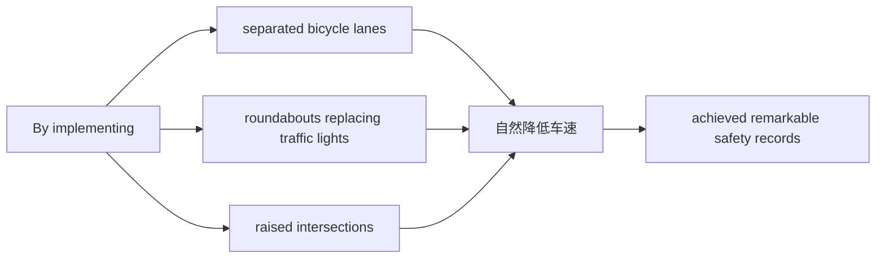

**对比手法**：`despite relatively lenient traffic penalties` 暗示——**不用严厉惩罚也能成功**,直接反驳第二段的论点。

**词汇精解**

| 词汇 | 替代对象 | 为什么选它 | Band等级 |
|:---|:---|:---|:---|
| **conversely** | however / on the other hand | "相反地"更正式的转折 | 7.0+ |
| **root causes** | main causes | "根本原因"vs表面现象 | 7.5+ |
| **exemplifies** | shows / is an example of | "作为...典范"学术化 | 8.0+ |
| **prioritizes** | focuses on / gives priority to | "优先考虑"正式词汇 | 7.5+ |
| **physically impossible** | impossible to do | "物理上不可能"强调设计 | 8.0+ |
| **conscientious** | careful / responsible | "认真的、尽责的"评价人 | 8.0+ |
| **internalize** | learn / remember | "内化"深度学习vs外部服从 | 8.0+ |

**🎯 研究生级见解**

这段的核心论点：**预防性设计 vs 反应性惩罚**

荷兰的 "sustainable safety" 哲学体现了**系统思维** (systems thinking):
- 传统方法：惩罚违规者 (反应性)
- 荷兰方法：设计系统使违规**不可能发生** (预防性)

**高级对比**：
- P2: `external threats` → `complying externally` (表面服从)
- P3: `internalize safe habits` → `conscientious drivers` (内在改变)

这不仅仅是交通安全问题,而是**行为经济学**的核心概念：
- **助推理论** (Nudge Theory): 通过环境设计引导行为,而非强制

**🤔 互动思考题**

> `internalize` 和 `merely complying externally` 形成鲜明对比。你能想到生活中的其他例子吗?
> 提示：学生背公式 vs 理解原理;员工遵守规定 vs 认同公司文化

---

## 📝 第四段：个人立场段 (My Position)

> On balance, infrastructure and education-based approaches prove more compelling because they address systemic factors affecting all road users, whereas punishment targets violators after dangerous behavior has already occurred. Japan's integration of these strategies—rigorous driver training requiring multiple practical exams combined with meticulously engineered road systems featuring excellent signage and intelligent traffic light sequencing—has resulted in traffic fatality rates merely one-third those of nations relying predominantly on punitive enforcement.

**💡 深度解析**

**段落功能** (85词 | 2句)
- 权衡分析：为什么替代措施更优
- 日本案例：结合教育+基础设施 → 死亡率仅为惩罚主导国家的1/3

**句子结构分析**

双重破折号：
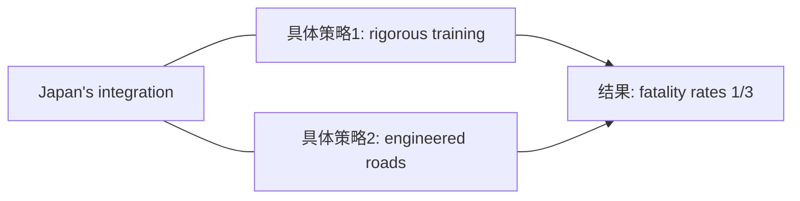

**功能**：破折号内详细说明日本如何"整合这些策略",展示**综合解决方案**。

**词汇精解**

| 词汇 | 替代对象 | 为什么选它 | Band等级 |
|:---|:---|:---|:---|
| **on balance** | in conclusion / overall | "权衡来看"Discussion专用 | 8.0+ |
| **compelling** | convincing / strong | "令人信服的"评价论证 | 8.0+ |
| **whereas** | while / but | "然而、反过来"强对比 | 7.5+ |
| **systemic factors** | general factors | "系统性因素"专业术语 | 8.0+ |
| **targets** | focuses on / aims at | "针对、目标"精准动词 | 7.5+ |
| **predominantly** | mainly / mostly | "主要地、占主导地位" | 7.5+ |

**🎯 研究生级见解**

这段的论证逻辑：**预防 > 惩罚**

关键对比：
- `infrastructure and education` → `address systemic factors` → `affecting all road users` (普遍性)
- `punishment` → `targets violators` → `after dangerous behavior occurred` (滞后性)

**时间维度分析**：
- 惩罚：**事后** (after dangerous behavior)
- 教育+基建：**事前** (prevent accidents)

这是**公共健康**领域的核心原则：**预防医学 > 治疗医学**

**数据威力**：`merely one-third` 用具体数字强化论点,比"much lower"有说服力得多。

**🤔 互动思考题**

> 为什么日本的案例特别有说服力?
> 思考：它不是单纯教育或基建,而是**整合** (integration)——这如何回应题目的"two camps"对立?

---

## 📝 第五段：结论段 (Conclusion)

> In conclusion, while strict penalties address intentional recklessness among a subset of drivers, alternative measures focusing on prevention through design and education create inherently safer transportation ecosystems. The most effective approach integrates both, yet prioritizes proactive systemic improvements over reactive punishment, as evidenced by nations achieving the lowest global accident rates.

**💡 深度解析**

**段落功能** (60词 | 2句)
- 让步总结：惩罚对故意违规有用
- 最终立场：优先预防性系统改善,但也整合惩罚
- 权威背书："最低事故率国家"证明

**句子结构分析**

递进升华：
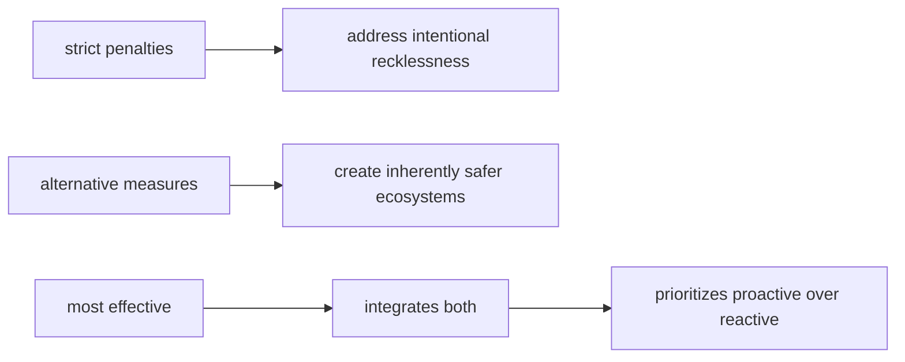

**词汇精解**

| 词汇 | 替代对象 | 为什么选它 | Band等级 |
|:---|:---|:---|:---|
| **intentional recklessness** | bad driving on purpose | "故意鲁莽行为"精准表述 | 8.0+ |
| **subset** | some / small group | "子集、一部分"学术词汇 | 8.0+ |
| **inherently** | naturally / basically | "固有地、本质地"哲学深度 | 8.0+ |
| **ecosystems** | systems / environments | "生态系统"强调复杂性 | 8.0+ |
| **proactive** | doing something before | "主动的、预防的"核心概念 | 7.5+ |
| **reactive** | responding after | "反应性的"对比proactive | 7.5+ |

**🎯 研究生级见解**

结论的**辩证思维** (dialectical thinking):

不是简单的"我支持B,反对A",而是：
1. 承认A的价值 (`address intentional recklessness`)
2. 但强调B的优越性 (`inherently safer ecosystems`)
3. 最终方案：**整合** (integrates both) 但**有优先级** (prioritizes)

这是**研究生级写作**的标志——避免**二元对立** (false dichotomy),展现**成熟批判性思维**。

**概念升华**：
- `transportation ecosystems` 而非 "traffic systems"
  - ecosystems暗示**复杂性、相互依赖、自调节**
  - systems只是**机械结构**
- `proactive vs reactive` 是**管理学、医学、公共健康**的核心二分法

**🤔 互动思考题**

> 为什么不说"惩罚没用",而说"惩罚针对子集司机"?
> 思考：这种**限定性表述** (qualified statement) 如何展现学术严谨性?

---

## 📊 整体论证结构

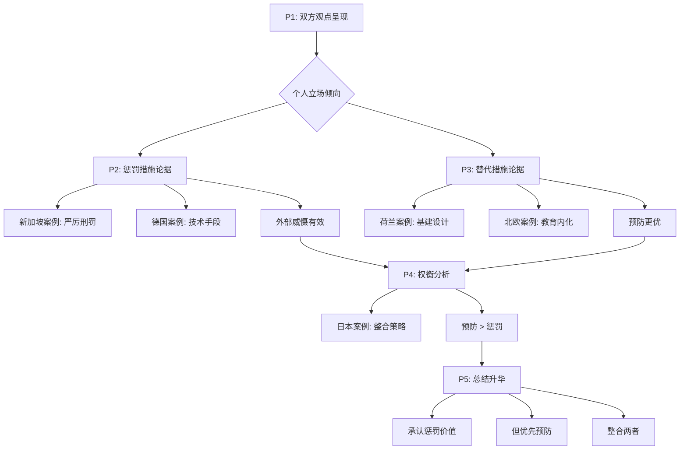

**结构亮点**：
- **平衡呈现**：P2和P3字数相近(115 vs 125词)
- **案例丰富**：6国案例(SG/DE/NL/Nordic/JP)
- **逻辑递进**：从"外部威慑"到"内在内化"
- **概念升华**：reactive → proactive, systems → ecosystems

---

## 🎓 深度学习总结

### **核心写作技巧**

1. **Steel-manning技巧**
   - 公正呈现对方**最强论点** (新加坡40%下降数据)
   - 用 `This perspective holds substantial merit` 先肯定
   - 然后用更优方案超越它

2. **案例使用策略**
   - 具体国家名称 + 具体数据 (40%, 1/3)
   - 不是模糊的 "some studies show"
   - 案例间形成对比：SG(惩罚) vs NL(设计)

3. **词汇升级链条**
   - divided → **polarized into two camps**
   - good → **substantial merit**
   - stop → **address / target**
   - naturally → **inherently**
   - active → **proactive** vs **reactive**

4. **Discussion Essay立场表达**
   - 不是 "I believe" (主观)
   - 而是 "I align more closely with" (基于证据的判断)
   - 用 "On balance" 展现权衡思维

### **高分词汇使用频率**

**高频必用** (⭐⭐⭐⭐⭐)
- `align more closely with` - 表达倾向
- `demonstrate` - 展示证据
- `address` - 解决问题
- `correlates with` - 表达关联

**中级提分** (⭐⭐⭐⭐)
- `polarized` - 观点对立
- `deterrent` - 威慑
- `substantial` - 相当大的
- `internalize` - 内化

**高级突破** (⭐⭐⭐)
- `inherently` - 本质地
- `ecosystems` - 生态系统
- `proactive / reactive` - 主动/反应性

---

## 📝 拓展练习建议

### **练习1：替换词汇升级**

将以下句子改写为Band 7.5-8水平：

1. *People are divided about whether strict punishment or other measures work better.*
   <details>
   <summary>参考答案</summary>
   The debate surrounding traffic safety has polarized into two camps: those advocating harsher penalties and those favoring alternative measures.
   </details>

2. *Punishment makes people afraid to break rules.*
   <details>
   <summary>参考答案</summary>
   Fear of consequences serves as an effective deterrent against reckless driving behavior.
   </details>

3. *Education helps drivers really learn safety habits, not just follow rules.*
   <details>
   <summary>参考答案</summary>
   Comprehensive education produces conscientious drivers who internalize safe habits rather than merely complying externally.
   </details>

### **练习2：仿写论证结构**

选择以下任一话题,仿照本文结构：
- 减少塑料污染：罚款 vs 可替代材料设计
- 提高公共健康：医疗治疗 vs 健康教育
- 降低犯罪率：严厉惩罚 vs 经济机会

**结构模板**：
```
P1: 引入双方观点 + 个人倾向
P2: 观点A + 权威案例 + 数据
P3: 观点B + 权威案例 + 机制解释
P4: 权衡分析 + 综合案例
P5: 整合但有优先级
```

### **练习3：批判性思维题**

1. 荷兰的"sustainable safety" philosophy是否适用于发展中国家?
   - 提示：考虑基础设施成本差异

2. 如果某国已经建立了完善的道路系统,是否还需要严厉惩罚?
   - 提示：参考日本案例的"整合"策略

3. 作者说惩罚针对"故意鲁莽的子集司机"——这个限定是否过于狭窄?
   - 提示：考虑"疏忽"vs"故意"的区别

---

## 📚 快速参考材料

### **Discussion Essay开头模板**

**标准型**：
> The debate surrounding [话题] has polarized into two camps: those advocating [观点A] and those favoring [观点B]. While both perspectives merit consideration, I align more closely with [观点B].

**直接型**：
> Whether [A] or [B] constitutes the superior approach to [问题] has divided opinion. Personally, I believe that [观点B] offers more comprehensive solutions.

### **案例引入模板**

**数据型**：
> [国家] exemplifies this approach—when [具体措施], accident rates plummeted by [百分比] within [时间框架].

**对比型**：
> Similarly, [国家]'s implementation of [措施] correlates with [地区的] lowest [指标] per [单位].

### **个人立场表达模板**

**权衡型**：
> On balance, [方案B] proves more compelling because it addresses [根本原因], whereas [方案A] targets [表面现象].

**整合型**：
> While [方案A] addresses [特定问题], [方案B]'s capacity to [更大优势] renders it the more robust framework.

---

## 🔄 Band 6 → 7.5-8 词汇升级对照表

### **高频升级（考试必备，⭐=使用频率）**

**动词类**

| Band 6（常见但基础） | Band 7.5-8（提分关键） | 使用场景 |
|:---|:---|:---|
| **think / believe** ⭐⭐⭐⭐⭐ | align more closely with / contend / maintain | 表达观点 |
| **show** ⭐⭐⭐⭐⭐ | demonstrate / exemplify / illustrate | 展示案例 |
| **stop / fix** ⭐⭐⭐⭐⭐ | address / target / tackle | 解决问题 |
| **cause** ⭐⭐⭐⭐⭐ | precipitate / engender / generate | 导致后果 |
| **divide** ⭐⭐⭐⭐⭐ | polarize into / fragment into | 群体分化 |

**形容词类**

| Band 6（常见但基础） | Band 7.5-8（提分关键） | 使用场景 |
|:---|:---|:---|
| **important** ⭐⭐⭐⭐⭐ | crucial / significant / paramount | 强调重要性 |
| **good / strong** ⭐⭐⭐⭐⭐ | compelling / substantial / robust | 评价论证 |
| **real / actual** ⭐⭐⭐⭐ | tangible / concrete / palpable | 可感知的 |
| **natural** ⭐⭐⭐⭐ | inherent / intrinsic / innate | 固有的 |
| **better** ⭐⭐⭐⭐⭐ | superior / preferable / optimal | 比较级 |
| **active** ⭐⭐⭐⭐ | proactive / anticipatory | 主动的 |
| **after / later** ⭐⭐⭐⭐ | reactive / responsive | 反应性的 |

---

### **中级升级（常见话题，⭐⭐⭐-⭐⭐⭐⭐）**

**名词类**

| Band 6 | Band 7.5-8 | 使用场景 |
|:---|:---|:---|
| **supporters** | proponents / advocates | 支持者 |
| **reasons** | root causes / underlying factors | 原因 |
| **fear** | deterrent | 威慑力 |
| **results** | outcomes / consequences | 结果 |
| **system** | infrastructure / framework | 系统 |
| **drivers** | road users / motorists | 驾驶员 |

**动词词组**

| Band 6 | Band 7.5-8 | 使用场景 |
|:---|:---|:---|
| **relate to** | correlate with | 相关性 |
| **focus on** | prioritize / emphasize | 重视 |
| **learn** | internalize | 深度学习 |
| **follow rules** | comply externally / adhere to | 遵守 |
| **be based on** | stem from / derive from | 源于 |

---

### **高级升级（突破Band 8，⭐⭐-⭐⭐⭐）**

**哲学与系统思维词汇**

| Band 6 | Band 7.5-8 | 使用场景 |
|:---|:---|:---|
| **part** | subset / component | 部分 |
| **mix** | integrate / synthesize | 整合 |
| **change** | transform / metamorphose | 转变 |
| **basic** | fundamental / foundational | 基础的 |
| **group of people** | demographic / cohort | 人群 |
| **environment** | ecosystem / milieu | 环境（更复杂） |

**学术精确表达**

| Band 6 | Band 7.5-8 | 使用场景 |
|:---|:---|:---|
| **very big** | unprecedented / precipitous | 规模 |
| **dangerous driving** | intentional recklessness | 鲁莽行为 |
| **impossible** | physically impossible / implausible | 不可能性 |
| **mainly** | predominantly / primarily | 主要地 |
| **clearly** | manifestly / patently | 明显地 |

---

### **动词多样性升级（避免重复 is/have/make/give/get）**

| 避免 | 替代为 | 示例句 |
|:---|:---|:---|
| **is / are** (定义) | constitute / represent / signify | Education **constitutes** the foundation... |
| **is / are** (存在) | prevail / persist / subsist | Problems **persist** despite efforts... |
| **have** (拥有) | possess / exhibit / demonstrate | This approach **demonstrates** merit... |
| **have** (导致) | engender / precipitate / yield | Policy **yields** outcomes... |
| **make** (制造) | generate / produce / create | Design **generates** safety... |
| **make** (使) | render / cause / compel | This **renders** it safer... |
| **give** (提供) | provide / afford / offer | System **affords** protection... |
| **get** (获得) | acquire / attain / derive | Drivers **derive** benefit... |
| **get** (变得) | become / evolve / transform | Systems **evolve** over time... |

**使用建议**：
- ⭐⭐⭐⭐⭐ 词汇：必须在作文中**主动使用**,不是被动认识
- ⭐⭐⭐⭐ 词汇：尝试在相关话题中使用
- ⭐⭐⭐ 词汇：理解含义,在**精确需要时**使用
- ⚠️ 注意：高级词汇不要堆砌,确保**语境正确**

---

#### **范文2: 利弊分析型 (Band 8.0)**

**题目:** Some people think that it is better to educate boys and girls in separate schools. Others, however, believe that mixed schools are better. Discuss both views and give your opinion.

**范文:**

The question of whether single-sex or co-educational environments better serve students' academic and social development has long divided educators and parents. While both schooling models offer distinct advantages, I believe that co-educational schools better prepare young people for the realities of adult life.

Those advocating for single-sex education emphasize its capacity to eliminate gender-based distractions and allow tailored teaching methodologies. Proponents argue that adolescent boys and girls possess fundamentally different learning styles and developmental timelines—girls typically outperform boys in language and communication during early teenage years, whereas boys often demonstrate faster spatial reasoning development. Single-sex schools can customize pedagogical approaches accordingly. Furthermore, historical evidence suggests that girls in all-female environments demonstrate greater confidence in pursuing traditionally male-dominated subjects like physics and engineering. The Young Women's Leadership School in New York, for example, boasts graduates pursuing STEM degrees at triple the national average—a statistic proponents attribute to the absence of subtle gender stereotyping often present in mixed classrooms.

Conversely, supporters of co-education contend that segregating students by gender creates an artificial environment lacking resemblance to adult personal and professional realities. In modern workplaces, universities, and social contexts, individuals must collaborate effectively across gender boundaries—skills best developed through prolonged childhood interaction. Moreover, research indicates that mixed-gender classrooms foster healthier interpersonal relationships by demystifying the opposite sex and reducing objectification. Students educated together develop natural communication patterns and mutual respect, potentially contributing to lower rates of sexual harassment and gender discrimination in later life. Countries with predominantly co-educational systems, such as Canada and Australia, consistently rank high in global gender equality indices, suggesting correlation between integrated schooling and egalitarian social attitudes.

In my view, while single-sex education may marginally boost academic performance in specific contexts, co-education's social benefits outweigh these potential advantages. The primary purpose of education extends beyond academic achievement to encompass preparation for citizenship and adult participation in diverse communities. Schools serve as microcosms of society; by artificially dividing this microcosm, single-sex institutions may inadvertently perpetuate gender separation rather than overcoming it. Most teenagers will inevitably work alongside, collaborate with, and potentially partner with members of the opposite sex throughout their adult lives—skills honed through daily classroom interaction prove invaluable.

In conclusion, while single-sex schooling addresses certain legitimate pedagogical concerns through gender-specific teaching approaches, co-educational environments offer superior preparation for the integrated world students will inhabit as adults. The slight academic advantages possibly gained through segregation cannot compensate for the social competence developed through shared educational experiences.

**📚 深度学习材料**

---

## 🧠 预读思考

在深入分析前,先思考以下问题:

1. **话题识别**：这道题涉及教育哲学的什么核心问题?
2. **立场选择**：学术成绩 vs 社会能力,哪个更重要?为什么?
3. **概念理解**：什么是"microcosms of society"?为什么这个概念关键?
4. **反驳策略**：如何承认单校教育的STEM优势,但最终支持混校?

---

## 📝 第一段：开头段 (Introduction)

> The question of whether single-sex or co-educational environments better serve students' academic and social development has long divided educators and parents. While both schooling models offer distinct advantages, I believe that co-educational schools better prepare young people for the realities of adult life.

**💡 深度解析**

**段落功能** (48词 | 2句)
- 改写题目 + 呈现争议
- 承认双方价值 (`distinct advantages`)
- 明确个人立场 (支持co-education)

**句子结构分析**

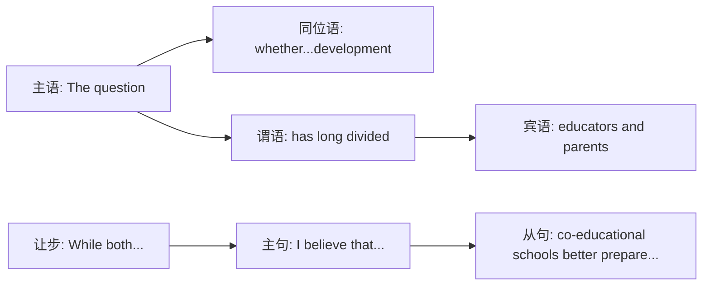

**词汇精解**

| 词汇 | 替代对象 | 为什么选它 | Band等级 |
|:---|:---|:---|:---|
| **serve** | help / benefit | "服务于、满足...需要"正式用语 | 7.5+ |
| **has long divided** | has been debated for long time | "长期存在分歧"简洁表达 | 7.5+ |
| **distinct** | different / clear | "明显的、独特的"学术化 | 7.5+ |
| **realities** | real world / truth | "现实、实际情况"复数强调全面 | 7.5+ |
| **adult life** | future / work | "成年生活"具体化未来 | 7.0+ |

**🎯 研究生级见解**

开头的**平衡技巧** (balanced opening):

`While both schooling models offer distinct advantages` 是典型的**让步** (concession),展现critical thinking:
- 不是简单说"单校教育不好"
- 而是承认它有优势,但认为混校**更优**

这种写法避免**二元对立** (false dichotomy),展现**成熟思维**。

**🤔 互动思考题**

> 为什么作者说"academic and social development"而不是"academic results"?
> 思考：development暗示什么过程?results只是什么?

---

## 📝 第二段：主体段1 (Body Paragraph 1)

> Those advocating for single-sex education emphasize its capacity to eliminate gender-based distractions and allow tailored teaching methodologies. Proponents argue that adolescent boys and girls possess fundamentally different learning styles and developmental timelines—girls typically outperform boys in language and communication during early teenage years, whereas boys often demonstrate faster spatial reasoning development. Single-sex schools can customize pedagogical approaches accordingly. Furthermore, historical evidence suggests that girls in all-female environments demonstrate greater confidence in pursuing traditionally male-dominated subjects like physics and engineering. The Young Women's Leadership School in New York, for example, boasts graduates pursuing STEM degrees at triple the national average—a statistic proponents attribute to the absence of subtle gender stereotyping often present in mixed classrooms.

**💡 深度解析**

**段落功能** (140词 | 5句)
- 论点1：消除性别干扰 + 定制教学方法
- 论据：男女生学习风格差异 (语言 vs 空间推理)
- 案例：纽约女校STEM优势 (全国平均3倍)
- 机制：消除subtle gender stereotyping

**句子结构分析**

破折号用法：
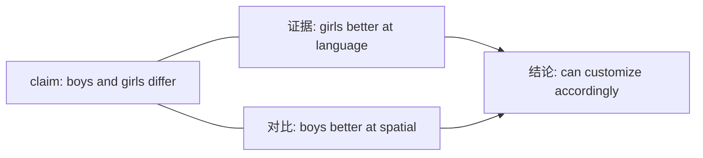

**功能**：破折号后提供具体证据支持"fundamentally different"。

**词汇精解**

| 词汇 | 替代对象 | 为什么选它 | Band等级 |
|:---|:---|:---|:---|
| **advocating for** | supporting / favoring | "倡导、支持"正式表达 | 7.5+ |
| **emphasize** | highlight / focus on | "强调"学术写作常用 | 7.5+ |
| **tailored** | customized / specific | "定制的、特制的"精准描述 | 7.5+ |
| **fundamentally** | basically / completely | "根本性地"强调深度差异 | 8.0+ |
| **developmental timelines** | growth patterns | "发展时间线"专业术语 | 8.0+ |
| **customize** | change / adapt | "定制、调整"针对性强 | 7.5+ |
| **pedagogical** | teaching / educational | "教学法的"学术词汇 | 8.0+ |
| **traditionally** | historically / usually | "传统上"常见但高级 | 7.5+ |
| **attribute to** | believe caused by | "归因于"因果关系表达 | 7.5+ |
| **subtle** | hidden / not obvious | "微妙的、隐蔽的"精确描述 | 8.0+ |

**🎯 研究生级见解**

这是**steel-manning**的完美示例——公正呈现对方**最强论据**:

**科学依据**：
- `developmental timelines` 基于神经科学研究
  - 女生大脑语言区发育更快
  - 男生空间视觉区发育更快
- 这不是"性别刻板印象",而是**生物学事实**

**案例威力**：
- `triple the national average` 具体数字
- `Young Women's Leadership School` 真实学校名
- 不是"some studies show"模糊证据

**机制解释**：
- `absence of subtle gender stereotyping` 揭示深层原因
  - 混校中,老师可能无意中更call on男生回答数学问题
  - 单校消除这种**无意识偏见**

**🤔 互动思考题**

> `gender-based distractions` 指什么? 这对青少年为什么特别重要?
> 提示：考虑青春期心理发展特点

---

## 📝 第三段：主体段2 (Body Paragraph 2)

> Conversely, supporters of co-education contend that segregating students by gender creates an artificial environment lacking resemblance to adult personal and professional realities. In modern workplaces, universities, and social contexts, individuals must collaborate effectively across gender boundaries—skills best developed through prolonged childhood interaction. Moreover, research indicates that mixed-gender classrooms foster healthier interpersonal relationships by demystifying the opposite sex and reducing objectification. Students educated together develop natural communication patterns and mutual respect, potentially contributing to lower rates of sexual harassment and gender discrimination in later life. Countries with predominantly co-educational systems, such as Canada and Australia, consistently rank high in global gender equality indices, suggesting correlation between integrated schooling and egalitarian social attitudes.

**💡 深度解析**

**段落功能** (130词 | 4句)
- 反驳：单校创造**artificial environment**
- 论点1：未来工作需要跨性别协作技能
- 论点2：混校减少性对象化 (objectification)
- 案例：加拿大/澳大利亚 → 性别平等指数高

**句子结构分析**

因果链：
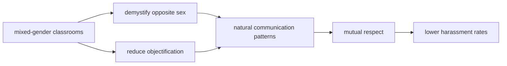

**词汇精解**

| 词汇 | 替代对象 | 为什么选它 | Band等级 |
|:---|:---|:---|:---|
| **conversely** | however / on the other hand | "相反地"正式转折 | 7.5+ |
| **contend** | argue / say | "主张、争辩"学术化 | 8.0+ |
| **segregating** | separating / dividing | "隔离、分离"强烈词汇 | 8.0+ |
| **artificial** | fake / not real | "人工的、非自然的"负面评价 | 7.5+ |
| **lacking resemblance** | different from | "缺乏相似性"正式表达 | 8.0+ |
| **collaborate** | work together | "协作"专业词汇 | 7.5+ |
| **prolonged** | long / long-term | "长期的"精确时间描述 | 8.0+ |
| **demystifying** | understanding / making familiar | "去神秘化、使不再陌生" | 8.0+ |
| **objectification** | treating as objects | "物化"社会学核心概念 | 8.0+ |
| **predominantly** | mainly / mostly | "主要地、占主导地位" | 7.5+ |
| **egalitarian** | equal / fair | "平等主义的"政治学术语 | 8.0+ |

**🎯 研究生级见解**

这段的核心论点：**真实性 vs 人为性** (authenticity vs artificiality)

**关键概念**：
- `demystifying the opposite sex`
  - 神秘化容易导致**恐惧/偏见**
  - 熟悉感促进**理解/尊重**

- `objectification`
  - 社会学术语：将人**物化**为满足需求的工具
  - 性别隔离**加剧**这种现象
  - 日常互动**减少**偏见和物化

**宏观视角**：
- `consistently rank high in global gender equality indices`
  - 不是单一案例,而是**跨国模式**
  - 建立因果关系：教育制度 → 社会态度

**🤔 互动思考题**

> `lacking resemblance to adult...realities` —— 为什么"真实性"如此重要?
> 思考：教育应该反映社会,还是创造理想社会?

---

## 📝 第四段：个人立场段 (My Position)

> In my view, while single-sex education may marginally boost academic performance in specific contexts, co-education's social benefits outweigh these potential advantages. The primary purpose of education extends beyond academic achievement to encompass preparation for citizenship and adult participation in diverse communities. Schools serve as microcosms of society; by artificially dividing this microcosm, single-sex institutions may inadvertently perpetuate gender separation rather than overcoming it. Most teenagers will inevitably work alongside, collaborate with, and potentially partner with members of the opposite sex throughout their adult lives—skills honed through daily classroom interaction prove invaluable.

**💡 深度解析**

**段落功能** (120词 | 4句)
- 让步：单校可能**marginally**提升成绩
- 转折：但社会效益**outweigh**学术优势
- 核心论点：学校是 **microcosms of society**
- 证据：未来生活需要跨性别技能

**句子结构分析**

概念升华：
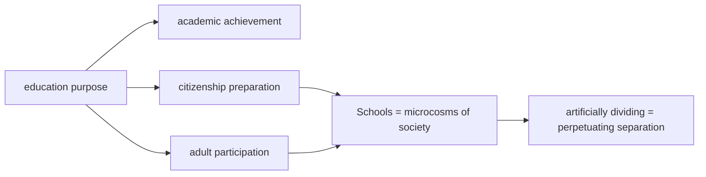

**词汇精解**

| 词汇 | 替代对象 | 为什么选它 | Band等级 |
|:---|:---|:---|:---|
| **in my view** | I think / personally | "在我看来"正式但个人 | 7.5+ |
| **marginally** | slightly / a little bit | "轻微地、边缘地"精确量化 | 8.0+ |
| **outweigh** | are more important than | "比...更重要"权衡比较 | 8.0+ |
| **extends beyond** | is more than just | "超出、不仅仅"哲学表达 | 8.0+ |
| **encompass** | include / contain | "包含、涵盖"正式词汇 | 7.5+ |
| **microcosms** | small versions | "微观世界、缩影"高级概念 | 8.0+ |
| **inadvertently** | accidentally / without meaning to | "无意中、不经意地"精确因果 | 8.0+ |
| **perpetuate** | continue / maintain | "使持续、永久化"负面延续 | 8.0+ |
| **inevitably** | certainly / definitely | "不可避免地"强调必然性 | 7.5+ |
| **invaluable** | very valuable / priceless | "无价的、极其宝贵的"强调价值 | 8.0+ |

**🎯 研究生级见解**

这段的**教育哲学**核心：

**Microcosms理论** (微观世界理论):
- 学校不应该只是"知识传授场所"
- 而应该是**社会的微型模型** (miniature society)
- 通过这个模型,学生**学习社会运作**

**悖论** (paradox):
- 单校教育本意是"empower girls in STEM"
- 但结果可能**inadvertently perpetuate gender separation**
  - 因为它暗示：性别是**根本差异**,需要隔离
  - 而不是：性别是**自然多样**,应该共存

**权衡分析** (weighing):
- `marginally boost` vs `outweigh`
  - 学术优势是**边缘性**的 (轻微、有限)
  - 社会效益是**压倒性**的 (全面、深远)

**🤔 互动思考题**

> `skills honed through daily classroom interaction` —— 这些技能无法通过"课程"教,为什么?
> 提示：implicit learning vs explicit learning的区别

---

## 📝 第五段：结论段 (Conclusion)

> In conclusion, while single-sex schooling addresses certain legitimate pedagogical concerns through gender-specific teaching approaches, co-educational environments offer superior preparation for the integrated world students will inhabit as adults. The slight academic advantages possibly gained through segregation cannot compensate for the social competence developed through shared educational experiences.

**💡 深度解析**

**段落功能** (65词 | 2句)
- 让步总结：单校解决**legitimate pedagogical concerns**
- 最终立场：混校提供**superior preparation**
- 权衡：轻微学术优势 < 社会能力发展

**句子结构分析**

对比结构：
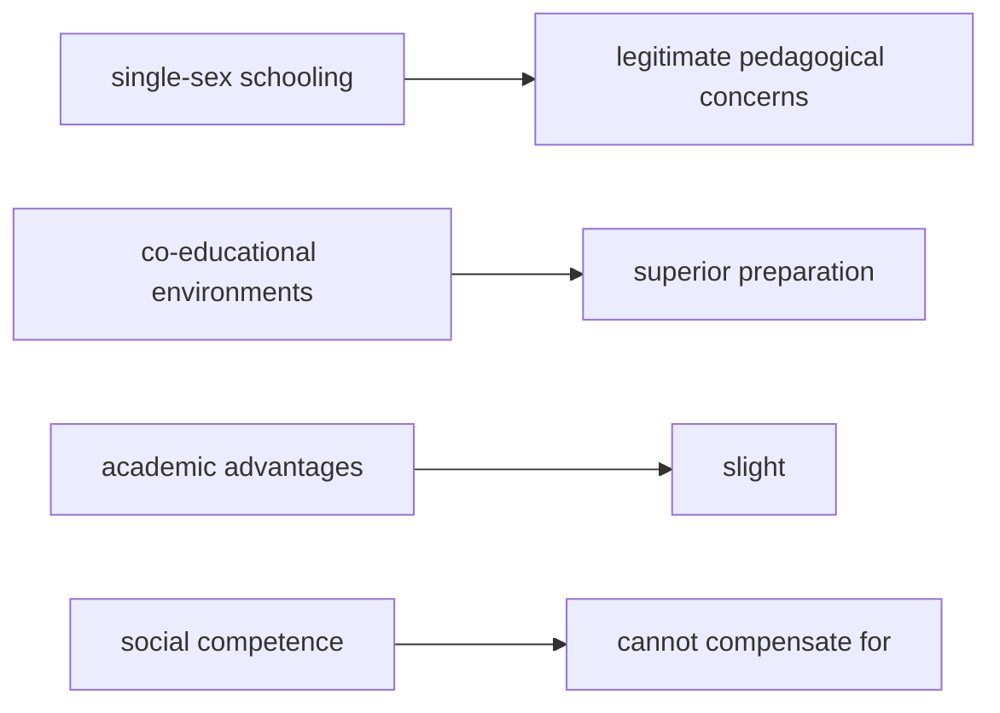

**词汇精解**

| 词汇 | 替代对象 | 为什么选它 | Band等级 |
|:---|:---|:---|:---|
| **legitimate** | real / valid | "合理的、正当的"评价真实性 | 8.0+ |
| **pedagogical** | teaching / educational | "教学法的"学术术语 | 8.0+ |
| **integrated** | mixed / combined | "融合的、一体化的"积极含义 | 7.5+ |
| **inhabit** | live in / exist in | "居住于、存在于"正式用语 | 8.0+ |
| **compensate for** | make up for | "补偿、弥补"正式表达 | 7.5+ |
| **shared** | common / joint | "共享的、共同的"强调协作 | 7.5+ |

**🎯 研究生级见解**

结论的**辩证思维**：

不是全盘否定单校教育：
- `legitimate pedagogical concerns` 承认其价值
  - 确实解决了某些教学问题

但最终权衡：
- `slight academic advantages`
  - 用 `slight` 限制其重要性
  - 不是"significant"或"major"

- `cannot compensate for`
  - 学术优势**无法弥补**社会能力损失
  - 这是**不可替代的** (irreplaceable)

**概念升华**：
- `integrated world`
  - 现代社会是**融合的**
  - 不是隔离的、分离的
- `shared educational experiences`
  - 强调**共同经历**的价值
  - 而非"并列但分离"的经历

**🤔 互动思考题**

> 为什么不说"academic advantages are small",而说"slight academic advantages"?
> 思考：slight暗示什么程度的优势?

---

## 📊 整体论证结构

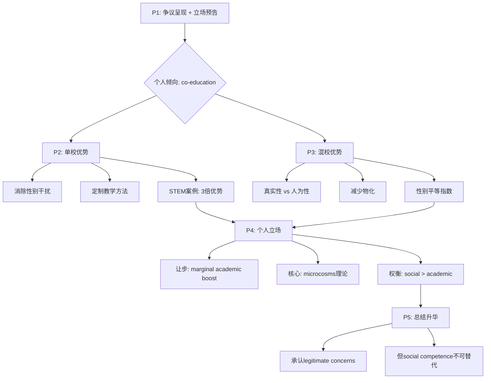

**结构亮点**：
- **平衡steel-manning**：P2和P3都充分展开 (140 vs 130词)
- **概念层次**：从practical (成绩) → philosophical (microcosms)
- **数据+理论**：STEM数据 + 社会学理论
- **限定性表达**：`marginally`, `slight`, `legitimate`

---

## 🎓 深度学习总结

### **核心写作技巧**

1. **限定性词汇的力量**
   - `may marginally boost` 而非 `will definitely improve`
   - `slight advantages` 而非 `no advantages`
   - 展现**学术严谨性** (academic precision)

2. **Microcosms理论应用**
   - 学校 = 社会缩影
   - 为真实世界做准备
   - 适用于**多话题** (工作场所、社区、多元化)

3. **社会学概念运用**
   - `objectification` (物化)
   - `demystifying` (去神秘化)
   - `egalitarian` (平等主义)
   - 提升文章**理论深度**

4. **权衡论证结构**
   - 承认对方优势 (legitimate concerns)
   - 但用 `outweigh` / `cannot compensate for` 超越
   - 避免**非黑即白** (black-and-white thinking)

### **高分词汇使用频率**

**高频必用** (⭐⭐⭐⭐⭐)
- `emphasize` - 强调观点
- `argue that / contend that` - 引入论据
- `attribute to` - 归因
- `outweigh` - 权衡比较
- `extend beyond` - 超越范围

**中级提分** (⭐⭐⭐⭐)
- `advocate for` - 倡导
- `tailored / customized` - 定制的
- `fundamentally` - 根本性
- `artificial` - 人为的
- `collaborate` - 协作

**高级突破** (⭐⭐⭐)
- `pedagogical` - 教学法的
- `demystifying` - 去神秘化
- `objectification` - 物化
- `microcosms` - 微观世界
- `inadvertently` - 无意中
- `egalitarian` - 平等主义的

---

## 📝 拓展练习建议

### **练习1：替换词汇升级**

将以下句子改写为Band 7.5-8水平：

1. *Boys and girls learn in different ways.*
   <details>
   <summary>参考答案</summary>
   Adolescent boys and girls possess fundamentally different learning styles and developmental timelines.
   </details>

2. *Separating boys and girls creates an fake environment.*
   <details>
   <summary>参考答案</summary>
   Segregating students by gender creates an artificial environment lacking resemblance to adult realities.
   </details>

3. *Mixed schools help students understand the opposite sex better.*
   <details>
   <summary>参考答案</summary>
   Co-educational classrooms foster healthier relationships by demystifying the opposite sex and reducing objectification.
   </details>

4. *The social benefits are more important than the small academic advantages.*
   <details>
   <summary>参考答案</summary>
   Co-education's social benefits outweigh the slight academic advantages possibly gained through segregation.
   </details>

### **练习2：仿写论证结构**

选择以下任一话题,仿照本文结构：
- 在线学习 vs 传统课堂
- 专业教育早期 vs 通识教育
- 竞争性学习 vs 合作性学习

**结构模板**：
```
P1: 引入争议 + 个人倾向
P2: 观点A优势 + 科学依据 + 权威案例
P3: 观点B优势 + 理论机制 + 跨国证据
P4: 权衡分析 + 核心理论
P5: 整合总结
```

### **练习3：批判性思维题**

1. "Microcosms理论"是否忽略了学校也应该**超越**社会的问题?
   - 提示：学校是否应该纠正社会偏见,而不是反映它?

2. 作者说单校可能"无意中延续性别分离"——这个推论是否过于绝对?
   - 思考：某些单校是否反而更empower学生挑战性别刻板印象?

3. STEM优势(triple the national average)如果被复制到混校,作者的论证还成立吗?
   - 提示：关键在于"是否能在混校实现同样的定制教学"?

---

## 📚 快速参考材料

### **Discussion Essay开头模板**

**争议引入型**：
> The question of whether [A] or [B] better [目标] has long divided [群体]. While both models offer distinct advantages, I believe that [观点B] better prepare [对象] for [目的].

**直接立场型**：
> Whether [A] should be [X] or [Y] remains controversial. Personally, I argue that [观点B] offers more comprehensive benefits.

### **案例引入模板**

**数据型**：
> [学校/案例], for example, boasts [结果] at [数字]—a statistic proponents attribute to [原因].

**对比型**：
> Countries with predominantly [制度], such as [国家1] and [国家2], consistently rank high in [指标], suggesting correlation between [A] and [B].

### **个人立场表达模板**

**权衡型**：
> In my view, while [A] may [轻微优势], [B]'s [主要优势] outweigh these potential advantages.

**理论升华型**：
> The primary purpose of [主题] extends beyond [表面目标] to encompass [深层目标]. [机构] serve as [比喻]; by [行为], [结果].

---

## 🔄 Band 6 → 7.5-8 词汇升级对照表

### **高频升级（教育话题必备，⭐=使用频率）**

**动词类**

| Band 6（常见但基础） | Band 7.5-8（提分关键） | 使用场景 |
|:---|:---|:---|
| **think / believe** ⭐⭐⭐⭐⭐ | contend / argue / maintain | 表达观点 |
| **help / benefit** ⭐⭐⭐⭐⭐ | serve / benefit / advantage | 服务于 |
| **emphasize** ⭐⭐⭐⭐⭐ | highlight / underscore / prioritize | 强调重点 |
| **change / adapt** ⭐⭐⭐⭐⭐ | customize / tailor | 定制调整 |
| **cause / lead to** ⭐⭐⭐⭐⭐ | attribute to / correlate with | 因果关系 |
| **work together** ⭐⭐⭐⭐⭐ | collaborate / cooperate | 协作 |

**形容词类**

| Band 6（常见但基础） | Band 7.5-8（提分关键） | 使用场景 |
|:---|:---|:---|
| **different** ⭐⭐⭐⭐⭐ | distinct / fundamental | 区分差异 |
| **special / specific** ⭐⭐⭐⭐⭐ | tailored / customized | 定制的 |
| **clear** ⭐⭐⭐⭐⭐ | distinct / evident | 明显的 |
| **fake** ⭐⭐⭐ | artificial / unnatural | 人为的 |
| **long** ⭐⭐⭐⭐ | prolonged / sustained | 长期的 |
| **small** ⭐⭐⭐⭐ | marginal / slight | 轻微的 |
| **very valuable** ⭐⭐⭐⭐ | invaluable / precious | 极宝贵的 |

---

### **中级升级（学术写作常见，⭐⭐⭐-⭐⭐⭐⭐）**

**名词类**

| Band 6 | Band 7.5-8 | 使用场景 |
|:---|:---|:---|
| **ways / methods** | approaches / methodologies | 方法 |
| **teaching** | pedagogy / instruction | 教学 |
| **development** | developmental timelines | 发展 |
| **reasons** | rationales / justifications | 理由 |
| **skills** | competences / capabilities | 能力 |
| **results** | outcomes / achievements | 结果 |

**动词词组**

| Band 6 | Band 7.5-8 | 使用场景 |
|:---|:---|:---|
| **be better than** | outweigh / surpass | 超越 |
| **be more than** | extend beyond / transcend | 超出 |
| **continue** | perpetuate / sustain | 延续 |
| **prepare for** | equip for / groom for | 准备 |
| **reduce** | diminish / mitigate | 减少 |

---

### **高级升级（社会学/教育理论，⭐⭐-⭐⭐⭐）**

**理论概念**

| Band 6 | Band 7.5-8 | 使用场景 |
|:---|:---|:---|
| **small version** | microcosm | 缩影 |
| **separating** | segregating | 隔离 |
| **understanding** | demystifying | 去神秘化 |
| **treating as objects** | objectification | 物化 |
| **equal** | egalitarian | 平等主义 |
| **happening without meaning** | inadvertently | 无意中 |

**精确表达**

| Band 6 | Band 7.5-8 | 使用场景 |
|:---|:---|:---|
| **real / valid** | legitimate | 合理的 |
| **very different** | fundamentally distinct | 根本性不同 |
| **cannot make up for** | cannot compensate for | 无法弥补 |
| **mixed** | integrated | 融合的 |
| **without doubt** | inevitably / unavoidably | 不可避免地 |

---

### **动词多样性升级（避免重复 is/have/make/cause）**

| 避免 | 替代为 | 示例句 |
|:---|:---|:---|
| **is / are** (存在) | constitute / represent / serve as | Schools **constitute** microcosms... |
| **have** (包含) | encompass / incorporate / comprise | Education **encompasses** more than... |
| **have** (特征) | possess / exhibit / demonstrate | Students **possess** different styles... |
| **make** (创造) | create / generate / foster / cultivate | Mixed schools **foster** understanding... |
| **make** (导致) | render / cause / lead to | Segregation **renders** environment artificial... |
| **cause** (原因) | give rise to / engender / precipitate | This **gives rise to** concerns... |
| **get** (获得) | acquire / attain / derive | Students **derive** benefit from... |
| **get** (变得) | become / evolve / develop | Skills **develop** through interaction... |

**使用建议**：
- ⭐⭐⭐⭐⭐ 词汇：**教育类话题必备**,必须掌握
- ⭐⭐⭐⭐ 词汇：尝试在各类话题中使用
- ⭐⭐⭐ 词汇：理解理论含义,精确使用时再应用
- ⚠️ 注意：`pedagogical` 等学术词汇确保语境正确

---

## **三、Problem-Solution Essay (问题解决类)**

### **识别标志**

```
What problems does this cause? What solutions can you suggest?
What are the causes and effects? How can this be addressed?
```

### **黄金结构**

```
P1: 背景 + 问题严重性
P2: 问题的原因/影响 (选其一深入分析)
P3: 解决方案1 + 可行性
P4: 解决方案2 + 预期效果
P5: 总结 + 呼吁行动
```

### **因果链分析法**

```
现象 → 直接原因 → 根本原因 → 影响 → 解决方案

例：塑料污染
现象: 海洋塑料增加
直接原因: 一次性塑料使用
根本原因: 便利文化 + 替代品缺乏
影响: 生态破坏 + 健康风险
方案: 政策禁令 + 材料创新
```

### **实战模板**

```
P1: [问题] has escalated into a pressing concern, 
manifesting in [具体表现].

P2: This phenomenon stems primarily from [根本原因].
- 机制解释
- 数据支撑
- 对比历史

P3: A viable solution lies in [方案1].
- 具体措施
- 成功案例 (如某国政策)
- 可行性分析

P4: Complementing this, [方案2] offers additional leverage.
- 协同效应
- 技术/教育层面
- 长期影响

P5: Only through a multi-pronged approach combining [1] and [2]
can we effectively mitigate [问题].
```

### **优秀范文示例**

#### **范文1: 环境问题解决方案型 (Band 8.5)**

**题目:** The increase in the production of consumer goods results in damage to the natural environment. What are the causes of this? What can be done to solve this problem?

**范文:**

The escalating production of consumer goods has precipitated an environmental crisis of unprecedented scale, manifesting in resource depletion, pollution accumulation, and ecosystem degradation. This phenomenon stems primarily from two interconnected factors: the linear economic model and planned obsolescence.

This phenomenon stems primarily from the prevailing linear economic paradigm euphemistically termed "take-make-dispose." Since the Industrial Revolution, industrialized nations have operated on the assumption of infinite resources, extracting raw materials without replenishment and generating waste impossible for Earth systems to assimilate. According to the Global Footprint Network, humanity currently consumes ecological resources 1.7 times faster than Earth can regenerate—a fundamentally unsustainable trajectory. Compounding this systemic issue, manufacturers deliberately engineer products with limited lifespans through planned obsolescence, as replacement sales drive corporate profit margins. Light bulbs designed to fail after 1,000 hours despite technology enabling 10,000-hour lifespans epitomize this wasteful approach, with smartphones, appliances, and clothing following similar patterns.

A viable solution lies in transitioning from linear to circular economic systems, wherein waste becomes input for new production cycles. The European Union's Circular Economy Action Plan represents pioneering policy in this domain, establishing ambitious targets: all plastic packaging must be recyclable or reusable by 2030, while electronic equipment must demonstrate repairability and recyclability before market authorization. These regulatory measures incentivize design innovation—Dutch company Fairphone exemplifies success by producing modular smartphones constructed from recycled materials and engineered for user-repairability, achieving remarkable market share despite premium pricing. Such circular models demonstrate that environmental responsibility and economic prosperity need not constitute mutually exclusive objectives.

Complementing systemic policy shifts, individual consumer behavior modification offers additional leverage through conscious purchasing decisions and extended product lifespans. The "buy less, choose well, make it last" philosophy, popularized by fashion designer Vivienne Westwood, challenges throwaway culture by emphasizing quality over quantity. When consumers prioritize durability and repairability, market forces naturally respond accordingly. Patagonia's "Worn Wear" program, which facilitates clothing repair and resale, transformed potential waste into continued value creation while building customer loyalty through shared environmental values. Educational campaigns raising awareness about consumption's hidden environmental costs—such as water footprints embedded in cotton production or carbon emissions from global shipping—empower informed choices that collectively drive demand for sustainable alternatives.

Only through a multi-pronged approach combining circular economic transformation and conscious consumerism can we effectively mitigate the environmental damage wrought by hyper-consumption. The time has arrived to redesign not merely products, but the very systems governing production and consumption, ensuring future generations inherit a planet capable of sustaining both human civilization and natural ecosystems.

**📚 深度学习材料**

---

## 🧠 预读思考

在深入分析前,先思考以下问题:

1. **问题识别**：消费品生产导致环境危机的**根本原因**是什么?表面原因呢?
2. **概念理解**：什么是"linear economy" vs "circular economy"?为什么这个概念关键?
3. **案例储备**：你能想到哪些公司或国家正在实践循环经济?
4. **解决思路**：政策干预 vs 个人行为改变,哪个更有效?能否两者结合?

---

## 📝 第一段：开头段 (Introduction)

> The escalating production of consumer goods has precipitated an environmental crisis of unprecedented scale, manifesting in resource depletion, pollution accumulation, and ecosystem degradation. This phenomenon stems primarily from two interconnected factors: the linear economic model and planned obsolescence.

**💡 深度解析**

**段落功能** (42词 | 2句)
- 问题陈述：消费品生产导致环境危机
- 具体表现：资源枯竭、污染积累、生态退化
- 预告原因：线性经济模式 + 计划报废

**句子结构分析**

```mermaid
graph LR
    A[主语: escalating production] --> B[谓语: has precipitated]
    B --> C[宾语: environmental crisis]
    C --> D[修饰: of unprecedented scale]
    C --> E[分词: manifesting in...]
    F[主句: This phenomenon stems from] --> G[两个因素]
    G --> H[linear economic model]
    G --> I[planned obsolescence]
```

**词汇精解**

| 词汇 | 替代对象 | 为什么选它 | Band等级 |
|:---|:---|:---|:---|
| **escalating** | increasing / growing | "不断升级的"强调加速恶化 | 8.0+ |
| **precipitated** | caused / led to | " precipitate"正式学术用语,强调"促成、加速" | 8.0+ |
| **unprecedented scale** | very big / huge scale | "前所未有的规模"强调严重性 | 8.0+ |
| **manifesting in** | showing in / appearing as | "表现为"正式表达 | 7.5+ |
| **stems primarily from** | comes mainly from | "主要源于"精准因果 | 7.5+ |
| **interconnected** | related / connected | "相互关联的"强调复杂性 | 7.5+ |

**🎯 研究生级见解**

开头段的**问题框架化** (problem framing):

**三维度展开**：
- `resource depletion` - 资源枯竭
- `pollution accumulation` - 污染积累
- `ecosystem degradation` - 生态退化

这不是简单说"environmental damage",而是**系统性分析**三个具体维度,展现学术深度。

**预告原因**：
- `linear economic model` - 宏观系统问题
- `planned obsolescence` - 微观商业实践

两者是**interconnected** (相互关联),不是独立因素——这为后文的**系统性解决方案**做铺垫。

**🤔 互动思考题**

> 为什么用 `escalating` 而不是 `increasing`?
> 提示：escalating暗示什么趋势?increasing只是什么?

---

## 📝 第二段：原因分析段 (Causes Analysis)

> This phenomenon stems primarily from the prevailing linear economic paradigm euphemistically termed "take-make-dispose." Since the Industrial Revolution, industrialized nations have operated on the assumption of infinite resources, extracting raw materials without replenishment and generating waste impossible for Earth systems to assimilate. According to the Global Footprint Network, humanity currently consumes ecological resources 1.7 times faster than Earth can regenerate—a fundamentally unsustainable trajectory. Compounding this systemic issue, manufacturers deliberately engineer products with limited lifespans through planned obsolescence, as replacement sales drive corporate profit margins. Light bulbs designed to fail after 1,000 hours despite technology enabling 10,000-hour lifespans epitomize this wasteful approach, with smartphones, appliances, and clothing following similar patterns.

**💡 深度解析**

**段落功能** (145词 | 4句)
- 原因1：线性经济模式 ("take-make-dispose")
- 数据：1.7倍超载生态承载力
- 原因2：计划报废 (light bulbs案例)
- 机制：利润驱动 → 有意设计产品"报废"

**句子结构分析**

破折号用法：
```mermaid
graph LR
    A[claim: consumes 1.7x faster] --- B[结论: fundamentally unsustainable]
```

**功能**：破折号后的结论是对数据的**价值判断**,而不仅仅是陈述事实。

**词汇精解**

| 词汇 | 替代对象 | 为什么选它 | Band等级 |
|:---|:---|:---|:---|
| **prevailing** | current / existing | "流行的、主导的"强调普遍性 | 8.0+ |
| **paradigm** | model / system | "范式、模式"学术术语 | 8.0+ |
| **euphemistically termed** | politely called | "委婉地称为"批判性表达 | 8.0+ |
| **assumption of infinite resources** | thinking resources are unlimited | "无限资源假设"哲学批判 | 8.0+ |
| **assimilate** | absorb / handle | "同化、吸收"科学用语 | 8.0+ |
| **regenerate** | grow back / recover | "再生"生态学术语 | 7.5+ |
| **trajectory** | trend / path | "轨迹、趋势"动态描述 | 8.0+ |
| **compounding** | making worse / adding to | "加剧、复合"精确因果 | 8.0+ |
| **deliberately engineer** | intentionally design | "刻意设计"强调主观意图 | 8.0+ |
| **epitomize** | is a perfect example of | "成为...典范、典型" | 8.0+ |

**🎯 研究生级见解**

这段的**批判性思维**体现在两个层面：

**1. Euphemism批判**：
`euphemistically termed "take-make-dispose"`
- **euphemism** (委婉语) 的作用是**soften the harsh reality**
- "take-make-dispose" 听起来中性,实际是**掠夺性模式**
- 作者揭露语言如何**掩盖环境暴力**

**2. Planned Obsolescence揭示**：

这是**商业阴谋** (conspiracy of planned waste):
```
light bulbs案例:
- 技术能力：10,000小时寿命
- 实际设计：1,000小时报废
- 目的：replacement sales → profit margins
```

这是**系统性的**,不是个别公司问题：
- `smartphones, appliances, and clothing following similar patterns`
- 不是"bad companies",而是**broken system**

**数据威力**：
- `1.7 times faster than Earth can regenerate`
  - 具体、可量化
  - 来自**Global Footprint Network** (权威机构)
  - 不是模糊的"we consume too much"

**🤔 互动思考题**

> 作者说"assumption of infinite resources"——这个假设为什么如此危险?
> 思考：有限星球 + 无限增长 = ?

---

## 📝 第三段：解决方案1 (Solution 1)

> A viable solution lies in transitioning from linear to circular economic systems, wherein waste becomes input for new production cycles. The European Union's Circular Economy Action Plan represents pioneering policy in this domain, establishing ambitious targets: all plastic packaging must be recyclable or reusable by 2030, while electronic equipment must demonstrate repairability and recyclability before market authorization. These regulatory measures incentivize design innovation—Dutch company Fairphone exemplifies success by producing modular smartphones constructed from recycled materials and engineered for user-repairability, achieving remarkable market share despite premium pricing. Such circular models demonstrate that environmental responsibility and economic prosperity need not constitute mutually exclusive objectives.

**💡 深度解析**

**段落功能** (135词 | 4句)
- 核心方案：线性 → 循环经济转型
- 政策案例：EU Circular Economy Action Plan
- 商业案例：Fairphone (模块化手机)
- 反驳常见误区：环保 ≠ 经济损失

**句子结构分析**

概念对比：
```mermaid
graph LR
    A[Linear Economy] --> B[take-make-dispose]
    C[Circular Economy] --> D[waste = input]
    D --> E[new production cycles]
```

**词汇精解**

| 词汇 | 替代对象 | 为什么选它 | Band等级 |
|:---|:---|:---|:---|
| **viable solution** | good solution / workable way | "可行的解决方案"学术评价 | 7.5+ |
| **transitioning from** | changing from / moving from | "转型、过渡"系统变革 | 7.5+ |
| **wherein** | in which | "其中、在其中"正式用语 | 8.0+ |
| **pioneering** | leading / first | "开创性的"积极评价 | 8.0+ |
| **in this domain** | in this area / field | "在这个领域"学术表达 | 7.5+ |
| **ambitious targets** | big goals | "雄心勃勃的目标"评价政策 | 7.5+ |
| **regulatory measures** | rules / regulations | "监管措施"正式用语 | 7.5+ |
| **incentivize** | encourage / motivate | "激励、刺激"政策用语 | 8.0+ |
| **exemplifies** | shows / is an example of | "作为...典范"学术化 | 8.0+ |
| **constitute** | are / form | "构成、组成"正式用语 | 8.0+ |
| **mutually exclusive** | cannot both be true | "互斥的、不相容的"逻辑术语 | 8.0+ |

**🎯 研究生级见解**

这段的核心是**系统性解决方案** (systemic solution):

**Circular Economy定义**：
```
Linear: take → make → dispose (废料 = 垃圾)
Circular: waste → input → production (废料 = 资源)
```

**政策 + 商业双案例**：
1. **EU政策** (自上而下):
   - `all plastic packaging must be recyclable` (强制性目标)
   - `2030` (时间框架,可问责)

2. **Fairphone** (自下而上):
   - `modular smartphones` (技术解决方案)
   - `user-repairability` (赋权消费者)
   - `despite premium pricing` (证明可持续有市场)

**反驳误区**：
- 常见论调："环保太贵,损害经济"
- 作者反驳：`need not constitute mutually exclusive objectives`
- Fairphone案例：环保 + 利润 **可以共存** (achieving remarkable market share)

**🤔 互动思考题**

> Fairphone "despite premium pricing" —— 为什么消费者愿意付更高价格?
> 思考：values-based消费趋势

---

## 📝 第四段：解决方案2 (Solution 2)

> Complementing systemic policy shifts, individual consumer behavior modification offers additional leverage through conscious purchasing decisions and extended product lifespans. The "buy less, choose well, make it last" philosophy, popularized by fashion designer Vivienne Westwood, challenges throwaway culture by emphasizing quality over quantity. When consumers prioritize durability and repairability, market forces naturally respond accordingly. Patagonia's "Worn Wear" program, which facilitates clothing repair and resale, transformed potential waste into continued value creation while building customer loyalty through shared environmental values. Educational campaigns raising awareness about consumption's hidden environmental costs—such as water footprints embedded in cotton production or carbon emissions from global shipping—empower informed choices that collectively drive demand for sustainable alternatives.

**💡 深度解析**

**段落功能** (135词 | 5句)
- 补充方案：个人行为改变
- 哲学："buy less, choose well, make it last"
- 案例：Patagonia's Worn Wear
- 机制：教育 → 知情选择 → 市场需求改变

**句子结构分析**

协同效应：
```mermaid
graph LR
    A[Policy Shifts] --> B[Systemic Change]
    C[Consumer Behavior] --> D[Market Forces]
    B & D --> E[Combined Impact]
```

**词汇精解**

| 词汇 | 替代对象 | 为什么选它 | Band等级 |
|:---|:---|:---|:---|
| **complementing** | adding to / working with | "补充、协同"强调合作 | 8.0+ |
| **modification** | change / modification | "改变、修正"正式用语 | 7.5+ |
| **leverage** | power / advantage | "杠杆作用、影响力" | 8.0+ |
| **philosophy** | idea / belief | "哲学、理念"提升高度 | 7.5+ |
| **popularized by** | made famous by | "推广、普及"中性表达 | 7.5+ |
| **throwaway culture** | wasteful habits | "一次性文化"社会学术语 | 8.0+ |
| **prioritize** | put first / give priority to | "优先考虑"正式用语 | 7.5+ |
| **facilitates** | helps / makes easier | "促进、便利"学术用语 | 7.5+ |
| **embedded in** | inside / part of | "嵌入于"精确描述 | 8.0+ |
| **empower** | enable / give power to | "赋权、使能够"积极词汇 | 8.0+ |

**🎯 研究生级见解**

这段强调**个人能动性** (individual agency):

**Complementing策略**：
- 不是"政策 vs 个人"的二元对立
- 而是**协同作用** (synergy)：`Complementing systemic policy shifts...`

**消费者力量机制**：
```
education (awareness)
    ↓
informed choices (hidden costs like water footprints)
    ↓
collective demand (sustainable alternatives)
    ↓
market forces respond (naturally)
```

这是**市场民主** (market democracy)的体现：
- 不是**强制**,而是**选择**
- 不是**监管**,而是**激励**

**Patagonia案例深度**：
- `Worn Wear` 不是"销售策略",而是**反增长商业模式**
- `transformed potential waste into continued value creation`
  - 不是linear的"use → dispose"
  - 而是circular的"repair → reuse → resell"
- `building customer loyalty through shared environmental values`
  - 品牌忠诚基于**价值观共鸣**,not just price/quality

**教育的作用**：
- `water footprints embedded in cotton production`
  - 让消费者看到**隐形的环境成本**
  - 不是"衣服便宜",而是"别人为环境付了代价"
- `empower informed choices`
  - **empower** 强调power from knowledge
  - 知情 → 赋权 → 行动改变

**🤔 互动思考题**

> "buy less, choose well, make it last" —— 这个哲学如何挑战现代消费主义?
> 思考：GDP增长 vs 可持续发展的冲突

---

## 📝 第五段：结论段 (Conclusion)

> Only through a multi-pronged approach combining circular economic transformation and conscious consumerism can we effectively mitigate the environmental damage wrought by hyper-consumption. The time has arrived to redesign not merely products, but the very systems governing production and consumption, ensuring future generations inherit a planet capable of sustaining both human civilization and natural ecosystems.

**💡 深度解析**

**段落功能** (65词 | 2句)
- 总结：多管齐下的必要性
- 升华：从产品设计到系统重构
- 终极目标：可持续星球 (人类+生态)

**句子结构分析**

倒装句：
```mermaid
graph LR
    A[Only through multi-pronged approach] --> B[can we effectively mitigate]
    B --> C[environmental damage]
```

**功能**：`Only through...can we...` 是**倒装句**,强调"唯一途径",增加说服力。

**词汇精解**

| 词汇 | 替代对象 | 为什么选它 | Band等级 |
|:---|:---|:---|:---|
| **multi-pronged approach** | multi-faceted strategy | "多管齐下"专业表达 | 8.0+ |
| **mitigate** | reduce / solve | "缓解、减轻"问题解决用语 | 7.5+ |
| **wrought by** | caused by / created by | "造成的、产生的"正式用语 | 8.0+ |
| **hyper-consumption** | over-consumption | "过度消费、超消费" | 8.0+ |
| **redesign** | change / improve | "重新设计"系统性变革 | 7.5+ |
| **very systems** | fundamental systems | "整个系统本身"强调根源 | 8.0+ |
| **inherent** | possess naturally | "固有、本质"哲学表达 | 8.0+ |
| **sustaining** | supporting / maintaining | "支撑、维持"生态用语 | 8.0+ |

**🎯 研究生级见解**

结论的**系统思维** (systems thinking):

**从产品到系统**：
- `not merely products` - 不只是换产品
- `but the very systems` - 而是系统重构
- 这是从**线性思维**到**系统思维**的跃迁

**代际正义** (intergenerational justice):
- `ensuring future generations inherit a planet`
  - 当代人的**道德责任**
  - 不是"我们的星球",而是**借自子孙**

**共存而非对立**：
- `sustaining both human civilization and natural ecosystems`
  - 不是"保护自然 vs 发展经济"的二元对立
  - 而是**共存共荣** (co-existence)
  - 人类**也是**生态系统的一部分,不是外部

**🤔 互动思考题**

> "hyper-consumption" vs "consumption" —— 为什么加hyper前缀?
> 思考：正常消费 vs 过度消费的界限在哪?

---

## 📊 整体论证结构

```mermaid
graph TD
    A[P1: 问题陈述] --> B[环境危机三维度]
    B --> C[P2: 原因分析]
    C --> D[Linear Economy]
    C --> E[Planned Obsolescence]

    D & E --> F[P3: 解决方案1 - Systemic]
    F --> F1[EU政策: 强制目标]
    F --> F2[Fairphone: 商业创新]
    F --> F3[环保 ≠ 经济损失]

    F --> G[P4: 解决方案2 - Individual]
    G --> G1[Conscious Consumerism]
    G --> G2[Patagonia: 延长产品寿命]
    G --> G3[教育赋权]

    F3 & G3 --> H[P5: 系统重构]
    H --> H1[Multi-pronged Approach]
    H --> H2[产品 → 系统]
    H --> H3[代际正义]
```

**结构亮点**：
- **问题→原因→解决方案** 逻辑链完整
- **Systemic + Individual** 双管齐下
- **Policy + Business** 多层次案例
- **从产品到系统** 概念升华

---

## 🎓 深度学习总结

### **核心写作技巧**

1. **问题分析三维度法**
   - resource depletion (资源)
   - pollution accumulation (污染)
   - ecosystem degradation (生态)
   - 展现**系统性思维**

2. **数据 + 案例双支撑**
   - 权威数据：Global Footprint Network (1.7倍)
   - 政策案例：EU Circular Economy Action Plan
   - 商业案例：Fairphone, Patagonia
   - 避免"some studies show"模糊表达

3. **系统性vs线性思维对比**
   - Linear: take-make-dispose (废料=垃圾)
   - Circular: waste→input (废料=资源)
   - 用**对比**强化论点

4. **多解决方案协同**
   - `Complementing systemic policy shifts...`
   - 不是"哪个更重要",而是**如何协同**
   - 展现**复杂问题,复杂解决**的成熟思维

### **高分词汇使用频率**

**高频必用** (⭐⭐⭐⭐⭐)
- `precipitate` - 导致(问题)
- `stem from` - 源于(原因)
- `mitigate` - 缓解(问题)
- `incentivize` - 激励(行为)
- `exemplify` - 作为典范

**中级提分** (⭐⭐⭐⭐)
- `escalating` - 不断升级
- `manifest in` - 表现为
- `prevailing` - 主导的
- `transition` - 转型
- `constitute` - 构成

**高级突破** (⭐⭐⭐)
- `euphemistically termed` - 委婉称为
- `paradigm` - 范式
- `assimilate` - 同化
- `epitomize` - 成为典型
- `mutually exclusive` - 互斥的
- `hyper-consumption` - 超消费

---

## 📝 拓展练习建议

### **练习1：替换词汇升级**

将以下句子改写为Band 7.5-8水平：

1. *Making more products has caused big environmental problems.*
   <details>
   <summary>参考答案</summary>
   The escalating production of consumer goods has precipitated an environmental crisis of unprecedented scale.
   </details>

2. *This problem comes from our economic system where we use things and throw them away.*
   <details>
   <summary>参考答案</summary>
   This phenomenon stems primarily from the prevailing linear economic paradigm euphemistically termed "take-make-dispose."
   </details>

3. *A good solution is to change to a circular economy where waste becomes new resources.*
   <details>
   <summary>参考答案</summary>
   A viable solution lies in transitioning from linear to circular economic systems, wherein waste becomes input for new production cycles.
   </details>

4. *Only by using both methods together can we fix this problem.*
   <details>
   <summary>参考答案</summary>
   Only through a multi-pronged approach combining circular economic transformation and conscious consumerism can we effectively mitigate the environmental damage.
   </details>

### **练习2：仿写论证结构**

选择以下任一话题,仿照本文结构：
- 塑料污染问题
- 碳排放与气候变化
- 食物浪费问题

**结构模板**：
```
P1: 问题陈述 + 三维度展开 + 预告原因
P2: 根本原因分析 + 权威数据 + 具体案例
P3: 解决方案1 (Systemic) + 政策案例 + 商业案例
P4: 解决方案2 (Individual) + 行为改变 + 教育赋权
P5: 多管齐下 + 系统重构 + 代际责任
```

### **练习3：批判性思维题**

1. "Circular Economy"是否只是shifted responsibility (转嫁责任)?
   - 提示：消费者真的愿意为耐用产品付更高价格吗?

2. Fairphone的成功是否可复制到所有行业?
   - 思考：快时尚、廉价电子产品如何"循环"?

3. 作者说环保与经济"need not constitute mutually exclusive" —— 但现实中是否真的如此?
   - 反思：短期成本 vs 长期收益的冲突

---

## 📚 快速参考材料

### **Problem-Solution开头模板**

**问题引入型**：
> The escalating [问题] has precipitated [后果] of unprecedented scale, manifesting in [具体表现1], [表现2], and [表现3]. This phenomenon stems primarily from [原因1] and [原因2].

**数据支撑型**：
> According to [权威机构], [数据]—a fundamentally unsustainable trajectory.

### **原因分析模板**

**根本原因**：
> This phenomenon stems primarily from the [根本原因] euphemistically termed [委婉称呼].

**具体机制**：
> [现象] epitomize this wasteful approach, with [案例2] and [案例3] following similar patterns.

### **解决方案模板**

**系统性方案**：
> A viable solution lies in [方案], wherein [机制].

**案例引入**：
> [政策/公司]'s [名称] represents pioneering policy in this domain, establishing [目标]. [具体案例] exemplifies success by [具体做法], achieving [结果] despite [挑战].

**补充方案**：
> Complementing [方案1], [方案2] offers additional leverage by [机制].

### **结论模板**

**多管齐下**：
> Only through a multi-pronged approach combining [方案1] and [方案2] can we effectively mitigate [问题].

**系统重构**：
> The time has arrived to redesign not merely [表面], but the very [系统] governing [领域], ensuring [终极目标].

---

## 🔄 Band 6 → 7.5-8 词汇升级对照表

### **高频升级（环境话题必备，⭐=使用频率）**

**动词类**

| Band 6（常见但基础） | Band 7.5-8（提分关键） | 使用场景 |
|:---|:---|:---|
| **cause / lead to** ⭐⭐⭐⭐⭐ | precipitate / engender / give rise to | 导致问题 |
| **come from / result from** ⭐⭐⭐⭐⭐ | stem from / derive from / originate in | 源于 |
| **solve / fix** ⭐⭐⭐⭐⭐ | mitigate / alleviate / address | 解决问题 |
| **get worse** ⭐⭐⭐⭐ | escalate / exacerbate / compound | 恶化 |
| **show / appear** ⭐⭐⭐⭐⭐ | manifest in / exhibit / display | 表现为 |
| **change / transform** ⭐⭐⭐⭐⭐ | transition / shift / metamorphose | 转变 |
| **encourage** ⭐⭐⭐⭐ | incentivize / stimulate / motivate | 激励 |
| **is / are** (构成) ⭐⭐⭐⭐⭐ | constitute / represent / comprise | 构成 |

**形容词类**

| Band 6（常见但基础） | Band 7.5-8（提分关键） | 使用场景 |
|:---|:---|:---|
| **very big / huge** ⭐⭐⭐⭐ | unprecedented scale | 规模 |
| **main / major** ⭐⭐⭐⭐⭐ | primary / fundamental / principal | 主要的 |
| **good / workable** ⭐⭐⭐⭐⭐ | viable / feasible / practicable | 可行的 |
| **serious / bad** ⭐⭐⭐⭐ | pressing / grave / acute | 严重 |
| **related / connected** ⭐⭐⭐⭐⭐ | interconnected / interrelated | 相互关联 |
|different** ⭐⭐⭐⭐ | mutually exclusive | 互斥的 |
| **fast / quick** ⭐⭐⭐ | precipitous / rapid | 快速的 |
| **unsustainable** ⭐⭐⭐⭐ | fundamentally unsustainable | 根本不可持续 |

---

### **中级升级（学术写作常见，⭐⭐⭐-⭐⭐⭐⭐）**

**名词类**

| Band 6 | Band 7.5-8 | 使用场景 |
|:---|:---|:---|
| **model / system** | paradigm / framework | 模式 |
| **waste** | byproducts / effluent | 废料 |
| **resources** | assets / materials | 资源 |
| **goals** | targets / objectives | 目标 |
| **ways / methods** | approaches / strategies | 方法 |
| **problem** | crisis / predicament | 问题 |
| **people** | consumers / populace | 人 |

**动词词组**

| Band 6 | Band 7.5-8 | 使用场景 |
|:---|:---|:---|
| **be based on** | operate on the assumption of | 基于 |
| **add to / make worse** | compound / exacerbate | 加剧 |
| **show / be an example** | exemplify / epitomize | 作为典型 |
| **change to** | transition from...to... | 转型 |
| **build / create** | establish / construct | 建立 |

---

### **高级升级（环境/经济理论，⭐⭐-⭐⭐⭐）**

**专业概念**

| Band 6 | Band 7.5-8 | 使用场景 |
|:---|:---|:---|
| **politely called** | euphemistically termed | 委婉语 |
| **absorb / handle** | assimilate | 同化 |
| **grow back** | regenerate | 再生 |
| **path / trend** | trajectory | 轨迹 |
| **perfect example** | epitome / exemplar | 典范 |
| **caused by** | wrought by / engendered by | 造成 |
| **too much consumption** | hyper-consumption | 超消费 |

**精确表达**

| Band 6 | Band 7.5-8 | 使用场景 |
|:---|:---|:---|
| **current / main** | prevailing | 主导的 |
| **cannot both happen** | mutually exclusive | 互斥 |
| **inside / part of** | embedded in | 嵌入 |
| **give power to** | empower | 赋权 |
| **support / maintain** | sustain | 支撑(生态) |

---

### **动词多样性升级（避免重复 is/have/make/cause）**

| 避免 | 替代为 | 示例句 |
|:---|:---|:---|
| **is / are** (存在) | constitute / represent / typify | This **constitutes** a crisis... |
| **have** (导致) | engender / precipitate / give rise to | This **engenders** problems... |
| **have** (特征) | exhibit / display / demonstrate | Products **exhibit** planned obsolescence... |
| **make** (制造) | produce / generate / create | System **generates** waste... |
| **make** (设计) | engineer / design / construct | Companies **engineer** products... |
| **make** (导致) | render / cause | This **renders** it unsustainable... |
| **cause** (原因) | precipitate / trigger / catalyze | This **precipitates** crisis... |
| **get / become** | evolve / transform / metamorphose | Economy **evolves** from linear... |

**使用建议**：
- ⭐⭐⭐⭐⭐ 词汇：**环境类话题必备**,必须掌握
- ⭐⭐⭐⭐ 词汇：尝试在各类问题解决型话题中使用
- ⭐⭐⭐ 词汇：理解专业概念,精确使用时再应用
- ⚠️ 注意：环境类词汇确保**科学准确性**,如`regenerate`用于生态系统,`assimilate`用于废物处理

---

#### **范文2: 社会问题解决方案型 (Band 8.0)**

**题目:** In many countries, the amount of crime is increasing. What are the causes of this problem? What can be done to solve it?

**范文:**

Crime rates have escalated into pressing concerns across numerous nations, manifesting in everything from petty theft to organized syndicate operations. This disturbing trend emerges primarily from widening economic inequality and social disintegration, demanding comprehensive responses addressing both material deprivation and community cohesion.

The fundamental driver of increasing criminality lies in growing economic disparities that leave substantial populations feeling systematically excluded from prosperity. When legitimate avenues for economic advancement appear inaccessible—whether through educational barriers, discrimination, or geographic disadvantage—individuals increasingly turn toward illicit activities as survival strategies or rapid wealth acquisition. The United Nations reports that countries with Gini coefficients exceeding 0.4 (indicating high inequality) consistently experience elevated crime rates compared to more egalitarian societies, with the United States serving as a prominent example where widening wealth gaps correlate with incarceration rates quadrupling since 1980. Moreover, the opioid epidemic ravaging working-class communities exemplifies how economic hopelessness drives substance abuse, which in turn fuels property crimes as addicted individuals finance desperate habits.

A viable solution lies in implementing comprehensive economic policies targeting inequality through education investment, living wage guarantees, and revitalized social safety nets. Scandinavian nations demonstrate success through "flexicurity" models combining flexible labor markets with robust unemployment protection and active retraining programs, ensuring that temporary joblessness never becomes permanent marginalization. Finland's experimental basic income program, though limited in scale, revealed that unconditional financial support increased recipients' mental health and employment prospects simultaneously—contradicting assumptions that welfare inherently reduces work motivation. By guaranteeing economic security floors alongside pathways to meaningful participation, societies can reduce crime-inducing desperation while preserving incentives for productivity.

Complementing economic measures, strengthening social capital through community-based prevention offers additional leverage by addressing the alienation and social disconnection that facilitate criminal behavior. The "Cure Violence" program, pioneered in Chicago and subsequently replicated globally, treats violence as a contagious health epidemic rather than merely moral failing, employing "violence interrupters" with personal credibility in high-risk communities to mediate conflicts before they escalate. This public health approach reduced shootings by up to 70% in implementation areas while costing pennies compared to traditional policing and incarceration. Similarly, after-school programs, mentorship initiatives, and youth employment schemes provide at-risk teenagers with positive adult relationships and constructive activities, reducing the appeal of gang affiliations that substitute for missing social bonds.

Only through a multi-pronged approach combining economic opportunity expansion and community-based social intervention can we effectively mitigate crime's root causes rather than merely treating symptoms through punitive measures. The most successful societies recognize that criminal behavior ultimately reflects systemic failures—addressing these failures through prevention and inclusion proves both more humane and effective than reliance on ever-expanding carceral systems.

**📚 深度学习材料**

---

## 🧠 预读思考

1. **核心问题**：犯罪率上升的根本原因是"坏人变多了"还是"系统失效了"?
2. **概念理解**：什么是"social capital"和"carceral systems"?
3. **解决思路**：惩罚 vs 预防,哪个更有效?能否结合?

---

## 📝 段落深度解析

### **P1: 开头段 - 问题框架化**

> Crime rates have escalated into pressing concerns across numerous nations, manifesting in everything from petty theft to organized syndicate operations. This disturbing trend emerges primarily from widening economic inequality and social disintegration, demanding comprehensive responses addressing both material deprivation and community cohesion.

**关键升级**：
- `escalated into pressing concerns` (Band 8) vs `became big problems` (Band 6)
- `manifesting in everything from...to...` - 展现**问题广度**
- `economic inequality + social disintegration` - 双重根本原因
- `demanding comprehensive responses` - 暗示需要**系统性解决**

**🎯 研究生级见解**：不是"more bad people",而是"broken systems"——从**道德指责**转向**系统分析**。

---

### **P2: 原因分析 - 经济不平等**

> The fundamental driver of increasing criminality lies in growing economic disparities that leave substantial populations feeling systematically excluded from prosperity...

**权威数据**：
- **Gini coefficient > 0.4** → 高犯罪率 (UN数据)
- **美国案例**：财富差距扩大 → 监禁率4倍增长 (1980年至今)

**机制链**：
```
economic disparity → systematic exclusion → illicit activities (生存策略)
```

**关键词升级**：
| Band 6 | Band 7.5-8 |
|:---|:---|
| main cause | **fundamental driver** |
| very serious | **pressing** concerns |
| feel left out | **systematically excluded** |

---

### **P3: 解决方案1 - 经济政策**

> A viable solution lies in implementing comprehensive economic policies targeting inequality through education investment, living wage guarantees, and revitalized social safety nets.

**双案例**：
1. **Scandinavia "flexicurity"** - 灵活就业+强保障+再培训
2. **Finland basic income** - 无条件资助→**提高**就业率 (反驳"福利养懒人")

**反驳误区**：`contradicting assumptions that welfare inherently reduces work motivation`

**🤔 互动思考**：为什么说"temporary joblessness never becomes permanent marginalization"?

---

### **P4: 解决方案2 - 社会资本**

> Complementing economic measures, strengthening social capital through community-based prevention offers additional leverage...

**Cure Violence项目 (Chicago)**：
- **概念转换**：暴力 = **传染性疾病** (not moral failing)
- **方法**：violence interrupters (有公信力的人调解冲突)
- **效果**：枪击↓70%, 成本仅为传统 policing的**pennies**

**社会资本机制**：
```
alienation + social disconnection → criminal behavior
    ↓
positive adult relationships + constructive activities → 减少gang吸引力
```

**词汇精解**：
- `social capital` - 社会资本(信任、网络、关系)
- `carceral systems` - 监禁系统
- `humane and effective` - 人道且有效

---

### **P5: 结论 - 预防>惩罚**

> Only through a multi-pronged approach combining economic opportunity expansion and community-based social intervention can we effectively mitigate crime's root causes rather than merely treating symptoms through punitive measures.

**倒装句**：`Only through...can we...` - 强调"唯一途径"

**升华**：
- `criminal behavior ultimately reflects systemic failures` - 犯罪反映系统失效
- `prevention and inclusion` > `ever-expanding carceral systems`
- **人道+有效** (humane and effective)

---

## 🎓 核心学习要点

### **写作技巧**

1. **权威数据+跨国案例**：UN Gini coefficient, Scandinavia, Finland, Chicago
2. **反驳常见误区**：welfare养懒人 → Finland basic income反驳
3. **概念转换**：暴力不是道德失败,而是**公共健康问题**
4. **协同解决方案**：`Complementing...offers additional leverage`

### **Band 6→7.5-8 词汇升级**

**高频必用** (⭐⭐⭐⭐⭐)
- `escalate into` - 升级为
- `fundamental driver` - 根本驱动
- `systematically excluded` - 系统性排斥
- `viable solution` - 可行方案
- `mitigate` - 缓解

**社会问题专业术语**
- `social disintegration` - 社会解体
- `social capital` - 社会资本
- `marginalization` - 边缘化
- `carceral systems` - 监禁系统
- `economic disparities` - 经济差距

### **拓展练习**

**改写句子**：
1. *Crime is getting worse in many countries.*
   → Crime rates have **escalated into pressing concerns** across numerous nations.

2. *The main reason is that poor people feel left out.*
   → The **fundamental driver** lies in economic disparities that leave populations **systematically excluded** from prosperity.

3. *We need to fix the root causes, not just punish people.*
   → We must **mitigate crime's root causes** rather than merely treating symptoms through punitive measures.

---

[雅思](https://zh.wikipedia.org/wiki/%E9%9B%85%E6%80%9D)

### 雅思考试分为4部分

---


## **四、Two-Part Question (双问题类)**

### **识别标志**

```
Why is this the case? Is this a positive or negative development?
What are the reasons? What measures should be taken?
```

### **黄金结构**

```
P1: 改写题目 + 预告两个问题的答案
P2: 回答问题1 - 论点1
P3: 回答问题1 - 论点2
P4: 回答问题2 - 论点1
P5: 总结两个问题的核心答案
```

### **平衡原则**

- **字数分配**: 问题1 (40%) + 问题2 (40%) + 开头结尾 (20%)
- **逻辑连贯**: 问题2的答案可以呼应问题1

### **实战模板**

```
P1: This essay examines why [现象] and evaluates whether 
this constitutes a positive or negative trend.

P2-3: 回答Why/Reasons
Several factors contribute to this:
- Factor 1: 经济/技术驱动
- Factor 2: 社会/文化变迁

P4: 回答Positive/Negative
This development proves largely [positive/negative] because...
- 影响1: 对个人/社会
- 影响2: 长期后果

P5: In conclusion, [现象] results from [核心原因] and
represents a [定性判断] shift in [领域].
```

### **优秀范文示例**

#### **范文1: Why + Positive/Negative型 (Band 8.5)**

**题目:** In many countries, people are living longer due to improved healthcare and better living standards. Why is this the case? Is this a positive or negative development?

**范文:**

This essay examines why global life expectancy has risen dramatically over the past century and evaluates whether this demographic shift constitutes a positive or negative transformation for humanity.

Several factors contribute to this unprecedented longevity revolution, with medical advancements constituting the primary driver. The development of antibiotics, vaccines, and sophisticated surgical techniques has transformed previously fatal conditions into manageable health issues. Smallpox, once claiming millions of lives annually, has been completely eradicated through coordinated vaccination efforts—a public health triumph unimaginable to previous generations. Moreover, improved nutrition resulting from agricultural innovations and global food distribution networks has virtually eliminated famine-related mortality in most developed nations. The Green Revolution of the mid-twentieth century, which introduced high-yield crop varieties and advanced farming methods, saved approximately one billion lives from starvation according to Nobel Peace Prize laureate Norman Borlaug's estimates.

Complementing these medical and nutritional factors, enhanced living standards through economic development, sanitation infrastructure, and occupational safety regulations have dramatically reduced premature deaths from infectious diseases and workplace accidents. The establishment of clean water systems in European and American cities during the late nineteenth century precipitously decreased cholera and typhoid fatalities, while modern environmental regulations limiting air pollution have prevented countless respiratory disease deaths.

This development proves overwhelmingly positive despite valid concerns regarding population aging and resource pressure. Extended lifespans represent humanity's ultimate triumph over nature's harshest constraints—few achievements demonstrate civilization's progress more eloquently than the statistical fact that global average life expectancy has more than doubled since 1900. Individuals benefit enormously from additional decades enabling deeper relationships, accumulated wisdom transmission to younger generations, and prolonged pursuit of meaningful endeavors. At societal levels, older populations constitute invaluable reservoirs of experience and institutional memory; many professions, particularly medicine, education, and governance, benefit from elders' historical perspective and seasoned judgment.

While valid concerns exist regarding pension system sustainability and intergenerational equity, these constitute manageable policy challenges rather than inherent drawbacks of longevity itself. Societies can adapt through gradually raising retirement ages, promoting lifelong learning, and redesigning economic systems to value contributions regardless of age. Japan, despite facing the world's most aged population, maintains high living standards and social cohesion through integrated approaches combining technological automation, elder employment programs, and community-based care systems that integrate rather than isolate seniors.

In conclusion, increased longevity results from the convergence of medical progress, improved nutrition, and enhanced living conditions representing humanity's greatest collective achievement. This demographic revolution constitutes an unequivocally positive development demanding adaptation rather than lamentation, as extended lifespans embody the very essence of human flourishing—more time for love, learning, and the pursuit of meaningful existence.

**📚 深度学习材料**

---

## 🧠 预读思考

1. **核心问题**：预期寿命延长是"进步"还是"负担"?
2. **论证策略**：如何正面回应"人口老龄化"担忧而不回避问题?
3. **价值升华**：长寿对个人和社会的深层意义是什么?

---

## 📝 段落深度解析

### **P1: 开头 - 双重问题预告**

> This essay examines why global life expectancy has risen dramatically over the past century and evaluates whether this demographic shift constitutes a positive or negative transformation for humanity.

**关键结构**：
- `This essay examines why...and evaluates whether...` - 标准Two-Part开头
- `demographic shift` - 人口结构转变(学术术语)
- `transformation` - "change"的Band 8升级

---

### **P2-3: 原因分析 - 医疗+营养+生活条件**

**P2核心**：`medical advancements constituting the primary driver`

**权威案例**：
- **Smallpox eradication** - 天花完全根除
- **Green Revolution** - 挽救10亿人免于饥饿 (Nobel Prize得主Norman Borlaug数据)

**P3补充**：`enhanced living standards` - 生活条件改善
- 清洁水系统→cholera死亡率↓
- 环保法规→respiratory disease↓

**词汇升级**：
| Band 6 | Band 7.5-8 |
|:---|:---|
| big change | **unprecedented longevity revolution** |
| main reason | **primary driver** |
| complete removal | **eradication** |
| very good | **overwhelmingly positive** |

---

### **P4: 正面评估 - 个人与社会双重益处**

> Extended lifespans represent humanity's ultimate triumph over nature's harshest constraints...

**哲学升华**：
- `triumph over nature's harshest constraints` - 战胜自然限制
- `more than doubled since 1900` - 具体数据强化

**个人层面**：
- deeper relationships
- accumulated wisdom transmission
- prolonged pursuit of meaningful endeavors

**社会层面**：
- older populations = `invaluable reservoirs of experience`
- professions benefit from `elders' historical perspective`

---

### **P5: 反驳担忧 - 适应性可解决**

> While valid concerns exist regarding pension system sustainability...these constitute manageable policy challenges rather than inherent drawbacks of longevity itself.

**关键区分**：
- `manageable policy challenges` vs `inherent drawbacks`
- 不是长寿本身的问题,而是**政策适应**的问题

**日本案例**：world's most aged population + high living standards
- technological automation
- elder employment programs
- community-based care (integrate not isolate)

---

### **P6: 结论 - 价值终极升华**

> ...extended lifespans embody the very essence of human flourishing—more time for love, learning, and the pursuit of meaningful existence.

**核心概念**：
- `human flourishing` - 人类繁荣
- `the very essence` - 本质、精髓
- `meaningful existence` - 有意义的存在

**🎯 哲学高度**：从统计数据→生命意义

---

## 🎓 核心学习要点

### **写作技巧**

1. **历史纵深对比**：1900 vs 现在 (life expectancy doubled)
2. **权威数据支撑**：Nobel Prize得主估计,具体病种根除
3. **反驳但不否认**：承认concerns存在,但归类为"manageable"
4. **价值层层递进**：生存→生活质量→生命意义

### **Band 6→7.5-8 词汇升级**

**高频必用** (⭐⭐⭐⭐⭐)
- `constitute` - 构成、是
- `unprecedented` - 前所未有的
- `primary driver` - 主要驱动
- `eradication` - 根除
- `manageable` - 可管理的
- `overwhelmingly` - 压倒性地

**高级突破**
- `demographic shift` - 人口结构转变
- `longevity revolution` - 长寿革命
- `institutional memory` - 机构记忆
- `unequivocally` - 明确无误地
- `human flourishing` - 人类繁荣

### **拓展练习**

**改写句子**：
1. *People live much longer now because of better medicine.*
   → Global life expectancy has risen dramatically due to medical advancements constituting the **primary driver**.

2. *This is a very good thing for everyone.*
   → This development proves **overwhelmingly positive** despite valid concerns.

3. *Living longer shows how much human civilization has improved.*
   → Extended lifespans represent humanity's **ultimate triumph** over nature's harshest constraints.

---

#### **范文2: Reasons + Measures型 (Band 8.0)**

**题目:** In some countries, many young people are leaving rural areas to live in cities or towns. What are the reasons for this? What measures can be taken to encourage young people to stay in rural areas?

**范文:**

This essay examines why rural youth increasingly migrate toward urban centers and proposes strategies for reversing this demographic drain that threatens rural communities' vitality.

The primary motivation driving youth migration lies in rural areas' profound economic disadvantage compared to cities regarding employment opportunities and income potential. Agriculture, traditional rural economies' mainstay, offers increasingly precarious livelihoods as climate change-induced droughts, floods, and temperature fluctuations devastate crop yields with growing frequency. Moreover, agricultural mechanization has dramatically reduced farming's labor demands—whereas a century ago American farms required over nine million workers, today merely two million farmers operate more productive operations thanks to advanced machinery and technology. This structural contraction, combined with globalization's price pressures forcing smallholders out of business, leaves rural youth facing bleak employment prospects absent diversification beyond agriculture.

Beyond economic considerations, educational and social attractions draw young people toward cities. Universities concentrate overwhelmingly in metropolitan areas, forcing college-bound rural youth to relocate and subsequently remain where professional networks and social attachments develop. Urban centers additionally offer cultural amenities—restaurants, entertainment venues, diverse communities, and dating pools—impossible to maintain in sparsely populated regions. The smartphone and social media era has exacerbated this pull by exposing rural youth to cosmopolitan lifestyles, rendering quiet rural existence seem provincially limiting by comparison. Contemporary young people prioritize experiences and self-discovery over stability, values more easily pursued in cities' diversity and opportunity abundance.

Multiple measures could encourage youth retention through rural economic revitalization and lifestyle enhancement. Government policies offering tax incentives, grants, and subsidized infrastructure could attract knowledge-based industries to rural areas, leveraging remote work's now-feasible possibility enabled by high-speed internet. Estonia's remarkable success demonstrates this potential—by prioritizing nationwide digital connectivity and creating e-residency programs welcoming global entrepreneurs, this small Baltic nation has transformed from post-Soviet economic stagnation into Europe's startup capital per capita. Moreover, investments in rural educational facilities, healthcare centers, and cultural venues could render small-town living more appealing without necessitating urban relocation. The "smart village" concept, pioneered in EU nations, combines traditional rural charm with modern digital infrastructure and co-working spaces, enabling professionals to choose location based on lifestyle preferences rather than career constraints.

Furthermore, targeted youth entrepreneurship programs providing microloans, business mentorship, and marketing support could empower young people to create innovative rural enterprises blending tradition with modernity. Agritourism, artisanal food production, online education platforms, and eco-tourism represent merely several sectors where creative young entrepreneurs build thriving businesses while revitalizing rural communities. When young people perceive rural areas not as dead ends but as canvases for innovation and meaningful community leadership, migration pressures naturally diminish.

In conclusion, youth rural-urban migration stems from rural areas' economic stagnation combined with cities' educational and social magnetism. Reversing this trend requires comprehensive strategies transforming rural regions from declining peripheries into dynamic economies leveraging technology, connectivity, and entrepreneurial innovation to offer young people futures as promising as those available in metropolitan centers.

**📚 深度学习材料**

---

## 🧠 预读思考

1. **核心问题**：年轻人离开农村是"推力"(农村问题)还是"拉力"(城市吸引力)?
2. **解决思路**：如何让农村"既传统又现代"而不是"要么落后要么城市化"?
3. **创新视角**：remote work时代,地理位置还重要吗?

---

## 📝 段落深度解析

### **P1: 开头 - 双重问题预告**

> This essay examines why rural youth increasingly migrate toward urban centers and proposes strategies for reversing this demographic drain that threatens rural communities' vitality.

**关键结构**：
- `examines why...and proposes strategies for...` - Reasons+Measures标准开头
- `demographic drain` - 人口流失(学术术语)
- `threatens rural communities' vitality` - 强调严重性

---

### **P2: 原因1 - 经济因素**

> The primary motivation driving youth migration lies in rural areas' profound economic disadvantage...

**核心机制链**：
```
agriculture → precarious livelihoods (climate change)
    +
mechanization → labor demands↓ (900万→200万农民)
    =
bleak employment prospects
```

**具体数据**：American farms: 9 million (百年前) → 2 million (今天)

**词汇升级**：
| Band 6 | Band 7.5-8 |
|:---|:---|
| main reason | **primary motivation** |
| move to cities | **migrate toward urban centers** |
| not stable | **precarious** |
| big problem | **demographic drain** |

---

### **P3: 原因2 - 教育与社会因素**

> Beyond economic considerations, educational and social attractions draw young people toward cities.

**推拉分析**：
- **推力**：Universities集中在metropolitan areas → forced to relocate
- **拉力**：cultural amenities + diverse communities + dating pools
- **加剧**：smartphone/social media → 暴露cosmopolitan lifestyles → rural显得`provincially limiting`

**价值观转变**：experiences + self-discovery > stability

---

### **P4: 解决方案1 - 政策+技术**

> Multiple measures could encourage youth retention through rural economic revitalization...

**Estonia案例**(创新典范)：
- nationwide digital connectivity
- e-residency programs (全球企业家)
- 结果：post-Soviet stagnation → Europe's startup capital per capita

**Smart Village概念**：
- traditional rural charm + modern digital infrastructure
- co-working spaces
- choose location based on **lifestyle preferences** not career constraints

---

### **P5: 解决方案2 - 创业赋权**

> ...targeted youth entrepreneurship programs providing microloans, business mentorship, and marketing support...

**创新业态**：
- agritourism (农业旅游)
- artisanal food production
- online education platforms
- eco-tourism

**认知转变**：rural areas = **dead ends** → **canvases for innovation**

---

### **P6: 结论 - 综合策略**

> Reversing this trend requires comprehensive strategies transforming rural regions from declining peripheries into dynamic economies...

**对比转化**：
- `declining peripheries` (衰退边缘)
- `dynamic economies` (活力经济)
- `leveraging technology, connectivity, and entrepreneurial innovation`

---

## 🎓 核心学习要点

### **写作技巧**

1. **推拉分析法**：
   - Push: economic disadvantage, precarious livelihoods
   - Pull: education, social amenities, cosmopolitan lifestyles

2. **创新案例选择**：
   - Estonia e-residency (数字创新)
   - Smart Village concept (传统+现代融合)

3. **前瞻性视角**：
   - remote work → location independence
   - rural entrepreneurship → 不是"回农村",而是"农村创新"

4. **概念重构**：
   - 农村=落后 → 农村=innovation canvas

### **Band 6→7.5-8 词汇升级**

**高频必用** (⭐⭐⭐⭐⭐)
- `migrate toward` - 迁移向
- `primary motivation` - 主要动机
- `precarious` - 不稳定的、 precarious的
- `exacerbate` - 加剧
- `leverage` - 利用、杠杆化
- `revitalize` - 复兴、 revitalization

**城市化话题专业术语**
- `demographic drain` - 人口流失
- `economic stagnation` - 经济停滞
- `mechanization` - 机械化
- `cosmopolitan` - 国际化的、大都市的
- `entrepreneurial innovation` - 创业创新
- `provincially limiting` - 乡巴佬式的局限

### **拓展练习**

**改写句子**：
1. *Young people move to cities because there are no jobs in villages.*
   → The **primary motivation driving** youth migration lies in rural areas' **economic disadvantage** and **precarious livelihoods**.

2. *Social media makes rural life seem boring compared to cities.*
   → Social media has **exacerbated** this pull by **exposing** rural youth to **cosmopolitan lifestyles**, rendering rural existence seem **provincially limiting**.

3. *Governments should use technology to make rural areas more attractive.*
   → Policies should **leverage** remote work's potential enabled by high-speed internet to **revitalize** rural economies.

4. *When young people see villages as places for innovation, they won't leave.*
   → When young people perceive rural areas not as **dead ends** but as **canvases for innovation**, migration pressures **naturally diminish**.

---

## **五、混合变体处理策略**

### **变体1: Opinion + Discussion**

```
题目: Some people think X. Others believe Y. 
Discuss both views and give your opinion.

策略: 用Discussion结构 + 在P4强化个人立场
```

### **变体2: Problem + Opinion**

```
题目: What problems does X cause? 
Do the benefits outweigh the drawbacks?

策略: 
P2: 问题分析
P3: 好处分析
P4: 权衡利弊 + 个人判断
```

---

## **六、万能论证工具包**

### **工具1: PEEL段落法**

```
P - Point (主题句)
E - Explanation (解释机制)
E - Evidence (案例/数据)
L - Link (回扣主题)

示例:
P: Remote work enhances productivity.
E: Eliminating commute time allows deeper focus.
E: A Stanford study showed 13% output increase.
L: Thus, flexibility proves instrumental to efficiency.
```

### **工具2: 5W1H拆解法**

| 要素 | 应用场景 | 示例 |
|:---|:---|:---|
| **What** | 定义问题 | What constitutes digital addiction? |
| **Why** | 分析原因 | Why do people procrastinate? |
| **Who** | 利益相关者 | Who benefits from automation? |
| **When** | 时间维度 | When did this trend emerge? |
| **Where** | 地域差异 | Where is this issue most acute? |
| **How** | 解决方案 | How can we address inequality? |

### **工具3: 对比矩阵**

```
传统方法 vs 新方法
过去 vs 现在
理论 vs 实践
发达国家 vs 发展中国家
```

**句型模板:**

```
While [A] emphasizes [特点1], [B] prioritizes [特点2].
Whereas [A] proves effective in [场景1], [B] excels in [场景2].
```

---

## **七、高分语料库**

### **开头段万能句**

```
引出争议:
The discourse surrounding [话题] has become increasingly polarized.
[话题] remains one of the most contentious issues in contemporary society.

背景铺垫:
In an era characterized by [趋势], [现象] has emerged as a defining feature.
The advent of [技术/变化] has fundamentally reshaped [领域].

预告立场:
While both perspectives merit consideration, I contend that...
This essay argues that [观点], albeit with certain caveats.
```

### **主体段高级连接词**

| 功能 | 连接词 |
|:---|:---|
| **因果** | stems from / attributed to / engenders / precipitates |
| **对比** | conversely / by contrast / whereas / juxtaposed with |
| **递进** | moreover / furthermore / compounding this |
| **让步** | albeit / notwithstanding / while X may hold true |
| **举例** | epitomized by / exemplified in / as evidenced by |

### **结尾段升华句**

```
总结重申:
In conclusion, while [让步], [核心观点] remains paramount.

呼吁行动:
Only through [方案] can we hope to address this multifaceted challenge.

展望未来:
As society continues to evolve, [趋势] will undoubtedly necessitate...

哲理升华:
Ultimately, the true measure of [概念] lies in [深层价值].
```

---

## **八、常见失分陷阱与规避**

### **陷阱1: 观点模糊**

❌ 错误: "I partly agree with this statement."  
✅ 正确: "I agree that X holds true in Y scenarios, but Z factors necessitate a more nuanced approach."

### **陷阱2: 论据重复**

❌ 错误: P2和P3都在说"节省时间"  
✅ 正确: P2说效率提升 / P3说成本降低（不同维度）

### **陷阱3: 案例泛化**

❌ 错误: "Many people think..."  
✅ 正确: "A 2023 Pew Research survey revealed that 67% of respondents..."

### **陷阱4: 逻辑跳跃**

❌ 错误: "Technology is good, so we should use it."  
✅ 正确: "Technology enhances efficiency → empirical evidence from X → therefore strategic adoption is warranted."

### **陷阱5: 立场摇摆**

❌ 错误: P2支持A / P3支持B / P4又支持A  
✅ 正确: 保持一致立场，或明确说明"有条件支持"

---

## **九、40分钟时间分配终极方案**

```
00:00-03:00  审题 + 确定类型 + 立场决策
03:00-07:00  快速列提纲 (每段1个核心点 + 1个案例)
07:00-10:00  写P1 (改写题目 + 立场)
10:00-18:00  写P2 (第一主体段 - 最重要)
18:00-26:00  写P3 (第二主体段)
26:00-32:00  写P4 (让步/深化段)
32:00-35:00  写P5 (结尾 - 可用模板加快)
35:00-40:00  检查: 语法 / 拼写 / 字数 / 逻辑
```

**紧急情况处理:**

- 时间不够: 删减P4，直接跳P5
- 字数不足: 在P2/P3各加一个supporting sentence
- 想不出例子: 用假设场景 "Consider a scenario where..."

---

## **十、题型快速识别决策树**

```
看到题目 
    ↓
是否有"agree/disagree"? 
    ↓ 是 → Opinion Essay
    ↓ 否
是否有"discuss both views"?
    ↓ 是 → Discussion Essay
    ↓ 否
是否有"problems/solutions"?
    ↓ 是 → Problem-Solution Essay
    ↓ 否
是否有两个问号?
    ↓ 是 → Two-Part Question
    ↓ 否
是否只有"advantages/disadvantages"?
    ↓ 是 → Discussion Essay (利弊分析)
```

---

## **终极检查清单 (考前1分钟)**

- [ ] **TR (Task Response)**: 回答了所有问题? 立场明确?
- [ ] **CC (Coherence & Cohesion)**: 逻辑连接词使用? 段落分明?
- [ ] **LR (Lexical Resource)**: 避免词汇重复? 有高级词汇?
- [ ] **GRA (Grammar)**: 句式多样? 无明显语法错误?
- [ ] **字数**: 270-290词 (安全区间)
- [ ] **格式**: 每段空行? 首行不缩进?

---

## **核心启示**

1. **题型识别 > 框架套用 > 语料填充** - 三步法确保不跑题
2. **Steel-manning对立观点** - 体现思辨深度
3. **PEEL段落法** - 保证论证充实
4. **案例具体化** - 避免空洞说教
5. **时间管理严格** - 主体段最重要

**记住:** 雅思作文不是文学创作，而是**在限定时间内展示结构化论证能力的标准化测试**。框架熟练 > 语言华丽。
