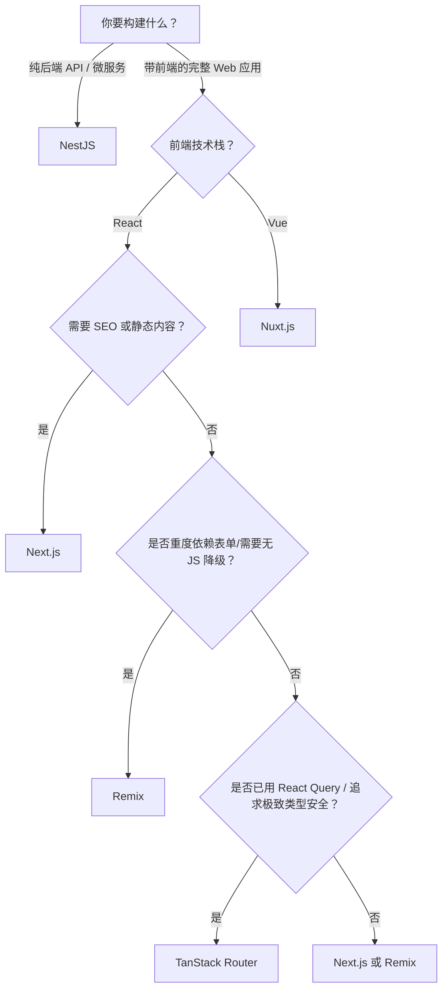

以下是 **TanStack（特指 TanStack Router）、Next.js、Remix 和 NestJS** 四个现代 JavaScript/TypeScript 框架的深度对比，涵盖设计哲学、核心能力、适用场景及选型建议（截至 2026 年）。

> 📌 注意：  
> - **TanStack** 是一个工具库集合（如 React Query、Table），但其 **TanStack Router**（v1+）已成为一个**全功能路由框架**，可作为独立前端路由方案或轻量级全栈框架使用。  
> - 本文将 **TanStack Router** 视为“前端路由 + 全栈能力”的代表参与比较。

---

## 一、概览对比表

| 特性       | **TanStack Router** | **Next.js**                                | **Remix**                         | **NestJS**             |
| -------- | ------------------- | ------------------------------------------ | --------------------------------- | ---------------------- |
| **类型**   | 前端路由框架（可扩展为全栈）      | React 全栈框架                                 | React 全栈框架                        | Node.js 后端框架（TS 优先）    |
| **核心理念** | 类型安全、渐进式、无运行时魔法     | 约定优于配置、SSR/SSG/ISR                         | Web 标准优先、渐进增强                     | 企业级架构、OOP + DI         |
| **数据获取** | `loader`（类似 Remix）  | `async` Server Components / Route Handlers | `loader` / `action`（基于 Web Fetch） | 自定义（REST/gRPC/GraphQL） |
| **渲染模式** | CSR 为主，支持 SSR（需集成）  | App Router: SSR/SSG/ISR/RSC                | 默认 SSR + Hydration                | 无内置前端（通常返回 JSON）       |
| **部署目标** | 任何 JS 环境（含 Edge）    | Vercel 优化，也支持其他                            | 通用（适配多平台）                         | Node.js 服务器 / Docker   |
| **学习曲线** | 中（需理解路由树、类型推导）      | 中高（App Router 概念多）                         | 中（强调 Web 原语）                      | 高（需 OOP、装饰器、模块系统）      |
| **典型用途** | 复杂 SPA / 渐进式全栈      | 企业级 Web 应用、营销站、CMS                         | 高交互性、表单密集型应用                      | 微服务、API 网关、后端系统        |

---

## 二、详细分析

### 1. **TanStack Router**
- **定位**：由 React Query 作者开发，**以类型安全和开发者体验为核心**的下一代路由方案。
- **亮点**：
  - 自动生成 TypeScript 类型（路径、参数、loader 数据）。
  - 路由即组件，支持嵌套路由、并行加载、错误边界。
  - 内置数据缓存、预加载、过渡状态管理（类似 React Query）。
  - 可与任何后端集成，也可通过 `createServer` 实现轻量 SSR。
- **适用场景**：
  - 已使用 React Query 的团队，希望统一数据流。
  - 需要极致类型安全和路由性能的复杂前端应用。
  - 不想被全栈框架“绑架”，但又想要现代路由能力。
- **局限**：
  - SSR 支持较新，生态不如 Next.js 成熟。
  - 不提供数据库、认证等后端功能（需自行搭建）。

> ✅ **适合**：前端主导、重视 DX 和类型安全的中大型 SPA。

---

### 2. **Next.js**
- **定位**：Vercel 主导的 **React 全栈框架**，目前最主流的 React 解决方案。
- **亮点**：
  - **App Router**：支持 React Server Components（RSC）、Streaming、Suspense。
  - 多种渲染策略：SSR、SSG、ISR、Edge Runtime。
  - 内置 API Routes、Image Optimization、Font、MDX 等。
  - 与 Vercel 深度集成（一键部署、Analytics、Speed Insights）。
- **适用场景**：
  - 需要 SEO 的营销网站、博客、文档站（SSG/ISR）。
  - 复杂 B2B/B2C 应用（结合 Auth.js、Prisma、Stripe）。
  - 团队希望“一站式”解决前后端问题。
- **局限**：
  - App Router 学习成本高（RSC 概念抽象）。
  - 在非 Vercel 平台部署体验下降。
  - Bundle 体积可能较大（尤其启用 RSC 时）。

> ✅ **适合**：大多数 React 项目，尤其是需要 SEO 或全栈能力的场景。

---

### 3. **Remix**
- **定位**：由 React Router 团队打造，**回归 Web 原语**（HTML、HTTP、表单）的全栈框架。
- **亮点**：
  - **基于 Web 标准**：用 `<form>` 提交触发 `action`，天然支持无 JS 场景。
  - 自动代码分割、嵌套路由、错误隔离。
  - 数据加载/提交通过 `loader`/`action`，返回 JSON 或直接重定向。
  - 内置 optimistic UI、pending 状态处理。
- **适用场景**：
  - 表单密集型应用（如后台管理系统、电商结账）。
  - 需要高可用性（即使 JS 失败也能工作）。
  - 团队偏好“渐进增强”而非纯 CSR。
- **局限**：
  - 社区和插件生态小于 Next.js。
  - 对传统 SPA 开发者需转变思维（拥抱 HTML 表单）。

> ✅ **适合**：重视用户体验鲁棒性、表单交互复杂的 Web 应用。

---

### 4. **NestJS**
- **定位**：**Node.js 后端框架**，受 Angular 启发，强调架构和可维护性。
- **亮点**：
  - 完整的 OOP + 函数式 + FRP 编程模型。
  - 内置 DI（依赖注入）、模块系统、守卫、管道、拦截器。
  - 支持 REST、GraphQL、WebSocket、gRPC、微服务。
  - 与 TypeORM/Prisma、Swagger、Jest 深度集成。
- **适用场景**：
  - 大型企业后端系统（银行、ERP、SaaS 平台）。
  - 需要严格代码组织、测试覆盖、长期维护的项目。
  - 构建微服务或 API 网关。
- **局限**：
  - **不包含前端**！通常与 React/Vue 前端分离部署。
  - 学习曲线陡峭（需理解装饰器、元编程等）。

> ✅ **适合**：纯后端服务、微服务架构、需要强类型和工程化约束的团队。

---

## 三、如何选择？—— 决策树

---

## 四、总结：各框架的“灵魂”

| 框架 | 核心价值 | 一句话定位 |
|------|--------|----------|
| **TanStack Router** | 类型安全 + 渐进式路由 | “给 React 应用装上智能导航系统” |
| **Next.js** | 全栈一体化 + 多渲染模式 | “React 应用的瑞士军刀” |
| **Remix** | Web 标准 + 渐进增强 | “让 Web 回归本质的 React 框架” |
| **NestJS** | 企业级架构 + 可维护性 | “Node.js 的 Spring Framework” |

---

## 五、趋势与建议（2026）

- **Next.js** 仍是 React 全栈的**默认选择**，尤其在 Vercel 生态中。
- **Remix** 在**表单和用户体验鲁棒性**要求高的场景持续赢得口碑。
- **TanStack Router** 正在成为**高级 React 团队**的新宠，尤其当项目已重度依赖 TanStack 生态。
- **NestJS** 在**后端领域地位稳固**，是 TypeScript 后端的事实标准之一。

> 💡 **最终建议**：
> - 不确定？从 **Next.js** 开始。
> - 做内部工具、管理后台？考虑 **Remix** 或 **TanStack Router**。
> - 只写 API？选 **NestJS**（或 Fastify/Hono 若追求轻量）。

## 渲染方式

你列出的这四种渲染模式代表了现代 Web 开发中**从纯前端到全栈、从静态到动态**的不同策略。下面我们将逐一对比 **CSR（客户端渲染）、SSR（服务端渲染）、SSG（静态站点生成）、ISR（增量静态再生）和 RSC（React Server Components）**，并解释它们在不同框架中的体现和适用场景。

---

## 📊 渲染模式对比总表

| 模式 | 全称 | 数据获取时机 | 首屏性能 | SEO 友好 | 交互能力 | 典型使用框架 |
|------|-----|------------|--------|--------|--------|------------|
| **CSR** | Client-Side Rendering | 浏览器加载 JS 后发起请求 | ❌ 较慢（需下载+执行 JS） | ❌ 差（爬虫可能看不到内容） | ✅ 强（完全动态） | React（原生）、Vue CLI、TanStack Router（默认） |
| **SSR** | Server-Side Rendering | 服务器在响应 HTML 前获取数据 | ✅ 快（直接返回完整 HTML） | ✅ 好 | ✅ 强（后续 Hydration） | Next.js (Pages Router)、Remix、Nuxt |
| **SSG** | Static Site Generation | 构建时（build time）预渲染 | ✅✅ 极快（纯静态文件） | ✅✅ 最佳 | ⚠️ 有限（需客户端 hydration） | Next.js、Gatsby、Astro |
| **ISR** | Incremental Static Regeneration | 构建时 + 运行时按需更新 | ✅ 快（缓存命中时） | ✅ 好 | ✅ 动态更新内容 | Next.js（独有） |
| **RSC** | React Server Components | 服务器组件在服务端渲染，不发送 JS | ✅ 减少客户端 bundle | ✅ 内容在 HTML 中 | ⚠️ 仅限特定组件（不能用 hooks） | Next.js App Router |

---

## 🔍 详细解析

### 1. **CSR（客户端渲染）**
- **工作方式**：服务器返回一个空 HTML + 一个 JS bundle，浏览器执行 JS 后才发起 API 请求、渲染页面。
- **优点**：
  - 开发简单，前后端完全分离。
  - 交互灵活，适合高度动态应用（如仪表盘、聊天室）。
- **缺点**：
  - 首屏慢（用户看到白屏直到 JS 加载完成）。
  - SEO 不友好（传统爬虫无法执行 JS）。
- **典型场景**：内部管理系统、SaaS 后台、不需要 SEO 的 SPA。

> ✅ **TanStack Router 默认是 CSR**，但可通过集成 `@tanstack/start` 或自定义服务器实现 SSR。

---

### 2. **SSR（服务端渲染）**
- **工作方式**：每次请求时，服务器获取数据 → 渲染完整 HTML → 返回给浏览器 → 客户端“注水”（Hydration）使其可交互。
- **优点**：
  - 首屏快，SEO 友好。
  - 支持个性化内容（如用户登录态）。
- **缺点**：
  - 服务器压力大（每次请求都要渲染）。
  - TTFB（Time to First Byte）可能较长。
- **典型场景**：电商首页、新闻网站、需要 SEO 的营销页。

> ✅ **Remix 默认采用 SSR**，强调“每个请求都新鲜”。

---

### 3. **SSG（静态站点生成）**
- **工作方式**：在 **构建时（build time）** 将所有页面预渲染为静态 HTML 文件，部署到 CDN。
- **优点**：
  - 极致性能（CDN 直接返回 HTML）。
  - 成本低（无需服务器）。
  - SEO 最佳。
- **缺点**：
  - 内容更新需重新构建（不适合频繁变化的数据）。
- **典型场景**：博客、文档站、公司官网、产品介绍页。

> ✅ **Next.js 支持 SSG**（通过 `getStaticProps` 或 App Router 的 `generateStaticParams`）。

---

### 4. **ISR（增量静态再生）** —— Next.js 独有
- **工作方式**：
  - 首次访问时若无缓存，返回 fallback 页面。
  - 后台异步生成页面并缓存。
  - 缓存过期后，下次请求触发后台更新（不影响用户）。
- **优点**：
  - 兼顾 SSG 的性能和 SSR 的动态性。
  - 无需重建整个站点即可更新部分内容。
- **缺点**：
  - 仅限 Next.js（Vercel 平台优化最好）。
- **典型场景**：电商商品页（成千上万页面，内容偶尔更新）。

> ✅ **Next.js App Router 中通过 `revalidate` 实现 ISR**。

---

### 5. **RSC（React Server Components）** —— Next.js App Router 核心
- **工作方式**：
  - 组件分为 **Server Component**（只在服务端运行，不发送 JS）和 **Client Component**（在浏览器运行）。
  - Server Component 可直接访问数据库、环境变量，返回序列化 UI。
- **优点**：
  - 减少客户端 bundle 体积。
  - 自动代码分割，提升性能。
  - 数据获取更靠近 UI（组件内直接 `await fetch()`）。
- **缺点**：
  - 学习曲线陡峭（需理解组件边界）。
  - 不能在 Server Component 中使用 hooks、事件等。
- **典型场景**：大型应用中需要优化首屏性能和 bundle 大小的部分。

> ✅ **Next.js App Router 默认启用 RSC**，是其“未来架构”的核心。

---

## 🧩 框架 vs 渲染模式总结

| 框架 | 默认/主推渲染模式 | 特点 |
|------|------------------|------|
| **TanStack Router** | CSR（可扩展 SSR） | 前端优先，灵活但需手动集成服务端能力 |
| **Next.js** | **混合模式**（App Router：RSC + SSR/SSG/ISR） | “全能选手”，一套代码支持多种策略 |
| **Remix** | **SSR 优先** | 强调 Web 标准，每个请求都是新鲜的 |
| **NestJS** | **无前端渲染** | 纯后端，返回 JSON，前端另选（如 React/Vue） |

---

## ✅ 如何选择？

| 需求 | 推荐模式 | 推荐框架 |
|------|--------|--------|
| 需要 SEO + 静态内容 | SSG / ISR | Next.js |
| 高度动态 + 个性化 | SSR | Remix / Next.js |
| 内部工具 / 无 SEO 需求 | CSR | TanStack Router / React |
| 极致性能 + 类型安全 | CSR + TanStack 生态 | TanStack Router |
| 企业级后端 API | — | NestJS |

---

## 💡 趋势（2026）

- **混合渲染**成为主流：不再非此即彼，而是根据页面/组件选择最优策略（Next.js App Router 是代表）。
- **RSC** 正在改变 React 应用架构，但生态仍在成熟中。
- **Edge SSR**（在边缘节点渲染）兴起，Remix 和 Next.js 均支持。
- **纯 CSR** 逐渐退守到“无 SEO 需求”的内部应用领域。

> 最终，**没有“最好”的渲染模式，只有“最合适”当前业务需求的组合**。