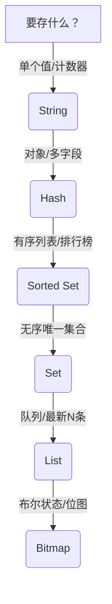

Redis 不仅仅是一个“缓存工具”，它是一个**支持多种数据结构的高性能内存数据引擎**。掌握其 5 种核心数据结构（实际常用的是 5+1 种）及其适用场景，能让你在项目中**用对工具、事半功倍**。

下面从 **结构特性 → 命令示例 → 真实应用场景** 三方面系统解析：

---

## 🧱 Redis 5+1 核心数据结构概览

| 数据结构                  | 中文名  | 特点                    | 典型应用场景      |
| --------------------- | ---- | --------------------- | ----------- |
| **String**            | 字符串  | 最基础，可存文本、数字、二进制       | 缓存、计数器、分布式锁 |
| **Hash**              | 哈希表  | field-value 映射，适合对象存储 | 用户资料、商品属性   |
| **List**              | 列表   | 双端链表，支持阻塞操作           | 消息队列、最新消息流  |
| **Set**               | 集合   | 无序、唯一、支持交并差           | 标签系统、共同好友   |
| **Sorted Set (ZSet)** | 有序集合 | 按 score 排序，唯一成员       | 排行榜、延迟队列    |
| **(Bonus) Bitmap**    | 位图   | 基于 String 的 bit 操作    | 用户签到、活跃统计   |

> 💡 **关键认知**：\
> **选错结构 = 性能浪费 + 代码复杂**。比如用 List 存用户资料？大错！

---

## 1️⃣ String：最简单，但最强大

### 🔧 核心命令

```bash
SET user:1001:name "Alice"
GET user:1001:name
INCR page:view:count        # 原子自增
SETEX token:abc123 3600 "user_id=1001"  # 带过期时间
```

### ✅ 典型应用场景

#### ✅ 场景 1：**通用缓存**

- 缓存数据库查询结果（如 `user:1001` → JSON）
- 缓存 HTML 片段、API 响应

#### ✅ 场景 2：**分布式计数器**

- 页面 PV/UV 统计（配合 HyperLogLog 更佳）
- 接口调用次数限制（如 `rate_limit:user:1001`）

#### ✅ 场景 3：**分布式锁（简易版）**

```python
# 获取锁（NX = 不存在才设，EX = 过期时间）
SET lock:order_create 1 NX EX 10
# 释放锁（需 Lua 保证原子性）
EVAL "if redis.call('GET', KEYS[1]) == ARGV[1] then return redis.call('DEL', KEYS[1]) else return 0 end" 1 lock:order_create "request_id"
```

> ⚠️ 生产建议用 Redlock 或 Redisson

---

## 2️⃣ Hash：存储对象的首选

### 🔧 核心命令

```bash
HSET user:1001 name "Alice" age 30 email "a@example.com"
HGET user:1001 name
HMGET user:1001 name age
HGETALL user:1001
```

### ✅ 典型应用场景

#### ✅ 场景：**缓存对象（比 String 更高效）**

- **优势**：可单独更新字段（如只改邮箱），节省网络带宽
- **对比**：
  - String：整个用户 JSON 序列化 → 更新邮箱需重传全部
  - Hash：只需 `HSET user:1001 email "new@example.com"`

> 📌 **经验法则**：\
> **当对象有多个字段且可能独立更新时，用 Hash；否则用 String**

---

## 3️⃣ List：双端队列 + 阻塞等待

### 🔧 核心命令

```bash
LPUSH news:latest "新闻A"   # 左插入
RPUSH order:queue "order_1001"  # 右插入
LPOP order:queue           # 左弹出
BRPOP order:queue 5        # 阻塞弹出（最多等5秒）
LRANGE news:latest 0 9     # 取最新10条
```

### ✅ 典型应用场景

#### ✅ 场景 1：**轻量级消息队列**

- 生产者：`RPUSH queue task`
- 消费者：`BRPOP queue 0`（永久阻塞，有消息立即返回）
- **优点**：简单、支持多消费者（竞争消费）
- **缺点**：不支持 ACK、消息持久化弱 → 适合非关键任务

#### ✅ 场景 2：**最新动态/消息流**

- 微博 timeline、朋友圈 feed
- 用 `LPUSH + LTRIM` 保持固定长度：

  ```bash
  LPUSH user:1001:feed "新动态"
  LTRIM user:1001:feed 0 99  # 只保留最近100条
  ```

> ⚠️ 注意：List 是**链表**，随机访问（如 `LINDEX`）慢，不适合分页。

---

## 4️⃣ Set：无序唯一集合

### 🔧 核心命令

```bash
SADD user:1001:tags "tech" "sports"
SMEMBERS user:1001:tags
SISMEMBER user:1001:tags "music"
SINTER user:1001:tags user:1002:tags  # 交集
```

### ✅ 典型应用场景

#### ✅ 场景 1：**标签系统**

- 用户打标签：`SADD user:1001:tags "java" "redis"`
- 查找带某标签的用户（需反向索引）：

  ```bash
  SADD tag:java:users 1001 1002
  ```

#### ✅ 场景 2：**共同好友 / 推荐**

- A 的好友：`SADD friends:A B C D`
- B 的好友：`SADD friends:B A C E`
- 共同好友：`SINTER friends:A friends:B` → `{C}`

#### ✅ 场景 3：**抽奖去重**

- 已参与用户：`SADD lottery:2024:participants user_1001`
- 防止重复参与：`SISMEMBER lottery:2024:participants user_1001`

---

## 5️⃣ Sorted Set (ZSet)：带权重的集合（最强大！）

### 🔧 核心命令

```bash
ZADD leaderboard 95 "Alice" 87 "Bob" 92 "Charlie"
ZRANGE leaderboard 0 -1 WITHSCORES  # 按分数升序
ZREVRANGE leaderboard 0 9            # 取 Top 10
ZSCORE leaderboard "Alice"           # 查 Alice 分数
ZINCRBY leaderboard 5 "Alice"        # Alice +5 分
```

### ✅ 典型应用场景

#### ✅ 场景 1：**实时排行榜**

- 游戏积分榜、电商热销榜
- **优势**：O(log N) 插入/查询，天然排序
- **技巧**：用 `ZREVRANGEBYSCORE` 实现分页

#### ✅ 场景 2：**延迟队列（Delay Queue）**

- 用 **时间戳作 score**：

  ```bash
  ZADD delay_queue 1710000000 "task_1001"  # 1710000000 = Unix 时间戳
  ```

- 后台进程轮询：

  ```bash
  ZRANGEBYSCORE delay_queue 0 <current_timestamp>  # 取到期任务
  ZREM delay_queue "task_1001"  # 处理后删除
  ```

#### ✅ 场景 3：**滑动窗口限流**

- 记录每次请求时间戳：

  ```bash
  ZADD rate_limit:user:1001 <timestamp> <unique_id>
  ZREMRANGEBYSCORE rate_limit:user:1001 0 <current-60>  # 清除1分钟前记录
  ZCARD rate_limit:user:1001  # 当前请求数
  ```

- 若 > 100，则拒绝

---

## 🎁 Bonus：Bitmap —— 超省空间的布尔数组

### 🔧 核心命令

```bash
SETBIT sign:20240401 1001 1    # 用户1001 4月1日签到
GETBIT sign:20240401 1001      # 是否签到？
BITCOUNT sign:20240401         # 当天总签到人数
BITOP AND sign:apr sign:20240401 sign:20240402 ...  # 多日连续签到
```

### ✅ 典型应用场景

#### ✅ 场景：**用户行为统计**

- 日活（DAU）：每天一个 Bitmap，`BITCOUNT` 得当日活跃数
- 连续签到：`BITOP AND` 多天 Bitmap，结果中 1 的数量 = 连续签到人数
- **空间效率**：1 亿用户 ≈ 12 MB / 天！

---

## 📊 如何选择？决策树



---

## ⚠️ 常见误区

| 误区            | 正确做法                                    |
| ------------- | --------------------------------------- |
| 用 List 存用户信息  | → 用 Hash                                |
| 用 String 存排行榜 | → 用 ZSet（否则排序需拉全量到内存）                   |
| 用 Set 做有序列表   | → 用 ZSet                                |
| 忽略 Big Key 风险 | → 单个 Key 不要超过 1MB，List/Set/ZSet 控制 size |

---

## ✅ 总结：Redis 数据结构使用口诀

> **“缓存计数用 String，\
> 对象存储选 Hash，\
> 队列最新走 List，\
> 唯一集合靠 Set，\
> 排行延迟 ZSet 上，\
> 签到统计 Bitmap 强。”**

掌握这 5+1 种结构，你就能在 90% 的业务场景中**精准选用 Redis 能力**，避免“拿着锤子看啥都是钉子”。

如果你有具体场景（比如“如何用 ZSet 做课程倒计时？”、“如何防止 List 消息丢失？”），欢迎提出，我可以给出详细方案！
