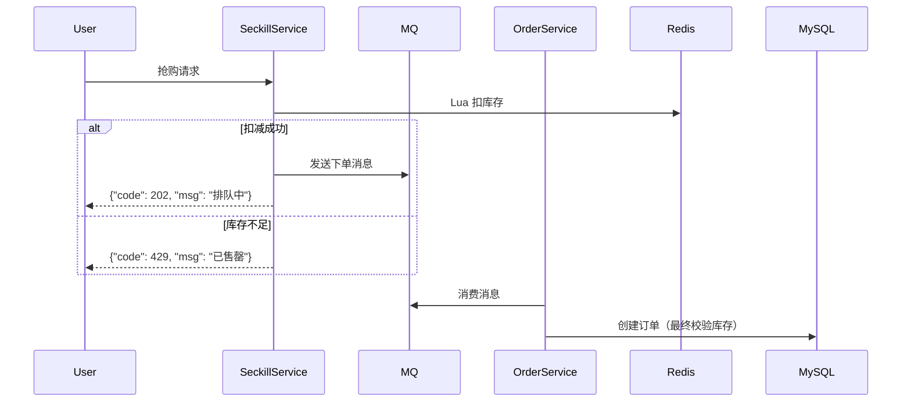

---
aliases:
date: 2026-01-10 12:04
tags:
source:
rating:
related:
  - "[[200组开发选题]]"
view-count:
---

搭建一个**高并发电商秒杀系统**是典型的“读多写少 + 瞬时流量洪峰”场景，对系统架构、缓存、限流、数据库设计等提出极高要求。下面从 **0 到 1** 拆解核心挑战与技术方案，给出一套**可落地的高并发秒杀架构**（含技术栈选型）。

---

## 🎯 核心目标

- **高并发**：支持 10w+ QPS 秒杀请求
- **一致性**：库存不超卖（100 件商品不能卖出 101 件）
- **可用性**：即使部分服务宕机，系统仍能降级运行
- **防刷**：防止机器人、脚本恶意抢购

---

## ⚠️ 秒杀的核心难点

| 问题        | 后果                          |
| --------- | --------------------------- |
| **瞬时高并发** | 数据库连接打满，服务雪崩                |
| **超卖**    | 库存扣成负数，发货失败，信誉受损            |
| **热点数据**  | 单个商品 ID 成为 Redis/DB 热点，性能瓶颈 |
| **网络拥塞**  | 大量无效请求占满带宽                  |

> 💡 **关键思想**：**层层过滤 + 异步削峰 + 缓存前置**

---

## 🏗️ 整体架构分层（自顶向下）

```
用户 → CDN → 负载均衡 → 网关（限流/鉴权） → 
    ↓
秒杀服务（缓存预热 + 库存扣减） → 
    ↓
消息队列（异步下单） → 
    ↓
订单服务 + 库存服务（最终一致性）
```

---

## 🔧 技术栈选型（主流 & 可扩展）

| 层级         | 技术选型                        | 说明              |
| ---------- | --------------------------- | --------------- |
| **前端**     | Vue/React + 静态资源 CDN        | 秒杀页静态化，减少后端压力   |
| **负载均衡**   | Nginx / ALB (AWS)           | 分发流量，支持 IP 限流   |
| **API 网关** | Spring Cloud Gateway / Kong | 统一鉴权、限流、熔断      |
| **缓存**     | **Redis Cluster**（主从 + 分片）  | 存储库存、令牌桶、用户资格   |
| **限流**     | **Redis + Lua** / Sentinel  | 分布式限流，防刷        |
| **消息队列**   | **RocketMQ** / Kafka        | 削峰填谷，异步创建订单     |
| **数据库**    | **MySQL（分库分表）** + Binlog 订阅 | 订单持久化，最终一致性     |
| **监控**     | Prometheus + Grafana + ELK  | 实时观测 QPS、延迟、错误率 |

---

## 🚦 关键模块详解

### 1️⃣ **前置过滤：把 99% 请求挡在门外**

#### ✅ 静态化页面

- 秒杀开始前，将商品详情页生成 **HTML 静态文件**，部署到 CDN
- 用户点击“立即抢购”才发起 API 请求

#### ✅ 网关层限流

- **IP 限流**：单 IP 每秒最多 5 次请求（Nginx `limit_req`）
- **用户限流**：登录用户每秒 1 次（网关集成 Redis 计数）

#### ✅ 验证码/答题（防机器人）

- 秒杀前 1 秒弹出滑块验证码（如腾讯云验证码）
- **注意**：不要提前弹！否则验证码服务被打爆

---

### 2️⃣ **库存扣减：如何保证不超卖？**

> ❌ 错误做法：`SELECT stock FROM goods WHERE id=101; if(stock>0) UPDATE ...`\
> （高并发下多个线程同时读到 stock=1，都通过判断，导致超卖）

#### ✅ 正确方案：**Redis + Lua 原子操作**

```lua
-- stock_deduction.lua
local stock = redis.call('GET', KEYS[1])
if tonumber(stock) > 0 then
    redis.call('DECR', KEYS[1])
    return 1  -- 扣减成功
end
return 0  -- 库存不足
```

- 将库存预热到 Redis：`SET seckill:stock:101 100`
- 所有扣减请求走 **Lua 脚本**（Redis 保证原子性）
- **优势**：QPS 可达 10w+，毫秒级响应

> 📌 **注意**：Redis 库存是“预扣”，最终以 DB 为准（见下文一致性保障）

---

### 3️⃣ **异步下单：用 MQ 削峰**

- 秒杀成功 → **只返回“排队中”**，同时发送消息到 MQ
- 订单服务消费 MQ，**异步创建订单**
- 用户前端轮询或 WebSocket 查询结果



#### ✅ 优势：

- 秒杀接口响应极快（只操作 Redis + 发 MQ）
- 即使订单服务慢，也不影响秒杀入口

---

### 4️⃣ **一致性保障：如何避免 Redis 与 DB 不一致？**

#### 方案：**最终一致性 + 补偿机制**

1. **MQ 消息包含完整上下文**：用户 ID、商品 ID、时间戳
2. **订单服务创建订单前，再次校验 DB 库存**（防 Redis 与 DB 不一致）
   - 若 DB 库存不足 → 订单状态设为“失效”，通知用户
3. **定时对账任务**：
   - 每天凌晨比对 Redis 预扣库存 vs DB 实际销量
   - 自动补偿（如释放多扣的库存）

> 💡 **原则**：**Redis 用于高性能扣减，DB 用于最终一致性兜底**

---

### 5️⃣ **热点 Key 优化（单商品百万 QPS）**

- **问题**：所有请求打向 `seckill:stock:101`，单 Redis 节点扛不住
- **解决方案**：
  - **分段库存**：将 100 件库存拆成 10 个 Key（`stock_101_0` ~ `stock_101_9`）
  - **随机选择**：用户请求随机选一个分段扣减
  - **合并统计**：后台定时合并各分段库存

```python
# 扣减时随机选分段
segment = random.randint(0, 9)
key = f"seckill:stock:{goods_id}_{segment}"
redis.eval(lua_script, 1, key)
```

---

### 6️⃣ **降级与熔断**

- **库存服务不可用** → 直接返回“活动火爆，请稍后再试”
- **MQ 堆积过多** → 暂停接收新请求，前端显示“排队人数过多”
- **Redis 宕机** → 切换到本地缓存（Guava/Caffeine）+ 限流 100 QPS

---

## 📊 性能压测指标（参考）

| 组件        | 目标 QPS    | 延迟         |
| --------- | --------- | ---------- |
| 秒杀接口      | ≥ 50,000  | P99 < 50ms |
| Redis 扣库存 | ≥ 100,000 | < 5ms      |
| MQ 生产     | ≥ 30,000  | < 10ms     |
| 订单创建      | ≥ 5,000   | < 200ms    |

---

## 🛡️ 安全防护

- **防刷**：设备指纹 + 行为分析（如鼠标轨迹）
- **防黄牛**：同一身份证/手机号限购 1 件
- **防 CC 攻击**：云厂商 WAF + 频次限制

---

## ✅ 总结：秒杀系统设计口诀

> **“静态化页面，网关先限流；\
> Redis 扣库存，Lua 保原子；\
> MQ 来削峰，异步建订单；\
> 分段抗热点，对账保一致；\
> 降级有预案，安全不能漏。”**

这套架构已在多个大促场景验证（如双11、618），可根据业务规模灵活裁剪（小公司可去掉分段库存、简化 MQ）。

如果你有具体场景（如“只有 3 台服务器怎么搭？”、“如何用 Go 实现？”），我可以给出更针对性的方案！
