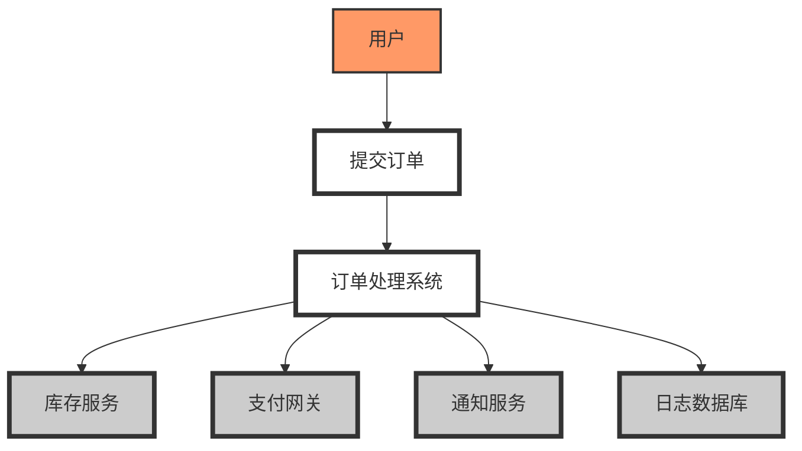
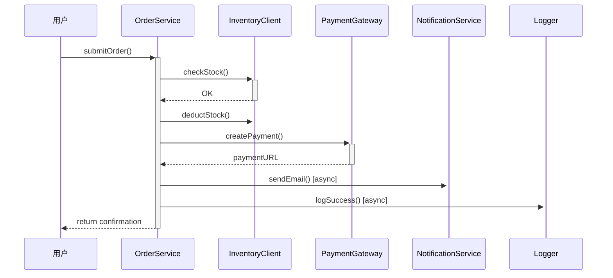

## 🎯 案例背景：在线订单处理系统（简化版）

假设我们正在开发一个小型电商平台的核心模块——“订单处理子系统”，包含以下功能：

- 用户提交订单
- 验证库存
- 扣减库存
- 生成支付请求
- 发送通知（邮件/SMS）
- 记录日志

我们将用上述四种可视化工具分别从不同角度建模该系统，并说明它们如何互补、揭示不同层面的问题。

---

### 1️⃣ 数据流图（DFD）— 关注 **信息流动**

**目的**：看清数据如何在外部实体、处理过程和数据存储之间流动。

#### 简化 Level 0 DFD（上下文图）：

```
[用户] → (提交订单) → [订单处理系统]
[订单处理系统] → [库存服务]
[订单处理系统] → [支付网关]
[订单处理系统] → [通知服务]
[订单处理系统] → [日志数据库]
```

#### Level 1 DFD（分解核心流程）：

- 外部实体：用户、库存服务、支付网关、通知服务
- 处理过程：
  1. 接收订单
  2. 验证并扣减库存
  3. 创建支付请求
  4. 发送通知
  5. 写入日志
- 数据存储：订单数据库、日志数据库

✅ **实践建议**：用 draw.io 或 Lucidchart 绘制 DFD，重点标注**数据流名称**（如“订单详情”、“库存响应”），避免只画箭头无语义。

🔍 **理解要点**：DFD 不关心“谁调用谁”，只关心“什么数据去了哪里”。它帮你发现**数据孤岛**或**冗余传输**。

---

### 2️⃣ 依赖关系矩阵（Dependency Matrix）— 关注 **任务/模块顺序**

| 任务 \ 依赖于 | 接收订单 | 验证库存 | 扣减库存 | 支付请求 | 通知 | 日志 |
| -------- | ---- | ---- | ---- | ---- | -- | -- |
| 接收订单     | —    |      |      |      |    |    |
| 验证库存     | ✅    | —    |      |      |    |    |
| 扣减库存     | ✅    | —    |      |      |    |    |
| 支付请求     | ✅    | ✅    | ✅    | —    |    |    |
| 通知       | ✅    |      | ✅    | —    |    |    |
| 日志       | ✅    | ✅    | ✅    | ✅    | ✅  | —  |

> ✅ = 强依赖（必须完成）；⚠️ = 弱依赖（可选或异步）

✅ **实践建议**：在项目管理工具（如 Jira）中用此矩阵规划任务顺序；在代码模块设计时识别循环依赖。

🔍 **理解要点**：依赖矩阵暴露**关键路径**和**耦合热点**。例如，“日志”依赖所有任务 → 可考虑解耦为事件驱动。

---

### 3️⃣ N² 图（N-Squared Chart）— 关注 **组件间接口**

假设有 5 个组件：

- OrderService
- InventoryClient
- PaymentGateway
- NotificationService
- Logger

构建 5×5 矩阵，每个格子填写接口类型（如 REST API、消息队列、函数调用）：

|           | Order | Inv  | Pay  | Notif | Log |
| --------- | ----- | ---- | ---- | ----- | --- |
| **Order** | —     | REST | REST | MQ    | MQ  |
| **Inv**   | ←     | —    |      |       |     |
| **Pay**   | ←     | —    |      |       |     |
| **Notif** | ←     |      | —    |       |     |
| **Log**   | ←     |      | —    |       |     |

> “←” 表示反向依赖（通常不填，因对称性只需填上三角）

✅ **实践建议**：用 Excel 或专用工具（如 Cameo Systems Modeler）绘制。颜色标记高耦合区域（如 Order 与所有组件通信 → 可能是“上帝组件”）。

🔍 **理解要点**：N² 图让你一眼看出**集成复杂度**。若某行/列接口过多，考虑引入**事件总线**或**中介者模式**解耦。

---

## ✅ 总结：每种图解决什么问题？

| 图表类型       | 回答的问题            | 软件开发中的价值       |
| ---------- | ---------------- | -------------- |
| DFD        | 数据从哪来到哪去？        | 识别数据冗余、缺失存储    |
| 依赖关系矩阵     | 哪些任务必须先完成？       | 规划开发/测试顺序，避免阻塞 |
| N² 图       | 哪些组件耦合最严重？       | 指导微服务拆分或引入中间件  |
| UML（组件/序列） | 接口怎么定义？交互时序是否合理？ | 接口契约明确，减少联调成本  |

---


### 数据流图（DFD）



### 序列图



### 依赖关系矩阵（用表格表示）


| 任务 \ 依赖于 | 接收订单 | 验证库存 | 扣减库存 | 支付请求 | 通知 | 日志 |
|---------------|--------|--------|--------|--------|------|-----|
| 接收订单       | —      |        |        |        |      |     |
| 验证库存       | ✅     | —      |        |        |      |     |
| 扣减库存       |        | ✅     | —      |        |      |     |
| 支付请求       | ✅     | ✅     | ✅     | —      |      |     |
| 通知           | ✅     |        |        | ✅     | —    |     |
| 日志           | ✅     | ✅     | ✅     | ✅     | ✅   | —   |
