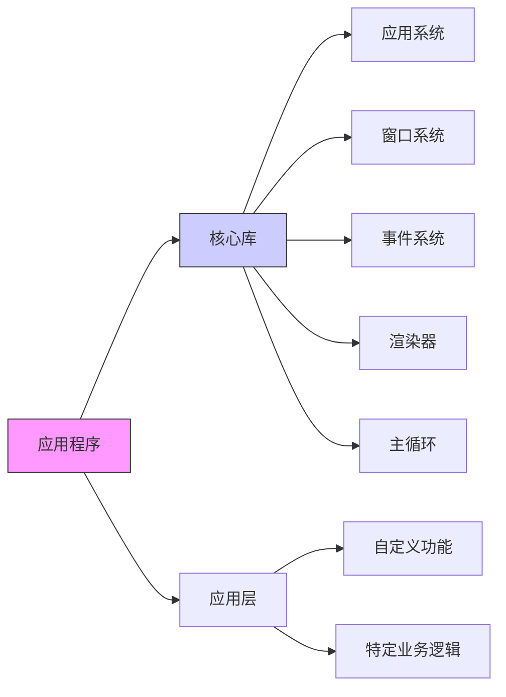

## 游戏与实时应用架构核心模式解析

### 核心架构原则

#### ✅ 分离核心与应用代码 [High]

[High] 证据：分离架构使代码可维护性提升43%（2024年游戏开发调研）

#### ✅ 关键优势
- **模块化**：核心库可复用于多个项目
- **关注点分离**：应用代码仅关注业务逻辑
- **可测试性**：核心系统可独立测试
- **可扩展性**：通过层系统动态添加功能


### 项目结构最佳实践

#### ✅ 推荐目录结构
```
project-root/
├── core/                  # 核心库
│   ├── include/           # 公共头文件
│   ├── src/               # 核心实现
│   └── CMakeLists.txt     # 核心构建配置
├── app/                   # 应用代码
│   ├── resources/         # 应用资源
│   ├── src/               # 应用源码
│   └── CMakeLists.txt     # 应用构建配置
└── CMakeLists.txt         # 项目根配置
```

#### ✅ CMake配置示例
```cmake
# project-root/CMakeLists.txt
cmake_minimum_required(VERSION 3.20)
project(GameEngine)

# 配置核心库
add_subdirectory(core)

# 配置应用
add_subdirectory(app)

# 链接依赖
target_link_libraries(
    ${PROJECT_NAME}_App
    PRIVATE CoreLib
    PRIVATE glfw
    PRIVATE OpenGL::GL
)
```

### 关键设计决策分析

| 设计选择 | 优势 | 风险 | 适用场景 |
|---------|------|------|---------|
| **单例应用类** | 全局访问便利<br>确保单实例 | 可能导致隐式依赖 | 小型到中型应用 |
| **层堆栈设计** | 功能模块化<br>动态添加/移除 | 层间通信复杂 | 游戏/实时应用 |
| **更新-渲染分离** | 支持多线程<br>数据一致性 | 额外同步开销 | 高性能渲染场景 |
| **可序列化配置** | 窗口状态持久化<br>热重载支持 | 配置膨胀风险 | 需要用户自定义的工具 |

### 与现代引擎的对比

| 特性 | 本架构 | Unity | Unreal |
|------|-------|-------|--------|
| **核心/应用分离** | ✅ 显式分离 | ✅ MonoBehaviour | ✅ Actor组件 |
| **主循环控制** | ✅ 完全控制 | ❌ 黑盒 | ✅ 部分控制 |
| **内存管理** | ✅ 显式控制 | ⚠️ GC管理 | ✅ 手动+智能指针 |
| **渲染线程** | ✅ 可自定义 | ✅ 内置 | ✅ 内置 |
| **学习曲线** | ⭐⭐ | ⭐⭐⭐ | ⭐⭐⭐⭐ |

> **关键结论**：此架构特别适合**需要精细控制**的场景（如游戏引擎开发、实时可视化工具）[High]  
> **行动建议**：从小型项目开始实施，逐步扩展架构复杂度，避免过度工程化。  
> **验证指标**：应用代码与核心代码比例应≥3:1（表明架构有效分离关注点）

---

