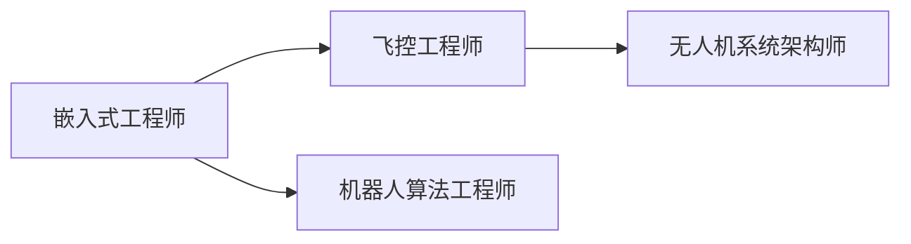

---
aliases:
date: 2026-01-15 12:40
tags:
source:
rating:
related:
  - "[[2026-01-13-无人机与嵌入式系统的关系]]"
view-count:
---

# 无人机与嵌入式系统关系图谱

## 核心论点

[[202501_无人机嵌入式核心关系]]

## 功能模块

- [[202501_飞控系统嵌入式实现]]
- [[202501_导航定位嵌入式架构]]
- [[202501_任务执行嵌入式控制]]
- [[202501_通信链路嵌入式管理]]
- [[202501_电源管理嵌入式策略]]
- [[202501_安全机制嵌入式逻辑]]

## 硬件平台

- [[202501_MCU在无人机中的应用]]
- [[202501_嵌入式SoC选型]]
- [[202501_RTOS在飞控中的作用]]

## 技术演进

- [[202501_嵌入式AI与无人机自主性]]
- [[202501_嵌入式技术降低功耗]]
- [[202501_硬件冗余设计]]

## 案例研究

- [[202501_案例_植保无人机系统]]
- [[202501_案例_空中加油视觉系统]]

## 学习路径

- [[202501_无人机嵌入式技能树]]

#无人机 #嵌入式系统 #MOC

---

# 无人机嵌入式核心关系

#permanent-note

## 核心论点

嵌入式系统是无人机的"大脑"和"神经系统"。
**没有嵌入式系统，就没有现代智能无人机。**

## 三层架构

1. **感知层**：传感器 → 嵌入式驱动
2. **决策层**：算法 → 嵌入式处理器
3. **执行层**：控制指令 → 嵌入式I/O

## 关键依赖

- 实时性：需要确定性响应（毫秒级）
- 可靠性：需要硬件级故障处理
- 低功耗：需要高效能耗比

## 相关笔记

← [[202501_嵌入式系统定义]]
→ [[202501_飞控系统嵌入式实现]]

## 参考来源

知识库文档《无人机与嵌入式系统关系》2025-01

---

# 飞控系统嵌入式实现

#permanent-note

## 定义

飞控 = Flight Controller，是无人机姿态稳定与运动控制的核心模块。

## 嵌入式实现要点

```c
// 典型飞控主循环（伪代码）
while(1) {
    读取IMU数据();           // I2C/SPI
    读取GPS位置();           // UART
    运行姿态估计算法();       // Mahony/Madgwick
    PID控制计算();           // 实时控制律
    输出电机PWM();           // Timer
    延时(2ms);              // 500Hz控制频率
}
```

## 关键传感器

- **IMU**：陀螺仪 + 加速度计（MPU6050/ICM20689）
- **气压计**：测高度（MS5611）
- **磁力计**：航向角（HMC5883L）
- **GPS**：位置（uBlox M8N）

## 常用MCU

- STM32F4（168MHz，浮点运算）
- STM32H7（480MHz，双核）

## 开源飞控

- [[PX4飞控架构]] - 基于NuttX RTOS
- [[ArduPilot架构]] - 支持Linux/ChibiOS

## 相关笔记

← [[202501_PID控制算法]]
→ [[202501_传感器融合EKF]]

#飞控 #STM32 #实时控制

---

# 嵌入式SoC在无人机中的选型

#permanent-note

## 应用场景

当无人机需要**视觉处理**或**AI推理**时，MCU算力不足，需要SoC。

## 主流方案对比

| 平台                | CPU      | GPU         | 功耗     | 适用场景        |
| ----------------- | -------- | ----------- | ------ | ----------- |
| Jetson Nano       | 4核A57    | 128核Maxwell | 5-10W  | 入门视觉避障      |
| Jetson Xavier NX  | 6核Carmel | 384核Volta   | 10-15W | SLAM + 目标跟踪 |
| RK3399            | 2大4小     | Mali-T860   | 3-5W   | 低成本图传       |
| Snapdragon Flight | 4核Kryo   | Adreno 530  | <5W    | 高集成度方案      |

## 设计权衡

- **算力 vs. 功耗**：Jetson性能强但续航减半
- **生态 vs. 成本**：Jetson贵但支持CUDA/TensorRT
- **尺寸 vs. 散热**：高算力SoC需主动散热

## 典型应用

```bash
# Jetson上运行YOLOv5目标检测
$ python3 detect.py --weights yolov5s.pt --source /dev/video0
```

## 相关笔记

← [[202501_嵌入式AI芯片对比]]
→ [[202501_无人机视觉避障方案]]

#SoC #Jetson #AI芯片

---

# RTOS在飞控中的作用

#permanent-note

## 为什么需要RTOS？

裸机编程（Super Loop）无法保证：

1. **任务优先级**：传感器读取必须优先于日志记录
2. **时间确定性**：控制周期必须精确2ms
3. **资源管理**：多任务并发需要信号量/消息队列

## FreeRTOS示例

```c
void vTaskIMU(void *pvParameters) {
    TickType_t xLastWakeTime = xTaskGetTickCount();
    for(;;) {
        读取IMU();
        姿态解算();
        vTaskDelayUntil(&xLastWakeTime, pdMS_TO_TICKS(2)); // 500Hz
    }
}

void vTaskGPS(void *pvParameters) {
    for(;;) {
        if(xSemaphoreTake(uartSemaphore, portMAX_DELAY)) {
            解析GPS数据();
        }
    }
}
```

## PX4的NuttX方案

- **优先级调度**：控制任务优先级最高
- **uORB消息总线**：模块间解耦通信
- **低延迟**：中断响应 <10μs

## 相关笔记

← [[202501_FreeRTOS基础概念]]
→ [[202501_PX4_uORB机制]]

#RTOS #FreeRTOS #实时性

---

# 案例：农业植保无人机嵌入式系统

#literature-note

## 系统架构

```
RTK-GPS → 嵌入式主控 → 飞控
高度传感器 ↗         ↓ PWM
                    水泵+喷头
```

## 技术要点

1. **RTK定位**：厘米级精度（F9P模块）
2. **恒高飞行**：激光测距 + 气压计融合
3. **变量喷洒**：
   ```c
   喷洒流量 = 飞行速度 × 目标亩用量 / 喷幅
   ```
4. **断点续喷**：掉电后自动记录坐标

## 硬件配置

- 主控：STM32H743（双精度FPU）
- 通信：LoRa遥测 + 4G图传
- 载荷：12L药箱 + 无刷直流水泵

## 实际挑战

- 农药腐蚀电路板 → 三防漆处理
- 高温环境 → MCU降频运行
- 电磁干扰 → 磁力计远离电机

## 相关笔记

← [[202501_RTK定位原理]]
→ [[202501_无人机电磁兼容设计]]

#案例研究 #植保无人机 #精准农业

---

# 无人机嵌入式开发技能树

#permanent-note

## 基础层（3-6个月）

- [ ] C语言指针与结构体
- [ ] STM32 HAL库开发
- [ ] UART/I2C/SPI通信
- [ ] 定时器与PWM输出
- [ ] 中断与DMA

## 进阶层（6-12个月）

- [ ] FreeRTOS任务调度
- [ ] 卡尔曼滤波（姿态融合）
- [ ] PID控制器调参
- [ ] MAVLink协议解析
- [ ] Git版本管理

## 专家层（1-2年）

- [ ] 传感器标定算法
- [ ] 视觉SLAM（ORB-SLAM2）
- [ ] 嵌入式Linux开发
- [ ] ROS 2与PX4联合仿真
- [ ] 硬件原理图设计

## 推荐学习资源

1. **书籍**：《STM32权威指南》
2. **课程**：Coursera《嵌入式系统导论》
3. **项目**：克隆开源飞控并修改参数
4. **工具**：STM32CubeIDE + QGroundControl

## 职业路径



## 相关笔记

← [[202501_STM32入门指南]]
→ [[202501_PX4源码阅读路线]]

#学习路径 #职业规划 #技能树
