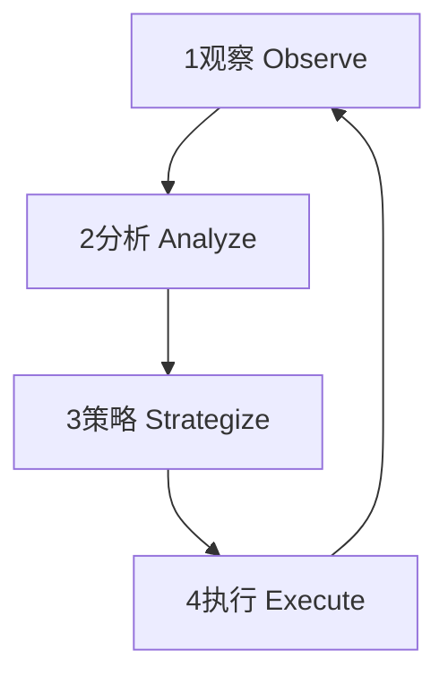

---
aliases:
  - Bloom's revised taxonomy
  - 布卢姆修订后分类学
date: 2025-05-22 16:29
tags:
  - Healthy
type: MOC
update: 2025-03-25 13:02
categories:
  - Mindset
rating: 10
source: 
author: 
important: false
---
## 元认知：重构你心智模型的操作系统

元认知 (Metacognition) 是对自身思维过程的认知与调控，本质上是为你的大脑安装一个调试器 (Debugger) 和分析器 (Profiler)。对于高级开发者而言，它不是一个模糊的心理学概念，而是一个可用于**持续优化心智算法、提升复杂问题解决能力**的工程框架。

**核心价值主张**：从被动思考者，转变为自身认知过程的**主动架构师**。

---

### 一、核心模型：元认知执行循环 (The Metacognitive Execution Loop)

所有元认知活动都可以被抽象为一个持续迭代的四阶段循环。这是我们思考、学习和成长的底层操作系统。

1.  **Observe (观察)**: 有意识地监控当前的思维状态和过程。“我的注意力在哪里？” “我对这个问题的直觉反应是什么？”
2.  **Analyze (分析)**: 解构和评估思维过程的质量。“我的理解深度处于哪个层级？” “是否存在认知偏差？” “认知负荷是否过高？”
3.  **Strategize (策略)**: 基于分析结果，设计或选择更优的思维策略。“我应该采用什么模型来简化这个问题？” “如何系统地拓展我的知识边界？”
4.  **Execute (执行)**: 应用新策略，并返回观察阶段，形成闭环。

---

### 二、循环组件与工具集 (Loop Components & Toolkit)

#### **阶段 1: 观察 (Observe) - 启动思维的监控器**
*   **核心工具：自我提问 (Self-Questioning)**
    *   **状态检查**: "我当前的情绪和精力水平如何？"
    *   **焦点检查**: "我的思维焦点是发散还是收敛？"
    *   **过程检查**: "我正在使用哪种思维模式？（例如：批判性思维、类比思维）"
*   **关键概念：认知之钟 (Cognitive Clock)**
    *   识别你对某个主题的认知阶段（不知己不知 → 知己不知 → 知己能 → 不知己能），这是启动后续分析的前提。

#### **阶段 2: 分析 (Analyze) - 调试你的思维过程**
*   **核心工具：布鲁姆认知层级 (Bloom's Taxonomy)**
    *   用作评估**理解深度**的量化标准。你只是在`记忆(Remember)`，还是已经能够`创造(Create)`？
*   **核心工具：认知偏差检查表 (Cognitive Bias Checklist)**
    *   **确认偏误 (Confirmation Bias)**: 我是否在寻找证据来支持我的既有观点？
    *   **框架锁定 (Framing Effect)**: 换个角度描述问题，我的结论会改变吗？
    *   **可得性启发 (Availability Heuristic)**: 我的判断是否过度依赖于最近或印象深刻的信息？
*   **关键概念：认知负荷 (Cognitive Load)**
    *   分析你的工作记忆是否过载。负担主要来自**任务内在复杂度 (Intrinsic)**, **信息呈现方式 (Extraneous)**, 还是**构建心智模型 (Germane)**？

#### **阶段 3: 策略 (Strategize) - 设计更优的心智算法**
*   **核心工具：“上广深”认知拓展框架**
    *   **提升高度 (上)**: 切换到更高抽象层级，思考问题的“第一性原理”。
    *   **拓展广度 (广)**: 进行交叉领域类比，寻找结构相似性。
    *   **加深深度 (深)**: 应用**费曼学习法**，通过教学来暴露理解盲区。
*   **核心工具：模型库 (Mental Model Library)**
    *   针对特定问题，主动选择合适的思维模型（如：系统思维、逆向思维、T型知识结构）。
*   **关键概念：FCPM 知识分类**
    *   根据知识类型（事实 F, 概念 C, 程序 P, 元认知 M）匹配不同的学习策略，实现精准打击。

#### **阶段 4: 执行 (Execute) - 刻意练习与固化**
*   **核心工具：刻意练习 (Deliberate Practice)**
    *   将策略分解为具体的、可重复的练习单元，并建立快速反馈机制。
*   **核心工具：环境设计 (Environment Design)**
    *   应用**福格行为模型**，改造物理和数字环境，使更优的思维策略更容易被触发。
*   **关键概念：知识内隐化 (Tacit Knowledge)**
    *   通过持续执行和复盘，将显性策略（如设计模式）转化为专家的直觉和“品味”。

---

### 三、反模式 (Anti-Patterns)

*   **伪元认知 (Pseudo-Metacognition)**: 沉迷于思考“如何思考”，而不去实际解决问题。这是“分析瘫痪”的一种形式。
*   **工具滥用 (Tool Fetishism)**: 痴迷于构建复杂的笔记系统或寻找完美的工具，而不是内化思维原则本身。
*   **浅层循环 (Shallow Loop)**: 停留在“观察-执行”的循环中，缺少“分析”和“策略”的深度加工，导致努力但无成长。
*   **认知固化 (Cognitive Rigidity)**: 拒绝更新或挑战自己已有的、成功的思维模型，导致无法适应新的问题环境。