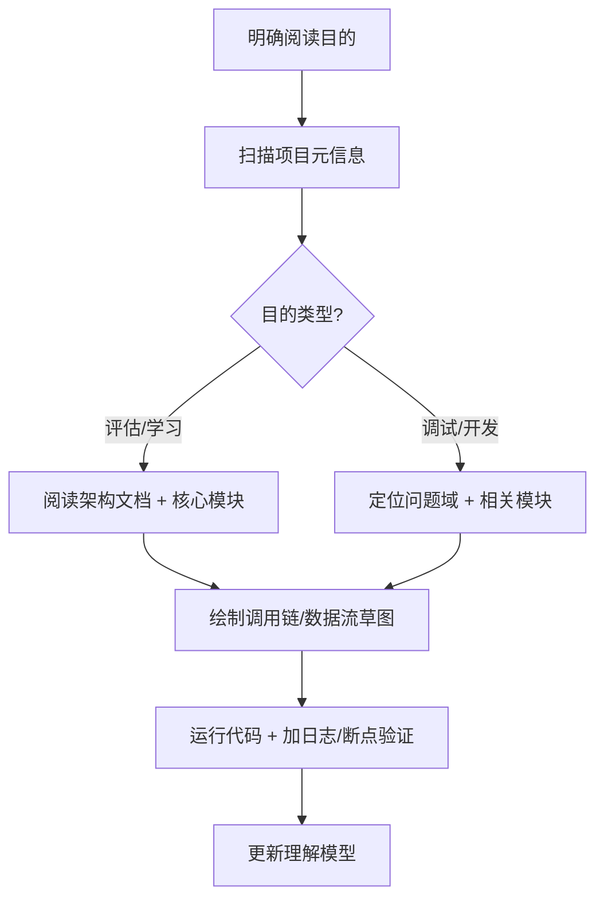
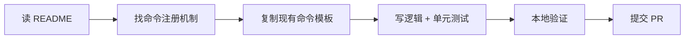

阅读代码仓库（Codebase Reading）是开发者核心能力之一，尤其在接手遗留系统、参与开源项目或进行技术调研时至关重要。若将**结构化拆解能力**（如 PIOO 框架 + Task Graph）应用于代码仓库阅读，可大幅提高效率、减少认知负荷。

---

## 一、用 PIOO 框架拆解“阅读代码仓库”任务

### 1. **目的（Purpose）**

> **为什么读这个仓库？**

明确目标决定阅读深度和路径：

- ✅ 快速评估是否可用（如选型）
- ✅ 调试/修复某个 Bug
- ✅ 新增功能（需理解扩展点）
- ✅ 学习架构设计模式
- ✅ 接手维护整个系统

> ❌ 没有目的的“通读全部代码”往往低效且容易迷失。

---

### 2. **信息（Information）**

> **需要哪些上下文才能有效阅读？**

| 信息类型                  | 获取方式                                             |
| --------------------- | ------------------------------------------------ |
| 项目文档（README、Wiki、ADR） | 查看根目录、docs/、.github/                             |
| 技术栈（语言、框架、依赖）         | package.json / requirements.txt / build.gradle 等 |
| 架构图或模块划分              | 文档中是否有 C4 模型、分层图？                                |
| 入口点（Entry Point）      | main 函数、启动脚本、Dockerfile                          |
| 测试用例                  | tests/ 或 spec/ 目录 → 理解预期行为                       |
| Issue / PR 历史         | GitHub/GitLab Issues → 了解痛点与设计权衡                 |

> 💡 **技巧**：先读测试，再读实现——测试是“活的文档”。

---

### 3. **操作（Operation）**

> **分阶段、有策略地阅读代码**

#### 阶段式阅读策略（Task Graph 思维）：

#### 具体操作建议：

| 操作       | 说明                              |
| -------- | ------------------------------- |
| **自顶向下** | 从入口 → 主流程 → 子模块（适合理解整体）         |
| **自底向上** | 从报错位置/关键函数 → 向上追溯调用者（适合 Debug）  |
| **关注边界** | 模块间接口（API、消息、DB Schema）比内部实现更重要 |
| **忽略细节** | 初期跳过工具函数、配置细节、异常处理（标记后回看）       |
| **画图辅助** | 手绘类图、序列图、状态机（哪怕很粗糙）             |

> 🛠️ 工具推荐：
>
> - VS Code + CodeMap / GitLens
> - SourceTrail（已停更但仍有用）
> - Understand / CodeLogic（商业工具）
> - `grep` / `ripgrep` + `ctags` 快速跳转

---

### 4. **输出（Output）**

> **阅读后应产出什么？**

避免“读完就忘”，强制输出成果：

| 目的   | 推荐输出                     |
| ---- | ------------------------ |
| 评估项目 | 选型报告（优缺点、风险、学习成本）        |
| 调试修复 | 根因分析 + 修复方案 + 单元测试       |
| 新增功能 | 接口设计草图 + 修改点清单           |
| 学习架构 | 架构笔记（含模块职责、通信方式、扩展机制）    |
| 接手维护 | 系统地图（System Map）+ 关键路径文档 |

> ✍️ 示例：一份“5 分钟读懂该仓库”的内部备忘录，包含：
>
> - 入口在哪？
> - 核心抽象是什么？（如：Pipeline、Handler、Entity）
> - 数据如何流动？
> - 哪些地方容易出错？

---

## 二、实战示例：阅读一个开源 CLI 工具仓库

### 场景

你想为 `my-cli-tool` 贡献一个新命令。

### PIOO 拆解

| 层级     | 内容                                                                                                                          |
| ------ | --------------------------------------------------------------------------------------------------------------------------- |
| **目的** | 安全地新增一个子命令，符合项目风格                                                                                                           |
| **信息** | - README 说明了插件机制   - package.json 显示使用 Commander.js   - tests/cli.test.js 有命令测试范例                                     |
| **操作** | 1. 找到命令注册入口（如 src/commands/index.ts）   2. 阅读现有命令实现（如 src/commands/build.ts）   3. 查看测试写法   4. 本地运行 `npm link` 测试新命令 |
| **输出** | - 新命令代码 + 测试   - PR 描述（含设计一致性说明）                                                                                         |

### Task Graph（简化）

---

## 三、高阶技巧：建立“代码心智模型”

1. **识别模式**：

   - 是 MVC？Event-Driven？Actor Model？
   - 是否有统一的错误处理、日志、配置方式？

1. **追踪数据流**：
   用户输入 → 解析 → 业务逻辑 → 存储/输出
   （用 `console.log` 或 debugger 跟踪关键变量）

2. **关注“胶水代码”**：
   模块如何被组合？依赖注入？工厂模式？路由表？

3. **版本对比**：
   `git log -p -- some/file` 看历史变更，理解演进逻辑。

---

## 四、常见误区

| 误区          | 正确做法              |
| ----------- | ----------------- |
| 从第一行代码开始顺序读 | 从入口/问题点切入，按需深入    |
| 试图记住所有细节    | 只记结构和关键抽象，细节可查    |
| 不运行代码       | 必须跑起来！加日志、断点、修改验证 |
| 忽略测试        | 测试是最可靠的“行为说明书”    |

---

## 结语

阅读代码仓库不是“看小说”，而是**侦探式探索 + 工程化建模**。
用 PIOO 框架锚定目标，用 Task Graph 规划路径，用输出固化理解——
你不仅能读懂代码，更能**驾驭复杂系统**。

> “优秀的程序员不是写更多代码的人，而是能最快理解他人代码的人。”
