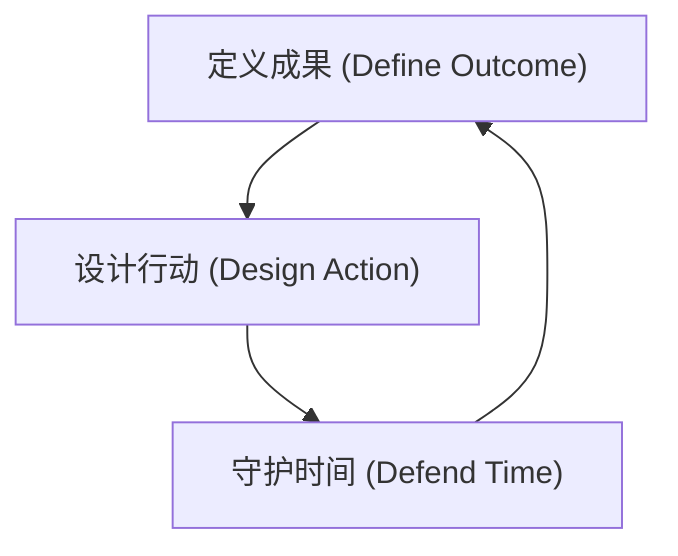

## 成果导向的时间管理系统 (Outcome-Oriented Time Management)

这是一个用于设计和执行高价值工作的操作系统。其核心理念是：**时间管理不是关于约束或纪律，而是关于设计。** 我们设计的不是日程表，而是成果。

### **一、核心哲学 (Core Philosophy)**

1.  **从解决问题开始 (Start with a Problem, Not a System):** 不要试图一次性构建完美的系统。找到一个真实的痛点（例如，项目拖延），应用一个原则并立即获益。这会提供构建完整系统的动力。
2.  **这是设计问题，不是纪律问题 (It's a Design Problem, Not a Discipline Problem):** 拖延和分心不是意志力薄弱的标志，而是行动计划设计不佳的信号。不要强迫自己，而要重新设计任务，使其更容易启动。
3.  **选择成果，而非牺牲时间 (Choose Outcomes, Not Sacrifices):** 有效的时间管理会创造更多可自由支配的时间，而不是更少。关键在于主动选择并完成能创造最高价值的成果。
4.  **完成比“重要”更重要 (Completion Creates Importance):** 事情的价值不是被“发现”的，而是通过“彻底完成”被创造的。与其寻找“重要”的事，不如思考如何“把事情完成得很重要”。

---

### **二、核心框架：成果-行动-守护 (The OAD Framework: Outcome-Action-Defend)**

本系统围绕一个三阶段的循环构建：

---

### **三、框架组件与工具集 (Components & Toolkit)**

#### **阶段 1: 定义成果 (Define Outcome) - 设计你的“价值主张”**

*   **工具：反直觉目标法 (The "Counter-Intuitive Goal" Method)**
    *   **指令:** 持续追问 “我真正想要的是什么？” 来穿透表层欲望，找到问题的根源。
    *   **场景:** 当你设定一个目标（如“学好英语”）却迟迟无法行动时，很可能这个目标是模糊的直觉。追问下去可能会发现，你真正想要的是“能无障碍阅读国外技术文档”或“在国际会议上自信发言”。

*   **工具：不完美计划法 (The "Imperfect Plan" Method)**
    *   **指令:** 放弃一次性制定完美计划。设定一个“当前阶段能做到且最有价值”的最小化成果，立即执行，然后根据反馈迭代。
    *   **场景:** 面对一个大型项目（如重构一个遗留系统），不要试图规划所有细节。先设定第一个成果：“成功将一个模块解耦并上线”，完成后再规划下一步。

*   **工具：目标现实化表单 (The "Goal Realization" Form)**
    *   **指令:** 使用一个简单的表单来拆解、评估和比较潜在目标。
    *   **结构:**
        *   **目标/问题:** 我想解决什么？
        *   **愿景价值:** 成功后，它会带来什么长期价值？
        *   **下一阶段成果:** 为实现该愿景，我现在能完成的第一个具体、可衡量的成果是什么？
        *   **可行性评估 (1-10):** 完成下一阶段成果的难度有多大？
    *   **应用:** 用此表单“比价”不同目标，优先选择“愿景价值高”且“下一阶段成果可行性高”的目标。

#### **阶段 2: 设计行动 (Design Action) - 架构你的“执行路径”**

*   **原则：成果鼓励法 (The "Outcome-as-Encouragement" Principle)**
    *   **理念:** 真正的动力来自于“已完成的成果”，而非外部奖励（如“做完就看电影”）。
    *   **指令:** 将宏大目标拆解为一系列“现在就能完成”且“与个人认同价值挂钩”的阶段性成果。每完成一个，其本身就是最好的激励。

*   **工具：下一步行动拆解 (Next-Action Decomposition)**
    *   **指令:** 面对任何困难任务，将其拆解为“立即可执行”的物理动作清单。
    *   **技术:**
        *   **回推法 (Push-Back):** 从困难步骤向前回推，找到那个最简单的准备动作。（“写代码” -> “搭建开发环境” -> “安装依赖” -> “打开终端”）
        *   **切割法 (Slice):** 将复杂成果看作简单成果的组合，按结构拆解。（“完成用户登录功能” -> “设计API接口” -> “编写后端逻辑” -> “创建前端页面”）
        *   **替代法 (Alternate):** 为不同情境设计不同的行动选项。（“写文档”：在办公室用电脑写 vs. 在通勤路上用手机构思大纲）

#### **阶段 3: 守护时间 (Defend Time) - 部署你的“防火墙”**

*   **工具：进击型行事历 (The "Offensive Calendar")**
    *   **指令:** 不要用日历被动记录会议。主动在每周的日历上为你的核心目标预留出固定的、不可侵犯的时间块（“神圣时间”）。
    *   **效果:** 这不是待办事项，这是一个与自己的“会议”。它确保了重要但不紧急的任务始终有进度。

*   **工具：三层待办清单 (The 3-Tier To-Do List)**
    *   **指令:** 每天只选择少数几项任务，按三个层级组织。
        *   **L1 - 自我实现 (Self-Actualization):** 1项。与你内心最深层目标相关，能带来巨大满足感的行动。
        *   **L2 - 进度推进 (Progress):** 2-4项。今天必须推进的核心工作/项目任务。
        *   **L3 - 杂事处理 (Maintenance):** 动态处理。用于应对突发的、必须做的杂事，不预先规划。

*   **工具：积极休息法 (Active Rest Method)**
    *   **指令:** 当对一项任务感到疲劳或卡顿时，不要停止工作去刷手机。切换到另一个**不同类型**的核心目标上。
    *   **原理:** 大脑只是对特定任务感到疲劳，切换主题能让不同区域得到休息，同时还能在另一条战线上取得进展。

---

### **四、反模式 (Anti-Patterns)**

*   **目标浪费 (Outcome Waste):** 将时间平均分配给多个次要目标，导致没有一个重要目标被“彻底完成”。
*   **思考浪费 (Thinking Waste):** 每次都从零开始思考相似任务的执行路径，因为从未将成功的行动清单模板化。
*   **不确定性浪费 (Uncertainty Waste):** 因任务未被拆解为清晰的下一步行动，导致大量时间被用于犹豫、焦虑和确认。
*   **返工浪费 (Rework Waste):** 没有在执行过程中即时记录问题和经验（KPT复盘），导致在后续项目中重复犯错。