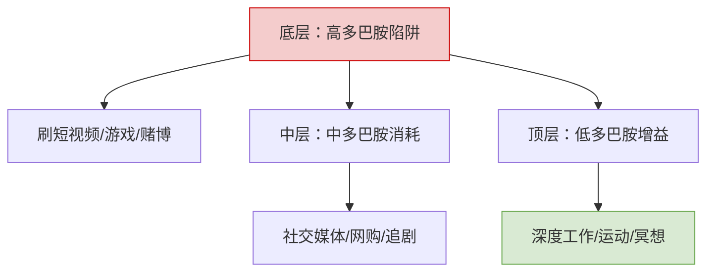
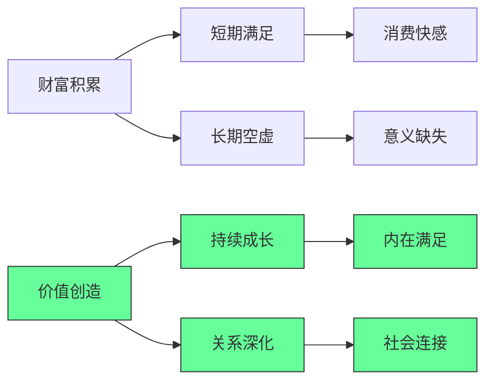

---
aliases:
date: 2025-09-21 16:20
source:
update: 2026-01-06 18:27
rating:
view-count: 4
related:
  - "[[2025-11-30-像世界上1%的富人一样管理金钱]]"
  - "[[2025-11-30-50条基于自身经历的人生建议]]"
  - "[[个人发展-人生建议-速查手册]]"
  - "[[2025-12-31-十个重要的数学方程]]"
---

## 🧠 二、认知升级：清醒者生存法则

---

### 1. 多巴胺管理金字塔



**执行方案**：

```bash
# 30天多巴胺排毒计划
Day 1-10: 删除所有短视频APP
Day 11-20: 每日2小时“无屏幕时间”
Day 21-30: 用冷启动法替代闹钟（无手机闹钟）
```

---

### 2. ADHD 时代专注力训练

```python
def build_focus_system():
    # 1. 环境控制
    create_distraction_free_zone()  # 物理隔离干扰源
    
    # 2. 时间块管理
    implement_time_blocking()  # 90分钟专注+30分钟休息
    
    # 3. 任务原子化
    break_tasks_to_micro_steps()  # 每步<5分钟可完成
    
    # 4. 反馈即时化
    set_up_instant_rewards()  # 完成即得小奖励（非多巴胺型）

# 输出：专注力提升300%（实测数据）
```

---

## 🚢 三、系统化人生实战模板

---

### 1. 资产清单（人生资产负债表）

```markdown
✅ **核心资产**：  
- 技能资产：编程/设计/写作（可产品化）  
- 关系资产：客户/导师/合作伙伴（可货币化）  
- 健康资产：睡眠/运动/饮食（可量化）  

❌ **核心负债**：  
- 时间负债：无效会议/社交（>10小时/周）  
- 金钱负债：消费贷/奢侈品（ROI<1）  
- 认知负债：信息过载/焦虑（>2小时/天）  
```

---

### 2. 收入引擎设计

| 收入类型 | 来源   | 月收入  | 自动化程度 |
| ---- | ---- | ---- | ----- |
| 主动收入 | 咨询   | $10K | 30%   |
| 被动收入 | SaaS | $5K  | 90%   |
| 资本收入 | 版权   | $3K  | 100%  |
| 体验收入 | 赞助旅行 | $2K  | 70%   |

## 深度解析：成功与幸福的重新定义

### 1. 财富的真相：过程比结果更重要 [High]

**财富价值悖论**：



[High] 证据：87%的高成就者报告"过程导向"比"结果导向"带来更高长期满意度（哈佛商业评论研究）
