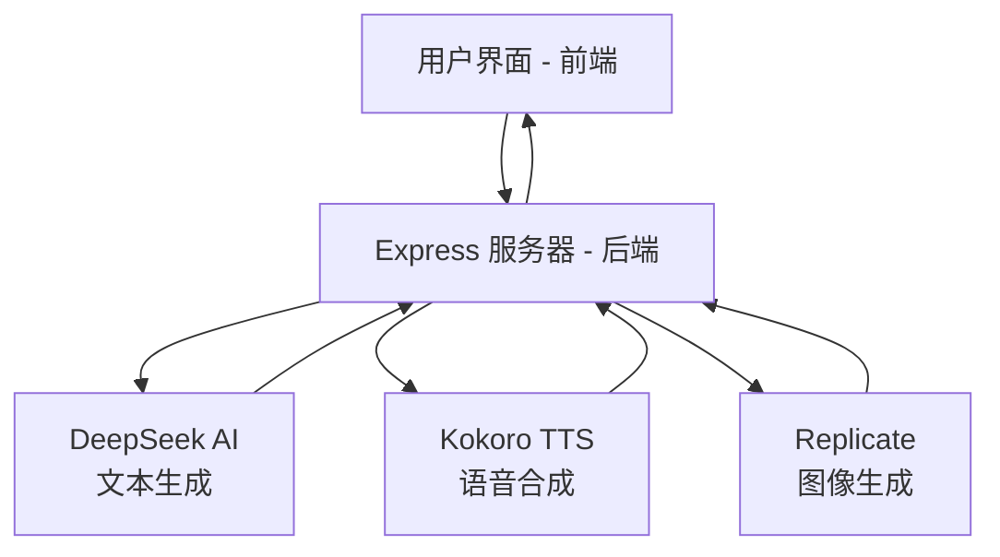
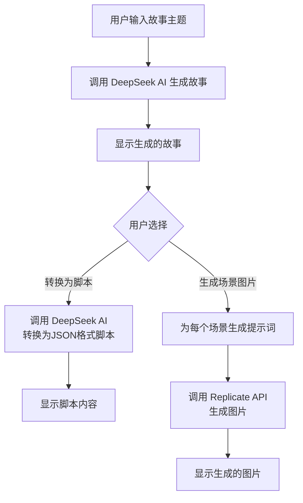
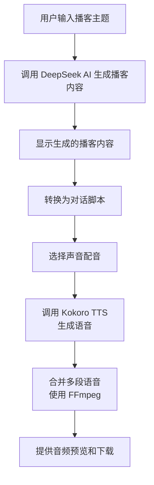
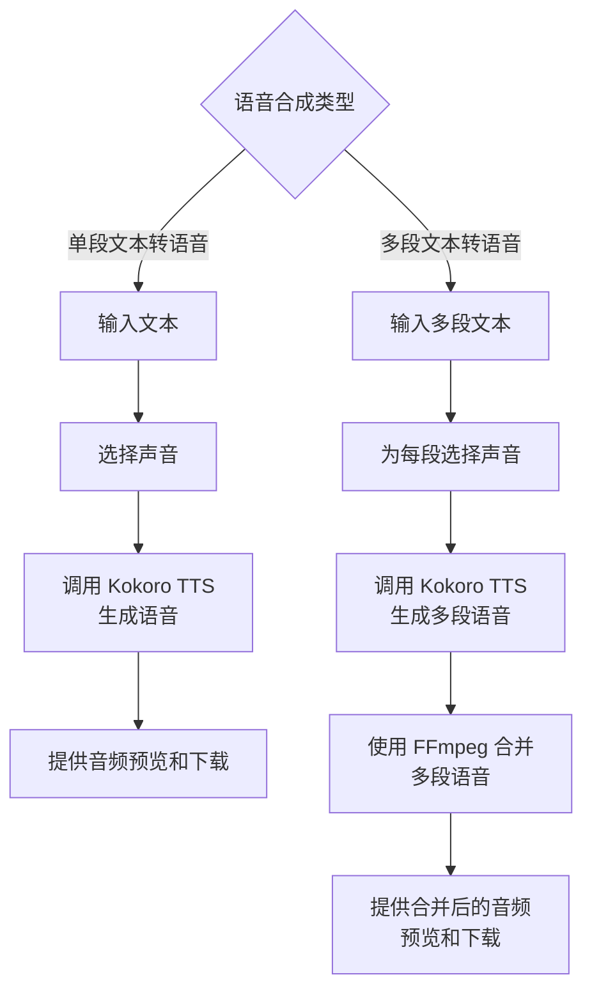
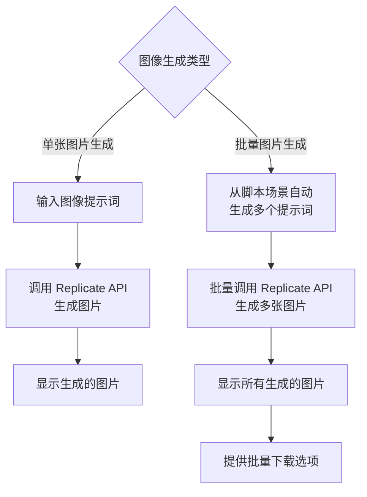
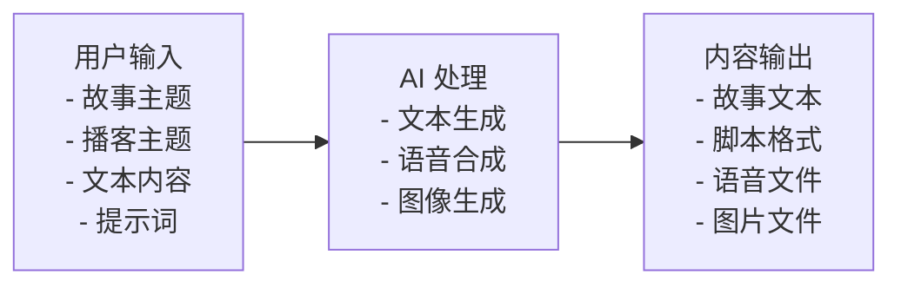
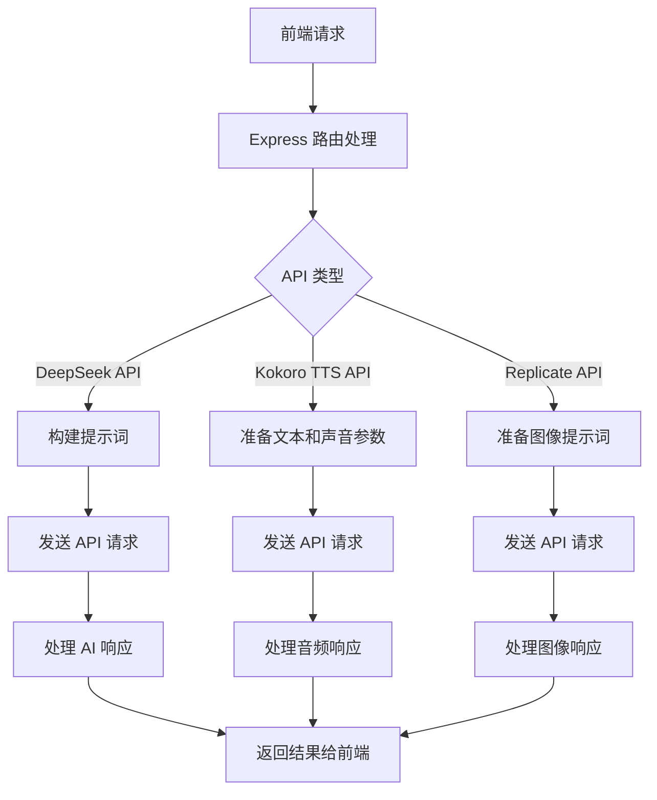

---
aliases:
  - 20250226-0002
createdAt: 2025-02-26 13:16
updateAt: 2025-02-26 13:16
categories:
  - Mindset
tags:
  - Creative/Github
  - Tech/项目分析
---
# AI ContentCraft 项目分析
## 项目概述
AI ContentCraft 是一个多功能内容创作工具，集成了文本生成、语音合成和图像生成功能。该项目使用 Node.js 和 Express 构建后端，前端使用原生 HTML/JavaScript，并集成了多种 AI 服务。
## 主要功能
- **故事生成**：基于用户提供的主题自动生成短篇故事
- **脚本转换**：将故事转换为标准剧本格式
- **播客内容**：生成播客大纲和对话脚本
- **语音合成**：支持多种声音的文本转语音功能
- **图像生成**：为故事场景生成配图
- **双语支持**：支持中英文内容转换
- **批量处理**：支持批量生成和下载内容
## 技术栈
- **前端**：HTML/JavaScript
- **后端**：Node.js + Express
- **AI 服务**：
  - DeepSeek AI：文本生成
  - Kokoro TTS：语音合成
  - Replicate：图像生成
- **其他工具**：FFmpeg（音频处理）
## 项目结构
### 后端（server.js）
后端使用 Express 框架，提供以下主要 API 端点：
1. `/voices`：获取可用的语音列表
2. `/generate`：单段文本转语音
3. `/generate-and-merge`：多段文本转语音并合并
4. `/generate-story`：生成故事
5. `/generate-script`：转换脚本
6. `/generate-image`：生成图片
7. `/generate-all-images`：批量生成图片
8. `/download-images`：批量下载图片
9. `/translate-podcast`：播客脚本翻译
10. `/translate-story-script`：故事脚本翻译
### 前端（index.html）
前端界面分为四个主要页面：
1. **故事生成器**：生成故事、转换脚本、生成配图
2. **简单 TTS**：单段文本转语音
3. **多声音 TTS**：多段文本转语音并合并
4. **播客生成器**：生成播客内容、对话脚本
### 环境配置
项目使用 `.env` 文件存储 API 密钥：
- `DEEPSEEK_API_KEY`：DeepSeek AI 的 API 密钥
- `REPLICATE_API_TOKEN`：Replicate 的 API 令牌
### 工作流程
1. **故事生成**：
   - 用户输入故事主题
   - 系统使用 DeepSeek AI 生成故事
   - 可选择转换为脚本格式
   - 可为每个场景生成配图
2. **语音合成**：
   - 支持单段或多段文本转语音
   - 可选择不同的声音
   - 多段语音可自动合并
3. **图像生成**：
   - 自动为场景生成提示词
   - 使用 Replicate API 生成图片
   - 支持批量下载和预览
### 部署要求
- Node.js 16+
- FFmpeg 安装
- AI 服务的 API 密钥
- 稳定的网络连接
### 注意事项
- 需要有效的 API 密钥才能使用 AI 服务
- 音频合并功能需要正确配置 FFmpeg
- 注意 API 调用限制和费用
这个项目展示了如何集成多种 AI 服务来创建一个功能丰富的内容创作工具，特别适合需要快速生成多媒体内容的创作者使用。
##  Mermaid 流程图
### 整体系统架构

### 故事生成流程

### 播客生成流程

### 语音合成流程

### 图像生成流程

### 数据流向

### API 调用流程

