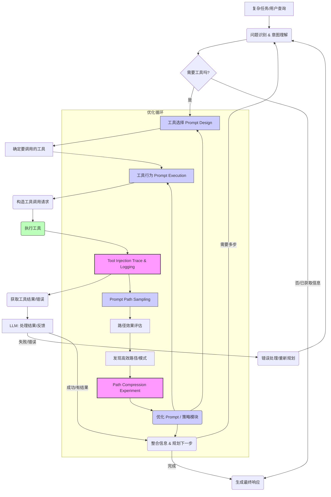

# 深度掌握 Prompt 路由与压缩范式：构建智能、可靠、高效的 LLM 应用

**核心理念：** 理解知识的**来龙去脉**和**为什么 (Rationale)**，而非止于**是什么**和**怎么做**。重视知识背后的**思维过程**。

---

## 引言：为什么需要一套“路由”与“压缩”的智能范式？

设想我们要构建一个能够执行复杂任务的 AI 助手，比如“帮我查找某个股票的最新消息，分析其对股价的影响，并生成一份投资摘要”。这个任务涉及：理解用户意图、查找外部信息（调用搜索引擎工具）、分析数据（可能需要调用分析工具或内部知识）、综合信息并生成文本。

这不仅仅是让 AI “知道”有这些工具或“知道”怎么生成文本那么简单。我们很快会遇到一系列挑战：

1.  **工具选择困境：** AI 如何在众多工具中准确选择当前任务最需要的那个？（是搜索引擎？还是数据库？或是某个专家模型？）选错了就无法完成任务。
2.  **执行过程不可控：** AI 尝试调用工具，但我们不清楚它内部是如何决策的，工具调用失败了怎么办？中间过程是否符合预期？这导致调试困难，也难以保证稳定性。
3.  **多步骤与分支复杂性：** 复杂的任务往往需要工具的串联调用，甚至可能需要根据中间结果决定下一步走向（比如搜索结果为空需要换个关键词）。如何规划和管理这样的执行“路径”？
4.  **效率与成本：** 每一步思考、每次工具调用都消耗计算资源和时间。随着任务复杂度增加，Prompt 变得越来越长，上下文爆炸，成本飙升，效率下降。
5.  **结果不稳定：** 即使是同一个任务，AI 可能走不同的路径，产生差异很大的结果。如何找到最优或最鲁棒的路径？

传统的 Prompt Engineering 往往关注单次交互或特定场景的提示设计，难以应对上述复杂性和不确定性。我们需要一种更系统化的方法，一套能够让 AI 像一个具备**思考、规划、执行、反馈**能力的智能体一样工作——这就是**Prompt 路由与压缩范式**试图解决的核心问题。

它提供了一套框架，让 AI 不仅能“嘴炮”，还能**智能地决定何时、何地、如何调用外部能力，并高效地管理整个决策和执行过程**。

---

## 核心思路与演进路径：构建“智能中枢”的思考过程

这套范式不是凭空出现的，而是随着我们尝试赋予 LLM 更强的“行动力”和处理复杂任务的能力，逐步演化出来的一系列解决方案的集合。我们可以按照解决问题的逻辑顺序，追溯其核心模块的诞生：

### 1. 问题：让 AI 知道“干什么用什么工具” - **工具选择 (Tool Selection)**

最基本的问题是：当用户提出一个任务时，AI 如何知道哪些可用的工具能帮助它？这就像给 AI 一堆钥匙，它得知道哪把钥匙开哪扇门。

*   **思维过程：** 最初可能只是硬编码简单的规则。但工具越来越多，规则难以维护。自然的想法是让 AI 自己根据任务描述去“理解”并选择工具。这就需要给 AI 提供工具的**“说明书”**，并教会它根据任务特性（关键词、意图）去匹配这些说明书。
*   **核心原理 (Rationale):** 将工具功能抽象化、结构化，并通过提示工程或微调，让模型学习**任务特征与工具描述之间的映射关系**。
*   **作用：** 确保在任务的正确“节点”选择合适的工具，是整个流程的第一步。

> **对应原笔记模块 1：Tool Selection Prompt Design**
> 它通过 `If-Then` 规则、结构化工具描述（`{name, input_schema, capability_hint}`）等方式，将这种选择逻辑嵌入到 Prompt 设计中。这是实现智能工具选择的具体“怎么做”。

### 2. 问题：工具调用后，“发生了什么”？如何排查？ - **工具注入追踪与日志 (Tool Injection Trace & Logging)**

AI 选择了工具并尝试调用。调用成功了吗？参数对不对？工具返回了什么？如果失败了，错误是什么？整个调用顺序是怎样的？这些信息对于理解 AI 的行为、调试问题至关重要。

*   **思维过程：** 就像软件开发需要日志一样，我们需要记录 AI 与外部世界的每一次交互——工具调用。记录下**调用的上下文、请求、响应、时间戳**，形成一个可回溯的执行轨迹。
*   **核心原理 (Rationale):** 建立一个全面的**行为链元数据**记录机制，将 LLM 的内部思考（如 ReAct 中的 Action/Observation）与外部工具的执行结果关联起来。
*   **作用：** 提供透明度，支持**行为回放、误差定位、路径调优**，甚至可以基于 trace 构建训练数据，让 AI 从过去的经验中学习。

> **对应原笔记模块 2：Tool Injection Trace & Logging**
> LangChain 的 `callback_manager`、AutoGen 的 `agent_executor.history` 或自定义 JSON 格式都是实现这种追踪的具体方法。它们提供了“怎么做”的细节。

### 3. 问题：选中工具后，“怎么用好它”？ - **工具行为提示执行 (Tool Behavior Prompt Execution)**

不同的工具可能有不同的 API 格式、输入要求、输出格式、错误类型。即使 AI 选择了正确的工具，它还需要知道如何**正确地构造调用请求、如何解析工具的返回结果，以及如何在工具出错时进行处理**。

*   **思维过程：** 不能指望一个通用的 Prompt 模板能适用于所有工具。每个工具都需要一个“使用说明书”或“执行脚本”，告诉 AI 调用它的具体步骤和注意事项。这个“脚本”本身也可以通过 Prompt 来承载，定义工具的调用边界和输入输出规范。
*   **核心原理 (Rationale):** 为每个工具创建**专属的交互模板**，定义调用时的上下文、参数格式、成功/失败处理逻辑，以及如何将工具结果融入后续 Prompt。
*   **作用：** 确保工具被**准确、有效地激活**，并且工具的输入输出能够与 LLM 的推理流程顺畅衔接。

> **对应原笔记模块 3：Tool Behavior Prompt Execution**
> 设计工具行为 Prompt（如 `Rephrase this into a SQL WHERE clause:`）、错误恢复机制、上下文保留策略等，都是为了实现对单个工具的精细化控制，回答了“怎么做”。

### 4. 问题：一条路不一定最优，“哪条路最好”？ - **提示路径采样 (Prompt Path Sampling)**

对于复杂任务，可能有多种完成路径：先查资料再计算？还是先分类再查资料？不同的工具组合、不同的执行顺序可能导致不同的结果、效率和成本。仅仅依靠 AI 的一次思考很难保证找到最优解或最鲁棒的路径。

*   **思维过程：** 既然单次尝试有局限性，那么就像人类解决问题时会尝试不同方法一样，让 AI **探索多条可能的执行路径**。然后评估这些路径的效果，从中选择更好的。
*   **核心原理 (Rationale):** 引入**搜索或采样机制**（如 Beam Search over prompt branches, Dynamic Prompt Template Injection），允许 AI 在关键决策点（如工具选择、下一步行动）探索不同的可能性，生成多条完整的执行轨迹。然后设计**评分函数**来量化路径的优劣（如结果质量、效率、成本）。
*   **作用：** 用于**发现更优的 Prompt 链、工具使用策略**，提升复杂任务的成功率和效率。

> **对应原笔记模块 4：Prompt Path Sampling**
> Beam Search、动态 Prompt 注入等技术，以及基于输出质量、工具使用效率等设计评分函数，都是实现路径采样的“怎么做”。

### 5. 问题：找到好路径后，如何“更简洁高效”并泛化？ - **路径压缩实验 (Path Compression Experiment)**

通过路径采样，我们可能找到了一些成功或优秀的执行路径。但这些路径往往包含中间步骤、多次尝试或冗余的思考。为了将经验固化、降低成本并提高推理速度，我们需要**提炼这些路径的核心逻辑，形成更简洁、更高效的提示或策略**。

*   **思维过程：** 观察大量成功路径的 trace 日志，寻找**重复的模式、关键的决策点和高效的工具组合**。尝试将这些模式概括化，用更短的 Prompt 或更紧凑的逻辑表达出来。这有点像人类从多次尝试中总结经验，形成一套“窍门”或“自动化流程”。
*   **核心原理 (Rationale):** 对成功的**行为轨迹进行分析、抽象和概括**，目标是提取一个更短、但能引导 AI 复制优秀行为的“骨架”（Prompt Chain Skeleton）。这可能涉及自动化分析 trace、利用模型生成元提示进行压缩，并对比压缩前后的效果。
*   **作用：** **降低 Prompt 长度、节省 token、提高推理速度**，并将特定任务的成功经验泛化为可复用的“策略模块”。

> **对应原笔记模块 5：Path Compression Experiment**
> 记录高频路径、构建 DAG、用 GPT 生成“路径摘要提示”（meta-prompt）、对比压缩效果等，是实现路径压缩的“怎么做”的具体方法。

至此，我们通过解决“选哪个工具”、“发生了什么”、“怎么用好它”、“哪条路最好”、“如何更高效”这五个核心问题，一步步构建起了 Prompt 路由与压缩范式的主要组成部分。它们相互依赖，共同构成了 AI 执行复杂任务的“智能中枢”。

---

## 实现策略：构建可复用范式的方法

基于上述核心模块和演进逻辑，要构建一套可复用的 Prompt 路由与压缩范式，需要考虑以下实现策略：

1.  **模块化 Prompt 设计：** 将不同的功能（意图识别、工具选择、参数提取、结果格式化等）封装到独立的 Prompt 模板或函数中。这符合“原子化与模块化的工具设计”和“提示结构拆解与模块化”原则，提高了可维护性和复用性，如同搭积木。
    *   *为什么这样做？* 降低复杂度，方便针对特定功能进行优化和测试，易于组合以构建复杂流程。
2.  **动态路由逻辑：** 使用一个核心的“路由器”或决策模块（可以是 LLM 自身，也可以是外部规则引擎或小型分类模型），根据当前的输入和上下文，动态决定激活哪个 Prompt 模块或调用哪个工具。这实现了基于任务的“智能分流”。
    *   *为什么这样做？* 提高系统的灵活性和适应性，能够根据实时情况调整执行路径。
3.  **高效 Prompt 压缩技巧：** 应用各种技术来管理和压缩上下文，避免 token 爆炸。
    *   *为什么这样做？* 控制成本，提高处理长文本和多轮对话的能力，确保模型效率。
    *   **技术示例：** 滑动窗口、选择性摘要（保留关键信息）、Prompt 蒸馏（见下文）。
4.  **行为调度与反馈闭环：** 设计机制来协调不同模块的执行顺序（行为调度），并在执行过程中监控结果。如果出现错误（如工具调用失败、输出格式不正确），系统能够检测到并通过反馈循环进行修正（重试、换工具、调整 Prompt 或向用户请求澄清）。这增强了系统的鲁棒性。
    *   *为什么这样做？* 应对现实世界的不确定性，使系统能够自我恢复和适应。
5.  **安全考量：** 在任何涉及外部工具调用的系统中，安全性至关重要。需要设计机制防止 Prompt 注入或其他恶意输入导致系统执行非预期或有害的操作。
    *   *为什么这样做？* 保护系统和用户数据安全，建立信任。

---

## 一个具体例子：范式如何解决实际问题

回到最初的股票分析任务：“帮我查找某个股票的最新消息，分析其对股价的影响，并生成一份投资摘要。”

这套范式可能按如下路径执行（揭示思维纹理）：

1.  **[用户查询]** -> **[LLM: 思考与规划]** (基于**工具选择**逻辑) -> 判断需要查找实时信息和分析，选择调用 `search_web` 工具。
2.  **[LLM]** (基于**工具行为提示**生成调用请求) -> 构造 `search_web` 工具的 Prompt 和参数（如搜索关键词：“某股票最新消息”、“某股票财报分析”）。
3.  **[系统]** 执行 `search_web` 调用 -> **[工具注入追踪]** 记录调用请求、时间、返回结果。
4.  **[工具]** 返回搜索结果 -> **[LLM: 处理结果并规划下一步]** (基于**路径控制**逻辑) -> 整合搜索结果，判断需要进行分析。如果搜索结果不充分（**反馈**），可能回到第 2 步调整搜索词或尝试其他工具（如内部数据库）。
5.  **[LLM]** (基于**工具选择**逻辑) -> 判断需要进行分析，选择调用 `analysis_tool` 或利用自身分析能力。
6.  **[LLM]** (基于**工具行为提示**生成分析请求) -> 构造分析 Prompt，将搜索结果作为输入。
7.  **[LLM]** 执行分析 -> **[工具注入追踪]** 记录分析过程/调用。
8.  **[LLM: 整合分析结果并生成摘要]** -> 应用**路径压缩**策略，将分析过程的关键点和最终结论整合到最终的摘要 Prompt 中。
9.  **[LLM]** 生成最终投资摘要 -> **[系统]** 输出给用户。

整个过程的每一步决策、工具调用和结果都会被**追踪与日志**记录下来，用于后续的审计和优化。通过**路径采样**，我们可以在初期探索不同的分析路径或工具组合，找到最优方案。通过**路径压缩**，可以将这个复杂流程提炼成一个更高效的 Prompt 链或策略模块，未来遇到类似任务时直接调用。

---

## 进阶技术：以 Prompt 蒸馏为例说明如何实现“压缩”与“策略学习”

在路径压缩实验中，我们希望能从大模型或成功的复杂路径中提炼出精华。**Prompt 蒸馏 (Prompt Distillation)** 就是一种非常有用的技术，它不是直接压缩文本长度，而是让**一个小模型或更简单的 Prompt 学会复制一个更复杂或由大模型生成的优质 Prompt 的“行为”或“思维模式”**。

*   **为什么需要 Prompt 蒸馏？**
    *   **成本与效率：** 某些复杂任务需要非常长的 Prompt 或调用昂贵的大模型。通过蒸馏，可以用更小的模型或更短的 Prompt 实现相似的效果，降低成本和延迟。
    *   **泛化与复用：** 大模型生成的优秀 Prompt 或思考路径是宝贵的经验。通过蒸馏，可以将这种“经验”转化为结构化的数据（训练样本），用于训练更轻量级、更易于部署的模型或生成通用的策略。
    *   **学习大模型的“思维纹理”：** 蒸馏的目标是让小模型不仅模仿输出，更重要的是模仿大模型在生成高质量 Prompt 或规划路径时的**思维过程**和**策略选择**。

*   **Prompt 蒸馏的思维过程：**
    1.  用大模型或精心设计的复杂 Prompt 处理大量任务样本，生成**“专家级”的高质量 Prompt 输出**（这可能是工具调用的 Sequence、结构化的中间思考、或最终的简洁 Prompt）。这些输出体现了大模型在理解任务、选择工具、规划路径等方面的能力。
    2.  将 **“任务输入 + 任务目标”** 作为训练样本的输入，将 **“专家级的高质量 Prompt 输出”** 作为训练样本的标签（Output）。
    3.  训练一个**较小模型**，使其能够根据任务输入预测生成那个“专家级”的 Prompt 输出。
    4.  或者，分析这些样本对，提炼出共性的模式，用于**优化 Prompt 模板**或生成一个**更简洁的元 Prompt**，指导模型完成任务。

---

## 总结与最佳实践：驾驭复杂的 LLM 应用

Prompt 路由与压缩范式为构建智能、可靠、高效的 LLM 应用提供了一套系统性的框架。它强调用结构化的方式解决让 AI 调用工具和执行复杂任务时遇到的核心问题。

遵循以下最佳实践有助于成功应用这套范式：

*   **从问题出发：** 始终明确当前步骤或模块是为了解决哪个具体问题。
*   **理解原理：** 深入理解每个模块背后的逻辑和“为什么”这样设计。
*   **关注过程：** 不仅关注最终结果，更要分析 AI 的思考过程和执行轨迹（Trace）。
*   **工具原子化：** 设计功能单一、清晰的工具，便于 AI 理解和组合。
*   **信息结构化：** 尽可能使用结构化数据格式（如 JSON）进行工具输入输出和信息追踪。
*   **持续迭代与追踪分析：** 利用 Trace 日志和采样实验结果，不断优化 Prompt 设计、工具描述和路径策略。
*   **风险意识：** 警惕工具幻觉、参数错误、路径不稳定性等风险，并设计相应的处理机制。

