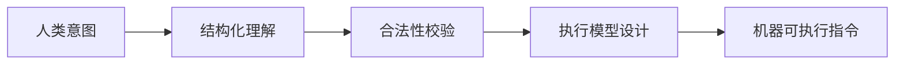

## 三、编译器在“翻译”什么？（不是简单替换）

### 编译的 4 个本质阶段（抽象视角）



对应技术实现：

| 阶段   | 在干嘛  | CEO 该怎么理解    |
| ---- | ---- | ------------ |
| 词法分析 | 拆词   | 像把一句话拆成名词、动词 |
| 语法分析 | 建结构  | 像识别一句话的主谓宾   |
| 语义分析 | 理解含义 | 判断“这句话合不合理”  |
| 代码生成 | 落地执行 | 把意思变成具体行动    |

> **关键点**：\
> 编译器不是“翻译器”，而是**理解 → 校验 → 重构 → 执行设计系统**

---

## 四、计算机真正能做的事（极其有限）

所有复杂软件，最终只建立在 4 种能力之上：

```text
1. 读 / 写内存
2. 数学与逻辑运算
3. 条件判断
4. 跳转（流程控制）
```

> **震撼点给 CEO 用**：\
> 微信、Google、AI、大模型，本质都是\
> **这 4 件事的组合与规模化自动执行**。

---

## 五、高级语言是“假象”，编译器是“真相”

### 举个 CEO 能理解的例子

```c
if (x > 0) {
    x = x + 1;
}
```

在机器眼里，只有：

```text
比较 → 判断 → 跳转 → 运算 → 写回
```

> **洞察**：\
> 所谓“高级语言”，只是为了**让人类不用关心这些细节**。

---

**商业隐喻**：

- 第一代靠体力

- 第二代靠工具

- 第三代靠系统自动进化

> 这也是为什么：\
> **软件行业会出现“赢家通吃”的技术平台**

---

## 八、现代开发工具链的真正价值

CEO 不需要知道命令，但需要知道**发生了什么**：

```text
你点“Run”的那一刻：
- 系统自动检查
- 自动优化
- 自动链接
- 自动部署
- 自动运行
```

> **结论**：\
> 现代工程效率 ≠ 人更努力\
> 而是 **工具链吞掉了复杂度**

---

> **AI ≈ 新一代编译器，只不过它编译的不是“代码”，而是“意图”。**

下面我用**CEO / 投资人可理解的语言**，一步一步把这个结论“推导出来”，而不是直接下定义。

---

````markdown
# 为什么 AI 本质上是“新一代编译器”（CEO 版）

---

## 一、先对齐一个关键事实

### 传统编译器在干什么？

> **把人类写的代码 → 机器能执行的确定性指令**

```text
人类思维（代码）
        ↓
     编译器
        ↓
机器行为（CPU 指令）
````

### 那 AI 在干什么？

> **把人类说的模糊意图 → 可执行的系统行为**

```text
人类意图（语言 / 需求）
        ↓
        AI
        ↓
系统行为（代码 / 决策 / 内容 /操作）
```

👉 **结构完全一致，只是“输入层级更高”。**

---

## 二、AI 与传统编译器的一一映射关系

| 传统编译器    | AI 系统          |
| -------- | -------------- |
| 源代码      | 自然语言 / 多模态输入   |
| 词法分析     | Tokenization   |
| 语法分析     | Prompt 结构理解    |
| 语义分析     | 意图理解 / 上下文建模   |
| 中间表示（IR） | 向量空间 / 隐状态     |
| 代码生成     | 文本 / 代码 / 行为输出 |
| 优化器      | RLHF / 推理策略    |
| 目标平台     | API / 系统 / 人类  |

> **结论**：\
> AI 不只是“像编译器”，\
> 它在**架构层面就是编译器的延伸形态**。

---

## 四、为什么这改变了整个软件工业？

### 过去的软件世界

```text
想法 → 产品经理 → PRD → 工程师 → 代码 → 系统
```

### AI 介入后的世界

```text
想法 → AI → 可执行系统（直接或半自动）
```

> **中间抽象层被压缩了。**

这不是“提效 20%”，\
这是 **“组织结构被重写”**。

---

## 五、为什么 CEO 会感觉 AI “不稳定”？

### 因为你在用“编译器思维”看一个“概率编译器”

| 传统编译器       | AI 编译器      |
| ----------- | ----------- |
| 同样输入 → 同样输出 | 同样输入 → 概率分布 |
| 错误是 bug     | 错误是分布尾部     |
| 不容忍歧义       | 主动填补歧义      |

> **关键洞察**：\
> AI 不是不可靠，\
> 而是**它在你没说清楚的地方做了“默认决策”**。

---

## 六、Prompt = 新一代“源代码”

这也是为什么：

- Prompt Engineering ≈ 编程范式

- Prompt 模板 ≈ 代码规范

- Chain-of-Thought ≈ 中间表示（IR）

- Agent Workflow ≈ 可执行程序

```text
Prompt
  ↓
推理步骤（IR）
  ↓
工具调用 / 代码 / 决策
```

> **你不是在“聊天”，你是在“编译意图”。**

---

## 八、AI = 编译器 + 搜索 + 经验压缩

为什么 AI 看起来“像一个超级工程师”？

因为它同时具备：

- 编译器：把意图变成结构

- 搜索引擎：遍历解空间

- 人类经验压缩：统计过往最佳路径

> 但注意：\
> **它没有“目标函数”，目标来自你。**

---

## 九、给 CEO 的最终结论（可直接引用）

> **“AI 不是员工，也不是工具，\
> 它更像一个能理解模糊语言的编译器。
>
> 谁能像管理编译器一样管理 AI，\
> 谁就能把‘想法’直接规模化成‘系统行为’。”**

---

## 十、战略层预判（前瞻）

- 今天：AI = 辅助编译器

- 2–3 年：AI = 系统级编译器（Agent + Workflow）

- 5 年：AI = 组织结构的“执行层”

> **未来的竞争不是“谁有 AI”，\
> 而是“谁的组织最先学会写 Prompt 这门新语言”。**

---

如果你愿意，下一层我可以继续帮你拆：

- **AI 为什么必然吃掉 DevOps / QA / 部分 PM**

- **为什么 Agent = 操作系统，而不是 App**

- **为什么“会写 Prompt”的 CEO 会碾压同行**

你点哪一个，我直接推进。
