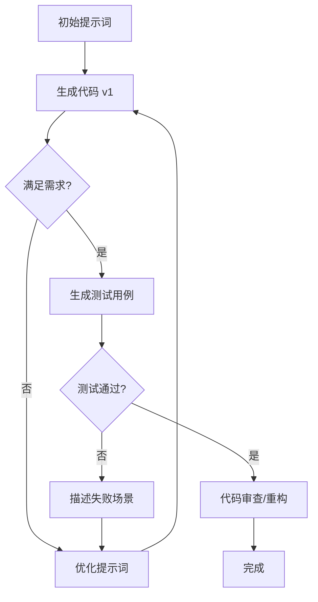

---
aliases:
  - 
date: 2025-12-04 17:23
tags:
  - 
collections:
source:
rating:
related:
view-count: 7
---
# [[Code_Gen_Prompt_Guide]] - 代码生成提示词协议

---

## 1. 场景决策矩阵 (Template Selection)

| 场景 | 核心目标 | 推荐模板 |
| :--- | :--- | :--- |
| **新功能** | 实现逻辑、定义 I/O | **[A] 功能实现版** |
| **高性能** | 降低复杂度、量化规模 | **[B] 算法优化版** |
| **新项目** | 目录结构、技术栈选型 | **[C] 项目脚手架版** |
| **重构** | 消除异味、提升可读性 | **[D] 审查重构版** |
| **调试** | 根因分析、回归测试 | **[E] Bug 修复版** |
| **迁移** | 1:1 等价、惯用法适配 | **[F] 代码转换版** |

---

## 2. 核心构造协议：CCC 原则

- **Clarity (明确性)**: 禁止模糊描述。使用 `[类型]`, `[示例值]`, `[复杂度]`。
- **Context (上下文)**: 提供 `[项目结构]`, `[技术栈版本]`, `[依赖限制]`。
- **Constraints (约束)**: 声明 `[边界条件]`, `[错误处理]`, `[性能红线]`。

---

## 3. 六大协议结构极简版

### [A] 功能实现：I/O 驱动
- **输入**: 参数名 + 类型 + 示例。
- **输出**: 返回值类型 + 格式。
- **质量**: 注解 + 文档 + 单元测试。

### [B] 算法优化：规模驱动
- **目标**: 时间 $O(n \log n)$, 空间 $O(1)$。
- **规模**: 数据量级 (如 $n \le 10^6$)。
- **对比**: 方案 A vs B 的权衡矩阵。

### [C] 脚手架：架构驱动
- **定义**: 语言 + 框架 + 数据库。
- **结构**: 目录树 + README + Docker。
- **核心**: API 端点 + 数据模型。

### [D] 重构：ROI 驱动
- **定位**: Code Smells + 安全漏洞。
- **对比**: 重构前/后性能数据 + 提升百分比。
- **建议**: 3 条最佳实践总结。

### [E] 修复：根因驱动
- **复现**: 步骤 + 错误堆栈 + 实际/预期行为。
- **修复**: 根因分析 + 防御性检查 + 回归测试。

### [F] 迁移：等价驱动
- **映射**: 源库 -> 目标库。
- **处理**: 动态 -> 静态类型, 回调 -> `async/await`。

---

## 4. 执行协议 (Workflow)

---

## 5. 性能与质量红线 (Checklist)

- [ ] **明确性**: 是否包含 3 个以上的测试用例 (正常/边界/异常)？
- [ ] **约束性**: 是否指定了具体的第三方库或标准库限制？
- [ ] **可复用**: 是否包含了复杂度分析 (Time/Space)？
- [ ] **安全性**: 是否处理了空指针、越界及敏感数据泄露？
- [ ] **一致性**: 是否指定了代码风格规范 (PEP 8 / ESLint)？

---

**最后更新: 2026-01-01**