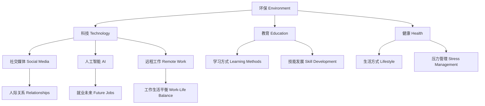

---
aliases:
  - Topic Network Graph
  - 话题关联图
categories:
  - 语言学习
  - 知识管理
tags:
  - Domain/English
  - Domain/Education
  - DSE
  - IELTS
  - 话题
  - Topic
  - 知识图谱
  - Network
  - Dataview
rating: 10
related:
  - '[[万能故事库模板]]'
  - '[[高频词汇表（Band 6→8）]]'
  - '[[DSE vs IELTS 语用能力提升真知灼见]]'
source: 网状知识组织策略
view-count: 0
update: 2026-01-23
date: 2026-01-23
---

# 话题网络图谱

> 💡 **核心理念**：知识不是孤岛，而是网络。建立话题间的关联，实现一个素材多场景复用。
>
> 📚 **理论依据**：参见 [[DSE vs IELTS 语用能力提升真知灼见#观点43-话题网络的知识图谱构建]]

---

## 🗺️ 话题网络结构

### 核心话题群



---

## 📊 DSE vs IELTS 话题对照表

### 热门话题交叉覆盖

| 话题类别 | DSE高频 | IELTS高频 | 交叉度 | 关键概念 |
|:---|:---|:---|:---:|:---|
| **环保** | Light pollution/Waste reduction | Environmental problems/Climate change | ⭐⭐⭐⭐⭐ | sustainability/carbon footprint |
| **科技** | AI ethics/Social media | Technology impact/Online learning | ⭐⭐⭐⭐⭐ | digital divide/screen time |
| **教育** | Learning methods/Exam pressure | Education systems/Online education | ⭐⭐⭐⭐⭐ | rote learning/critical thinking |
| **健康** | Mental health/Exercise | Public health/Lifestyle diseases | ⭐⭐⭐⭐ | work-life balance/stress management |
| **文化** | Traditional culture/Heritage | Cultural differences/Globalization | ⭐⭐⭐⭐ | cultural identity/preservation |
| **社交** | Communication skills/Friendship | Social media/Community | ⭐⭐⭐⭐ | interpersonal skills/virtual vs real |
| **工作** | Career planning/Part-time jobs | Work patterns/Future jobs | ⭐⭐⭐ | job satisfaction/remote work |
| **消费** | Smart shopping/Consumerism | Materialism vs minimalism | ⭐⭐⭐ | sustainable consumption/fast fashion |

---

## 🌐 话题深度映射

### 话题1：环保（Environment）

#### 关联话题网络
```markdown
环保
├── **核心问题**
│   ├── 污染类型：light pollution/air pollution/plastic waste
│   ├── 气候变化：global warming/carbon emissions/extreme weather
│   └── 资源 depletion：water shortage/deforestation
│
├── **解决方案**
│   ├── 个人层面：reduce-reuse-recycle/energy conservation
│   ├── 政策层面：carbon tax/environmental regulations
│   └── 技术层面：renewable energy/electric vehicles
│
├── **DSE应用场景**
│   ├── Letter to Editor: 光污染投诉
│   ├── Article: 减少塑料使用倡议
│   └── Speech: 环保行动呼吁
│
├── **IELTS应用场景**
│   ├── Part 1: Weather/Environment in your city
│   ├── Part 2: An environmental problem/Place in nature
│   └── Part 3: Environmental responsibility/Govt vs individual role
│
└── **万能故事链接**
    ├── [[万能故事库模板#故事：手工礼物]] → 手工 vs 批量生产（环保角度）
    └── [[万能故事库模板#故事：理想房子]] → 可持续生活方式
```

#### 高频词汇库
| 基础 | Band 7 | Band 8 |
|:---|:---|:---|
| pollution | environmental degradation | ecological crisis |
| important | crucial | indispensable |
| help | mitigate | alleviate |
| people | individuals | citizens/stakeholders |
| use | utilize/consume | exploit/harness |

#### 可用论据
- **个人案例**：Hong Kong's plastic waste reduction scheme
- **国际案例**：Finland's carbon neutrality target
- **数据支持**：50% of plastic is single-use
- **名言引用**："We do not inherit the earth from our ancestors; we borrow it from our children."

---

### 话题2：科技（Technology）

#### 关联话题网络
```markdown
科技
├── **核心议题**
│   ├── 人工智能：AI ethics/automation/job displacement
│   ├── 社交媒体：social media addiction/cyberbullying/fake news
│   ├── 数字化生活：online learning/remote work/digital divide
│   └── 隐私安全：data privacy/surveillance/cybersecurity
│
├── **正反观点**
│   ├── 优势：efficiency/connectivity/innovation/convenience
│   └── 劣势：dependency/isolation/health issues/privacy concerns
│
├── **DSE应用场景**
│   ├── Argumentative: AI利弊辩论
│   ├── Article: 社交媒体对青少年的影响
│   └── Speech: 技术依赖的反思
│
├── **IELTS应用场景**
│   ├── Part 1: Computers/Internet/Social media usage
│   ├── Part 2: Useful website/Electronic device/Online experience
│   └── Part 3: Technology impact/AI future/Online vs offline
│
└── **万能故事链接**
    ├── [[万能故事库模板#故事：远程学习经历]] → 数字化教育体验
    └── [[万能故事库模板#故事：数字排毒]] → 技术依赖反思
```

#### 高频词汇库
| 基础 | Band 7 | Band 8 |
|:---|:---|:---|
| good/bad | beneficial/problematic | double-edged sword |
| change | transform | revolutionize/disrupt |
| connect | facilitate communication | foster global connectivity |
| worry | concern | ethical dilemma/moral quandary |
| affect | impact | revolutionize paradigm shift |

---

### 话题3：教育（Education）

#### 关联话题网络
```markdown
教育
├── **核心议题**
│   ├── 学习方式：rote learning vs critical thinking/online vs offline
│   ├── 教育压力：exam pressure/stress/mental health
│   ├── 技能发展：soft skills/hard skills/lifelong learning
│   └── 教育公平：private vs public education/digital divide
│
├── **DSE应用场景**
│   ├── Article: 学习方法建议
│   ├── Speech: 毕业典礼演讲
│   └── Letter: 建议减少作业量
│
├── **IELTS应用场景**
│   ├── Part 1: Study/Teachers/Learning English
│   ├── Part 2: Teacher you admire/Subject you liked/disliked
│   └── Part 3: Education systems/Role of teachers/Online learning
│
└── **万能故事链接**
    ├── [[万能故事库模板#故事：学习困难的经历]] → 成长思维
    └── [[万能故事库模板#故事：影响我的老师]] → 师生关系
```

---

### 话题4：健康与生活方式（Health & Lifestyle）

#### 关联话题网络
```markdown
健康与生活方式
├── **核心议题**
│   ├── 身体健康：exercise/diet/sleep/work-life balance
│   ├── 心理健康：stress/anxiety/depression/mental wellness
│   ├── 生活方式：fast food vs home cooking/sedentary lifestyle
│   └── 公共卫生：healthcare systems/pandemic preparedness
│
├── **DSE应用场景**
│   ├── Article: 促进心理健康的方法
│   ├── Speech: 健康生活方式倡导
│   └── Letter: 呼吁改善学校体育设施
│
├── **IELTS应用场景**
│   ├── Part 1: Health/Exercise/Daily routine
│   ├── Part 2: Healthy habit/Person with healthy lifestyle
│   └── Part 3: Public health/Govt responsibility in health
│
└── **万能故事链接**
    ├── [[万能故事库模板#故事：健身经历]] → 自律与坚持
    └── [[万能故事库模板#故事：烹饪爱好]] → 生活态度
```

---

## 🔍 Dataview查询示例

### 查询1：所有标记为DSE/IELTS的笔记

```dataview
LIST
FROM [[DSE vs IELTS 语用能力提升真知灼见]]
WHERE contains(tags, "DSE") OR contains(tags, "IELTS")
SORT file.ctime DESC
```

### 查询2：按话题分类的笔记

```dataview
TABLE tags, date
FROM [[#话题分类]]
WHERE contains(tags[0], "Domain/English")
GROUP BY topic
SORT rows.file.ctime DESC
```

### 查询3：万能故事使用记录

```dataview
TABLE
  story_type AS "故事类型",
  dse_used AS "DSE应用",
  ielts_used AS "IELTS应用",
  effect_rating AS "效果评分"
FROM [[万能故事库模板]]
WHERE effect_rating > 0
SORT effect_rating DESC
```

---

## 🛠️ 使用指南

### Step 1: 话题盘点（Week 1）
**列出你已有的故事/经历**：
1. 头脑风暴10个个人经历
2. 分类到8大话题类别
3. 标记每个故事的覆盖面（1-5个应用场景）

### Step 2: 话题扩展（Week 2）
**为每个话题准备素材**：
1. 列出话题的3-5个子议题
2. 准备2-3个论据（个人/社会/国际）
3. 整理话题词汇（Band 7-8）

### Step 3: 关联建立（Week 3）
**建立话题间链接**：
1. 找到话题的共同点（如环保+科技→绿色科技）
2. 准备跨话题的论据
3. 用Obsidian双向链接记录

### Step 4: 场景应用（持续）
**模拟考试场景**：
1. DSE：用话题素材写Argumentative/Speech/Article
2. IELTS：用话题素材回答Part 1/2/3
3. 记录哪些论据/表达最有效

---

## 📝 话题追踪表

### 我的话题准备进度

| 话题 | DSE素材 | IELTS P1 | IELTS P2 | IELTS P3 | 完成度 | 优先级 |
|:---|:---:|:---:|:---:|:---:|:---:|:---:|
| 环保 | ✅ | ✅ | ✅ | ✅ | 100% | ⭐⭐⭐⭐⭐ |
| 科技 | ✅ | ✅ | ⏳ | ⏳ | 60% | ⭐⭐⭐⭐⭐ |
| 教育 | ⏳ | ✅ | ✅ | ⏳ | 50% | ⭐⭐⭐⭐ |
| 健康 | ⏳ | ✅ | ✅ | ⏳ | 50% | ⭐⭐⭐ |
| 文化 | ✅ | ⏳ | ✅ | ✅ | 75% | ⭐⭐⭐⭐ |
| 社交 | ⏳ | ✅ | ⏳ | ⏳ | 25% | ⭐⭐⭐ |
| 工作 | ⏳ | ✅ | ⏳ | ⏳ | 25% | ⭐⭐⭐ |
| 消费 | ✅ | ⏳ | ✅ | ⏳ | 50% | ⭐⭐ |

**图例**：
- ✅ 已完成
- ⏳ 进行中
- ⏸️ 未开始

---

## 💡 高级技巧

### 1. 话题融合（Topic Integration）
将两个话题结合，形成独特视角：
```
环保 + 科技 = 绿色科技（sustainable technology）
教育 + 科技 = 在线教育（online learning pros/cons）
健康 + 科技 = 数字健康（digital wellness）
```

### 2. 论据复用（Evidence Repurposing）
同一论据多话题使用：
```
论据：COVID-19期间的远程学习体验
├── 教育话题：online learning effectiveness
├── 科技话题：technology impact on education
└── 健康话题：mental health during pandemic
```

### 3. 观点迁移（Perspective Transfer）
从一个话题的观点迁移到另一个话题：
```
教育话题的"平衡观点"（On one hand...On the other...）
  → 环保话题（economic growth vs environmental protection）
  → 科技话题（convenience vs privacy concerns）
```

---

## 🔗 相关资源

### 按话题分类的练习资源

#### DSE专项
- **环保**：[[Light pollution writing sample]]（待创建）
- **科技**：[[AI ethics argumentative essay]]（待创建）
- **教育**：[[Learning methods article]]（待创建）

#### IELTS专项
- **Part 1话题库**：[[雅思口语知识库#Part-1高频话题]]
- **Part 2话题卡**：[[雅思口语知识库#Part-2话题分类]]
- **Part 3讨论框架**：[[雅思思维工具箱]]

---

## 📊 效果评估

### 话题准备自检清单

**对于每个话题，问自己**：

- [ ] 我能说出3个相关的子议题吗？
- [ ] 我有2-3个具体论据吗？
- [ ] 我能想到至少5个Band 7+词汇吗？
- [ ] 我有个人经历可以分享吗？
- [ ] 我能在DSE和IELTS中都使用这个话题吗？

**评分标准**：
- 5/5：话题准备充分，随时可用
- 4/5：基本准备，需要细化
- 3/5：有概念，需要补充
- 2/5：准备不足，优先提升
- 1/5：尚未开始，立即行动

---

**💡 核心原则**：
> **"一个深度准备的话题 > 十个泛泛而谈的话题。"**
>
> 专注于8大核心话题，每个都准备到Band 8水平，你就覆盖了80%的考试场景。
