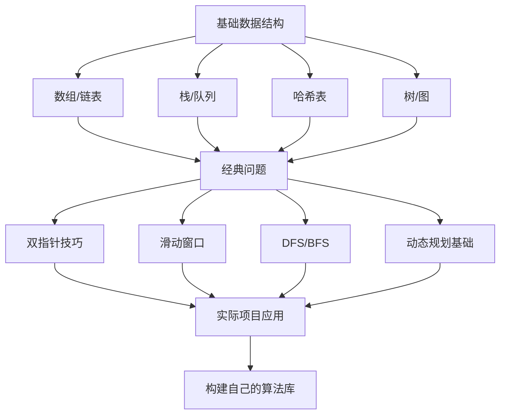

## 三、计算机科学基础：从理论到实践的转化

### 1. 算法学习的正确姿势

**避免**：盲目刷LeetCode（从简单到困难随机做题）

**推荐**：结构化算法学习路径

**大学生实操指南**：

1. 从《NeetCode 150》开始（比LeetCode更结构化）
2. 按主题系统学习，而非随机刷题
3. 每解决一个问题，记录：
   - 问题类型
   - 解决思路
   - 通用模式
   - 相关变体
4. 创建自己的"算法模式手册"（Markdown格式）
5. 将算法应用到个人项目中（如：用图算法实现校园导航）

### 2. 系统级知识学习策略

**避免**：盲目学习底层知识（如CUDA编程）而不清楚实际用途

**推荐**：自上而下的学习路径

| 学习阶段    | 学习内容        | 实践项目          |
| ------- | ----------- | ------------- |
| **应用层** | 高级语言特性、框架使用 | 构建完整Web应用     |
| **中间层** | 性能分析、优化技巧   | 为应用添加性能监控     |
| **系统层** | 内存管理、并发模型   | 实现简易内存池/线程池   |
| **硬件层** | 缓存机制、指令集    | 用perf工具分析热点代码 |

**行动建议**：

- 选择一个你正在使用的框架/库，阅读其核心源码
- 使用`perf`或`valgrind`分析自己项目的性能瓶颈
- 尝试为开源项目贡献小功能（从"good first issue"开始）
- 创建"系统知识映射图"，将理论与实际观察关联

## 四、项目驱动学习：打造个人能力引擎

### 1. 项目选择框架

选择项目时，问自己：

- **相关性**：是否与我的职业目标直接相关？
- **挑战度**：是否需要学习1-2个新概念才能完成？
- **可见性**：完成后能否展示给潜在雇主看？
- **可持续性**：能否逐步扩展，形成系列项目？

**避免**：选择过于宏大或与目标无关的项目（如"我要做自己的操作系统"）

### 2. 一学期内的项目规划示例

| 时间      | 项目阶段 | 学习内容         | 产出        |
| ------- | ---- | ------------ | --------- |
| 第1-2周   | 问题定义 | 需求分析、技术调研    | 项目提案文档    |
| 第3-4周   | 基础搭建 | 核心技术栈学习      | 可运行的最小原型  |
| 第5-8周   | 核心功能 | 深度学习1-2个关键技术 | 完整功能实现    |
| 第9-10周  | 优化扩展 | 性能/安全/用户体验   | 优化后的版本    |
| 第11-12周 | 总结展示 | 技术写作、演示准备    | 项目文档+演示视频 |

### 3. 推荐项目类型（按职业方向）

| 职业方向  | 推荐项目       | 关键学习点           |
| ----- | ---------- | --------------- |
| Web开发 | 带性能监控的博客系统 | 前后端分离、性能优化、错误追踪 |
| 数据科学  | 校园活动预测分析   | 数据清洗、特征工程、模型解释  |
| 系统编程  | 简易文件同步工具   | 网络编程、并发控制、错误处理  |
| 机器学习  | 课程推荐系统     | 特征工程、协同过滤、评估指标  |

## 五、学期学习计划模板

### 1. 每周学习循环

```mermaid
gantt
    title 大学生高效学习周计划
    dateFormat  HH:mm
    section 周一至周五
    课程学习       :active, 09:00, 4h
    项目工作       :         15:00, 2h
    知识整合       :         19:00, 1h
    section 周末
    深度项目工作   :         10:00, 3h
    技术社区参与   :         14:00, 2h
    下周计划制定   :         16:00, 1h
```

记住：**产出比消费更有价值，聚焦比广泛更重要，持续比突击更有效**。从今天开始，将你的学习转化为真正的专业能力！
