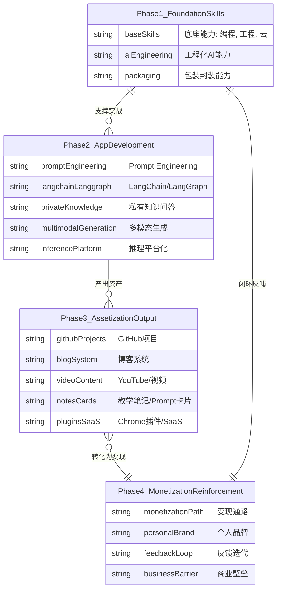

用Mermaid语法,绘制出符合{activeNote}主题/中心思想(符合帕累托原则)的实体关系图
使用英文字符作为实体标识符，并将中文描述放在属性或关系标签中，使其符合Mermaid语法要求.
参考示例如下, 

```mermaid
erDiagram
    Phase1_FoundationSkills {
        string baseSkills "底座能力: 编程, 工程, 云"
        string aiEngineering "工程化AI能力"
        string packaging "包装封装能力"
    }
    Phase2_AppDevelopment {
        string promptEngineering "Prompt Engineering"
        string langchainLanggraph "LangChain/LangGraph"
        string privateKnowledge "私有知识问答"
        string multimodalGeneration "多模态生成"
        string inferencePlatform "推理平台化"
    }
    Phase3_AssetizationOutput {
        string githubProjects "GitHub项目"
        string blogSystem "博客系统"
        string videoContent "YouTube/视频"
        string notesCards "教学笔记/Prompt卡片"
        string pluginsSaaS "Chrome插件/SaaS"
    }
    Phase4_MonetizationReinforcement {
        string monetizationPath "变现通路"
        string personalBrand "个人品牌"
        string feedbackLoop "反馈迭代"
        string businessBarrier "商业壁垒"
    }

    Phase1_FoundationSkills ||--o{ Phase2_AppDevelopment : "支撑实战"
    Phase2_AppDevelopment ||--o{ Phase3_AssetizationOutput : "产出资产"
    Phase3_AssetizationOutput o{--|| Phase4_MonetizationReinforcement : "转化为变现"
    Phase4_MonetizationReinforcement ||--|| Phase1_FoundationSkills : "闭环反哺"
```