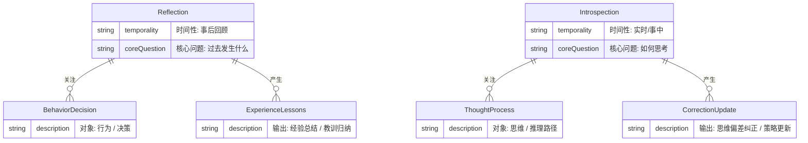

用Mermaid语法,绘制出符合{activeNote}主题/中心思想的实体关系图
使用英文字符作为实体标识符，并将中文描述放在属性或关系标签中，使其符合Mermaid语法要求.
参考示例如下, 

```mermaid
erDiagram
    Reflection {
        string temporality "时间性: 事后回顾"
        string coreQuestion "核心问题: 过去发生什么"
    }
    Introspection {
        string temporality "时间性: 实时/事中"
        string coreQuestion "核心问题: 如何思考"
    }
    BehaviorDecision {
        string description "对象: 行为 / 决策"
    }
    ThoughtProcess {
        string description "对象: 思维 / 推理路径"
    }
    ExperienceLessons {
        string description "输出: 经验总结 / 教训归纳"
    }
    CorrectionUpdate {
        string description "输出: 思维偏差纠正 / 策略更新"
    }

    Reflection ||--o{ BehaviorDecision : "关注"
    Reflection ||--o{ ExperienceLessons : "产生"
    Introspection ||--o{ ThoughtProcess : "关注"
    Introspection ||--o{ CorrectionUpdate : "产生"
```