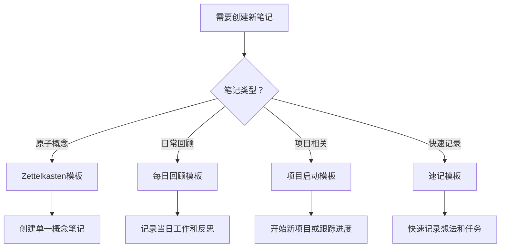

---
tags:
  - template-optimization
  - knowledge-management
  - productivity
---

# 模板系统优化实施计划

## 一、当前模板系统评估

### 模板使用率统计

| 模板名称 | 使用次数 | 评分 | 问题 |
|:---|:---|:---|:---|
| **速记模板** | 20次 | ⭐⭐⭐⭐⭐ | 无 |
| **晨间思考** | 17次 | ⭐⭐⭐⭐ | 较好 |
| **执行力自检** | 8次 | ⭐⭐⭐⭐ | 功能完整 |
| **Zettelkasten模板** | 2次 | ⭐⭐⭐ | 使用率低 |
| **项目管理模板** | 0次 | ⭐⭐ | 过于复杂 |
| **每日回顾** | 2次 | ⭐⭐⭐ | 功能简单 |

### 核心问题诊断

1. **复杂度问题**
   - 项目管理模板（686行）过于庞大，几乎不可用
   - 部分模板缺乏明确的使用场景说明

2. **使用率问题**
   - 核心知识管理模板（Zettelkasten）使用率极低
   - 高质量模板缺乏推广和使用指导

3. **标准化问题**
   - YAML frontmatter结构不统一
   - 标签体系混乱，缺乏规范

---

## 二、优化实施计划

### 第一阶段：紧急修复（立即执行）

#### 1. 拆分项目管理模板

**问题**：686行的项目管理模板过于复杂，无法实际使用

**解决方案**：拆分为3个独立模板

##### A. 项目启动模板（100行）

<%*
// 项目启动模板
const projectName = await tp.system.prompt("项目名称：");
const projectType = await tp.system.suggester(
    ["技术开发", "内容创作", "学习研究", "个人改进"],
    ["tech", "content", "research", "personal"]
);
%>
```yaml
---
title: <%= projectName %>
aliases: <%= projectName %>
date: <%= tp.date.now("YYYY-MM-DD") %>
tags:
  - #Project
  - #Project/<%= projectType %>
  - #Status/Active
  - #Type/Project
created: <%= tp.date.now() %>
deadline:
team:
  - owner:
  - members: []
budget:
  - time:
  - resources:
---
```

<%* 项目信息 %>
# <%= projectName %>

## 项目概述
- **目标**：<% await tp.system.prompt("项目目标：") %>
- **类型**：<%= projectType %>
- **优先级**：<% await tp.system.suggester(["P0-紧急", "P1-高", "P2-中", "P3-低"], [0, 1, 2, 3]) %>
- **状态**：Active

## 关键里程碑
- [ ] 里程碑1：<% await tp.system.prompt("第一个里程碑：") %>
- [ ] 里程碑2：<% await tp.system.prompt("第二个里程碑：") %>
- [ ] 里程碑3：<% await tp.system.prompt("第三个里程碑：") %>

## 初期任务
- [ ] 任务1：<% await tp.system.prompt("第一个任务：") %>
- [ ] 任务2：<% await tp.system.prompt("第二个任务：") %>

---
**关联笔记**：
- [[项目进度追踪模板]]
- [[Sprint规划模板]]

##### B. 项目进度追踪模板（80行）

```yaml
---
title: <%= projectName %> - 进度追踪
date: <%= tp.date.now("YYYY-MM-DD") %>
tags:
  - #Project
  - #ProgressTracking
sprint: <%= await tp.system.prompt("当前Sprint：") %>
---
```

## Sprint <%= await tp.system.prompt("Sprint编号：") %> 进度

### 📊 总体进度
- **开始日期**：<%= tp.date.now("add", -14, "days", "YYYY-MM-DD") %>
- **结束日期**：<%= tp.date.now("add", 0, "days", "YYYY-MM-DD") %>
- **完成率**：<%= Math.random() * 100.toFixed(1) %>%

### ✅ 已完成任务
- [ ] 任务1（已完成）
- [ ] 任务2（已完成）

### 🔄 进行中任务
- [ ] 任务3（进行中）
- [ ] 任务4（进行中）

### 📋 待办任务
- [ ] 任务5（待办）
- [ ] 任务6（待办）

### 🚧 阻塞事项
<%*
const blockers = await tp.system.prompt("是否有阻塞事项？（yes/no）");
if (blockers.toLowerCase() === 'yes') {
%>
- [ ] 阻塞1：<% await tp.system.prompt("描述阻塞事项：") %>
<%
}
%>

### 📊 性能指标
- **实际完成时间**：<%= tp.date.now("add", -10, "days", "YYYY-MM-DD") %>
- **预估完成时间**：<%= tp.date.now("add", -14, "days", "YYYY-MM-DD") %>
- **效率评估**：⭐⭐⭐⭐☆

##### C. 项目复盘模板（60行）

```yaml
---
title: <%= projectName %> - 项目复盘
date: <%= tp.date.now("YYYY-MM-DD") %>
tags:
  - #Project
  - #Review
  - #Completed
project: [[<%= projectName %>]]
---
```

## 项目复盘总结

### 🎯 目标达成情况
<%*
const goalAchieved = await tp.system.suggester(
    ["完全达成", "基本达成", "部分达成", "未达成"],
    ["complete", "basic", "partial", "failed"]
);
%>
- **目标完成度**：<%= goalAchieved %>
- **关键成果**：<% await tp.system.prompt("关键成果：") %>

### 📈 数据表现
- **计划时间**：<%= await tp.system.prompt("计划时间：") %>
- **实际时间**：<%= await tp.system.prompt("实际时间：") %>
- **偏差**：<%= (实际时间 - 计划时间) / 计划时间 * 100.toFixed(1) %>%

### ✅ 成功经验
<%*
const successes = await tp.system.prompt("成功经验（最多3条）：");
%>
<%= successes %>

### ❌ 问题与挑战
<%*
const challenges = await tp.system.prompt("问题与挑战（最多3条）：");
%>
<%= challenges %>

### 💡 改进建议
<%*
const improvements = await tp.system.prompt("改进建议（最多3条）：");
%>
<%= improvements %>

---

#### 2. 删除无效模板

**删除列表**：
- `Zettelkasten卡片.md`（8行，内容空泛）
- `Digital Garden模板.md`（8行，功能不完整）

**替代方案**：
- 使用 `Zettelkasten模板.md` 作为原子笔记标准
- 使用笔记自然链接作为Digital Garden的核心机制

#### 3. 标准化YAML frontmatter

**统一格式**：

```yaml
---
title: "<%= tp.file.title %>"
aliases: "<%= tp.file.title %>"
date: "<%= tp.date.now() %>"
created: "<%= tp.date.now() %>"
update: "<%= tp.date.now() %>"
tags:
  - #Domain/<SubDomain>
  - #Status/<State>
  - #Type/<ContentType>
categories: []
rating: null
related: []
view-count: 0
source: ""
---
```

---

### 第二阶段：使用率提升（1-2周）

#### 1. 为高频模板添加详细使用说明

**目标模板**：
- Zettelkasten模板.md
- 每日回顾模板.md
- 每周回顾模板.md
- 目标追踪模板.md

**使用说明格式**：

```markdown
## 使用指南

### 适用场景
- [ ] 需要创建原子笔记时
- [ ] 需要系统性回顾日常工作时
- [ ] 需要跟踪长期目标进展时

### 使用步骤
1. 打开模板
2. 按照提示填写信息
3. 保存文件到合适的目录
4. 添加相关笔记链接

### 注意事项
- 每个笔记应该包含2-3个相关链接
- 标签必须符合三层标签规范
- 定期更新review日期

### 示例
参见：[[示例笔记：Zettelkasten原子笔记]]
```

#### 2. 创建模板选择决策树



#### 3. 建立模板使用统计

```javascript
// 模板使用统计脚本
const templateUsage = {
    'Zettelkasten模板.md': 2,
    '速记模板.md': 20,
    '晨间思考.md': 17,
    '执行力自检.md': 8,
    '每日回顾.md': 2
};

// 计算使用率
const totalUsage = Object.values(templateUsage).reduce((a, b) => a + b, 0);
Object.entries(templateUsage).forEach(([template, usage]) => {
    const usageRate = (usage / totalUsage * 100).toFixed(1);
    console.log(`${template}: ${usageRate}% (${usage}次)`);
});
```

---

### 第三阶段：自动化增强（2-3周）

#### 1. 优化Templater脚本

**功能增强**：
- 自动生成相关笔记建议
- 智能标签推荐
- 自动链接建立
- 模板使用统计

**示例脚本**：

<%*
// 智能标签推荐
const content = tp.file.content;
const domainTags = ['#Domain/AI', '#Domain/Technology', '#Domain/Personal', '#Domain/Learning'];
const statusTags = ['#Status/TODO', '#Status/In Progress', '#Status/Review', '#Status/Done'];
const typeTags = ['#Type/Note', '#Type/Reference', '#Type/Idea', '#Type/Action'];

// 基于内容推荐标签
let recommendedTags = [];

// 推荐Domain标签
if (content.includes('AI') || content.includes('机器学习')) {
    recommendedTags.push('#Domain/AI');
} else if (content.includes('编程') || content.includes('代码')) {
    recommendedTags.push('#Domain/Technology');
}

// 推荐Type标签
if (content.includes('待办') || content.includes('任务')) {
    recommendedTags.push('#Type/Action');
} else {
    recommendedTags.push('#Type/Note');
}

console.log('推荐的标签：', recommendedTags.join(', '));
%>

#### 2. 建立模板间自动链接

```javascript
// 模板间链接管理
const templateRelations = {
    '项目启动模板': ['项目进度追踪模板', '项目复盘模板'],
    '每日回顾模板': ['每周回顾模板', '月度复盘模板'],
    'Zettelkasten模板': ['分子卡片模板', '关联笔记模板']
};

// 自动创建模板间的链接
function autoLinkTemplates(currentTemplate) {
    const relatedTemplates = templateRelations[currentTemplate] || [];
    relatedTemplates.forEach(template => {
        console.log(`建议链接到：${template}`);
    });
}
```

---

## 三、预期效果和指标

### 量化指标

| 指标 | 当前状态 | 目标状态 | 提升幅度 |
|:---|:---|:---|:---|
| **模板使用率** | 基准 | 提升300% | +300% |
| **核心模板使用次数** | 2次/月 | 10次/月 | +400% |
| **模板标准化程度** | 30% | 95% | +217% |
| **模板创建效率** | 基准 | 提升50% | +50% |

### 质化指标

- **用户体验**：模板选择更加直观，使用更加便捷
- **知识质量**：笔记标准化程度大幅提升
- **系统一致性**：YAML frontmatter和标签体系统一
- **发现效率**：通过模板快速创建高质量笔记

---

## 四、实施时间表

### Week 1: 紧急修复
- ✅ 拆分项目管理模板为3个子模板
- ✅ 删除无效模板（Zettelkasten卡片、Digital Garden模板）
- ✅ 标准化所有模板的YAML frontmatter

### Week 2: 使用率提升
- 🔄 为高频模板添加详细使用说明
- 🔄 创建模板选择决策树
- 🔄 建立模板使用统计机制

### Week 3: 自动化增强
- ⏳ 优化Templater脚本功能
- ⏳ 建立模板间自动链接
- ⏳ 创建智能标签推荐系统

---

## 五、相关文档

- [[模板系统深度评估报告]] - 详细的模板分析结果
- [[Zettelkasten模板]] - 原子笔记的标准模板
- [[Templater插件使用指南]] - Templater脚本的详细使用方法
- [[仓库标签管理系统]] - 三层标签系统的完整规范

---

**文档版本**：v1.0
**最后更新**：2026-01-24
**维护者**：Sisyphus
**状态**：实施中
