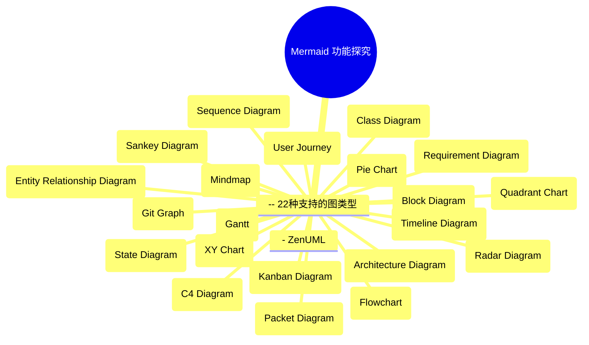
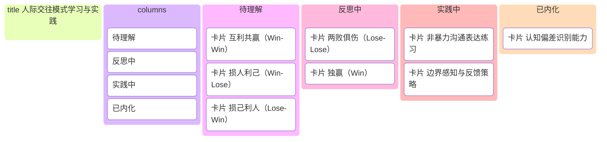

[🧜‍♀️ Mermaid 功能探究 · Refly](https://refly.ai/share/canvas/can-ut29sdt61c0ujktd2uhm2o3b)

![[Mermaid-实体关系图]]

## 22种图的名称

**实用性打分对照：**
*   5 - 非常实用 (Highly Practical)
*   4 - 高度实用 (Highly Useful in Specific Contexts)
*   3 - 中等实用 (Moderately Practical)
*   2 - 有限实用 (Limited Practicality / Niche)
*   1 - 很少实用 (Rarely Practical)

| 图类型 (Diagram Type)                     | 实用性打分 (Practical Utility Score) | 简要说明 (Brief Explanation)         |
| :------------------------------------- | :------------------------------ | :------------------------------- |
| 1. 思维导图 (Mindmap)                      | 5                               | 用于头脑风暴、组织想法、学习和规划，个人和团队都常用。      |
| 2. 流程图 (Flowchart)                     | 5                               | 广泛用于描述流程、算法、决策逻辑。                |
| 3. XY 图 (XY Chart)                     | 5                               | 广泛用于数据分析和可视化，展示两个变量之间的关系。        |
| 4. 甘特图 (Gantt)                         | 5                               | 项目管理中用于计划、安排和跟踪任务进度。             |
| 5. 看板图 (Kanban Diagram)                | 5                               | 敏捷开发和任务管理中用于可视化工作流程和进度。          |
| 6. 架构图 (Architecture Diagram)          | 5                               | 通用术语，用于描述各种系统的结构和组织。             |
| 7. 实体关系图 (Entity Relationship Diagram) | 5                               | 数据库设计和数据模型建模的基础。                 |
| 8. Git 分支图 (Git Graph)                 | 4                               | Git 用户用于可视化版本控制历史和分支管理。          |
| 9. 时序图 (Sequence Diagram)              | 4                               | 软件开发中用于展示对象或组件间的交互顺序。            |
| 10. 类图 (Class Diagram)                 | 4                               | 软件工程中用于描述类、属性和它们之间的关系。           |
| 11. 用户旅程图 (User Journey)               | 4                               | UX、产品和营销中用于理解用户体验和痛点。            |
| 12. 象限图 (Quadrant Chart)               | 4                               | 用于根据两个维度（如重要性和紧急性）对事物进行分类和优先级排序。 |
| 13. 时间线图 (Timeline Diagram)            | 4                               | 用于可视化事件、里程碑或流程的时间顺序。             |
| 14. C4 图 (C4 Diagram)                  | 4                               | 软件架构可视化方法，分层描述系统。                |
| 15. ZenUML                             | 4                               | 作为时序图的一种文本描述方式，其实用性等同于时序图。       |
| 16. 饼图 (Pie Chart)                     | 3                               | 用于展示部分占总体的比例，易理解但有时信息量有限。        |
| 17. 状态图 (State Diagram)                | 3                               | 用于建模具有离散状态的系统或对象的生命周期。           |
| 18. 块状图 (Block Diagram)                | 3                               | 高层次展示系统的主要组件及其相互关系，用于系统概述。       |
| 19. 雷达图 (Radar Diagram)                | 3                               | 用于展示多个项目在多个维度上的表现对比。             |
| 20. 需求图 (Requirement Diagram)          | 3                               | 系统工程中用于建模需求及其关系。                 |
| 21. 桑基图 (Sankey Diagram)               | 3                               | 用于可视化能量、资金或物质的流动和分布。             |
| 22. 数据包图 (Packet Diagram)              | 2                               | 网络工程中用于可视化网络数据包结构，非常垂直领域。        |

以下是使用 Mermaid 语法绘制的思维导图：

