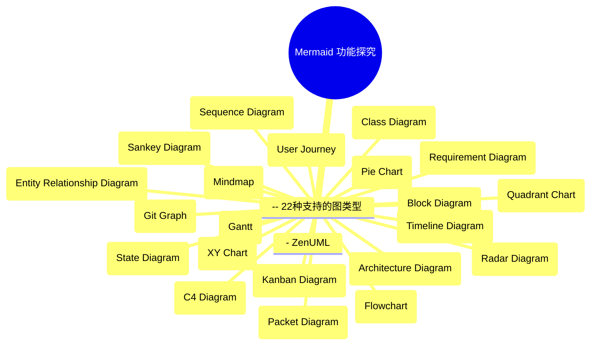

[🧜‍♀️ Mermaid 功能探究 · Refly](https://refly.ai/share/canvas/can-ut29sdt61c0ujktd2uhm2o3b)

![[Mermaid-实体关系图]]

## 22种图的名称

1. 流程图 (Flowchart)
2. 时序图 (Sequence Diagram)
3. 类图 (Class Diagram)
4. 状态图 (State Diagram)
5. 实体关系图 (Entity Relationship Diagram)
6. 用户旅程图 (User Journey)
7. 甘特图 (Gantt)
8. 饼图 (Pie Chart)
9. 象限图 (Quadrant Chart)
10. 需求图 (Requirement Diagram)
11. Git 分支图 (Git Graph)
12. C4 图 (C4 Diagram)
13. 思维导图 (Mindmap)
14. 时间线图 (Timeline Diagram)
15. ZenUML
16. 桑基图 (Sankey Diagram)
17. XY 图 (XY Chart)
18. 块状图 (Block Diagram)
19. 数据包图 (Packet Diagram)
20. 看板图 (Kanban Diagram)
21. 架构图 (Architecture Diagram)
22. 雷达图 (Radar Diagram)

好的，根据您 [[Mermaid 功能探究]] 这篇笔记的内容，我将为您绘制一个思维导图，重点列出笔记中提到的 22 种图类型。

以下是使用 Mermaid 语法绘制的思维导图：

```mermaid
mindmap
  root((Mermaid 功能探究))
    -- 22种支持的图类型
      - 流程图 (Flowchart)
      - 时序图 (Sequence Diagram)
      - 类图 (Class Diagram)
      - 状态图 (State Diagram)
      - 实体关系图 (Entity Relationship Diagram)
      - 用户旅程图 (User Journey)
      - 甘特图 (Gantt)
      - 饼图 (Pie Chart)
      - 象限图 (Quadrant Chart)
      - 需求图 (Requirement Diagram)
      - Git 分支图 (Git Graph)
      - C4 图 (C4 Diagram)
      - 思维导图 (Mindmap)
      - 时间线图 (Timeline Diagram)
      - ZenUML
      - 桑基图 (Sankey Diagram)
      - XY 图 (XY Chart)
      - 块状图 (Block Diagram)
      - 数据包图 (Packet Diagram)
      - 看板图 (Kanban Diagram)
      - 架构图 (Architecture Diagram)
      - 雷达图 (Radar Diagram)
```