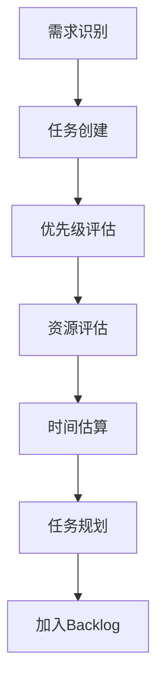
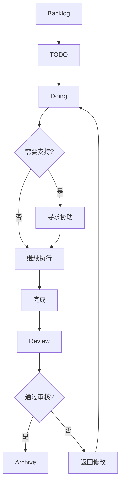

---
tags:
  - knowledge-base-structure
  - project-management
  - task-tracking
  - agile-workflow
  - Type/Reference
  - Domain/Cognitive
  - knowledge-base-structure
  - project-management
  - task-tracking
  - agile-workflow
---
# CLAUDE.md - Atlas Kanban系统

## 系统概述
这是Atlas Kanban系统的专属指导文件。Kanban是知识库的项目管理和任务跟踪中心，采用敏捷开发方法进行工作流程管理。

## 系统职责
- **项目管理**: 基于看板的项目管理
- **任务跟踪**: 实时的任务状态跟踪
- **工作流管理**: 标准化的工作流程管理
- **团队协作**: 支持多人协作的任务管理

## 系统架构

### 1. 看板结构
- **Roadmap**: 长期规划和路线图
- **Backlog**: 待办任务列表
- **TODO**: 计划执行的任务
- **Doing**: 正在进行的任务
- **Review**: 完成待审核的任务
- **Archive**: 已完成的归档任务

### 2. 任务分类
- **按项目**: 不同项目的任务分类
- **按优先级**: 高中低优先级的任务管理
- **按类型**: 开发、学习、创作等任务类型
- **按负责人**: 不同负责人的任务分配

## 系统特定标签系统
```
#Domain/ProjectManagement
#Status/Roadmap #Status/Backlog #Status/Active #Status/Review #Status/Completed
#Type/Task #Type/Milestone #Type/Epic #Type/SubTask
#Priority/Critical #Priority/High #Priority/Medium #Priority/Low
```

## 工作流程设计

### 1. 任务创建流程


### 2. 任务执行流程


### 3. 敏捷迭代流程
- **Sprint规划**: 周期性的Sprint规划和目标设定
- **每日站会**: 进度同步和问题识别
- **Sprint回顾**: 周期性的回顾和改进
- **持续改进**: 基于反馈的流程持续改进

## 任务管理策略

### 优先级管理
- **紧急重要矩阵**: 基于紧急性和重要性的优先级评估
- **价值评估**: 基于业务价值的优先级排序
- **依赖关系**: 考虑任务间依赖关系的优先级调整
- **资源约束**: 考虑资源约束的优先级管理

### 时间管理
- **时间估算**: 任务完成时间的准确估算
- **里程碑设置**: 关键里程碑的设置和跟踪
- **缓冲时间**: 意外情况的缓冲时间设置
- **进度监控**: 实时的进度监控和预警

### 质量管理
- **验收标准**: 明确的任务完成标准
- **质量检查**: 任务完成质量的多级检查
- **缺陷管理**: 缺陷的发现、记录和修复
- **持续改进**: 基于质量问题的持续改进

## 看板配置指南

### 看板设置
- **泳道设置**: 按项目或类别设置泳道
- **列设置**: 工作流状态的列设置
- **标签系统**: 统一的标签分类和颜色
- **自动化规则**: 任务状态变更的自动化规则

### 卡片设计
- **卡片模板**: 统一的卡片信息模板
- **字段设置**: 必要字段的设置和验证
- **关联管理**: 卡片间关联关系的管理
- **附件支持**: 文件和链接的附件支持

## 常用看板模板

### 项目看板模板
```markdown
## 项目: [项目名称]
### 项目目标: [具体目标]
### 项目周期: [开始日期] - [结束日期]

#### Roadmap
- [里程碑1]: [完成时间]
- [里程碑2]: [完成时间]

#### Backlog
- [任务1]: [优先级] - [预估工时]
- [任务2]: [优先级] - [预估工时]

#### 当前Sprint
- **目标**: [Sprint目标]
- **周期**: [Sprint周期]
- **任务列表**: [具体任务]
```

### 学习看板模板
```markdown
## 学习主题: [主题名称]
### 学习目标: [具体目标]

#### 学习阶段
- [阶段1]: [内容] - [时间]
- [阶段2]: [内容] - [时间]

#### 任务列表
- [学习任务1]: [状态] - [进度]
- [练习任务1]: [状态] - [进度]

#### 复习计划
- [复习时间1]: [内容]
- [复习时间2]: [内容]
```

## 团队协作机制

### 角色分工
- **产品负责人**: 需求管理和优先级决策
- **项目经理**: 进度管理和资源协调
- **开发成员**: 任务执行和质量保证
- **测试成员**: 质量测试和验收确认

### 沟通机制
- **定期会议**: 周例会、月回顾等定期会议
- **即时沟通**: 重要问题的即时沟通机制
- **文档同步**: 项目文档的实时同步更新
- **决策记录**: 重要决策的记录和共享

### 协作工具
- **看板工具**: Obsidian Kanban插件
- **沟通工具**: 即时通讯工具的集成
- **文档工具**: 共享文档和协作文档
- **日程工具**: 共享日程和会议安排

## 性能监控与分析

### 项目指标
- **完成率**: 任务按时完成率
- **周期时间**: 任务平均完成周期
- **在制品数量**: 同时进行的任务数量
- **流量效率**: 任务在工作流中的流动效率

### 团队指标
- **个人贡献**: 团队成员的任务贡献
- **协作效率**: 团队协作的效率指标
- **质量指标**: 交付质量和缺陷率
- **满意度**: 团队成员的工作满意度

## 常用查询示例

### 项目状态查询
```tasks
path includes Atlas/kanban
tag includes #Status/Active
group by project
sort by priority
```

### 逾期任务查询
```tasks
path includes Atlas/kanban
due before today
not done
sort by due
```

### 个人任务查询
```tasks
path includes Atlas/kanban
assigned to [用户名]
not done
sort by priority
```

## 质量保证机制

### 任务质量
- **明确性**: 任务描述的明确性和可执行性
- **完整性**: 任务信息的完整性和准确性
- **可追踪性**: 任务执行过程的可追踪性
- **可验证性**: 任务完成结果的可验证性

### 流程质量
- **标准化**: 流程的标准化和规范化
- **可视化**: 流程的可视化和透明化
- **适应性**: 流程对变化的适应性
- **持续改进**: 基于反馈的持续改进

## 风险管理

### 风险识别
- **技术风险**: 技术实现相关的风险
- **资源风险**: 人力资源和时间资源风险
- **质量风险**: 交付质量相关的风险
- **进度风险**: 项目进度延期的风险

### 风险应对
- **预防措施**: 风险的预防和缓解措施
- **应急计划**: 风险发生时的应急计划
- **监控预警**: 风险的监控和预警机制
- **经验总结**: 风险处理经验的总结分享

## 关键资源连接
- 项目来源: `[[1.Projects]]` 中的具体项目
- 理论支持: `[[2.Topics]]` 中的管理理论
- 资源支持: `[[3.Resources]]` 中的工具和方法
- 系统管理: `[[Atlas/BASE]]` 中的系统配置

## 集成与自动化

### 工具集成
- **日历集成**: 与日历工具的集成
- **邮件集成**: 与邮件系统的集成
- **通知系统**: 任务状态变更的通知
- **报表系统**: 自动化的报表生成

### 自动化规则
- **状态自动更新**: 基于条件的自动状态更新
- **通知自动发送**: 关键事件的自动通知
- **报表自动生成**: 定期报表的自动生成
- **数据自动备份**: 重要数据的自动备份
