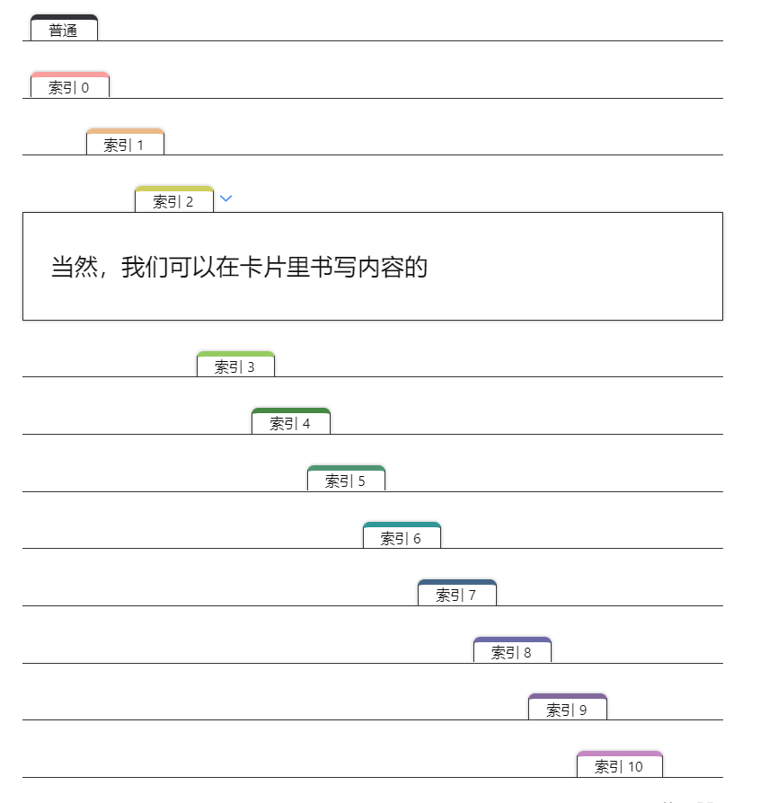

# 索引标签样式卡片

## 效果展示



## 相关文件

 [/snippets/Paper-Index-Callout.css](assets/img/Paper-Index-Callout/IMG-Paper-Index-Callout-20240714124636523.css)

## 使用方法

首先请阅读：[Callout 样式的使用方法](../Usages/How-to-Use-Callout.md)。

然后按如下格式使用：

```markdown
> [!paper-index-0] 索引 0
```

可以使用 `[!paper-index-0]` 到 `[!paper-index-11]` 共计 12 索引。主要区别就是标签的颜色和位置偏移。

`[!paper-index]` 就是普通样式，黑色，无偏移。